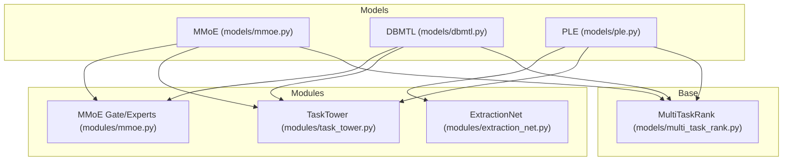
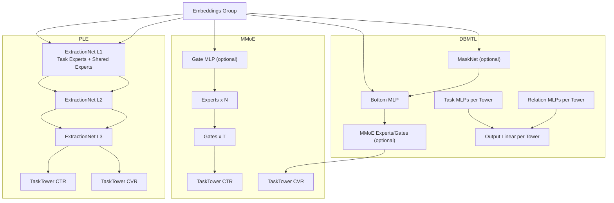
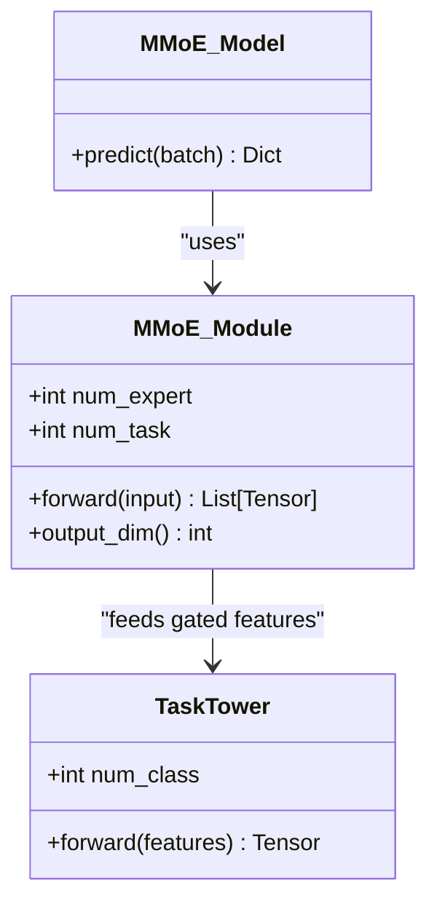
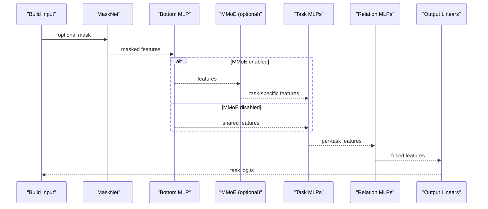
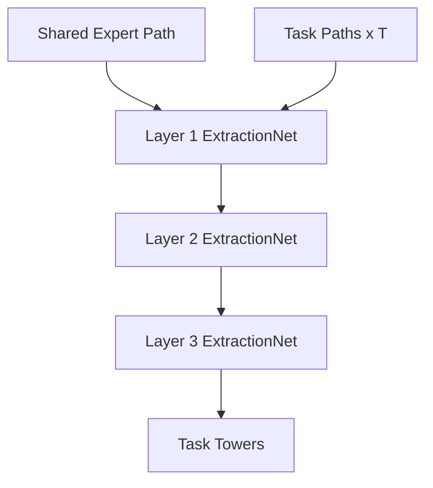
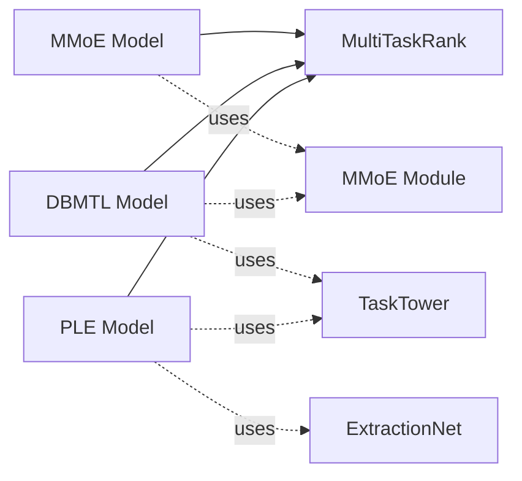

# Multi-Task Learning Models

<cite>
**Referenced Files in This Document**
- [mmoe.py](file://tzrec/models/mmoe.py)
- [dbmtl.py](file://tzrec/models/dbmtl.py)
- [ple.py](file://tzrec/models/ple.py)
- [mmoe.py](file://tzrec/modules/mmoe.py)
- [extraction_net.py](file://tzrec/modules/extraction_net.py)
- [task_tower.py](file://tzrec/modules/task_tower.py)
- [multi_task_rank.py](file://tzrec/models/multi_task_rank.py)
- [mmoe_taobao.config](file://examples/mmoe_taobao.config)
- [dbmtl_taobao.config](file://examples/dbmtl_taobao.config)
- [ple_taobao.config](file://examples/ple_taobao.config)
- [mmoe.md](file://docs/source/models/mmoe.md)
- [dbmtl.md](file://docs/source/models/dbmtl.md)
- [ple.md](file://docs/source/models/ple.md)
- [loss.md](file://docs/source/models/loss.md)
- [rank_model.py](file://tzrec/models/rank_model.py)
- [metric.proto](file://tzrec/protos/metric.proto)
- [train_eval.py](file://tzrec/train_eval.py)
</cite>

## Table of Contents

1. [Introduction](#introduction)
1. [Project Structure](#project-structure)
1. [Core Components](#core-components)
1. [Architecture Overview](#architecture-overview)
1. [Detailed Component Analysis](#detailed-component-analysis)
1. [Dependency Analysis](#dependency-analysis)
1. [Performance Considerations](#performance-considerations)
1. [Troubleshooting Guide](#troubleshooting-guide)
1. [Conclusion](#conclusion)
1. [Appendices](#appendices)

## Introduction

This document explains TorchEasyRec’s multi-task learning (MTL) capabilities with three primary architectures:

- MMoE (Multi-gate Mixture-of-Experts): task-specific expert networks with task-wise gating for shared-exclusivity trade-offs.
- DBMTL (Deep Bi-Modal Transformer Learning): explicit bi-modal fusion with auxiliary relations between tasks and optional expert sharing via MMoE.
- PLE (Progressive Layered Extraction): layered extraction with task and shared experts, designed to mitigate seesaw effects across tasks.

It covers theoretical foundations, network architectures, task interaction mechanisms, shared-exclusivity strategies, implementation details (task towers, gates, auxiliary losses), practical configuration examples, evaluation metrics, regularization, and selection guidance.

## Project Structure

TorchEasyRec organizes MTL models around a shared multi-task base class and modular building blocks:

- Model classes: MMoE, DBMTL, PLE inherit from a common multi-task ranking base.
- Modules: MMoE gate/expert block, PLE ExtractionNet, TaskTower, MaskNet, MLP.
- Protobuf configs: model-level configuration for each architecture and task towers.
- Examples: ready-to-run configs for Taobao-like multi-task scenarios.

**Diagram sources**

- \[mmoe.py\](file://tzrec/models/mmoe.py#L26-L87)
- \[dbmtl.py\](file://tzrec/models/dbmtl.py#L28-L176)
- \[ple.py\](file://tzrec/models/ple.py#L27-L110)
- \[mmoe.py\](file://tzrec/modules/mmoe.py#L21-L78)
- \[extraction_net.py\](file://tzrec/modules/extraction_net.py#L20-L140)
- \[task_tower.py\](file://tzrec/modules/task_tower.py#L21-L51)
- \[multi_task_rank.py\](file://tzrec/models/multi_task_rank.py#L25-L221)

**Section sources**

- \[mmoe.py\](file://tzrec/models/mmoe.py#L26-L87)
- \[dbmtl.py\](file://tzrec/models/dbmtl.py#L28-L176)
- \[ple.py\](file://tzrec/models/ple.py#L27-L110)
- \[multi_task_rank.py\](file://tzrec/models/multi_task_rank.py#L25-L221)

## Core Components

- MultiTaskRank base: orchestrates task towers, loss initialization, metrics, and prediction post-processing across tasks.
- TaskTower: generic MLP + linear head per task.
- MMoE module: multiple experts plus task-wise gates; optional gate MLP.
- ExtractionNet: multiple task experts + shared experts with gating; progressive layer output dims.
- Auxiliary modules: MLP, MaskNet (DBMTL optionally masks input before bottom MLP).

Key responsibilities:

- Build shared input from embeddings.
- Apply task-specific or shared expert pathways.
- Compute per-task outputs and combined predictions.
- Initialize and apply per-task losses and metrics.

**Section sources**

- \[multi_task_rank.py\](file://tzrec/models/multi_task_rank.py#L50-L221)
- \[task_tower.py\](file://tzrec/modules/task_tower.py#L21-L51)
- \[mmoe.py\](file://tzrec/modules/mmoe.py#L21-L78)
- \[extraction_net.py\](file://tzrec/modules/extraction_net.py#L20-L140)

## Architecture Overview

Below are the high-level architectures for each method and how they connect to the base framework.

**Diagram sources**

- \[mmoe.py\](file://tzrec/models/mmoe.py#L49-L86)
- \[mmoe.py\](file://tzrec/modules/mmoe.py#L21-L78)
- \[dbmtl.py\](file://tzrec/models/dbmtl.py#L57-L175)
- \[ple.py\](file://tzrec/models/ple.py#L58-L109)

## Detailed Component Analysis

### MMoE (Multi-gate Mixture-of-Experts)

- Theory: Multiple experts learn shared representations; task-wise gates select expert combinations, enabling shared-exclusivity trade-offs.
- Implementation highlights:
  - Experts: stacked MLPs per expert.
  - Gates: softmax over experts per task; optional gate MLP improves gate representation.
  - Task towers: per-task MLP heads atop gated expert features.
- Task interaction: gating weights couple tasks implicitly; complementary experts can specialize per task.
- Shared-exclusivity: increase num_expert to allow specialization; adjust gate MLP to modulate gate sensitivity.

**Diagram sources**

- \[mmoe.py\](file://tzrec/modules/mmoe.py#L21-L78)
- \[task_tower.py\](file://tzrec/modules/task_tower.py#L21-L51)
- \[mmoe.py\](file://tzrec/models/mmoe.py#L26-L87)

Practical configuration (example paths):

- Example config defines two tasks (CTR/CVR) with shared experts and task towers.
- Use gate_mlp to refine gating; expert_mlp and num_expert control capacity.

**Section sources**

- \[mmoe.py\](file://tzrec/models/mmoe.py#L26-L87)
- \[mmoe.py\](file://tzrec/modules/mmoe.py#L21-L78)
- \[mmoe.md\](file://docs/source/models/mmoe.md#L1-L88)
- \[mmoe_taobao.config\](file://examples/mmoe_taobao.config#L180-L213)

### DBMTL (Deep Bi-Modal Transformer Learning)

- Theory: Explicitly models relationships among tasks via auxiliary relation towers; supports hard parameter sharing (bottom MLP) and soft sharing via MMoE.
- Implementation highlights:
  - Optional MaskNet before bottom MLP.
  - Bottom MLP (shared).
  - Optional MMoE replacing bottom MLP outputs with task-specific features.
  - Per-task MLPs; per-task Relation MLPs fuse current task with upstream relation towers.
  - Final linear heads per task.
- Task interaction: relation_tower_names and relation_mlp enable cross-task information fusion.
- Shared-exclusivity: bottom MLP shares low-level features; MMoE adds task-specific expert specialization.

**Diagram sources**

- \[dbmtl.py\](file://tzrec/models/dbmtl.py#L125-L176)

Practical configuration (example paths):

- Define bottom_mlp and task_towers; optionally enable expert_mlp and num_expert for MMoE.
- Add relation_tower_names and relation_mlp for bi-modal fusion.

**Section sources**

- \[dbmtl.py\](file://tzrec/models/dbmtl.py#L28-L176)
- \[dbmtl.md\](file://docs/source/models/dbmtl.md#L1-L160)
- \[dbmtl_taobao.config\](file://examples/dbmtl_taobao.config#L180-L222)

### PLE (Progressive Layered Extraction)

- Theory: Progressive layers extract specialized and shared signals; reduces seesaw by separating task-specific and shared expert paths.
- Implementation highlights:
  - Multiple ExtractionNets (layers) with:
    - Task experts per layer (expert_num_per_task).
    - Shared experts (share_num).
  - Gates per task and shared gate compute weighted combinations.
  - Final task towers atop the last-layer task expert features.
- Task interaction: relation-free; structured progressive extraction favors complementary feature learning across layers.
- Shared-exclusivity: more task experts per layer encourage specialization; shared experts capture common signals.

**Diagram sources**

- \[ple.py\](file://tzrec/models/ple.py#L58-L109)
- \[extraction_net.py\](file://tzrec/modules/extraction_net.py#L20-L140)

Practical configuration (example paths):

- Configure extraction_networks with increasing complexity; set task_towers with MLPs and losses.

**Section sources**

- \[ple.py\](file://tzrec/models/ple.py#L27-L110)
- \[ple.md\](file://docs/source/models/ple.md#L1-L118)
- \[ple_taobao.config\](file://examples/ple_taobao.config#L180-L243)

## Dependency Analysis

- Inheritance and composition:
  - MMoE/DBMTL/PLE inherit MultiTaskRank for unified loss/metric/task handling.
  - MMoE uses MMoE module and TaskTower.
  - DBMTL composes MaskNet, MLP, optional MMoE, per-task MLPs, relation MLPs, and output linears.
  - PLE composes multiple ExtractionNets and TaskTower(s).
- Protobuf-driven configuration:
  - model_config.task_towers define per-task MLPs, losses, metrics, and optional task-space weighting.
  - Losses and metrics are initialized per task with suffix-based naming.

**Diagram sources**

- \[multi_task_rank.py\](file://tzrec/models/multi_task_rank.py#L25-L221)
- \[mmoe.py\](file://tzrec/models/mmoe.py#L26-L87)
- \[dbmtl.py\](file://tzrec/models/dbmtl.py#L28-L176)
- \[ple.py\](file://tzrec/models/ple.py#L27-L110)
- \[mmoe.py\](file://tzrec/modules/mmoe.py#L21-L78)
- \[extraction_net.py\](file://tzrec/modules/extraction_net.py#L20-L140)
- \[task_tower.py\](file://tzrec/modules/task_tower.py#L21-L51)

**Section sources**

- \[multi_task_rank.py\](file://tzrec/models/multi_task_rank.py#L25-L221)
- \[mmoe.py\](file://tzrec/models/mmoe.py#L26-L87)
- \[dbmtl.py\](file://tzrec/models/dbmtl.py#L28-L176)
- \[ple.py\](file://tzrec/models/ple.py#L27-L110)

## Performance Considerations

- Task-space weighting and auxiliary losses:
  - task_space_indicator_label and in/out task-space weights allow training within a specific task domain.
  - Sample weights and per-task weight scaling normalize and emphasize tasks.
- Pareto-efficient loss weighting:
  - use_pareto_loss_weight toggles dynamic loss re-weighting; pareto_min_loss_weight sets minimum per-task weights.
- Metrics:
  - AUC, grouped AUC, XAUC, accuracy, MAE, MSE supported; configured per task with suffix-based names.
- Training entrypoint:
  - train_and_evaluate supports CLI overrides for pipeline config, model dir, and fine-tuning.

Practical tips:

- Start with balanced task weights; monitor per-task AUCs to detect seesaw.
- Use relation MLPs in DBMTL to improve downstream task synergy.
- Increase expert counts gradually; monitor overfitting.
- Enable Pareto loss weighting when tasks exhibit disparate scales or convergence rates.

**Section sources**

- \[multi_task_rank.py\](file://tzrec/models/multi_task_rank.py#L80-L142)
- \[loss.md\](file://docs/source/models/loss.md#L103-L139)
- \[metric.proto\](file://tzrec/protos/metric.proto#L48-L60)
- \[rank_model.py\](file://tzrec/models/rank_model.py#L286-L315)
- \[train_eval.py\](file://tzrec/train_eval.py#L16-L73)

## Troubleshooting Guide

Common issues and remedies:

- Imbalanced tasks causing seesaw:
  - Mitigation: PLE progressive extraction; DBMTL relation fusion; Pareto loss weighting.
- Poor task-specific adaptation:
  - Mitigation: increase num_expert or expert_num_per_task; use gate_mlp in MMoE/DBMTL.
- Overfitting:
  - Mitigation: reduce expert sizes, add dropout via MLP configs, increase regularization.
- Task-space leakage:
  - Mitigation: configure task_space_indicator_label and in/out weights; verify normalization.
- Metric naming conflicts:
  - Mitigation: suffix-based task names ensure unique metric keys.

**Section sources**

- \[multi_task_rank.py\](file://tzrec/models/multi_task_rank.py#L105-L125)
- \[loss.md\](file://docs/source/models/loss.md#L103-L139)
- \[mmoe.md\](file://docs/source/models/mmoe.md#L66-L74)
- \[dbmtl.md\](file://docs/source/models/dbmtl.md#L70-L84)
- \[ple.md\](file://docs/source/models/ple.md#L90-L110)

## Conclusion

TorchEasyRec’s MTL stack provides flexible, modular multi-task learning:

- MMoE excels when tasks differ substantially and benefit from task-specific experts with soft gating.
- DBMTL leverages explicit task relations and supports both hard and soft sharing.
- PLE mitigates seesaw by progressively extracting shared and task-specific signals.

Choose architectures based on task relationships and resources: PLE for structured progressive extraction, DBMTL for relational fusion, MMoE for flexible expert specialization. Combine with robust metrics, auxiliary losses, and Pareto loss weighting for stable multi-task training.

## Appendices

### Practical Configuration Examples

- MMoE:
  - Define feature_groups and mmoe with expert_mlp, num_expert, and task_towers (CTR/CVR).
  - Reference: \[mmoe_taobao.config\](file://examples/mmoe_taobao.config#L160-L215)
- DBMTL:
  - Configure bottom_mlp, task_towers, optional expert_mlp/num_expert, relation_tower_names, relation_mlp.
  - Reference: \[dbmtl_taobao.config\](file://examples/dbmtl_taobao.config#L159-L223)
- PLE:
  - Set extraction_networks with expert_num_per_task and share_num per layer; define task_towers.
  - Reference: \[ple_taobao.config\](file://examples/ple_taobao.config#L159-L245)

### Evaluation Metrics and Losses

- Metrics:
  - AUC, Multiclass AUC, Recall@K, MAE, MSE, Accuracy, GroupedAUC, XAUC, GroupedXAUC.
- Losses:
  - Binary cross entropy, and others configured per task.
- References:
  - \[metric.proto\](file://tzrec/protos/metric.proto#L48-L60)
  - \[rank_model.py\](file://tzrec/models/rank_model.py#L286-L315)
  - \[loss.md\](file://docs/source/models/loss.md#L103-L139)
