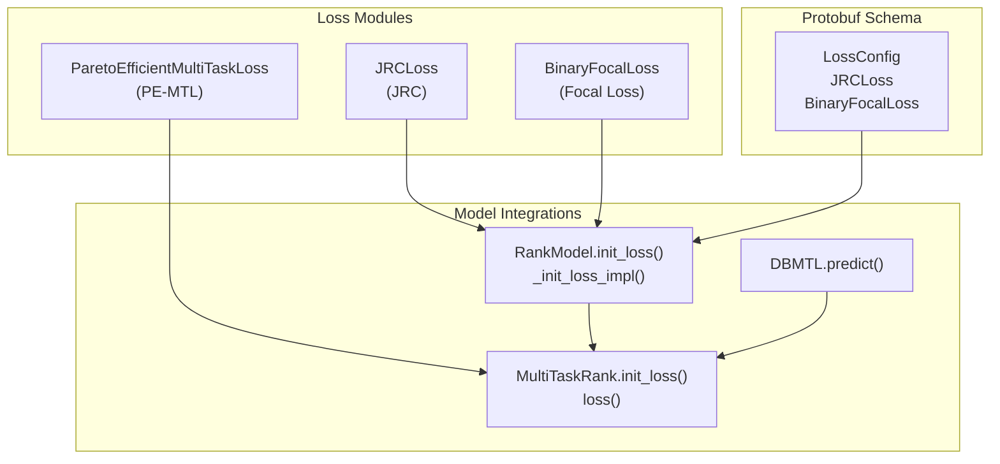
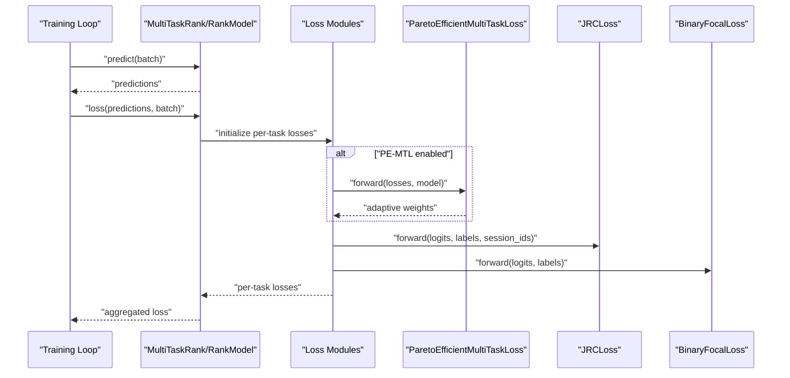
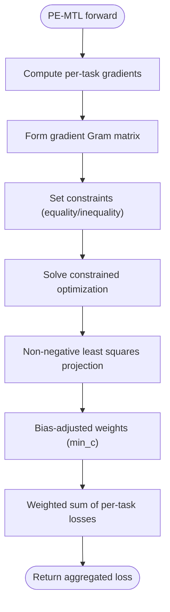
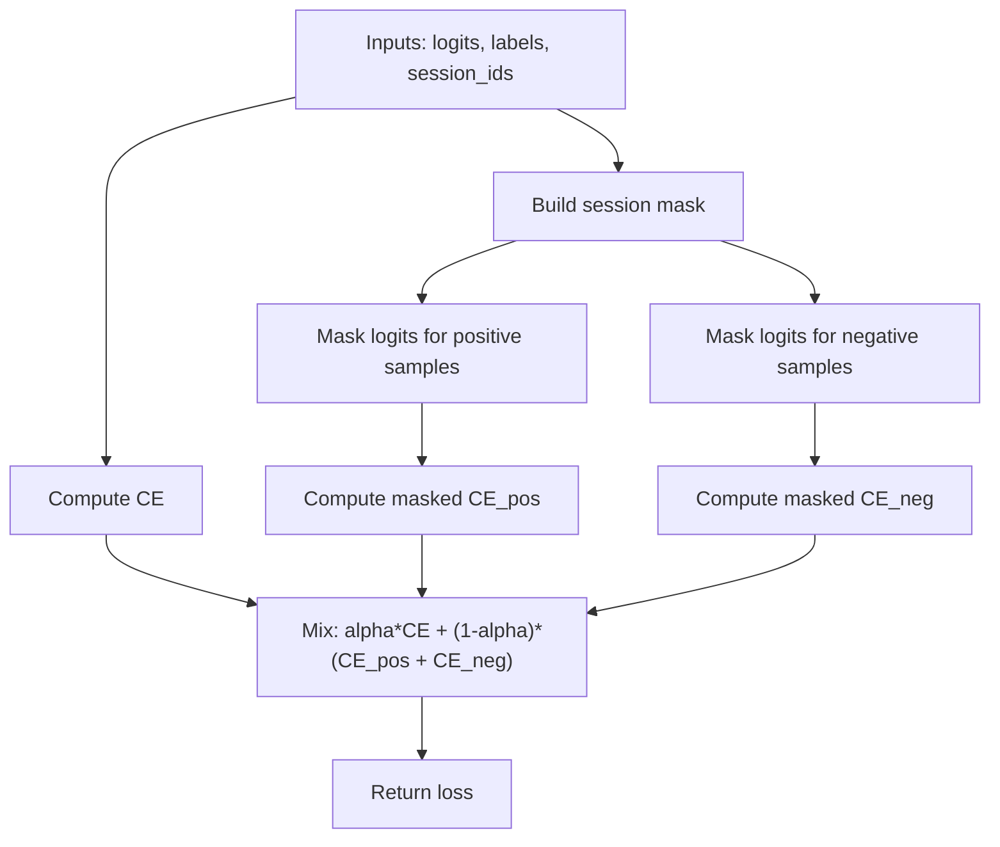
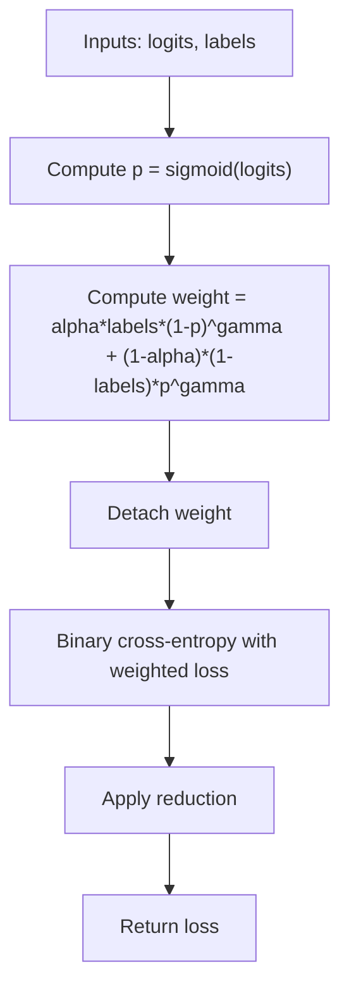
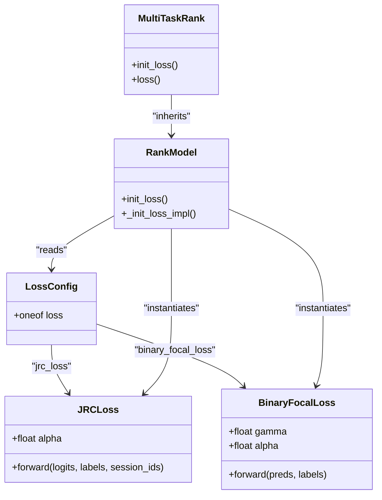

# Multi-Task Loss Functions and Regularization

<cite>
**Referenced Files in This Document**
- [pe_mtl_loss.py](file://tzrec/loss/pe_mtl_loss.py)
- [jrc_loss.py](file://tzrec/loss/jrc_loss.py)
- [focal_loss.py](file://tzrec/loss/focal_loss.py)
- [loss.proto](file://tzrec/protos/loss.proto)
- [multi_task_rank.py](file://tzrec/models/multi_task_rank.py)
- [rank_model.py](file://tzrec/models/rank_model.py)
- [dbmtl.py](file://tzrec/models/dbmtl.py)
- [dbmtl_taobao_jrc.config](file://examples/dbmtl_taobao_jrc.config)
- [jrc_loss_test.py](file://tzrec/loss/jrc_loss_test.py)
- [focal_loss_test.py](file://tzrec/loss/focal_loss_test.py)
</cite>

## Table of Contents

1. [Introduction](#introduction)
1. [Project Structure](#project-structure)
1. [Core Components](#core-components)
1. [Architecture Overview](#architecture-overview)
1. [Detailed Component Analysis](#detailed-component-analysis)
1. [Dependency Analysis](#dependency-analysis)
1. [Performance Considerations](#performance-considerations)
1. [Troubleshooting Guide](#troubleshooting-guide)
1. [Conclusion](#conclusion)
1. [Appendices](#appendices)

## Introduction

This document explains multi-task loss function implementations and regularization strategies in the repository, focusing on:

- Progressive Expert MTL loss (PE-MTL) for adaptive task weighting
- Joint Representation Learning loss (JRC) for session-aware shared representation learning
- Focal Loss adaptations for imbalanced multi-task scenarios

It details mathematical formulations, parameter configurations, use cases, implementation patterns, gradient balancing, task prioritization, and practical configuration examples. It also covers integration with model architectures and training pipelines, along with common challenges and optimization strategies.

## Project Structure

The multi-task loss ecosystem spans three primary areas:

- Loss modules: PE-MTL, JRC, and Binary Focal Loss implementations
- Protobuf definitions: loss configuration schema
- Model integrations: initialization and combination of per-task losses

**Diagram sources**

- \[pe_mtl_loss.py\](file://tzrec/loss/pe_mtl_loss.py#L18-L111)
- \[jrc_loss.py\](file://tzrec/loss/jrc_loss.py#L29-L118)
- \[focal_loss.py\](file://tzrec/loss/focal_loss.py#L18-L73)
- \[loss.proto\](file://tzrec/protos/loss.proto#L4-L33)
- \[multi_task_rank.py\](file://tzrec/models/multi_task_rank.py#L80-L127)
- \[rank_model.py\](file://tzrec/models/rank_model.py#L182-L218)
- \[dbmtl.py\](file://tzrec/models/dbmtl.py#L125-L176)

**Section sources**

- \[pe_mtl_loss.py\](file://tzrec/loss/pe_mtl_loss.py#L18-L111)
- \[jrc_loss.py\](file://tzrec/loss/jrc_loss.py#L29-L118)
- \[focal_loss.py\](file://tzrec/loss/focal_loss.py#L18-L73)
- \[loss.proto\](file://tzrec/protos/loss.proto#L4-L33)
- \[multi_task_rank.py\](file://tzrec/models/multi_task_rank.py#L80-L127)
- \[rank_model.py\](file://tzrec/models/rank_model.py#L182-L218)
- \[dbmtl.py\](file://tzrec/models/dbmtl.py#L125-L176)

## Core Components

- PE-MTL (Pareto Efficient Multi-Task Loss)

  - Dynamically computes task weights by solving a constrained optimization over gradient norms and inner products to approximate the Pareto frontier of losses.
  - Uses gradient vectors across tasks to iteratively update per-task weights.
  - Supports a minimum loss weight bias vector to bias toward certain tasks.

- JRC (Joint Representation Learning Loss)

  - Encourages positive samples to compete within sessions while suppressing negative ones within the same session.
  - Combines cross-entropy with a session-aware contrastive-like term controlled by a mixing coefficient alpha.

- Binary Focal Loss

  - Adjusts the cross-entropy loss to focus learning on easy examples and reduce the influence of easy negatives/positives via modulating factors controlled by gamma and alpha.

**Section sources**

- \[pe_mtl_loss.py\](file://tzrec/loss/pe_mtl_loss.py#L18-L111)
- \[jrc_loss.py\](file://tzrec/loss/jrc_loss.py#L29-L118)
- \[focal_loss.py\](file://tzrec/loss/focal_loss.py#L18-L73)

## Architecture Overview

The training pipeline initializes loss modules per task, computes individual task losses, optionally applies gradient-balancing or task weighting, and aggregates them into a total loss for backpropagation.

**Diagram sources**

- \[multi_task_rank.py\](file://tzrec/models/multi_task_rank.py#L80-L127)
- \[rank_model.py\](file://tzrec/models/rank_model.py#L182-L218)
- \[pe_mtl_loss.py\](file://tzrec/loss/pe_mtl_loss.py#L77-L111)
- \[jrc_loss.py\](file://tzrec/loss/jrc_loss.py#L51-L118)
- \[focal_loss.py\](file://tzrec/loss/focal_loss.py#L46-L73)

## Detailed Component Analysis

### Progressive Expert MTL Loss (PE-MTL)

- Mathematical formulation

  - Computes per-task gradients across trainable parameters.
  - Builds a Gram matrix from gradient outer products and solves a quadratic program with equality and inequality constraints to find weights near the Pareto-efficient frontier.
  - Applies a projection to maintain non-negativity and sum-to-one constraints, adjusted by a bias vector.

- Parameters

  - min_c: Bias vector constraining the minimum weight for each task (sum must be in \[0, 1)).
  - Internal optimization uses gradient computations and numerical solvers.

- Implementation highlights

  - Gradient computation across all tasks and trainable parameters.
  - Iterative update via constrained optimization and non-negative least squares.
  - Aggregates weighted losses into a single scalar for backward pass.

- Use cases

  - Scenarios with heterogeneous loss scales and competing objectives.
  - When static weighting fails to balance competing tasks effectively.

- Practical configuration

  - Enable in model configuration to initialize PE-MTL with per-task bias vectors.
  - Tune min_c to bias towards critical tasks.

**Diagram sources**

- \[pe_mtl_loss.py\](file://tzrec/loss/pe_mtl_loss.py#L30-L111)

**Section sources**

- \[pe_mtl_loss.py\](file://tzrec/loss/pe_mtl_loss.py#L18-L111)
- \[multi_task_rank.py\](file://tzrec/models/multi_task_rank.py#L46-L96)

### Joint Representation Learning Loss (JRC)

- Mathematical formulation

  - Combines standard cross-entropy with a session-aware contrastive-like term.
  - Separates positive and negative samples, masks logits to only consider intra-session competition, and re-computes CE over masked logits.
  - Mixes original CE with the masked CE using a coefficient alpha.

- Parameters

  - alpha: Mixing weight between CE and session-aware contrastive term.
  - reduction: Controls whether to average over batch or keep per-sample losses.

- Implementation highlights

  - Session mask construction from session identifiers.
  - Dynamic masking of logits for positive and negative classes separately.
  - Supports reduction modes for compatibility with per-sample weighting.

- Use cases

  - Session-based ranking/recSys where items from the same session compete for relevance.
  - Reducing global ranking pressure and encouraging within-session discrimination.

- Practical configuration

  - Configure JRC in task towers with session_name pointing to a session column.
  - Tune alpha to balance global CE and session-aware contrastive terms.

**Diagram sources**

- \[jrc_loss.py\](file://tzrec/loss/jrc_loss.py#L51-L118)

**Section sources**

- \[jrc_loss.py\](file://tzrec/loss/jrc_loss.py#L29-L118)
- \[rank_model.py\](file://tzrec/models/rank_model.py#L204-L208)
- \[dbmtl_taobao_jrc.config\](file://examples/dbmtl_taobao_jrc.config#L178-L201)

### Binary Focal Loss

- Mathematical formulation

  - Modulates the standard binary cross-entropy by weighting each sample according to prediction confidence and class balance.
  - Uses gamma to down-weight easy examples and alpha to balance positive/negative class emphasis.

- Parameters

  - gamma: Focusing parameter; higher values increase emphasis on hard examples.
  - alpha: Class balance parameter; controls positive vs negative weighting.
  - reduction: none/mean/sum behavior.

- Implementation highlights

  - Applies sigmoid probabilities derived from logits.
  - Detaches modulation weights to avoid gradient interference with the modulator itself.
  - Integrates with standard binary cross-entropy with sample-wise weights.

- Use cases

  - Highly imbalanced binary tasks within multi-task setups.
  - Reducing dominance of majority class and focusing on minority class learning.

- Practical configuration

  - Configure BinaryFocalLoss in task towers.
  - Tune gamma and alpha based on dataset imbalance and task importance.

**Diagram sources**

- \[focal_loss.py\](file://tzrec/loss/focal_loss.py#L46-L73)

**Section sources**

- \[focal_loss.py\](file://tzrec/loss/focal_loss.py#L18-L73)
- \[rank_model.py\](file://tzrec/models/rank_model.py#L193-L198)

## Dependency Analysis

- Loss configuration schema

  - LossConfig supports BinaryCrossEntropy, SoftmaxCrossEntropy, L2Loss, JRCLoss, and BinaryFocalLoss.
  - JRCLoss requires a session_name and optional alpha.
  - BinaryFocalLoss accepts gamma and alpha.

- Model integration

  - RankModel initializes loss modules based on configuration, selecting appropriate PyTorch loss classes or custom losses.
  - MultiTaskRank orchestrates per-task loss initialization and aggregation, optionally enabling PE-MTL with per-task bias vectors.

**Diagram sources**

- \[loss.proto\](file://tzrec/protos/loss.proto#L4-L33)
- \[rank_model.py\](file://tzrec/models/rank_model.py#L182-L218)
- \[multi_task_rank.py\](file://tzrec/models/multi_task_rank.py#L80-L127)

**Section sources**

- \[loss.proto\](file://tzrec/protos/loss.proto#L4-L33)
- \[rank_model.py\](file://tzrec/models/rank_model.py#L182-L218)
- \[multi_task_rank.py\](file://tzrec/models/multi_task_rank.py#L80-L127)

## Performance Considerations

- Gradient balancing

  - PE-MTL dynamically adjusts task weights using gradient geometry, reducing oscillation across tasks and stabilizing multi-task training.
  - JRC’s session-aware masking reduces intra-session noise and improves local discrimination without increasing model complexity.

- Computational overhead

  - PE-MTL involves gradient computation across tasks and numerical optimization; consider batch sizes and frequency of updates.
  - JRC adds masking and per-class CE computations; ensure efficient tensor indexing and masking.

- Convergence optimization

  - Start with balanced alpha in JRC; gradually increase to emphasize within-session competition.
  - Tune gamma and alpha in Binary Focal Loss to address class imbalance without overfitting.

[No sources needed since this section provides general guidance]

## Troubleshooting Guide

- JRC loss assertions and shapes

  - Ensure labels and logits shapes align with expectations and that num_class equals 2 when using JRC.
  - Verify session_name corresponds to a proper grouping column.

- Binary Focal Loss constraints

  - gamma must be non-negative; alpha must be in (0, 1); reduction must be one of none/mean/sum.

- PE-MTL initialization

  - Ensure min_c sums to less than 1 and matches the number of tasks.
  - Confirm model parameters require gradients for accurate gradient computation.

- Validation via unit tests

  - JRC loss unit tests validate numeric outputs for both reduction modes.
  - Binary Focal Loss unit tests validate numeric outputs for both reduction modes.

**Section sources**

- \[jrc_loss.py\](file://tzrec/loss/jrc_loss.py#L29-L118)
- \[focal_loss.py\](file://tzrec/loss/focal_loss.py#L29-L44)
- \[pe_mtl_loss.py\](file://tzrec/loss/pe_mtl_loss.py#L21-L28)
- \[jrc_loss_test.py\](file://tzrec/loss/jrc_loss_test.py#L20-L63)
- \[focal_loss_test.py\](file://tzrec/loss/focal_loss_test.py#L19-L42)

## Conclusion

The repository provides robust multi-task loss capabilities:

- PE-MTL enables adaptive task weighting via gradient geometry and constrained optimization.
- JRC encourages session-aware competition to improve local discrimination.
- Binary Focal Loss mitigates class imbalance by focusing on hard examples and balancing positive/negative emphasis.

These components integrate cleanly with model configurations and training pipelines, supporting practical multi-task scenarios with strong defaults and tunable parameters.

[No sources needed since this section summarizes without analyzing specific files]

## Appendices

### Practical Configuration Examples

- JRC in DBMTL

  - Configure JRC with a session_name and adjust alpha for within-session competition.
  - Example configuration demonstrates two task towers (CTR and CVR) using JRC with a shared session identifier.

- Binary Focal Loss in multi-task models

  - Add BinaryFocalLoss to task-specific losses with gamma and alpha tuned to dataset characteristics.

- PE-MTL in multi-task models

  - Enable per-task min_c biases to favor critical tasks; monitor convergence and adjust min_c if necessary.

**Section sources**

- \[dbmtl_taobao_jrc.config\](file://examples/dbmtl_taobao_jrc.config#L178-L201)
- \[rank_model.py\](file://tzrec/models/rank_model.py#L193-L198)
- \[multi_task_rank.py\](file://tzrec/models/multi_task_rank.py#L92-L96)
