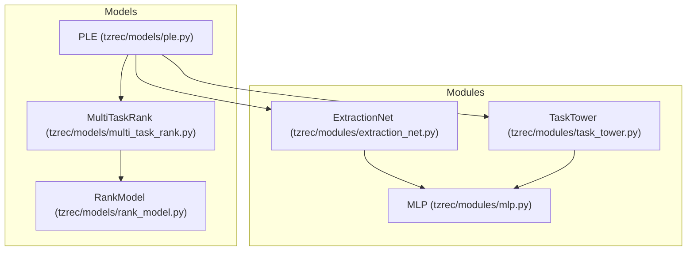
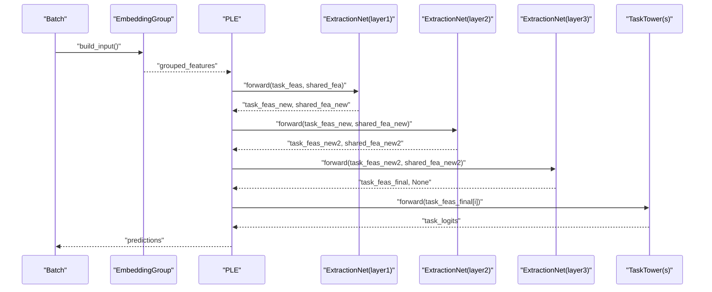
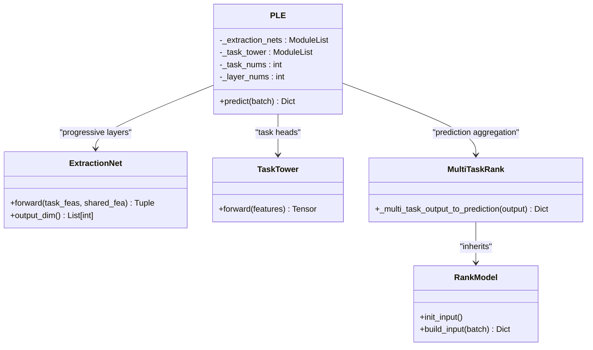
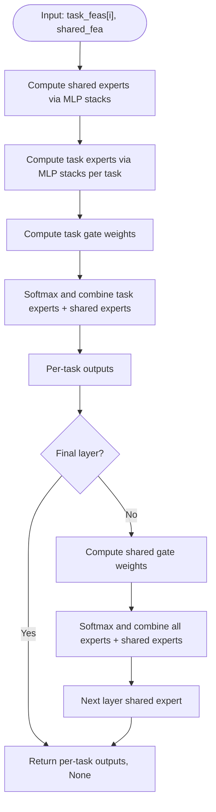
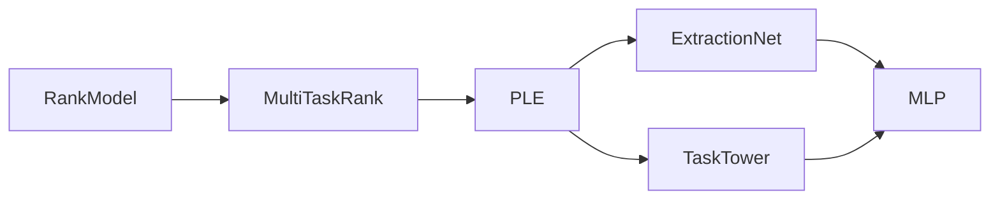

# PLE Model (Progressive Layered Extraction)

<cite>
**Referenced Files in This Document**
- [ple.py](file://tzrec/models/ple.py)
- [extraction_net.py](file://tzrec/modules/extraction_net.py)
- [task_tower.py](file://tzrec/modules/task_tower.py)
- [multi_task_rank.py](file://tzrec/models/multi_task_rank.py)
- [rank_model.py](file://tzrec/models/rank_model.py)
- [mlp.py](file://tzrec/modules/mlp.py)
- [ple.md](file://docs/source/models/ple.md)
- [ple_taobao.config](file://examples/ple_taobao.config)
- [ple_test.py](file://tzrec/models/ple_test.py)
</cite>

## Table of Contents

1. [Introduction](#introduction)
1. [Project Structure](#project-structure)
1. [Core Components](#core-components)
1. [Architecture Overview](#architecture-overview)
1. [Detailed Component Analysis](#detailed-component-analysis)
1. [Dependency Analysis](#dependency-analysis)
1. [Performance Considerations](#performance-considerations)
1. [Troubleshooting Guide](#troubleshooting-guide)
1. [Conclusion](#conclusion)
1. [Appendices](#appendices)

## Introduction

This document explains the Progressive Layered Extraction (PLE) model implementation in TorchEasyRec. PLE improves multi-task learning by mitigating the seesaw effect (where some tasks improve while others degrade under shared learning) through a progressive, hierarchical extraction approach. It maintains shared knowledge across layers while enabling task-specialized feature extraction that deepens progressively.

Key goals:

- Progressive layer-wise extraction with shared and task-specific experts
- Hierarchical multi-task learning with task towers
- Stable training and improved task balance compared to flat multi-task architectures
- Memory efficiency via modular expert routing and gating

## Project Structure

The PLE implementation is composed of:

- Model definition and orchestration: PLE class
- Layer-wise extraction module: ExtractionNet (MoE-style experts with gates)
- Task-specific prediction heads: TaskTower
- Multi-task base framework: MultiTaskRank and RankModel
- Shared building blocks: MLP

**Diagram sources**

- \[ple.py\](file://tzrec/models/ple.py#L27-L110)
- \[extraction_net.py\](file://tzrec/modules/extraction_net.py#L20-L140)
- \[task_tower.py\](file://tzrec/modules/task_tower.py#L21-L94)
- \[multi_task_rank.py\](file://tzrec/models/multi_task_rank.py#L25-L221)
- \[rank_model.py\](file://tzrec/models/rank_model.py#L56-L513)
- \[mlp.py\](file://tzrec/modules/mlp.py#L86-L178)

**Section sources**

- \[ple.py\](file://tzrec/models/ple.py#L27-L110)
- \[extraction_net.py\](file://tzrec/modules/extraction_net.py#L20-L140)
- \[task_tower.py\](file://tzrec/modules/task_tower.py#L21-L94)
- \[multi_task_rank.py\](file://tzrec/models/multi_task_rank.py#L25-L221)
- \[rank_model.py\](file://tzrec/models/rank_model.py#L56-L513)
- \[mlp.py\](file://tzrec/modules/mlp.py#L86-L178)

## Core Components

- PLE: Orchestrates progressive extraction across multiple layers and produces multi-task predictions.
- ExtractionNet: Implements shared and task-specific experts with gating to route signals to task towers and shared experts.
- TaskTower: Applies optional MLP stacking then a linear head per task.
- MultiTaskRank: Provides multi-task loss/metric initialization and prediction aggregation.
- RankModel: Base embedding and input construction, plus loss/metric plumbing.
- MLP: Stacked perceptrons with normalization and activation.

**Section sources**

- \[ple.py\](file://tzrec/models/ple.py#L27-L110)
- \[extraction_net.py\](file://tzrec/modules/extraction_net.py#L20-L140)
- \[task_tower.py\](file://tzrec/modules/task_tower.py#L21-L94)
- \[multi_task_rank.py\](file://tzrec/models/multi_task_rank.py#L25-L221)
- \[rank_model.py\](file://tzrec/models/rank_model.py#L56-L513)
- \[mlp.py\](file://tzrec/modules/mlp.py#L86-L178)

## Architecture Overview

PLE performs progressive layer-wise extraction:

- Each layer has:
  - Task-specific experts (per task)
  - Shared experts
  - Task gates (route to task experts + shared experts)
  - Optional shared gate (routes all task experts + shared experts to the next layer’s shared expert)
- Final layer does not produce a shared expert output (final_flag).
- Task towers consume per-task expert outputs from the final layer.

**Diagram sources**

- \[ple.py\](file://tzrec/models/ple.py#L87-L110)
- \[extraction_net.py\](file://tzrec/modules/extraction_net.py#L111-L140)
- \[task_tower.py\](file://tzrec/modules/task_tower.py#L45-L51)
- \[multi_task_rank.py\](file://tzrec/models/multi_task_rank.py#L50-L65)

## Detailed Component Analysis

### PLE Model

- Initializes:
  - Number of tasks and layers from model config
  - Embedding group and total input dimension
  - A list of ExtractionNet layers (one per progressive layer)
  - A list of TaskTower heads (one per task)
- Forward:
  - Builds grouped embeddings
  - Runs progressive extraction: each layer updates per-task and shared features
  - Feeds per-task features to respective TaskTower heads
  - Aggregates predictions via MultiTaskRank helpers

**Diagram sources**

- \[ple.py\](file://tzrec/models/ple.py#L27-L110)
- \[extraction_net.py\](file://tzrec/modules/extraction_net.py#L20-L140)
- \[task_tower.py\](file://tzrec/modules/task_tower.py#L21-L94)
- \[multi_task_rank.py\](file://tzrec/models/multi_task_rank.py#L25-L221)
- \[rank_model.py\](file://tzrec/models/rank_model.py#L56-L513)

**Section sources**

- \[ple.py\](file://tzrec/models/ple.py#L37-L110)

### ExtractionNet (Layer-wise Experts and Gates)

- Constructs:
  - Shared experts: MLP stacks for shared knowledge
  - Task experts: MLP stacks per task
  - Task gates: Linear layers that compute routing weights across task experts and shared experts
  - Optional shared gate: Linear layer that routes all experts to the next layer’s shared expert (except final layer)
- Forward:
  - Computes shared experts and per-task experts
  - Applies softmax gating to combine experts into per-task and shared outputs
  - Returns per-task outputs and next-layer shared expert (or None for final layer)

**Diagram sources**

- \[extraction_net.py\](file://tzrec/modules/extraction_net.py#L89-L140)

**Section sources**

- \[extraction_net.py\](file://tzrec/modules/extraction_net.py#L34-L140)

### TaskTower (Per-Task Prediction Heads)

- Optional MLP stacking on top of the incoming features
- Linear head sized by number of classes per task
- Supports multi-class and binary classification outputs

**Section sources**

- \[task_tower.py\](file://tzrec/modules/task_tower.py#L30-L51)

### MultiTaskRank and RankModel (Multi-Task Pipeline)

- MultiTaskRank:
  - Aggregates predictions across tasks
  - Initializes per-task losses and metrics
  - Handles task-space weighting and sample weights
- RankModel:
  - Builds embedding groups and applies optional variational dropout
  - Converts logits/probabilities to predictions based on loss type
  - Provides loss/metric initialization and updates

**Section sources**

- \[multi_task_rank.py\](file://tzrec/models/multi_task_rank.py#L50-L221)
- \[rank_model.py\](file://tzrec/models/rank_model.py#L115-L513)

## Dependency Analysis

- PLE depends on:
  - MultiTaskRank for multi-task scaffolding
  - ExtractionNet for progressive layer-wise expert routing
  - TaskTower for per-task heads
  - RankModel for embedding and prediction conversion
- ExtractionNet depends on MLP for expert networks
- TaskTower optionally depends on MLP for stacking

**Diagram sources**

- \[ple.py\](file://tzrec/models/ple.py#L27-L110)
- \[multi_task_rank.py\](file://tzrec/models/multi_task_rank.py#L25-L221)
- \[rank_model.py\](file://tzrec/models/rank_model.py#L56-L513)
- \[extraction_net.py\](file://tzrec/modules/extraction_net.py#L20-L140)
- \[task_tower.py\](file://tzrec/modules/task_tower.py#L21-L94)
- \[mlp.py\](file://tzrec/modules/mlp.py#L86-L178)

**Section sources**

- \[ple.py\](file://tzrec/models/ple.py#L27-L110)
- \[extraction_net.py\](file://tzrec/modules/extraction_net.py#L20-L140)
- \[task_tower.py\](file://tzrec/modules/task_tower.py#L21-L94)
- \[multi_task_rank.py\](file://tzrec/models/multi_task_rank.py#L25-L221)
- \[rank_model.py\](file://tzrec/models/rank_model.py#L56-L513)
- \[mlp.py\](file://tzrec/modules/mlp.py#L86-L178)

## Performance Considerations

- Progressive extraction reduces cross-task interference by gradually deepening task specialization while preserving shared knowledge.
- Gating minimizes redundant computation by routing only relevant expert activations to downstream layers.
- Memory efficiency:
  - Experts are reused across tasks; gating is lightweight.
  - Final layer avoids producing shared features, reducing downstream fan-out.
- Training stability:
  - Gradual specialization helps mitigate the seesaw effect.
  - Task gates and shared gates normalize routing weights via softmax.

[No sources needed since this section provides general guidance]

## Troubleshooting Guide

- Shape mismatches:
  - Ensure per-layer expert output dimensions align with subsequent layer inputs.
  - Verify task_num equals the number of task towers.
- Routing anomalies:
  - Confirm expert_num_per_task and share_num are positive integers.
  - Check that task_expert_net and share_expert_net hidden_units are consistent with input dimensions.
- Multi-task loss weighting:
  - Use task_space_indicator_label and in/out task space weights to restrict loss computation to relevant samples.
  - Sample weights are normalized internally; adjust absolute weights via task weight parameters.

**Section sources**

- \[ple.py\](file://tzrec/models/ple.py#L51-L86)
- \[multi_task_rank.py\](file://tzrec/models/multi_task_rank.py#L105-L126)

## Conclusion

PLE’s progressive, hierarchical multi-task architecture balances shared knowledge with task specialization. By stacking ExtractionNets with shared and task-specific experts and gating mechanisms, PLE reduces negative transfer and the seesaw effect, while maintaining memory efficiency and training stability. TaskTower heads then produce task-specific predictions, and MultiTaskRank aggregates outputs consistently with TorchEasyRec’s multi-task framework.

[No sources needed since this section summarizes without analyzing specific files]

## Appendices

### Configuration Examples

- Example model configuration for PLE with three progressive layers and two tasks is provided in the documentation and example config files.
- Key configuration keys:
  - feature_groups: define the embedding group(s)
  - ple.extraction_networks: list of progressive layers with expert counts and expert MLP specs
  - ple.task_towers: per-task tower configurations with label names, MLP, losses, and metrics

**Section sources**

- \[ple.md\](file://docs/source/models/ple.md#L15-L88)
- \[ple_taobao.config\](file://examples/ple_taobao.config#L159-L246)

### Forward Pass Through Progressive Layers

- Build embeddings from the embedding group
- Initialize per-task and shared feature lists
- Iterate ExtractionNet layers:
  - Compute per-task and shared experts
  - Apply gating to produce routed outputs
  - Update per-task and shared features for next layer
- Final layer returns per-task features without shared output
- TaskTower heads process per-task features and produce predictions

**Section sources**

- \[ple.py\](file://tzrec/models/ple.py#L87-L110)
- \[extraction_net.py\](file://tzrec/modules/extraction_net.py#L111-L140)
- \[task_tower.py\](file://tzrec/modules/task_tower.py#L45-L51)

### Benefits Compared to Flat Multi-Task Architectures

- Mitigates seesaw effect by progressively deepening task specialization
- Reduces negative transfer by isolating strong task-specific signals until later layers
- Improves training stability via gating and shared expert routing
- Maintains memory efficiency by avoiding full-flat sharing across all layers

[No sources needed since this section provides general guidance]
