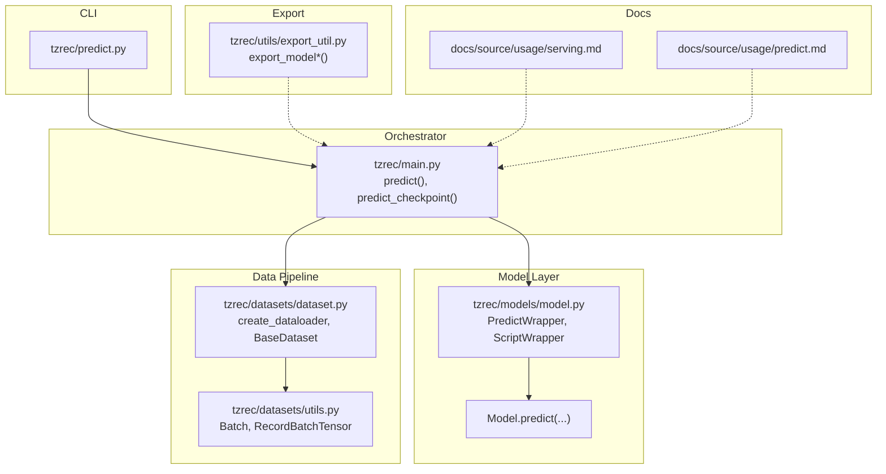
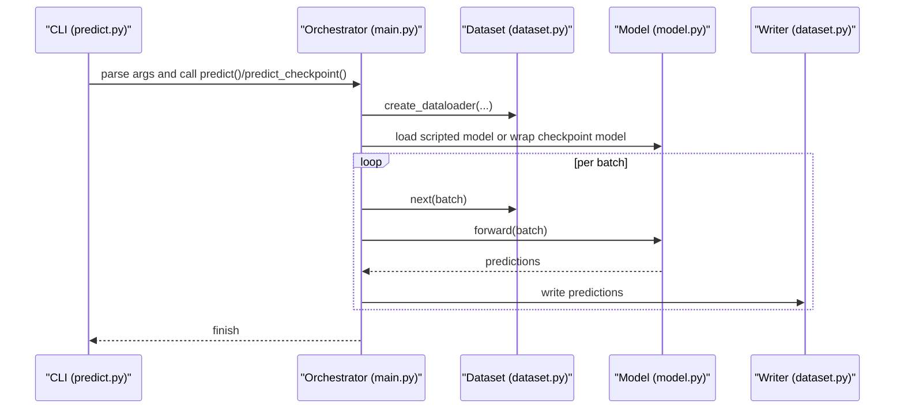
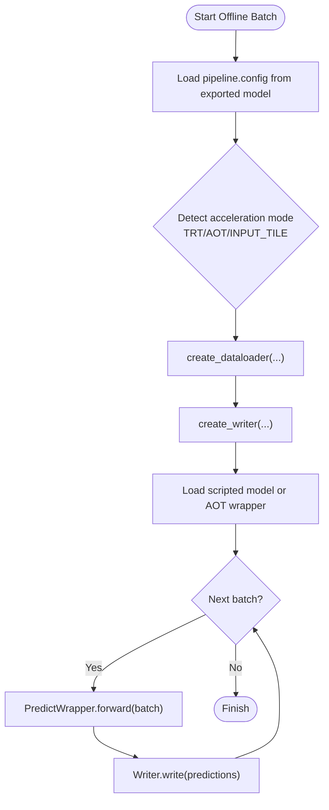
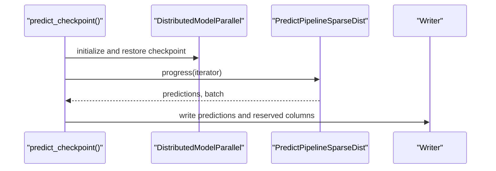
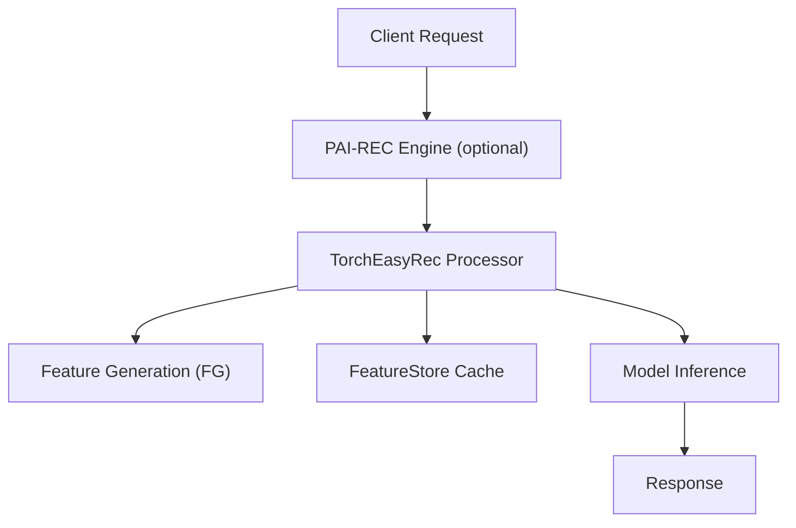
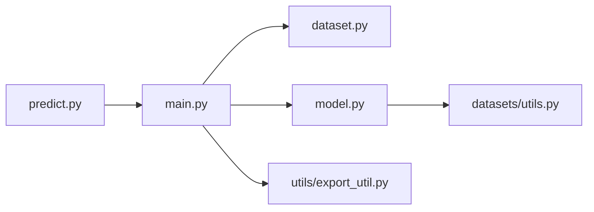

# Prediction and Inference Pipeline

<cite>
**Referenced Files in This Document**
- [predict.py](file://tzrec/predict.py)
- [main.py](file://tzrec/main.py)
- [model.py](file://tzrec/models/model.py)
- [dataset.py](file://tzrec/datasets/dataset.py)
- [utils.py](file://tzrec/datasets/utils.py)
- [export_util.py](file://tzrec/utils/export_util.py)
- [serving.md](file://docs/source/usage/serving.md)
- [predict.md](file://docs/source/usage/predict.md)
</cite>

## Table of Contents

1. [Introduction](#introduction)
1. [Project Structure](#project-structure)
1. [Core Components](#core-components)
1. [Architecture Overview](#architecture-overview)
1. [Detailed Component Analysis](#detailed-component-analysis)
1. [Dependency Analysis](#dependency-analysis)
1. [Performance Considerations](#performance-considerations)
1. [Troubleshooting Guide](#troubleshooting-guide)
1. [Conclusion](#conclusion)
1. [Appendices](#appendices)

## Introduction

This document explains TorchEasyRec’s prediction and inference pipeline, covering offline batch scoring, online real-time serving, and integration with serving infrastructure. It details the end-to-end workflow from input preprocessing to model execution and output postprocessing, and provides guidance on optimizing latency, managing memory, scaling workloads, interpreting results, and deploying production-grade inference.

## Project Structure

The prediction pipeline spans CLI entry points, the main prediction orchestrator, model wrappers, dataset readers/writers, and export utilities. Serving integrates with PAI EAS via a Processor that combines feature generation, FeatureStore caching, and model inference.

**Diagram sources**

- \[predict.py\](file://tzrec/predict.py#L15-L143)
- \[main.py\](file://tzrec/main.py#L976-L1195)
- \[model.py\](file://tzrec/models/model.py#L287-L360)
- \[dataset.py\](file://tzrec/datasets/dataset.py#L645-L649)
- \[utils.py\](file://tzrec/datasets/utils.py#L110-L200)
- \[export_util.py\](file://tzrec/utils/export_util.py#L75-L238)
- \[serving.md\](file://docs/source/usage/serving.md#L1-L97)
- \[predict.md\](file://docs/source/usage/predict.md#L1-L66)

**Section sources**

- \[predict.py\](file://tzrec/predict.py#L15-L143)
- \[main.py\](file://tzrec/main.py#L976-L1195)
- \[model.py\](file://tzrec/models/model.py#L287-L360)
- \[dataset.py\](file://tzrec/datasets/dataset.py#L645-L649)
- \[utils.py\](file://tzrec/datasets/utils.py#L110-L200)
- \[export_util.py\](file://tzrec/utils/export_util.py#L75-L238)
- \[serving.md\](file://docs/source/usage/serving.md#L1-L97)
- \[predict.md\](file://docs/source/usage/predict.md#L1-L66)

## Core Components

- CLI entry point parses arguments and dispatches to either scripted model prediction or checkpoint-based prediction.
- Prediction orchestrators build datasets, writers, and models, then run inference loops with parallelism and queues.
- Model wrappers adapt model outputs and optionally enable mixed precision or selective output columns.
- Dataset utilities define the Batch abstraction and serialization for inter-process communication.
- Export utilities produce optimized scripted models and metadata for serving.

Key responsibilities:

- Argument parsing and dispatch: \[predict.py\](file://tzrec/predict.py#L15-L143)
- Scripted model prediction loop: \[main.py\](file://tzrec/main.py#L976-L1195)
- Checkpoint-based prediction loop: \[main.py\](file://tzrec/main.py#L1198-L1387)
- Model wrappers: \[model.py\](file://tzrec/models/model.py#L287-L360)
- Batch and RecordBatchTensor: \[utils.py\](file://tzrec/datasets/utils.py#L83-L200)
- Dataset creation: \[dataset.py\](file://tzrec/datasets/dataset.py#L645-L649)
- Export pipeline: \[export_util.py\](file://tzrec/utils/export_util.py#L75-L238)

**Section sources**

- \[predict.py\](file://tzrec/predict.py#L15-L143)
- \[main.py\](file://tzrec/main.py#L976-L1195)
- \[main.py\](file://tzrec/main.py#L1198-L1387)
- \[model.py\](file://tzrec/models/model.py#L287-L360)
- \[utils.py\](file://tzrec/datasets/utils.py#L83-L200)
- \[dataset.py\](file://tzrec/datasets/dataset.py#L645-L649)
- \[export_util.py\](file://tzrec/utils/export_util.py#L75-L238)

## Architecture Overview

The pipeline supports two primary modes:

- Offline batch prediction using exported scripted models.
- Offline batch prediction using checkpoints with live model code.

**Diagram sources**

- \[predict.py\](file://tzrec/predict.py#L15-L143)
- \[main.py\](file://tzrec/main.py#L976-L1195)
- \[dataset.py\](file://tzrec/datasets/dataset.py#L645-L649)
- \[model.py\](file://tzrec/models/model.py#L287-L360)

## Detailed Component Analysis

### Offline Batch Prediction (Scripted Model)

- Entry point: \[predict.py\](file://tzrec/predict.py#L15-L143)
- Orchestrator: \[main.py\](file://tzrec/main.py#L976-L1195)
  - Loads pipeline config from exported model directory.
  - Detects acceleration modes (TensorRT/AOT/INPUT_TILE).
  - Builds dataset and writer, loads scripted model, and runs prediction loop.
  - Uses producer-consumer queues and threads for throughput.
- Model wrapper: \[model.py\](file://tzrec/models/model.py#L287-L360)
  - PredictWrapper enables mixed precision and selective output columns.
  - ScriptWrapper prepares feature parsing for scripted execution.
- Dataset and writer: \[dataset.py\](file://tzrec/datasets/dataset.py#L645-L649), \[dataset.py\](file://tzrec/datasets/dataset.py#L621-L642)
  - create_dataloader builds PyArrow-backed readers/writers.
  - Writers support CSV/Parquet/Odps targets.
- Batch abstraction: \[utils.py\](file://tzrec/datasets/utils.py#L110-L200)
  - Batch holds dense/sparse/sequence features and reserved columns.
  - RecordBatchTensor serializes reserved inputs for inter-process transfer.

**Diagram sources**

- \[main.py\](file://tzrec/main.py#L976-L1195)
- \[model.py\](file://tzrec/models/model.py#L287-L360)
- \[dataset.py\](file://tzrec/datasets/dataset.py#L621-L642)
- \[utils.py\](file://tzrec/datasets/utils.py#L110-L200)

**Section sources**

- \[predict.py\](file://tzrec/predict.py#L15-L143)
- \[main.py\](file://tzrec/main.py#L976-L1195)
- \[model.py\](file://tzrec/models/model.py#L287-L360)
- \[dataset.py\](file://tzrec/datasets/dataset.py#L621-L642)
- \[utils.py\](file://tzrec/datasets/utils.py#L110-L200)

### Offline Batch Prediction (Checkpoint)

- Orchestrator: \[main.py\](file://tzrec/main.py#L1198-L1387)
  - Validates unsupported model types for checkpoint predict.
  - Builds model with PredictWrapper and DistributedModelParallel.
  - Runs PredictPipelineSparseDist to iterate batches and write results.
- Dataset and writer: \[dataset.py\](file://tzrec/datasets/dataset.py#L645-L649), \[dataset.py\](file://tzrec/datasets/dataset.py#L621-L642)
- Batch handling: \[utils.py\](file://tzrec/datasets/utils.py#L110-L200)

**Diagram sources**

- \[main.py\](file://tzrec/main.py#L1198-L1387)
- \[dataset.py\](file://tzrec/datasets/dataset.py#L621-L642)
- \[utils.py\](file://tzrec/datasets/utils.py#L110-L200)

**Section sources**

- \[main.py\](file://tzrec/main.py#L1198-L1387)
- \[dataset.py\](file://tzrec/datasets/dataset.py#L621-L642)
- \[utils.py\](file://tzrec/datasets/utils.py#L110-L200)

### Real-Time Serving Pattern (PAI EAS)

- Deployment: \[serving.md\](file://docs/source/usage/serving.md#L1-L97)
  - Processor configuration includes FG mode/threads, FeatureStore parameters, and retrieval tuning knobs.
  - Supports direct Processor invocation or integration via PAI-REC engine.
- Serving parameters:
  - Feature generation modes and threads.
  - FeatureStore project/model/entity and credentials.
  - Retrieval controls (FAISS/TDM).
  - Runtime flags (e.g., INPUT_TILE, NO_GRAD_GUARD).

**Diagram sources**

- \[serving.md\](file://docs/source/usage/serving.md#L1-L97)

**Section sources**

- \[serving.md\](file://docs/source/usage/serving.md#L1-L97)

### Prediction Utilities and Postprocessing

- Reserved columns: preserved inputs passed through Batch.reserves and written by the writer.
- Output columns: PredictWrapper can restrict outputs to specified columns.
- Debugging: debug_level dumps parsed feature data for inspection.
- Writers: Parquet/Csv/Odps writers support distributed writes and quotas.

**Section sources**

- \[dataset.py\](file://tzrec/datasets/dataset.py#L400-L419)
- \[model.py\](file://tzrec/models/model.py#L332-L345)
- \[utils.py\](file://tzrec/datasets/utils.py#L110-L200)
- \[dataset.py\](file://tzrec/datasets/dataset.py#L621-L642)

## Dependency Analysis

- CLI depends on main orchestration functions.
- Orchestrator depends on dataset creation, model wrappers, and writers.
- Model wrappers depend on Batch and DataParser abstractions.
- Export utilities depend on model tracing and acceleration detection.

**Diagram sources**

- \[predict.py\](file://tzrec/predict.py#L15-L143)
- \[main.py\](file://tzrec/main.py#L976-L1195)
- \[dataset.py\](file://tzrec/datasets/dataset.py#L645-L649)
- \[model.py\](file://tzrec/models/model.py#L287-L360)
- \[utils.py\](file://tzrec/datasets/utils.py#L110-L200)
- \[export_util.py\](file://tzrec/utils/export_util.py#L75-L238)

**Section sources**

- \[predict.py\](file://tzrec/predict.py#L15-L143)
- \[main.py\](file://tzrec/main.py#L976-L1195)
- \[dataset.py\](file://tzrec/datasets/dataset.py#L645-L649)
- \[model.py\](file://tzrec/models/model.py#L287-L360)
- \[utils.py\](file://tzrec/datasets/utils.py#L110-L200)
- \[export_util.py\](file://tzrec/utils/export_util.py#L75-L238)

## Performance Considerations

- Throughput and latency:
  - Parallel data loading and prediction threads: \[main.py\](file://tzrec/main.py#L1116-L1117)
  - Producer/consumer queues decouple IO and compute: \[main.py\](file://tzrec/main.py#L1118-L1121)
  - Mixed precision in PredictWrapper reduces memory bandwidth: \[model.py\](file://tzrec/models/model.py#L304-L312)
- Acceleration modes:
  - TensorRT export and limits: \[export_util.py\](file://tzrec/utils/export_util.py#L195-L201)
  - AOT export and splitting: \[export_util.py\](file://tzrec/utils/export_util.py#L202-L208)
  - INPUT_TILE toggles batching behavior: \[main.py\](file://tzrec/main.py#L1125-L1128)
- GPU/CPU transfers:
  - PredictWrapper moves outputs to CPU when device is CUDA: \[model.py\](file://tzrec/models/model.py#L343-L344)
  - Synchronization after pipeline progress: \[main.py\](file://tzrec/main.py#L1364-L1365)
- Serving tuning:
  - FG threads, RPC worker threads, and retrieval parameters: \[serving.md\](file://docs/source/usage/serving.md#L57-L84)

[No sources needed since this section provides general guidance]

## Troubleshooting Guide

- Unsupported model types for checkpoint predict:
  - Certain architectures are not supported in checkpoint predict: \[main.py\](file://tzrec/main.py#L1240-L1244)
- Environment variables for MaxCompute:
  - ODPS endpoint and config file must be set for ODPS datasets: \[predict.md\](file://docs/source/usage/predict.md#L61-L66)
- Profiling offline prediction:
  - Enable profiling to capture traces and memory: \[main.py\](file://tzrec/main.py#L1102-L1113)
- Writer lifecycle:
  - Writers must be closed explicitly; otherwise warnings are logged: \[dataset.py\](file://tzrec/datasets/dataset.py#L575-L579)

**Section sources**

- \[main.py\](file://tzrec/main.py#L1240-L1244)
- \[predict.md\](file://docs/source/usage/predict.md#L61-L66)
- \[main.py\](file://tzrec/main.py#L1102-L1113)
- \[dataset.py\](file://tzrec/datasets/dataset.py#L575-L579)

## Conclusion

TorchEasyRec provides a robust, scalable inference pipeline supporting both offline batch scoring and online real-time serving. The design leverages parallel data loading, model wrappers for mixed precision and selective outputs, and export utilities for acceleration. Serving integrates with PAI EAS and FeatureStore for high-throughput, low-latency online ranking. Production deployments benefit from profiling, careful tuning of FG threads and RPC workers, and disciplined memory management during inference.

[No sources needed since this section summarizes without analyzing specific files]

## Appendices

### Practical Examples

- Offline batch prediction with exported model:

  - Command-line usage and options: \[predict.md\](file://docs/source/usage/predict.md#L5-L28)
  - Scripted model prediction loop: \[main.py\](file://tzrec/main.py#L976-L1195)

- Offline batch prediction with checkpoint:

  - Command-line usage and options: \[predict.md\](file://docs/source/usage/predict.md#L34-L59)
  - Checkpoint-based prediction loop: \[main.py\](file://tzrec/main.py#L1198-L1387)

- Configure prediction endpoints for serving:

  - Processor configuration and parameters: \[serving.md\](file://docs/source/usage/serving.md#L5-L84)

- Optimize inference performance:

  - Mixed precision and output column filtering: \[model.py\](file://tzrec/models/model.py#L304-L345)
  - TensorRT/AOT export and INPUT_TILE: \[export_util.py\](file://tzrec/utils/export_util.py#L195-L208), \[main.py\](file://tzrec/main.py#L1125-L1128)
  - Serving tuning knobs: \[serving.md\](file://docs/source/usage/serving.md#L57-L84)

- Interpret prediction results and integrate downstream:

  - Reserved columns and output columns: \[dataset.py\](file://tzrec/datasets/dataset.py#L400-L419), \[model.py\](file://tzrec/models/model.py#L332-L345)
  - Writers for Parquet/Csv/Odps: \[dataset.py\](file://tzrec/datasets/dataset.py#L621-L642)

**Section sources**

- \[predict.md\](file://docs/source/usage/predict.md#L5-L59)
- \[main.py\](file://tzrec/main.py#L976-L1195)
- \[main.py\](file://tzrec/main.py#L1198-L1387)
- \[serving.md\](file://docs/source/usage/serving.md#L5-L84)
- \[model.py\](file://tzrec/models/model.py#L304-L345)
- \[export_util.py\](file://tzrec/utils/export_util.py#L195-L208)
- \[dataset.py\](file://tzrec/datasets/dataset.py#L400-L419)
- \[dataset.py\](file://tzrec/datasets/dataset.py#L621-L642)
