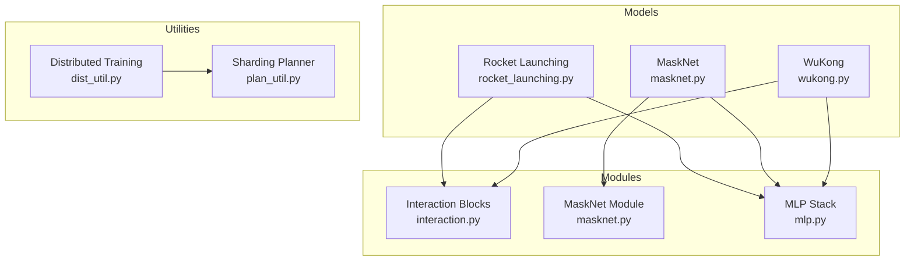
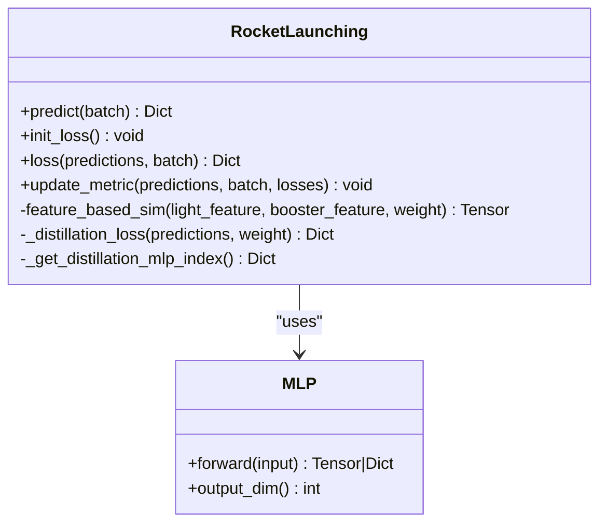
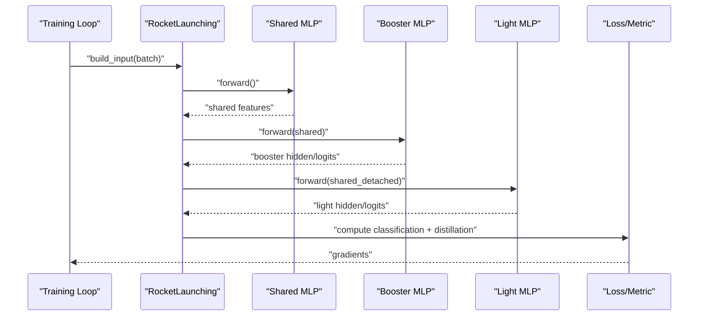
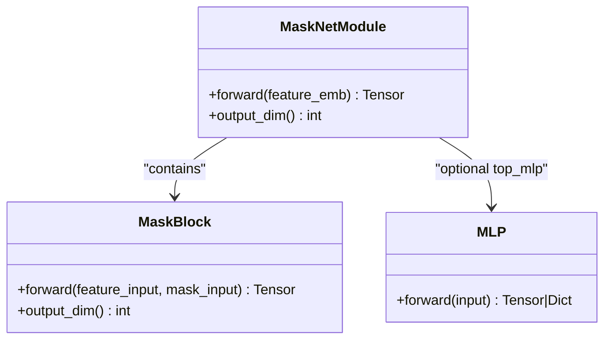
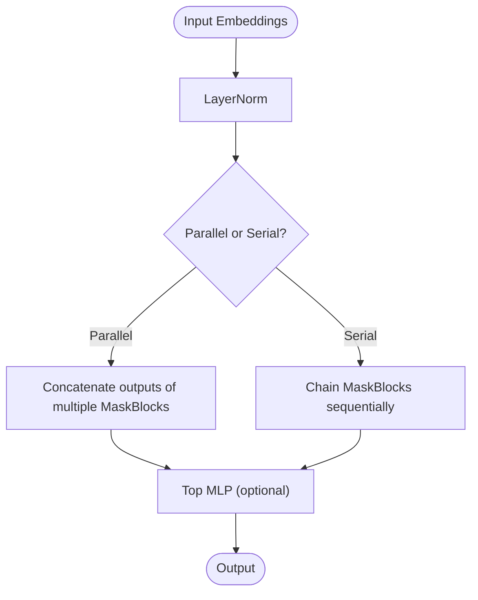
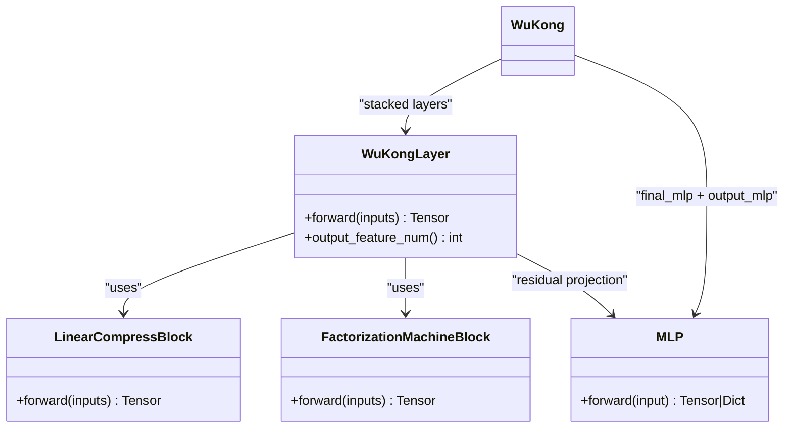
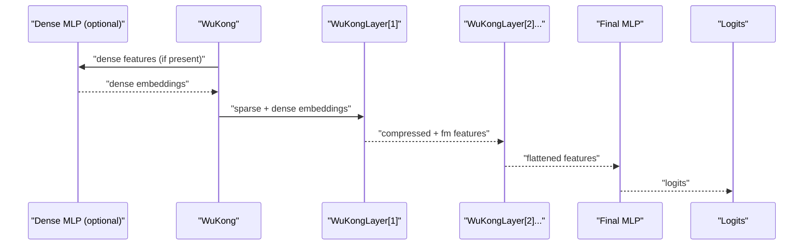
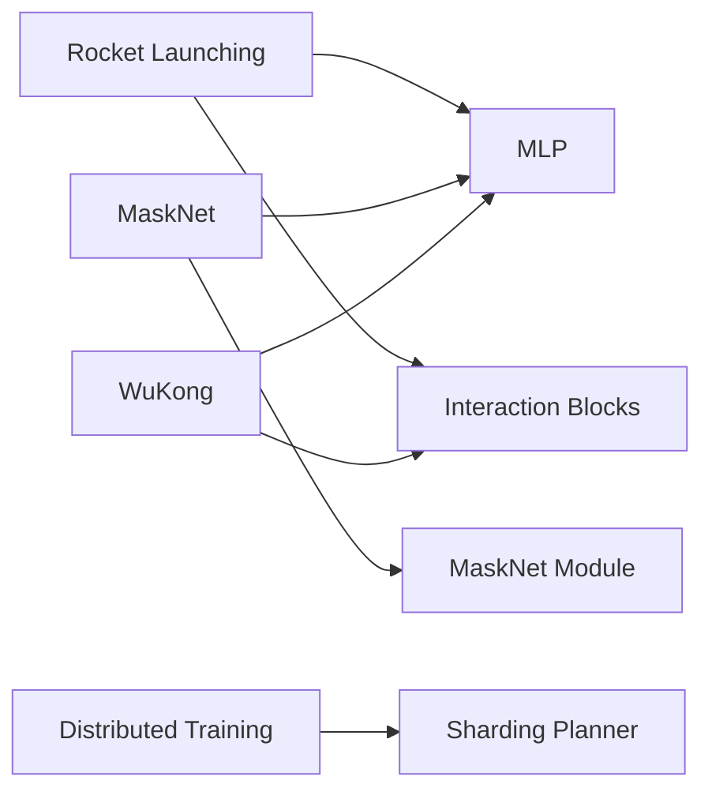

# Advanced Interaction and Generative Models

<cite>
**Referenced Files in This Document**
- [rocket_launching.py](file://tzrec/models/rocket_launching.py)
- [rocket_launching_criteo.config](file://examples/rocket_launching_criteo.config)
- [rocket_launching.md](file://docs/source/models/rocket_launching.md)
- [masknet.py](file://tzrec/models/masknet.py)
- [masknet_criteo.config](file://examples/masknet_criteo.config)
- [masknet.md](file://docs/source/models/masknet.md)
- [wukong.py](file://tzrec/models/wukong.py)
- [wukong_criteo.config](file://examples/wukong_criteo.config)
- [wukong.md](file://docs/source/models/wukong.md)
- [interaction.py](file://tzrec/modules/interaction.py)
- [masknet.py](file://tzrec/modules/masknet.py)
- [mlp.py](file://tzrec/modules/mlp.py)
- [dist_util.py](file://tzrec/utils/dist_util.py)
- [plan_util.py](file://tzrec/utils/plan_util.py)
</cite>

## Table of Contents

1. [Introduction](#introduction)
1. [Project Structure](#project-structure)
1. [Core Components](#core-components)
1. [Architecture Overview](#architecture-overview)
1. [Detailed Component Analysis](#detailed-component-analysis)
1. [Dependency Analysis](#dependency-analysis)
1. [Performance Considerations](#performance-considerations)
1. [Troubleshooting Guide](#troubleshooting-guide)
1. [Conclusion](#conclusion)
1. [Appendices](#appendices)

## Introduction

This document presents advanced interaction and generative ranking models implemented in the repository, focusing on three architectures:

- Rocket Launching: a staged training framework with a shared backbone, a booster network, and a lightweight student network with feature-level distillation.
- MaskNet: an attention-inspired masking module that enhances feature interactions via learned gating and residual-style FFN blocks.
- WuKong: a scalable interaction architecture designed for massive vocabularies and distributed training, leveraging efficient feature compression and factorization machines.

We explain the implementation details of attention-like mechanisms, masking strategies, and scalable architecture design, and provide configuration examples, performance considerations, and deployment strategies for enterprise-scale recommendation systems.

## Project Structure

The relevant components are organized into models, modules, and utilities:

- Models: Rocket Launching, MaskNet, and WuKong implementations reside under tzrec/models.
- Modules: Attention-like interaction blocks, masking units, and MLP stacks live under tzrec/modules.
- Utilities: Distributed training orchestration and embedding sharding planning under tzrec/utils.



**Diagram sources**

- \[rocket_launching.py\](file://tzrec/models/rocket_launching.py#L28-L324)
- \[masknet.py\](file://tzrec/models/masknet.py#L25-L66)
- \[wukong.py\](file://tzrec/models/wukong.py#L26-L131)
- \[interaction.py\](file://tzrec/modules/interaction.py#L28-L379)
- \[masknet.py\](file://tzrec/modules/masknet.py#L88-L162)
- \[mlp.py\](file://tzrec/modules/mlp.py#L86-L178)
- \[dist_util.py\](file://tzrec/utils/dist_util.py#L154-L183)
- \[plan_util.py\](file://tzrec/utils/plan_util.py#L88-L190)

**Section sources**

- \[rocket_launching.py\](file://tzrec/models/rocket_launching.py#L28-L324)
- \[masknet.py\](file://tzrec/models/masknet.py#L25-L66)
- \[wukong.py\](file://tzrec/models/wukong.py#L26-L131)
- \[interaction.py\](file://tzrec/modules/interaction.py#L28-L379)
- \[masknet.py\](file://tzrec/modules/masknet.py#L88-L162)
- \[mlp.py\](file://tzrec/modules/mlp.py#L86-L178)
- \[dist_util.py\](file://tzrec/utils/dist_util.py#L154-L183)
- \[plan_util.py\](file://tzrec/utils/plan_util.py#L88-L190)

## Core Components

- Rocket Launching: Implements a shared MLP backbone feeding two heads: a booster MLP and a light MLP. It supports feature-based distillation between intermediate layers and a hint loss between logits for improved generalization with minimal inference overhead.
- MaskNet: Introduces MaskBlock modules that compute attention-like masks via a mask generator network and apply them to embeddings, followed by FFN layers. Supports serial or parallel stacking of MaskBlocks with a configurable top MLP.
- WuKong: A multi-layer interaction architecture combining LinearCompressBlock and FactorizationMachineBlock per layer, enabling efficient high-order feature interactions with compressed representations and residual connections.

**Section sources**

- \[rocket_launching.md\](file://docs/source/models/rocket_launching.md#L1-L76)
- \[rocket_launching.py\](file://tzrec/models/rocket_launching.py#L28-L324)
- \[masknet.md\](file://docs/source/models/masknet.md#L1-L40)
- \[masknet.py\](file://tzrec/models/masknet.py#L25-L66)
- \[masknet.py\](file://tzrec/modules/masknet.py#L20-L162)
- \[wukong.md\](file://docs/source/models/wukong.md#L1-L112)
- \[wukong.py\](file://tzrec/models/wukong.py#L26-L131)
- \[interaction.py\](file://tzrec/modules/interaction.py#L236-L379)

## Architecture Overview

The three models share a common pattern: embedding groups are built, transformed by MLPs or specialized interaction layers, and finally mapped to logits. Distributed training utilities handle sharding and pipeline stages for large-scale deployment.

```mermaid
sequenceDiagram
participant Data as "Data Loader"
participant Model as "Model (RL/MN/WK)"
participant Dist as "Distributed Wrapper"
participant Plan as "Sharding Planner"
participant Opt as "Optimizer"
Data->>Model : "Batched features"
Model->>Model : "Embedding groups + MLP/Interaction"
Model->>Dist : "Forward outputs"
Dist->>Plan : "Collective plan"
Plan-->>Dist : "Sharding plan"
Dist->>Opt : "Backward + step"
Opt-->>Model : "Updated parameters"
```

**Diagram sources**

- \[dist_util.py\](file://tzrec/utils/dist_util.py#L154-L183)
- \[plan_util.py\](file://tzrec/utils/plan_util.py#L88-L190)
- \[rocket_launching.py\](file://tzrec/models/rocket_launching.py#L88-L123)
- \[masknet.py\](file://tzrec/models/masknet.py#L57-L66)
- \[wukong.py\](file://tzrec/models/wukong.py#L102-L131)

## Detailed Component Analysis

### Rocket Launching: Staged Training with Feature Distillation

Rocket Launching trains a shared backbone with a booster network and a lightweight student network. During training, the light network mimics the booster’s intermediate features and logits via distillation losses, while inference uses only the light network for speed.

Key implementation highlights:

- Shared MLP backbone feeding booster and light MLPs.
- Feature-based distillation: cosine or distance similarity between intermediate hidden features.
- Hint loss: MSE between light and boosted logits (with teacher detached).
- Configurable distillation similarity function and indices alignment between MLP layers.



**Diagram sources**

- \[rocket_launching.py\](file://tzrec/models/rocket_launching.py#L28-L324)
- \[mlp.py\](file://tzrec/modules/mlp.py#L86-L178)



**Diagram sources**

- \[rocket_launching.py\](file://tzrec/models/rocket_launching.py#L88-L123)
- \[rocket_launching.py\](file://tzrec/models/rocket_launching.py#L182-L204)

Configuration example references:

- \[rocket_launching_criteo.config\](file://examples/rocket_launching_criteo.config#L331-L391)
- \[rocket_launching.md\](file://docs/source/models/rocket_launching.md#L10-L76)

**Section sources**

- \[rocket_launching.py\](file://tzrec/models/rocket_launching.py#L28-L324)
- \[rocket_launching_criteo.config\](file://examples/rocket_launching_criteo.config#L331-L391)
- \[rocket_launching.md\](file://docs/source/models/rocket_launching.md#L10-L76)

### MaskNet: Attention-Based Feature Masking

MaskNet introduces MaskBlock modules that compute attention-like masks from embeddings and apply them to feature vectors, followed by FFN layers. It supports serial or parallel stacking and a top MLP.

Key implementation highlights:

- MaskBlock computes a mask via a small MLP over input embeddings and multiplies it with the input embedding.
- FFN applies layer normalization and ReLU to the masked embedding.
- Parallel vs serial stacking of MaskBlocks; optional top MLP.



**Diagram sources**

- \[masknet.py\](file://tzrec/modules/masknet.py#L20-L86)
- \[masknet.py\](file://tzrec/modules/masknet.py#L88-L162)
- \[mlp.py\](file://tzrec/modules/mlp.py#L86-L178)



**Diagram sources**

- \[masknet.py\](file://tzrec/modules/masknet.py#L142-L161)

Configuration example references:

- \[masknet_criteo.config\](file://examples/masknet_criteo.config#L346-L412)
- \[masknet.md\](file://docs/source/models/masknet.md#L8-L40)

**Section sources**

- \[masknet.py\](file://tzrec/models/masknet.py#L25-L66)
- \[masknet.py\](file://tzrec/modules/masknet.py#L20-L162)
- \[masknet_criteo.config\](file://examples/masknet_criteo.config#L346-L412)
- \[masknet.md\](file://docs/source/models/masknet.md#L8-L40)

### WuKong: Large-Scale Interaction Architecture

WuKong stacks layers of LinearCompressBlock and FactorizationMachineBlock, enabling efficient high-order interactions with compressed representations. It supports optional dense preprocessing and residual connections.

Key implementation highlights:

- Dense MLP transforms dense features to match sparse embedding dimensionality.
- WuKongLayer combines:
  - LinearCompressBlock: compresses feature count via learnable projection.
  - FactorizationMachineBlock: optimized FM with compression and MLP head.
  - Residual connection with optional projection to balance dimensions.
- Final MLP flattens and maps to logits.



**Diagram sources**

- \[interaction.py\](file://tzrec/modules/interaction.py#L236-L379)
- \[wukong.py\](file://tzrec/models/wukong.py#L26-L131)
- \[mlp.py\](file://tzrec/modules/mlp.py#L86-L178)



**Diagram sources**

- \[wukong.py\](file://tzrec/models/wukong.py#L102-L131)
- \[interaction.py\](file://tzrec/modules/interaction.py#L324-L379)

Configuration example references:

- \[wukong_criteo.config\](file://examples/wukong_criteo.config#L331-L413)
- \[wukong.md\](file://docs/source/models/wukong.md#L13-L112)

**Section sources**

- \[wukong.py\](file://tzrec/models/wukong.py#L26-L131)
- \[interaction.py\](file://tzrec/modules/interaction.py#L236-L379)
- \[wukong_criteo.config\](file://examples/wukong_criteo.config#L331-L413)
- \[wukong.md\](file://docs/source/models/wukong.md#L13-L112)

## Dependency Analysis

The models depend on shared modules for MLP stacks and interaction blocks. Distributed training utilities orchestrate sharding and pipeline stages.



**Diagram sources**

- \[rocket_launching.py\](file://tzrec/models/rocket_launching.py#L28-L324)
- \[masknet.py\](file://tzrec/models/masknet.py#L25-L66)
- \[wukong.py\](file://tzrec/models/wukong.py#L26-L131)
- \[interaction.py\](file://tzrec/modules/interaction.py#L28-L379)
- \[masknet.py\](file://tzrec/modules/masknet.py#L88-L162)
- \[mlp.py\](file://tzrec/modules/mlp.py#L86-L178)
- \[dist_util.py\](file://tzrec/utils/dist_util.py#L154-L183)
- \[plan_util.py\](file://tzrec/utils/plan_util.py#L88-L190)

**Section sources**

- \[rocket_launching.py\](file://tzrec/models/rocket_launching.py#L28-L324)
- \[masknet.py\](file://tzrec/models/masknet.py#L25-L66)
- \[wukong.py\](file://tzrec/models/wukong.py#L26-L131)
- \[interaction.py\](file://tzrec/modules/interaction.py#L28-L379)
- \[masknet.py\](file://tzrec/modules/masknet.py#L88-L162)
- \[mlp.py\](file://tzrec/modules/mlp.py#L86-L178)
- \[dist_util.py\](file://tzrec/utils/dist_util.py#L154-L183)
- \[plan_util.py\](file://tzrec/utils/plan_util.py#L88-L190)

## Performance Considerations

- Memory optimization:
  - Use layer normalization and residual connections to stabilize gradients and reduce activations’ variance.
  - Compress feature counts in WuKong layers to reduce compute and memory footprint.
  - Enable pruning of unused or low-signal features via configuration and feature groups.
- Distributed training:
  - Leverage the embedding sharding planner to distribute large embedding tables across devices respecting memory budgets.
  - Use pipeline-aware estimators to account for peak memory during embedding forward/backward.
  - Adjust storage reservation percentages to mitigate OOM risks in heterogeneous environments.
- Mixed precision and gradient accumulation:
  - Combine with optimizer wrappers to scale throughput while maintaining numerical stability.

[No sources needed since this section provides general guidance]

## Troubleshooting Guide

Common issues and mitigations:

- Sparse embedding sharding failures:
  - Verify that the sharding plan is generated and applied before training begins.
  - Confirm that parameter constraints align with the model’s embedding tables.
- Pipeline hangs or imbalanced batches:
  - Use the custom train pipeline that handles dummy batches to prevent deadlocks.
- OOM during training:
  - Increase storage reserve percentage or adjust caching ratios for embedding tables.
  - Reduce batch size or enable gradient accumulation steps.

**Section sources**

- \[dist_util.py\](file://tzrec/utils/dist_util.py#L304-L345)
- \[plan_util.py\](file://tzrec/utils/plan_util.py#L117-L125)

## Conclusion

Rocket Launching, MaskNet, and WuKong provide complementary capabilities for modern recommendation systems:

- Rocket Launching accelerates deployment with staged training and distillation.
- MaskNet enhances feature interactions with attention-like masking and FFN blocks.
- WuKong scales efficiently to massive vocabularies with compressed interactions and distributed training primitives.

By combining these models with the provided configuration templates and distributed utilities, teams can achieve strong performance and scalability for enterprise-grade recommendation systems.

## Appendices

### Configuration Examples

- Rocket Launching (Criteo example):
  - \[rocket_launching_criteo.config\](file://examples/rocket_launching_criteo.config#L331-L391)
  - \[rocket_launching.md\](file://docs/source/models/rocket_launching.md#L10-L76)
- MaskNet (Criteo example):
  - \[masknet_criteo.config\](file://examples/masknet_criteo.config#L346-L412)
  - \[masknet.md\](file://docs/source/models/masknet.md#L8-L40)
- WuKong (Criteo example):
  - \[wukong_criteo.config\](file://examples/wukong_criteo.config#L331-L413)
  - \[wukong.md\](file://docs/source/models/wukong.md#L13-L112)

### Distributed Training and Sharding

- Distributed model parallel wrapper and pipeline creation:
  - \[dist_util.py\](file://tzrec/utils/dist_util.py#L154-L183)
  - \[dist_util.py\](file://tzrec/utils/dist_util.py#L304-L345)
- Embedding sharding planner and dynamic programming proposer:
  - \[plan_util.py\](file://tzrec/utils/plan_util.py#L88-L190)
  - \[plan_util.py\](file://tzrec/utils/plan_util.py#L221-L421)
