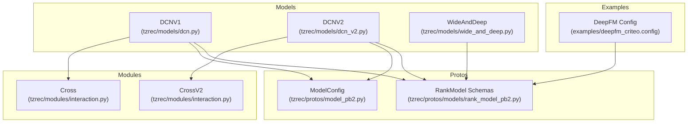
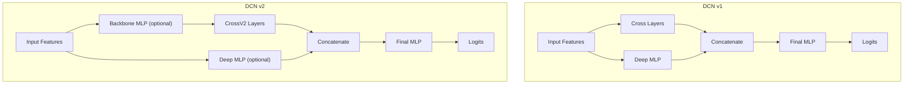
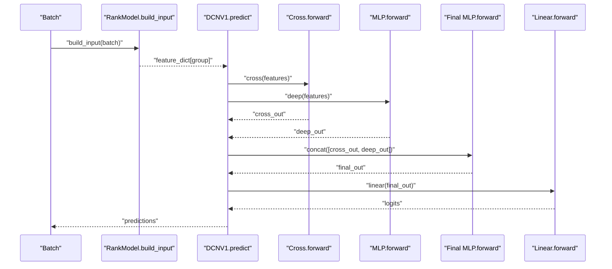
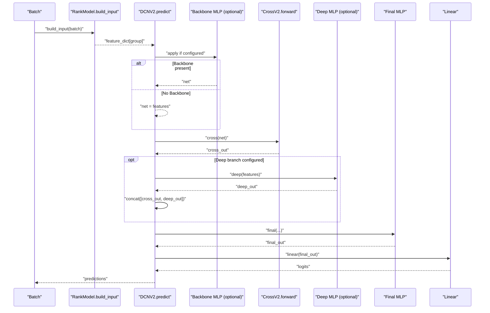
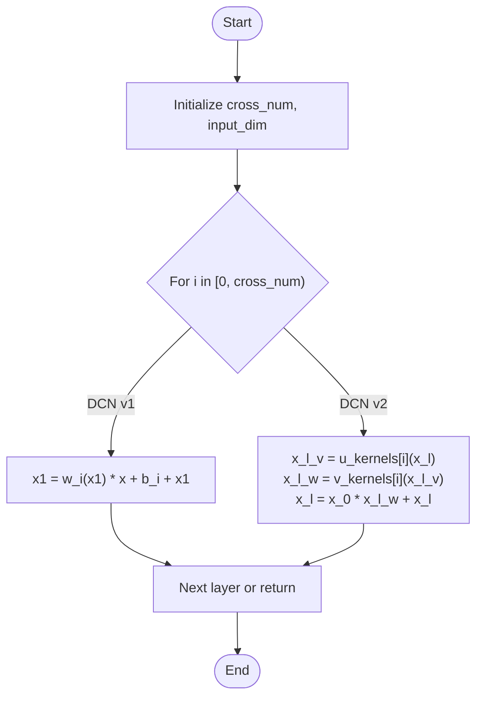
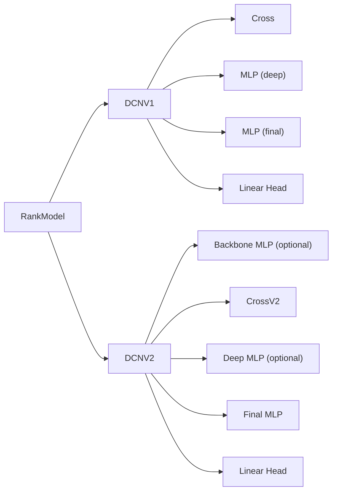

# Cross Network Models

<cite>
**Referenced Files in This Document**
- [dcn.py](file://tzrec/models/dcn.py)
- [dcn_v2.py](file://tzrec/models/dcn_v2.py)
- [interaction.py](file://tzrec/modules/interaction.py)
- [rank_model.py](file://tzrec/models/rank_model.py)
- [wide_and_deep.py](file://tzrec/models/wide_and_deep.py)
- [dcn.md](file://docs/source/models/dcn.md)
- [dcn_v2.md](file://docs/source/models/dcn_v2.md)
- [deepfm_criteo.config](file://examples/deepfm_criteo.config)
- [rank_model_pb2.py](file://tzrec/protos/models/rank_model_pb2.py)
- [model_pb2.py](file://tzrec/protos/model_pb2.py)
</cite>

## Table of Contents

1. [Introduction](#introduction)
1. [Project Structure](#project-structure)
1. [Core Components](#core-components)
1. [Architecture Overview](#architecture-overview)
1. [Detailed Component Analysis](#detailed-component-analysis)
1. [Dependency Analysis](#dependency-analysis)
1. [Performance Considerations](#performance-considerations)
1. [Troubleshooting Guide](#troubleshooting-guide)
1. [Conclusion](#conclusion)
1. [Appendices](#appendices)

## Introduction

This document explains cross network-based ranking models implemented in the repository, focusing on Deep & Cross Network (DCN) and its extension DCNv2. It covers:

- Explicit feature crossing via learnable cross layers
- Mathematical formulations of feature interactions and cross network construction
- DCNv2 enhancements with an optional backbone MLP and optional deep branch
- Advantages of explicit feature crossing versus implicit feature learning through deep MLPs
- Implementation details: cross layer design, residual-style interactions, and network depth optimization
- Configuration examples for different cross network depths
- Comparative guidance with DeepFM and Wide & Deep
- Guidelines for selecting appropriate model complexity based on dataset characteristics

## Project Structure

The cross network models are implemented as PyTorch modules integrated into the framework’s ranking model abstraction. Key locations:

- Models: DCN v1 and DCN v2 implementations
- Modules: Cross and CrossV2 layers
- Protos: Model configuration schemas for DCN v1/v2
- Examples: Example configs for related architectures (DeepFM, Wide & Deep) for comparative reference
- Base model: RankModel provides shared input building, prediction conversion, and metrics/loss wiring

**Diagram sources**

- \[dcn.py\](file://tzrec/models/dcn.py#L26-L74)
- \[dcn_v2.py\](file://tzrec/models/dcn_v2.py#L26-L89)
- \[interaction.py\](file://tzrec/modules/interaction.py#L94-L181)
- \[rank_model_pb2.py\](file://tzrec/protos/models/rank_model_pb2.py#L38-L45)
- \[model_pb2.py\](file://tzrec/protos/model_pb2.py#L15-L43)
- \[wide_and_deep.py\](file://tzrec/models/wide_and_deep.py#L25-L89)
- \[deepfm_criteo.config\](file://examples/deepfm_criteo.config#L278-L397)

**Section sources**

- \[dcn.py\](file://tzrec/models/dcn.py#L26-L74)
- \[dcn_v2.py\](file://tzrec/models/dcn_v2.py#L26-L89)
- \[interaction.py\](file://tzrec/modules/interaction.py#L94-L181)
- \[rank_model_pb2.py\](file://tzrec/protos/models/rank_model_pb2.py#L38-L45)
- \[model_pb2.py\](file://tzrec/protos/model_pb2.py#L15-L43)
- \[wide_and_deep.py\](file://tzrec/models/wide_and_deep.py#L25-L89)
- \[deepfm_criteo.config\](file://examples/deepfm_criteo.config#L278-L397)

## Core Components

- DCNV1: Combines an explicit cross network with a deep MLP branch; concatenates outputs and projects to logits.
- DCNV2: Adds an optional backbone MLP before the cross network and optionally a deep branch after cross; integrates outputs via a final MLP and linear projection.
- Cross (DCN v1): Learnable explicit feature crossing with per-layer weights and biases; computes residual-like updates.
- CrossV2 (DCN v2): Matrix-based cross with low-rank decomposition for scalability; also residual-like updates.
- RankModel base: Provides embedding group building, input assembly, prediction conversion, and metrics/loss registration.

Key implementation highlights:

- DCNV1 builds Cross and MLP, concatenates outputs, and applies a final MLP plus a linear head.
- DCNV2 conditionally adds a backbone MLP and/or a deep MLP after cross, then finalizes with an MLP and linear head.
- Cross/CrossV2 define the explicit feature interaction mechanism with configurable depth and rank.

**Section sources**

- \[dcn.py\](file://tzrec/models/dcn.py#L26-L74)
- \[dcn_v2.py\](file://tzrec/models/dcn_v2.py#L26-L89)
- \[interaction.py\](file://tzrec/modules/interaction.py#L94-L181)
- \[rank_model.py\](file://tzrec/models/rank_model.py#L56-L133)

## Architecture Overview

The cross network family explicitly models feature interactions through dedicated cross layers, contrasting with implicit interactions learned solely by deep MLPs. DCNv2 extends this by enabling a backbone MLP and optional deep branch to improve representational capacity.

**Diagram sources**

- \[dcn.py\](file://tzrec/models/dcn.py#L48-L61)
- \[dcn_v2.py\](file://tzrec/models/dcn_v2.py#L49-L73)
- \[interaction.py\](file://tzrec/modules/interaction.py#L94-L181)

## Detailed Component Analysis

### DCN v1: Explicit Feature Crossing with Deep MLP

- Construction:
  - Cross: explicit feature interactions via per-layer linear maps and residual updates.
  - Deep MLP: separate representation learning path.
  - Final MLP + linear head: fused combination to logits.
- Forward pass:
  - Cross output concatenated with Deep output, passed through final MLP, then linear projection to logits.
- Configuration:
  - cross_num controls cross layer depth.
  - deep.hidden_units defines MLP widths.
  - final.hidden_units defines fusion MLP widths.

**Diagram sources**

- \[dcn.py\](file://tzrec/models/dcn.py#L63-L74)
- \[interaction.py\](file://tzrec/modules/interaction.py#L126-L132)
- \[rank_model.py\](file://tzrec/models/rank_model.py#L115-L132)

**Section sources**

- \[dcn.py\](file://tzrec/models/dcn.py#L26-L74)
- \[interaction.py\](file://tzrec/modules/interaction.py#L94-L133)
- \[dcn.md\](file://docs/source/models/dcn.md#L15-L65)

### DCN v2: Enhanced Cross Network with Backbone and Optional Deep Branch

- Construction:
  - Optional backbone MLP to transform input before cross.
  - CrossV2 with low-rank decomposition for scalable matrix-based feature interactions.
  - Optional deep MLP applied to original features, concatenated with cross output.
  - Final MLP and linear head.
- Forward pass:
  - If backbone exists, apply it; otherwise use raw features.
  - Apply CrossV2; if deep branch configured, concatenate with deep features; finalize with MLP and linear head.
- Configuration:
  - backbone.hidden_units: optional pre-cross transformation.
  - cross.cross_num, cross.low_rank: cross depth and low-rank factorization.
  - deep.hidden_units: optional post-cross deep branch.
  - final.hidden_units: fusion MLP widths.

**Diagram sources**

- \[dcn_v2.py\](file://tzrec/models/dcn_v2.py#L75-L89)
- \[interaction.py\](file://tzrec/modules/interaction.py#L135-L181)
- \[rank_model.py\](file://tzrec/models/rank_model.py#L115-L132)

**Section sources**

- \[dcn_v2.py\](file://tzrec/models/dcn_v2.py#L26-L89)
- \[interaction.py\](file://tzrec/modules/interaction.py#L135-L181)
- \[dcn_v2.md\](file://docs/source/models/dcn_v2.md#L18-L76)

### Cross Layer Design and Mathematical Formulation

- DCN v1 Cross:
  - Each cross layer applies a trainable linear map and bias, then performs a Hadamard product with input and residual addition.
  - Output dimension equals input dimension; cross_num controls depth.
- DCN v2 CrossV2:
  - Uses low-rank decomposition to approximate matrix multiplication, reducing parameter count while maintaining expressiveness.
  - Residual-style update ensures stable training and deeper stacking.

**Diagram sources**

- \[interaction.py\](file://tzrec/modules/interaction.py#L126-L132)
- \[interaction.py\](file://tzrec/modules/interaction.py#L167-L180)

**Section sources**

- \[interaction.py\](file://tzrec/modules/interaction.py#L94-L181)

### Advantages of Explicit Feature Crossing vs. Implicit Learning via Deep MLPs

- Explicit crossing:
  - Guarantees modeling of degree-k feature interactions up to cross_num.
  - Computationally efficient for explicit pairwise and higher-order interactions compared to exponential growth of implicit MLP combinations.
  - Stable training with residual-like updates.
- Implicit crossing via deep MLPs:
  - Learns interactions implicitly; capacity depends on depth/width and initialization.
  - Risk of redundant or inefficient feature mixing without explicit structure.

[No sources needed since this section provides comparative reasoning based on the referenced implementations]

### Implementation Details: Residual Connections and Depth Optimization

- Residual-style updates in Cross and CrossV2 stabilize gradients and enable deeper stacking.
- DCN v2 introduces optional backbone and deep branches to balance representational power and computational cost.
- Depth optimization:
  - Start with fewer cross layers; increase until validation performance plateaus.
  - Use low_rank in CrossV2 to reduce parameters while preserving expressiveness.
  - Add backbone/deep branches gradually when dataset complexity warrants.

**Section sources**

- \[interaction.py\](file://tzrec/modules/interaction.py#L126-L132)
- \[interaction.py\](file://tzrec/modules/interaction.py#L167-L180)
- \[dcn_v2.py\](file://tzrec/models/dcn_v2.py#L49-L73)

### Configuration Examples and Selection Guidelines

- DCN v1 configuration example and parameters:
  - cross.cross_num: controls cross depth.
  - deep.hidden_units: MLP widths for deep branch.
  - final.hidden_units: fusion MLP widths.
- DCN v2 configuration example and parameters:
  - backbone.hidden_units: optional pre-cross MLP.
  - cross.cross_num, cross.low_rank: cross depth and low-rank factorization.
  - deep.hidden_units: optional post-cross deep branch.
  - final.hidden_units: fusion MLP widths.
- Comparative references:
  - DeepFM config demonstrates separate wide and deep groups and final MLP structure.
  - Wide & Deep config shows parallel wide and deep branches with optional fusion.

Guidelines:

- Small tabular datasets: prefer DCN v1 with moderate cross_num and deep MLP.
- Medium-scale datasets with strong second-order interactions: DCN v2 with low_rank and optional backbone/deep.
- Large-scale sparse-dense mix: consider DCN v2 backbone to pre-process dense features, then CrossV2 for explicit interactions.

**Section sources**

- \[dcn.md\](file://docs/source/models/dcn.md#L15-L65)
- \[dcn_v2.md\](file://docs/source/models/dcn_v2.md#L18-L76)
- \[deepfm_criteo.config\](file://examples/deepfm_criteo.config#L278-L397)
- \[wide_and_deep.py\](file://tzrec/models/wide_and_deep.py#L25-L89)

## Dependency Analysis

- DCNV1 depends on Cross and MLP modules; outputs are concatenated and projected.
- DCNV2 conditionally composes backbone MLP, CrossV2, optional deep MLP, final MLP, and linear head.
- Both inherit from RankModel, leveraging shared input assembly and prediction conversion.

**Diagram sources**

- \[rank_model.py\](file://tzrec/models/rank_model.py#L56-L133)
- \[dcn.py\](file://tzrec/models/dcn.py#L48-L61)
- \[dcn_v2.py\](file://tzrec/models/dcn_v2.py#L49-L73)
- \[interaction.py\](file://tzrec/modules/interaction.py#L94-L181)

**Section sources**

- \[rank_model.py\](file://tzrec/models/rank_model.py#L56-L133)
- \[dcn.py\](file://tzrec/models/dcn.py#L48-L61)
- \[dcn_v2.py\](file://tzrec/models/dcn_v2.py#L49-L73)
- \[interaction.py\](file://tzrec/modules/interaction.py#L94-L181)

## Performance Considerations

- Cross layer depth: increasing cross_num improves explicit interaction modeling but raises compute and memory.
- Low-rank decomposition in CrossV2 reduces parameter count and can improve training stability.
- Optional backbone/deep branches add capacity; tune carefully to avoid overfitting.
- Concatenation of cross and deep outputs increases dimensionality; ensure final MLP is appropriately sized.

[No sources needed since this section provides general guidance]

## Troubleshooting Guide

- Shape mismatches:
  - Verify embedding group total dimension matches cross input expectations.
  - Ensure concatenation dimensions align when deep branch is enabled.
- Training instability:
  - Reduce cross_num or low_rank initially; increase gradually.
  - Use appropriate learning rates and regularization.
- Overfitting:
  - Simplify cross depth or add dropout/regularization in backbone/deep/final MLPs.
  - Monitor validation metrics and early stopping.

**Section sources**

- \[rank_model.py\](file://tzrec/models/rank_model.py#L115-L132)
- \[dcn.py\](file://tzrec/models/dcn.py#L48-L61)
- \[dcn_v2.py\](file://tzrec/models/dcn_v2.py#L49-L73)

## Conclusion

Cross network models provide a principled way to capture explicit feature interactions with controlled depth and scalable matrix factorization. DCN v1 offers a compact, effective baseline; DCN v2 extends this with optional backbone and deep branches for richer representational power. Choose model complexity based on dataset scale and interaction patterns, and leverage configuration parameters to optimize performance and efficiency.

[No sources needed since this section summarizes without analyzing specific files]

## Appendices

### Mathematical Formulations and Cross Network Construction

- DCN v1 Cross update:
  - For each layer i, update x\_{l+1} = x_0 * (W^l x_l) + b^l + x_l, where x_0 is the input projection and * denotes element-wise multiplication.
- DCN v2 CrossV2 update:
  - Decompose the transformation into low-rank matrices: u_kernels[i] and v_kernels[i]; update x\_{l+1} = x_0 * (v_kernels[i](<u_kernels%5Bi%5D(x_l)>)) + x_l.

**Section sources**

- \[interaction.py\](file://tzrec/modules/interaction.py#L126-L132)
- \[interaction.py\](file://tzrec/modules/interaction.py#L167-L180)

### Comparative Architecture Notes

- DeepFM: combines a wide linear model with a deep MLP and FM-like interactions; useful for sparse-dense tabular tasks.
- Wide & Deep: parallel wide linear and deep MLP branches with optional fusion; complementary to cross networks’ explicit interactions.

**Section sources**

- \[deepfm_criteo.config\](file://examples/deepfm_criteo.config#L278-L397)
- \[wide_and_deep.py\](file://tzrec/models/wide_and_deep.py#L25-L89)
