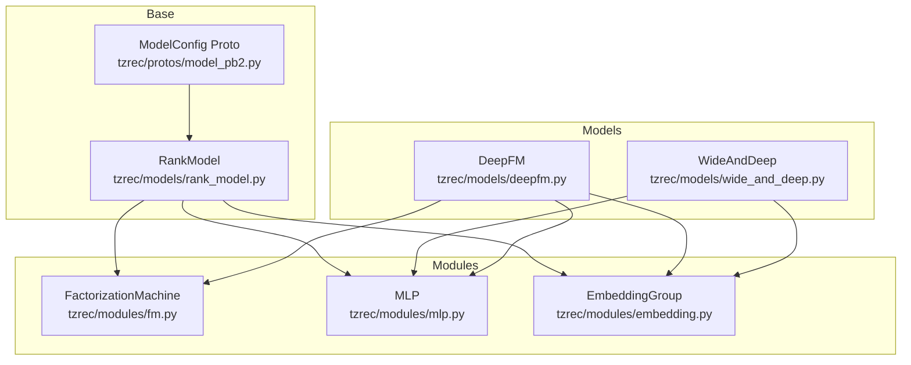
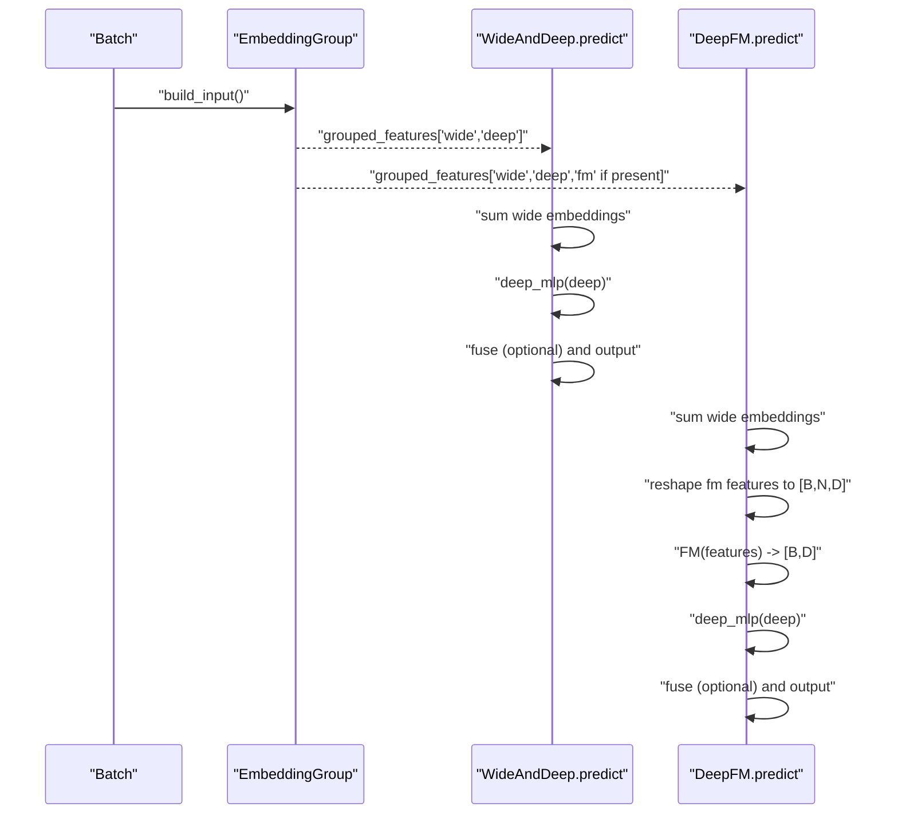
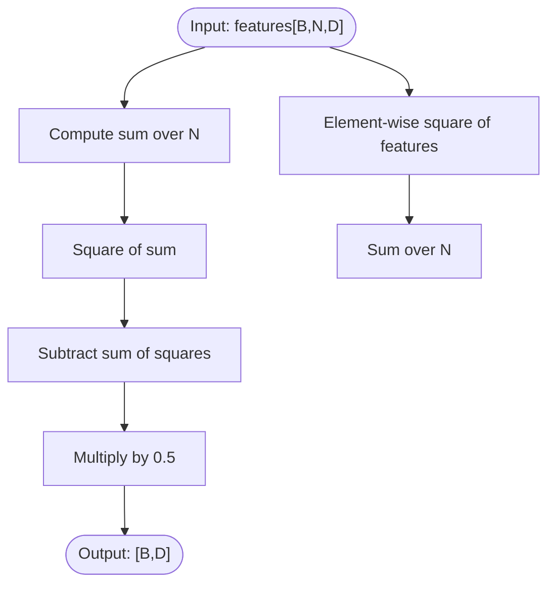
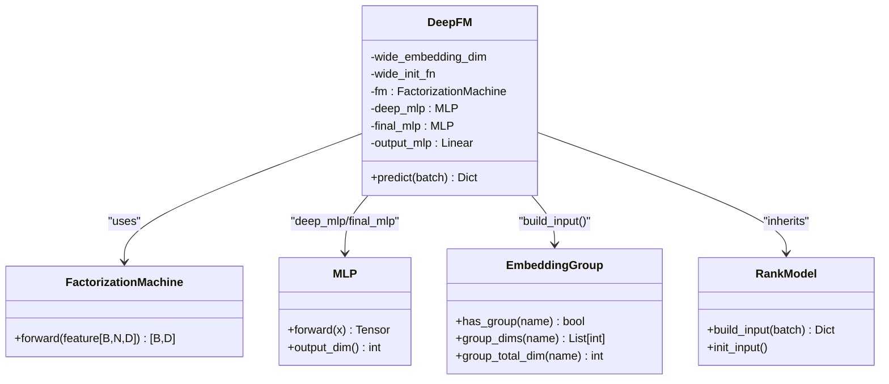
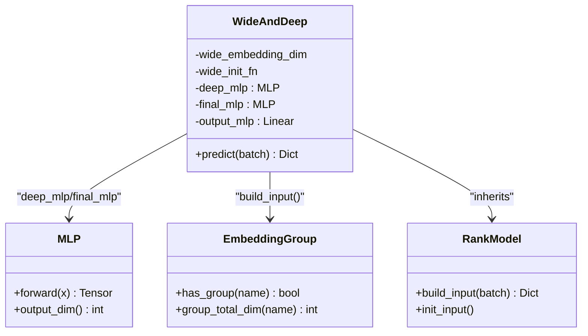
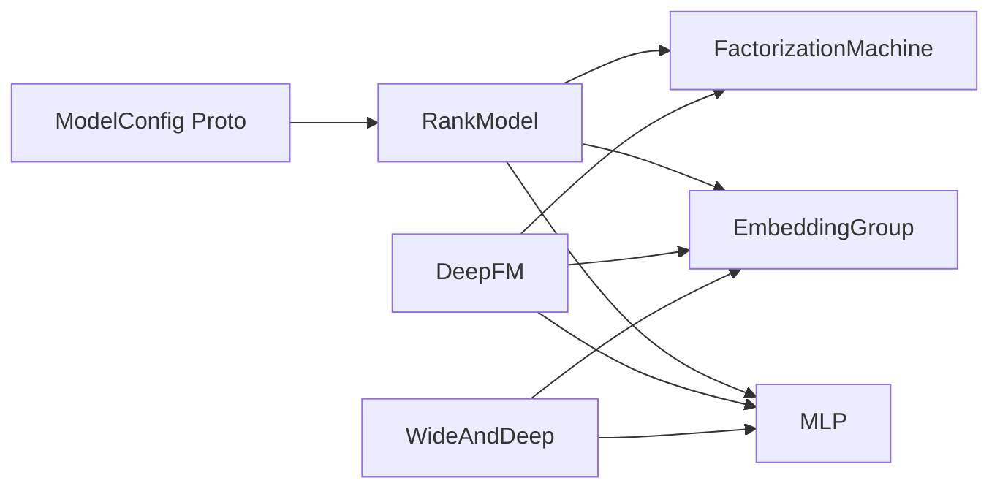

# Factorization Machine Models

<cite>
**Referenced Files in This Document**
- [deepfm.py](file://tzrec/models/deepfm.py)
- [wide_and_deep.py](file://tzrec/models/wide_and_deep.py)
- [fm.py](file://tzrec/modules/fm.py)
- [mlp.py](file://tzrec/modules/mlp.py)
- [embedding.py](file://tzrec/modules/embedding.py)
- [rank_model.py](file://tzrec/models/rank_model.py)
- [deepfm.md](file://docs/source/models/deepfm.md)
- [wide_and_deep.md](file://docs/source/models/wide_and_deep.md)
- [deepfm_criteo.config](file://examples/deepfm_criteo.config)
- [wide_and_deep_criteo.config](file://examples/wide_and_deep.config)
- [model_pb2.py](file://tzrec/protos/model_pb2.py)
</cite>

## Table of Contents

1. [Introduction](#introduction)
1. [Project Structure](#project-structure)
1. [Core Components](#core-components)
1. [Architecture Overview](#architecture-overview)
1. [Detailed Component Analysis](#detailed-component-analysis)
1. [Dependency Analysis](#dependency-analysis)
1. [Performance Considerations](#performance-considerations)
1. [Troubleshooting Guide](#troubleshooting-guide)
1. [Conclusion](#conclusion)
1. [Appendices](#appendices)

## Introduction

This document explains factorization machine-based ranking models in the repository, focusing on WideAndDeep’s hybrid approach and DeepFM’s factorization machine architecture integrated with deep neural networks. It covers:

- Mathematical foundations: polynomial expansion and low-rank matrix factorization for second-order feature interactions
- Implementation details: embedding groups, cross-product-style FM interactions, and MLP integration
- Configuration and examples for training and evaluation
- Practical guidance on memory efficiency, training optimization, and hyperparameter tuning

## Project Structure

The relevant components are organized around modular building blocks:

- Models: DeepFM and WideAndDeep ranking models
- Modules: FactorizationMachine (FM), MLP, and EmbeddingGroup
- Base model infrastructure: RankModel and BaseModel
- Documentation and examples: model-specific docs and example configs

**Diagram sources**

- \[wide_and_deep.py\](file://tzrec/models/wide_and_deep.py#L25-L89)
- \[deepfm.py\](file://tzrec/models/deepfm.py#L26-L109)
- \[fm.py\](file://tzrec/modules/fm.py#L17-L42)
- \[mlp.py\](file://tzrec/modules/mlp.py#L86-L178)
- \[embedding.py\](file://tzrec/modules/embedding.py#L139-L200)
- \[rank_model.py\](file://tzrec/models/rank_model.py#L56-L133)
- \[model_pb2.py\](file://tzrec/protos/model_pb2.py#L1-L43)

**Section sources**

- \[wide_and_deep.py\](file://tzrec/models/wide_and_deep.py#L25-L89)
- \[deepfm.py\](file://tzrec/models/deepfm.py#L26-L109)
- \[fm.py\](file://tzrec/modules/fm.py#L17-L42)
- \[mlp.py\](file://tzrec/modules/mlp.py#L86-L178)
- \[embedding.py\](file://tzrec/modules/embedding.py#L139-L200)
- \[rank_model.py\](file://tzrec/models/rank_model.py#L56-L133)
- \[model_pb2.py\](file://tzrec/protos/model_pb2.py#L1-L43)

## Core Components

- FactorizationMachine: Implements second-order feature interactions via element-wise sums and square differences to compute pairwise interactions efficiently.
- MLP: Stacked perceptrons with configurable activations, normalization, dropout, and optional hidden-layer feature outputs.
- EmbeddingGroup: Aggregates embeddings per feature group (wide, deep, fm) and supports optional wide-side initialization and variational dropout.
- RankModel: Base class orchestrating embedding construction, input grouping, prediction-to-output conversion, loss/metric initialization, and training hooks.
- DeepFM and WideAndDeep: Concrete models composing wide, deep, and optionally FM branches.

Key implementation highlights:

- DeepFM constructs separate MLP from “deep” features and applies FM on either a dedicated “fm” group or falls back to “deep” group embeddings.
- WideAndDeep computes a linear wide signal and a deep MLP signal, optionally fused with a final MLP before the output head.

**Section sources**

- \[fm.py\](file://tzrec/modules/fm.py#L17-L42)
- \[mlp.py\](file://tzrec/modules/mlp.py#L86-L178)
- \[embedding.py\](file://tzrec/modules/embedding.py#L139-L200)
- \[rank_model.py\](file://tzrec/models/rank_model.py#L56-L133)
- \[deepfm.py\](file://tzrec/models/deepfm.py#L26-L109)
- \[wide_and_deep.py\](file://tzrec/models/wide_and_deep.py#L25-L89)

## Architecture Overview

The models share a common input pipeline via EmbeddingGroup and RankModel, while differing in how they combine signals:

- WideAndDeep: linear wide + deep MLP
- DeepFM: linear wide + FM + deep MLP (with optional fusion)

**Diagram sources**

- \[rank_model.py\](file://tzrec/models/rank_model.py#L115-L133)
- \[wide_and_deep.py\](file://tzrec/models/wide_and_deep.py#L62-L89)
- \[deepfm.py\](file://tzrec/models/deepfm.py#L72-L109)
- \[fm.py\](file://tzrec/modules/fm.py#L27-L42)
- \[mlp.py\](file://tzrec/modules/mlp.py#L161-L178)

## Detailed Component Analysis

### FactorizationMachine Module

- Purpose: Learn second-order feature interactions from shared embeddings.
- Input: Tensor of shape [B, N, D] representing N embedded features per sample.
- Computation: Uses sum-of-squares minus square-of-sum trick to compute interaction terms efficiently, returning [B, D].

**Diagram sources**

- \[fm.py\](file://tzrec/modules/fm.py#L27-L42)

**Section sources**

- \[fm.py\](file://tzrec/modules/fm.py#L17-L42)

### DeepFM Model

- Embedding groups: Supports “fm” and “deep” groups; FM operates on the same embeddings as deep when “fm” is absent.
- Branches:
  - Wide: sum of wide embeddings
  - FM: FactorizationMachine applied to reshaped embeddings
  - Deep: MLP on deep features
- Fusion: Optional final MLP concatenating [wide, fm, deep] before output projection.

**Diagram sources**

- \[deepfm.py\](file://tzrec/models/deepfm.py#L26-L109)
- \[fm.py\](file://tzrec/modules/fm.py#L17-L42)
- \[mlp.py\](file://tzrec/modules/mlp.py#L86-L178)
- \[embedding.py\](file://tzrec/modules/embedding.py#L139-L200)
- \[rank_model.py\](file://tzrec/models/rank_model.py#L56-L133)

**Section sources**

- \[deepfm.py\](file://tzrec/models/deepfm.py#L26-L109)
- \[deepfm.md\](file://docs/source/models/deepfm.md#L1-L79)
- \[deepfm_criteo.config\](file://examples/deepfm_criteo.config#L278-L397)

### WideAndDeep Model

- Embedding groups: Requires “wide” and “deep” groups.
- Branches:
  - Wide: sum of wide embeddings
  - Deep: MLP on deep features
- Fusion: Optional final MLP concatenating [wide, deep] before output projection.

**Diagram sources**

- \[wide_and_deep.py\](file://tzrec/models/wide_and_deep.py#L25-L89)
- \[mlp.py\](file://tzrec/modules/mlp.py#L86-L178)
- \[embedding.py\](file://tzrec/modules/embedding.py#L139-L200)
- \[rank_model.py\](file://tzrec/models/rank_model.py#L56-L133)

**Section sources**

- \[wide_and_deep.py\](file://tzrec/models/wide_and_deep.py#L25-L89)
- \[wide_and_deep.md\](file://docs/source/models/wide_and_deep.md#L1-L59)
- \[wide_and_deep_criteo.config\](file://examples/wide_and_deep.config#L1-L200)

### Mathematical Foundations

- Polynomial expansion: Factorization machines generalize linear models by adding pairwise feature interactions. The second-order term captures combinations across features.
- Low-rank matrix factorization: Each feature is represented by a latent vector; pairwise interaction is the dot product of two latent vectors. Efficiently computed via sum-of-squares minus square-of-sum identity to avoid explicit outer products.
- Automatic feature engineering: Deep MLP learns higher-order and complex interactions implicitly from raw features.

[No sources needed since this section provides general guidance]

### Implementation Details

- Embedding groups: Feature groups define which features feed into “wide”, “deep”, and optionally “fm”. EmbeddingGroup builds per-group embeddings and supports optional wide-side initialization and variational dropout.
- Cross-product interactions: DeepFM’s FM module computes second-order interactions directly from embeddings without constructing explicit cross-product matrices.
- MLP integration: Both models integrate MLPs after wide or deep branches; DeepFM adds an FM branch and optional fusion MLP before output.

**Section sources**

- \[embedding.py\](file://tzrec/modules/embedding.py#L139-L200)
- \[fm.py\](file://tzrec/modules/fm.py#L27-L42)
- \[mlp.py\](file://tzrec/modules/mlp.py#L86-L178)
- \[deepfm.py\](file://tzrec/models/deepfm.py#L48-L70)
- \[wide_and_deep.py\](file://tzrec/models/wide_and_deep.py#L48-L61)

## Dependency Analysis

- DeepFM depends on FactorizationMachine and MLP; both models depend on EmbeddingGroup and RankModel.
- Protobuf ModelConfig defines model configurations and feature groups; RankModel consumes these to construct inputs and outputs.

**Diagram sources**

- \[model_pb2.py\](file://tzrec/protos/model_pb2.py#L1-L43)
- \[rank_model.py\](file://tzrec/models/rank_model.py#L56-L133)
- \[embedding.py\](file://tzrec/modules/embedding.py#L139-L200)
- \[mlp.py\](file://tzrec/modules/mlp.py#L86-L178)
- \[fm.py\](file://tzrec/modules/fm.py#L17-L42)
- \[deepfm.py\](file://tzrec/models/deepfm.py#L26-L109)
- \[wide_and_deep.py\](file://tzrec/models/wide_and_deep.py#L25-L89)

**Section sources**

- \[model_pb2.py\](file://tzrec/protos/model_pb2.py#L1-L43)
- \[rank_model.py\](file://tzrec/models/rank_model.py#L56-L133)

## Performance Considerations

- Memory efficiency:
  - Shared embeddings: DeepFM and WideAndDeep reuse embeddings across wide, deep, and FM branches when configured accordingly, reducing memory footprint.
  - EmbeddingGroup supports optional wide-side initialization and variational dropout; enable only when beneficial for your task.
- Training optimization:
  - Separate optimizers for sparse and dense parameters are commonly used in example configs; tune learning rates and schedulers per task.
  - Batch size and embedding dimensions impact throughput; adjust according to hardware constraints.
  - Dropout and normalization can stabilize training; use carefully to avoid underfitting.

[No sources needed since this section provides general guidance]

## Troubleshooting Guide

- Shape mismatches in FM:
  - Ensure all features in the FM group have identical embedding dimensions; the model asserts uniformity.
- Feature group configuration:
  - Verify “wide” and “deep” groups exist for WideAndDeep; DeepFM requires at least “deep” and optionally “fm”.
- Prediction outputs:
  - RankModel maps logits/probabilities to outputs depending on loss configuration; confirm your loss aligns with expected outputs.

**Section sources**

- \[deepfm.py\](file://tzrec/models/deepfm.py#L53-L56)
- \[rank_model.py\](file://tzrec/models/rank_model.py#L134-L181)

## Conclusion

WideAndDeep and DeepFM demonstrate complementary strengths: WideAndDeep’s wide linear memorization plus deep MLP generalization, and DeepFM’s explicit second-order FM interactions integrated with deep learning. The repository’s modular design enables flexible configuration, efficient embedding sharing, and straightforward extension for additional tasks.

[No sources needed since this section summarizes without analyzing specific files]

## Appendices

### Configuration Examples and Hyperparameters

- DeepFM example config demonstrates:
  - Feature groups: “wide”, “fm”, “deep”
  - Deep MLP hidden units and optional final MLP
  - Metrics and losses
- WideAndDeep example config demonstrates:
  - Feature groups: “wide”, “deep”
  - Deep MLP hidden units
  - Metrics and losses

**Section sources**

- \[deepfm.md\](file://docs/source/models/deepfm.md#L9-L79)
- \[wide_and_deep.md\](file://docs/source/models/wide_and_deep.md#L9-L59)
- \[deepfm_criteo.config\](file://examples/deepfm_criteo.config#L278-L397)
- \[wide_and_deep_criteo.config\](file://examples/wide_and_deep.config#L1-L200)
