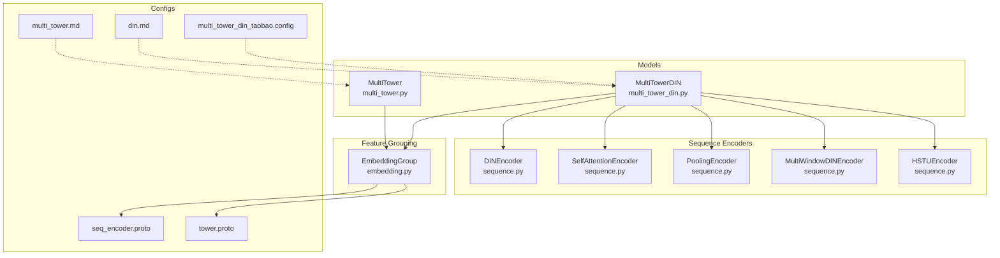
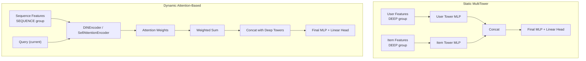
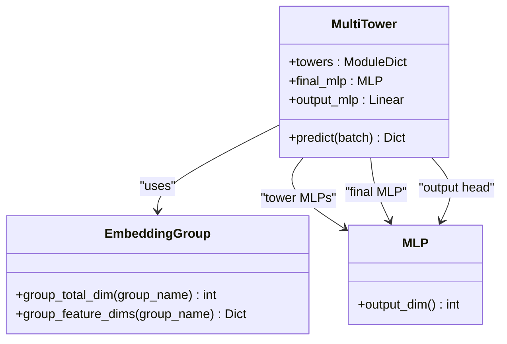
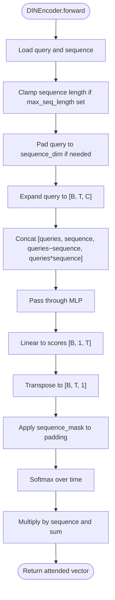
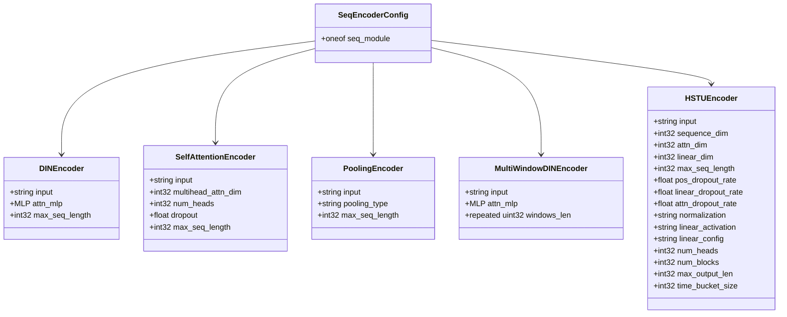
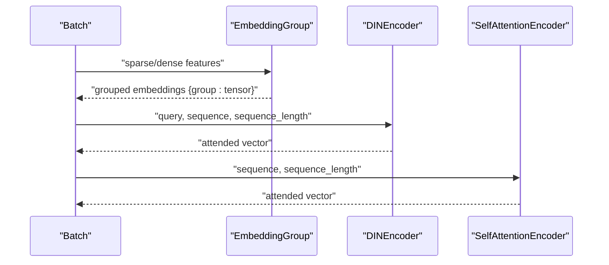
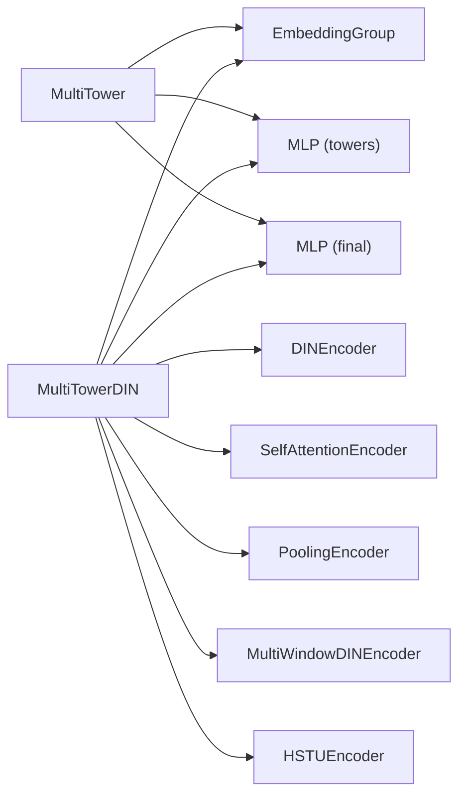

# Multi-Tower and Attention-Based Models

<cite>
**Referenced Files in This Document**
- [multi_tower.py](file://tzrec/models/multi_tower.py)
- [multi_tower_din.py](file://tzrec/models/multi_tower_din.py)
- [rank_model.py](file://tzrec/models/rank_model.py)
- [sequence.py](file://tzrec/modules/sequence.py)
- [embedding.py](file://tzrec/modules/embedding.py)
- [multi_tower.md](file://docs/source/models/multi_tower.md)
- [din.md](file://docs/source/models/din.md)
- [multi_tower_din_taobao.config](file://examples/multi_tower_din_taobao.config)
- [seq_encoder.proto](file://tzrec/protos/seq_encoder.proto)
- [tower.proto](file://tzrec/protos/tower.proto)
</cite>

## Table of Contents

1. [Introduction](#introduction)
1. [Project Structure](#project-structure)
1. [Core Components](#core-components)
1. [Architecture Overview](#architecture-overview)
1. [Detailed Component Analysis](#detailed-component-analysis)
1. [Dependency Analysis](#dependency-analysis)
1. [Performance Considerations](#performance-considerations)
1. [Troubleshooting Guide](#troubleshooting-guide)
1. [Conclusion](#conclusion)
1. [Appendices](#appendices)

## Introduction

This document explains multi-tower and attention-based ranking models in the repository, focusing on:

- MultiTower: heterogeneous input modalities via separate embedding towers and cross-tower fusion.
- DIN (Deep Interest Network): attention over user behavior sequences to extract dynamic interests.
- Practical feature grouping strategies, attention scoring mechanics, and sequence modeling.
- Differences between static multi-tower and dynamic attention-based models.
- Implementation details and optimization tips for large-scale deployment.

## Project Structure

The relevant components span model definitions, sequence encoders, feature grouping, and configuration:

- Models: MultiTower and MultiTowerDIN
- Sequence encoders: DINEncoder, SelfAttentionEncoder, PoolingEncoder, MultiWindowDINEncoder, HSTUEncoder
- Feature grouping: EmbeddingGroup and group_total_dim
- Protos: seq_encoder.proto and tower.proto define configuration schemas
- Docs and examples: multi_tower.md, din.md, and multi_tower_din_taobao.config

**Diagram sources**

- \[multi_tower.py\](file://tzrec/models/multi_tower.py#L25-L85)
- \[multi_tower_din.py\](file://tzrec/models/multi_tower_din.py#L26-L104)
- \[sequence.py\](file://tzrec/modules/sequence.py#L70-L134)
- \[embedding.py\](file://tzrec/modules/embedding.py#L139-L200)
- \[seq_encoder.proto\](file://tzrec/protos/seq_encoder.proto#L6-L107)
- \[tower.proto\](file://tzrec/protos/tower.proto#L8-L27)
- \[multi_tower.md\](file://docs/source/models/multi_tower.md#L1-L72)
- \[din.md\](file://docs/source/models/din.md#L1-L89)
- \[multi_tower_din_taobao.config\](file://examples/multi_tower_din_taobao.config#L189-L243)

**Section sources**

- \[multi_tower.py\](file://tzrec/models/multi_tower.py#L25-L85)
- \[multi_tower_din.py\](file://tzrec/models/multi_tower_din.py#L26-L104)
- \[sequence.py\](file://tzrec/modules/sequence.py#L70-L134)
- \[embedding.py\](file://tzrec/modules/embedding.py#L139-L200)
- \[multi_tower.md\](file://docs/source/models/multi_tower.md#L1-L72)
- \[din.md\](file://docs/source/models/din.md#L1-L89)
- \[multi_tower_din_taobao.config\](file://examples/multi_tower_din_taobao.config#L189-L243)

## Core Components

- MultiTower
  - Builds separate MLP towers per feature group and concatenates outputs.
  - Supports an optional final MLP before the output head.
  - Uses EmbeddingGroup to compute group_total_dim for each tower’s input size.
- MultiTowerDIN
  - Extends MultiTower by adding DIN-style sequence towers.
  - Each sequence feature group contributes a DINEncoder (or other encoders) with attention over historical items.
  - Concatenates deep towers and sequence towers, optionally followed by a final MLP.

Key implementation references:

- MultiTower initialization and predict flow: \[multi_tower.py\](file://tzrec/models/multi_tower.py#L35-L85)
- MultiTowerDIN initialization and predict flow: \[multi_tower_din.py\](file://tzrec/models/multi_tower_din.py#L36-L104)
- Feature grouping and group_total_dim: \[embedding.py\](file://tzrec/modules/embedding.py#L245-L270), \[rank_model.py\](file://tzrec/models/rank_model.py#L115-L132)

**Section sources**

- \[multi_tower.py\](file://tzrec/models/multi_tower.py#L35-L85)
- \[multi_tower_din.py\](file://tzrec/models/multi_tower_din.py#L36-L104)
- \[embedding.py\](file://tzrec/modules/embedding.py#L245-L270)
- \[rank_model.py\](file://tzrec/models/rank_model.py#L115-L132)

## Architecture Overview

Static vs dynamic:

- Static multi-tower (MultiTower): fixed concatenation of per-group MLP features; no intra-sequence attention.
- Dynamic attention-based (MultiTowerDIN/DIN encoders): attention-weighted aggregation over historical sequences to extract dynamic interests.

**Diagram sources**

- \[multi_tower.py\](file://tzrec/models/multi_tower.py#L46-L85)
- \[multi_tower_din.py\](file://tzrec/models/multi_tower_din.py#L47-L104)
- \[sequence.py\](file://tzrec/modules/sequence.py#L70-L134)
- \[sequence.py\](file://tzrec/modules/sequence.py#L226-L290)

## Detailed Component Analysis

### MultiTower

- Purpose: Separate embedding towers per feature group; simple cross-tower fusion via concatenation.
- Feature grouping:
  - EmbeddingGroup computes total embedding dimension per group via group_total_dim.
  - Each tower is an MLP whose input size equals the group’s total embedding dimension.
- Cross-tower fusion:
  - Concatenates all tower outputs along the feature dimension.
  - Optional final MLP reduces combined representation to desired scale.
- Output head:
  - Single linear layer to logits/probabilities depending on loss configuration.

**Diagram sources**

- \[multi_tower.py\](file://tzrec/models/multi_tower.py#L25-L85)
- \[embedding.py\](file://tzrec/modules/embedding.py#L245-L270)

**Section sources**

- \[multi_tower.py\](file://tzrec/models/multi_tower.py#L35-L85)
- \[embedding.py\](file://tzrec/modules/embedding.py#L245-L270)

### MultiTowerDIN and DIN Encoders

- Purpose: Combine static deep features with dynamic sequence modeling via attention.
- Sequence modeling:
  - DINEncoder: computes attention over historical items using query–candidate interactions.
  - SelfAttentionEncoder: multi-head self-attention over sequences with masked attention.
  - PoolingEncoder: mean/sum pooling baseline.
  - MultiWindowDINEncoder: windowed attention across multiple time windows.
  - HSTUEncoder: advanced transduction unit with relative position/time bias.
- Attention computation:
  - DINEncoder: builds query–sequence pairs, concatenates [query, seq, query−seq, query∗seq], passes through an MLP, applies softmax over valid positions, and returns a weighted sum.
  - SelfAttentionEncoder: constructs Q/K/V from sequence embeddings, applies masked multihead attention, and averages over sequence length.

**Diagram sources**

- \[sequence.py\](file://tzrec/modules/sequence.py#L106-L133)

**Section sources**

- \[multi_tower_din.py\](file://tzrec/models/multi_tower_din.py#L36-L104)
- \[sequence.py\](file://tzrec/modules/sequence.py#L70-L134)
- \[sequence.py\](file://tzrec/modules/sequence.py#L226-L290)

### Sequence Encoder Protos and Configurations

- seq_encoder.proto defines message schemas for DINEncoder, SelfAttentionEncoder, PoolingEncoder, MultiWindowDINEncoder, and HSTUEncoder.
- tower.proto defines Tower and DINTower messages used in model configs.

**Diagram sources**

- \[seq_encoder.proto\](file://tzrec/protos/seq_encoder.proto#L6-L107)

**Section sources**

- \[seq_encoder.proto\](file://tzrec/protos/seq_encoder.proto#L6-L107)
- \[tower.proto\](file://tzrec/protos/tower.proto#L8-L27)

### Feature Grouping Strategies and Cross-Tower Fusion

- Feature groups:
  - DEEP groups: static features (user/item/context).
  - SEQUENCE groups: historical sequences with query and sequence tensors.
- Group total dimension:
  - EmbeddingGroup.group_total_dim sums embedding dimensions per group, accounting for sequence encoders’ outputs.
- Cross-tower fusion:
  - MultiTower: concatenate per-tower MLP outputs; optional final MLP.
  - MultiTowerDIN: concatenate deep towers and sequence encoders’ outputs; optional final MLP.

Practical examples:

- Example config demonstrates DEEP and SEQUENCE feature groups and multi_tower_din configuration: \[multi_tower_din_taobao.config\](file://examples/multi_tower_din_taobao.config#L189-L243)
- Model docs show DEEP and SEQUENCE group usage: \[din.md\](file://docs/source/models/din.md#L11-L56), \[multi_tower.md\](file://docs/source/models/multi_tower.md#L12-L51)

**Section sources**

- \[embedding.py\](file://tzrec/modules/embedding.py#L245-L270)
- \[rank_model.py\](file://tzrec/models/rank_model.py#L115-L132)
- \[multi_tower_din_taobao.config\](file://examples/multi_tower_din_taobao.config#L189-L243)
- \[din.md\](file://docs/source/models/din.md#L11-L56)
- \[multi_tower.md\](file://docs/source/models/multi_tower.md#L12-L51)

### Attention Scoring Functions and Multi-Head Attention

- DINEncoder scoring:
  - Concatenates query and sequence embeddings with difference and product terms, feeds through MLP, projects to scalar scores, masks padding, and normalizes with softmax.
- SelfAttentionEncoder scoring:
  - Constructs Q, K, V from sequence embeddings, applies masked multihead attention, and averages over sequence length after nan-to-num handling.
- Multi-Window DIN:
  - Computes attention per window and aggregates per-window sums normalized by effective window lengths.

**Diagram sources**

- \[sequence.py\](file://tzrec/modules/sequence.py#L106-L133)
- \[sequence.py\](file://tzrec/modules/sequence.py#L273-L290)

**Section sources**

- \[sequence.py\](file://tzrec/modules/sequence.py#L70-L134)
- \[sequence.py\](file://tzrec/modules/sequence.py#L226-L290)

### Implementation Details and Configuration

- MultiTower config highlights:
  - feature_groups define DEEP groups.
  - multi_tower.towers map each DEEP group to an MLP.
  - optional multi_tower.final MLP before output.
  - Reference: \[multi_tower.md\](file://docs/source/models/multi_tower.md#L12-L51)
- MultiTowerDIN config highlights:
  - feature_groups include DEEP and SEQUENCE groups.
  - multi_tower_din.towers for DEEP groups.
  - multi_tower_din.din_towers specify attn_mlp for attention scoring.
  - optional multi_tower_din.final MLP.
  - Reference: \[din.md\](file://docs/source/models/din.md#L11-L56)
- Example config:
  - \[multi_tower_din_taobao.config\](file://examples/multi_tower_din_taobao.config#L189-L243)

**Section sources**

- \[multi_tower.md\](file://docs/source/models/multi_tower.md#L12-L51)
- \[din.md\](file://docs/source/models/din.md#L11-L56)
- \[multi_tower_din_taobao.config\](file://examples/multi_tower_din_taobao.config#L189-L243)

## Dependency Analysis

- MultiTower depends on:
  - EmbeddingGroup for per-group embedding dimensions.
  - MLP towers and optional final MLP.
- MultiTowerDIN additionally depends on:
  - Sequence encoders (DINEncoder, SelfAttentionEncoder, etc.) registered via create_seq_encoder.
  - Protobuf schemas for encoder configuration.

**Diagram sources**

- \[multi_tower.py\](file://tzrec/models/multi_tower.py#L46-L63)
- \[multi_tower_din.py\](file://tzrec/models/multi_tower_din.py#L47-L80)
- \[sequence.py\](file://tzrec/modules/sequence.py#L580-L604)

**Section sources**

- \[multi_tower.py\](file://tzrec/models/multi_tower.py#L46-L63)
- \[multi_tower_din.py\](file://tzrec/models/multi_tower_din.py#L47-L80)
- \[sequence.py\](file://tzrec/modules/sequence.py#L580-L604)

## Performance Considerations

- Sequence length control:
  - Use max_seq_length in encoders to cap memory and compute.
- Multi-head attention:
  - Ensure multihead_attn_dim is divisible by num_heads; precompute Q/K/V to reduce overhead.
- Attention masking:
  - Apply attention masks to avoid attending to padded positions; handle NaNs robustly.
- Feature grouping:
  - Keep DEEP and SEQUENCE groups aligned with model capacity; avoid overly large embedding dimensions unless justified.
- Final fusion:
  - Use a smaller final MLP to reduce parameters and speed up inference.

[No sources needed since this section provides general guidance]

## Troubleshooting Guide

- Sequence length mismatch:
  - Ensure all SEQUENCE feature groups have equal sequence lengths when using certain encoders.
  - Reference: \[din.md\](file://docs/source/models/din.md#L74-L76)
- Query and sequence dimension mismatch:
  - DINEncoder pads query to match sequence dimension; ensure query_dim ≤ sequence_dim.
  - Reference: \[sequence.py\](file://tzrec/modules/sequence.py#L93-L94)
- Attention mask construction:
  - Verify attention masks align with batch size and sequence length; confirm broadcasting semantics.
  - Reference: \[sequence.py\](file://tzrec/modules/sequence.py#L39-L51), \[sequence.py\](file://tzrec/modules/sequence.py#L283-L285)
- NaN handling:
  - SelfAttentionEncoder replaces NaNs with zeros; check inputs for numerical stability.
  - Reference: \[sequence.py\](file://tzrec/modules/sequence.py#L287-L287)

**Section sources**

- \[din.md\](file://docs/source/models/din.md#L74-L76)
- \[sequence.py\](file://tzrec/modules/sequence.py#L93-L94)
- \[sequence.py\](file://tzrec/modules/sequence.py#L39-L51)
- \[sequence.py\](file://tzrec/modules/sequence.py#L283-L285)
- \[sequence.py\](file://tzrec/modules/sequence.py#L287-L287)

## Conclusion

- MultiTower offers a scalable, static fusion of heterogeneous features via separate embedding towers.
- MultiTowerDIN augments this with attention over sequences, enabling dynamic interest modeling.
- Proper feature grouping, attention scoring, and sequence modeling choices are crucial for accuracy and performance.
- The repository provides flexible protobuf-driven configurations and modular encoders to tailor models to production needs.

[No sources needed since this section summarizes without analyzing specific files]

## Appendices

### Practical Examples and References

- MultiTower config example: \[multi_tower.md\](file://docs/source/models/multi_tower.md#L12-L51)
- MultiTowerDIN config example: \[din.md\](file://docs/source/models/din.md#L11-L56), \[multi_tower_din_taobao.config\](file://examples/multi_tower_din_taobao.config#L189-L243)

[No sources needed since this section lists existing references]
