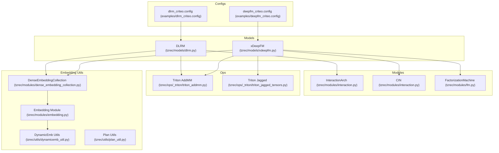
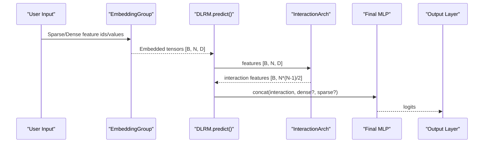
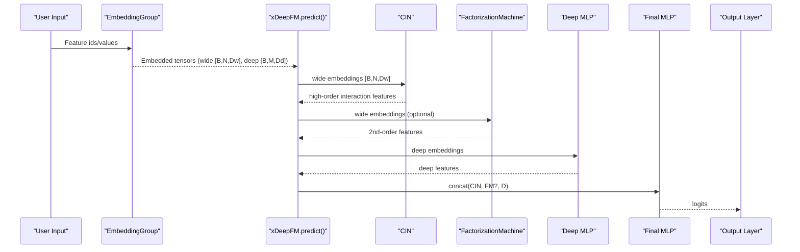
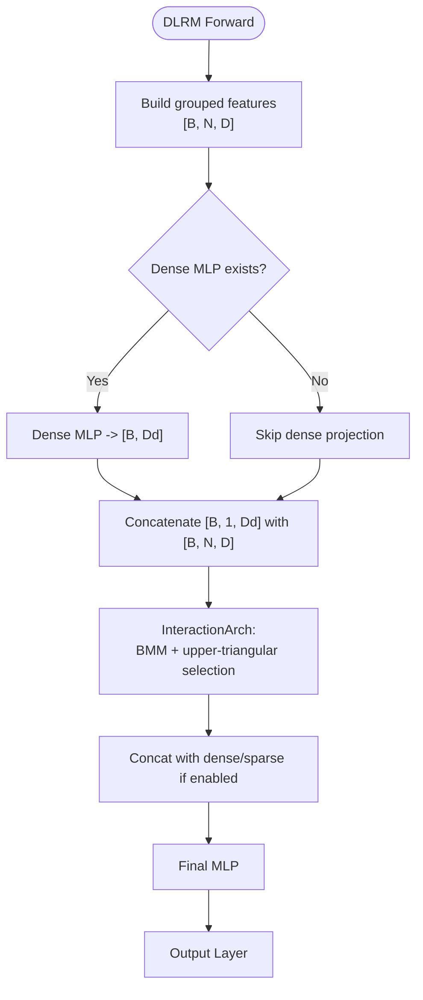
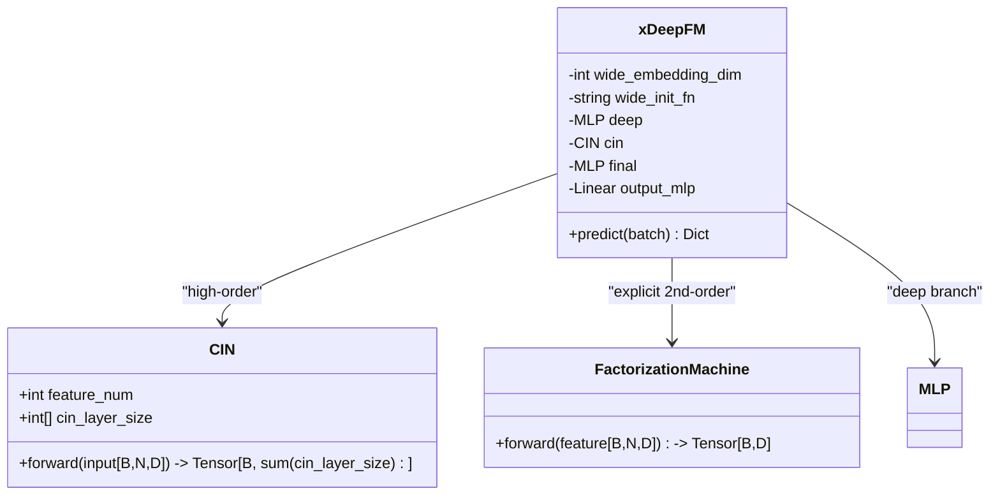
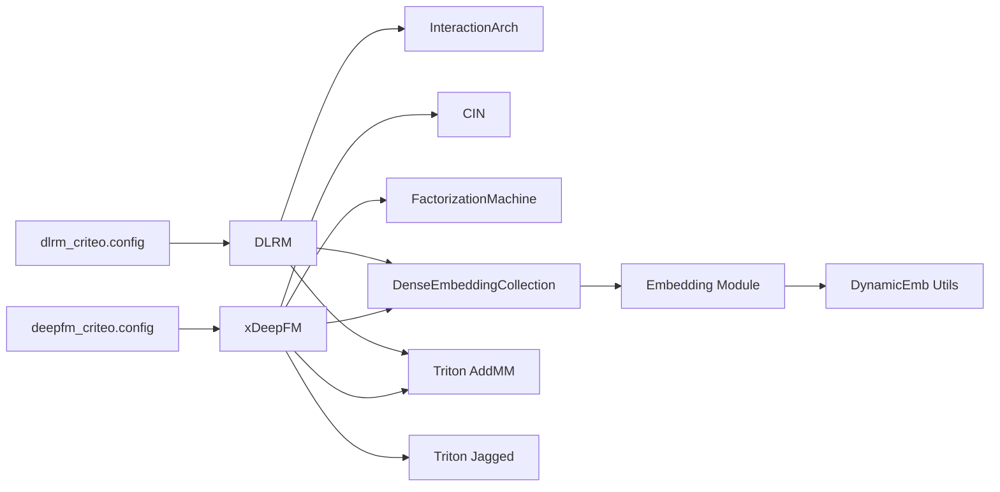

# Product-Based Neural Models

<cite>
**Referenced Files in This Document**
- [dlrm.py](file://tzrec/models/dlrm.py)
- [xdeepfm.py](file://tzrec/models/xdeepfm.py)
- [interaction.py](file://tzrec/modules/interaction.py)
- [fm.py](file://tzrec/modules/fm.py)
- [dlrm.md](file://docs/source/models/dlrm.md)
- [xdeepfm.md](file://docs/source/models/xdeepfm.md)
- [dlrm_criteo.config](file://examples/dlrm_criteo.config)
- [deepfm_criteo.config](file://examples/deepfm_criteo.config)
- [dense_embedding_collection.py](file://tzrec/modules/dense_embedding_collection.py)
- [embedding.py](file://tzrec/modules/embedding.py)
- [dynamicemb_util.py](file://tzrec/utils/dynamicemb_util.py)
- [plan_util.py](file://tzrec/utils/plan_util.py)
- [triton_addmm.py](file://tzrec/ops/_triton/triton_addmm.py)
- [triton_jagged_tensors.py](file://tzrec/ops/_triton/triton_jagged_tensors.py)
</cite>

## Table of Contents

1. [Introduction](#introduction)
1. [Project Structure](#project-structure)
1. [Core Components](#core-components)
1. [Architecture Overview](#architecture-overview)
1. [Detailed Component Analysis](#detailed-component-analysis)
1. [Dependency Analysis](#dependency-analysis)
1. [Performance Considerations](#performance-considerations)
1. [Troubleshooting Guide](#troubleshooting-guide)
1. [Conclusion](#conclusion)
1. [Appendices](#appendices)

## Introduction

This document explains product-based neural network models implemented in the repository, focusing on DLRM and xDeepFM. It covers:

- DLRM’s feature interaction via compressed embedding tables and optimized inner product computations for large-scale recommendation.
- xDeepFM’s extended factorization machine with compressed interaction network (CIN) and an optional linear theta (OLT) layer for high-order feature interactions.
- Mathematical foundations of product-based networks, embedding compression techniques, and efficient dot-product computations.
- Implementation details of embedding table design, field-wise operations, and deep CIN layers.
- Performance optimization strategies, memory usage considerations, and scaling guidelines for production deployments with billions of parameters.

## Project Structure

The relevant modules and models are organized as follows:

- Models: DLRM and xDeepFM define the high-level architectures.
- Modules: Interaction-related building blocks (InteractionArch, CIN, FM) implement efficient feature interaction and compression.
- Examples: Example configurations demonstrate embedding table sizing and model setups for large-scale datasets.
- Ops: Triton kernels accelerate matrix multiplication and jagged tensor operations.
- Utilities: Dynamic embedding and planning utilities assist with memory and storage planning for massive embedding tables.

**Diagram sources**

- \[dlrm.py\](file://tzrec/models/dlrm.py#L26-L136)
- \[xdeepfm.py\](file://tzrec/models/xdeepfm.py#L26-L87)
- \[interaction.py\](file://tzrec/modules/interaction.py#L57-L234)
- \[fm.py\](file://tzrec/modules/fm.py#L17-L43)
- \[dlrm_criteo.config\](file://examples/dlrm_criteo.config#L331-L398)
- \[deepfm_criteo.config\](file://examples/deepfm_criteo.config#L278-L397)
- \[dense_embedding_collection.py\](file://tzrec/modules/dense_embedding_collection.py#L30-L200)
- \[embedding.py\](file://tzrec/modules/embedding.py#L981-L1008)
- \[dynamicemb_util.py\](file://tzrec/utils/dynamicemb_util.py#L344-L579)
- \[plan_util.py\](file://tzrec/utils/plan_util.py#L451-L506)
- \[triton_addmm.py\](file://tzrec/ops/\_triton/triton_addmm.py#L199-L216)
- \[triton_jagged_tensors.py\](file://tzrec/ops/\_triton/triton_jagged_tensors.py#L320-L349)

**Section sources**

- \[dlrm.py\](file://tzrec/models/dlrm.py#L26-L136)
- \[xdeepfm.py\](file://tzrec/models/xdeepfm.py#L26-L87)
- \[interaction.py\](file://tzrec/modules/interaction.py#L57-L234)
- \[fm.py\](file://tzrec/modules/fm.py#L17-L43)
- \[dlrm.md\](file://docs/source/models/dlrm.md#L1-L101)
- \[xdeepfm.md\](file://docs/source/models/xdeepfm.md#L1-L89)
- \[dlrm_criteo.config\](file://examples/dlrm_criteo.config#L331-L398)
- \[deepfm_criteo.config\](file://examples/deepfm_criteo.config#L278-L397)
- \[dense_embedding_collection.py\](file://tzrec/modules/dense_embedding_collection.py#L30-L200)
- \[embedding.py\](file://tzrec/modules/embedding.py#L981-L1008)
- \[dynamicemb_util.py\](file://tzrec/utils/dynamicemb_util.py#L344-L579)
- \[plan_util.py\](file://tzrec/utils/plan_util.py#L451-L506)
- \[triton_addmm.py\](file://tzrec/ops/\_triton/triton_addmm.py#L199-L216)
- \[triton_jagged_tensors.py\](file://tzrec/ops/\_triton/triton_jagged_tensors.py#L320-L349)

## Core Components

- DLRM

  - Uses an InteractionArch module to compute pairwise inner products among embedded features, producing a compact set of interaction features.
  - Supports optional dense MLP and concatenation of sparse embeddings for final prediction.
  - Configurable to include original sparse features alongside interactions in the final MLP.

- xDeepFM

  - Employs a Compressed Interaction Network (CIN) to capture high-order feature interactions efficiently.
  - Integrates a deep MLP branch and optionally a Factorization Machine (FM) block for second-order interactions.
  - Provides an optional OLT-like linear theta layer via a dedicated wide embedding pathway.

- Interaction and Compression Building Blocks

  - InteractionArch: Efficient pairwise dot-products using batched matrix multiplication and upper-triangular indexing.
  - CIN: Field-wise cubic interactions compressed via 1D convolutions across feature and field dimensions.
  - FactorizationMachine: Second-order FM computation for explicit two-way interactions.
  - WuKongLayer and LinearCompressBlock/FactorizationMachineBlock: Optimized FM compression pathways for very large feature counts.

**Section sources**

- \[dlrm.py\](file://tzrec/models/dlrm.py#L26-L136)
- \[xdeepfm.py\](file://tzrec/models/xdeepfm.py#L26-L87)
- \[interaction.py\](file://tzrec/modules/interaction.py#L57-L234)
- \[fm.py\](file://tzrec/modules/fm.py#L17-L43)

## Architecture Overview

The following diagrams illustrate the end-to-end flows of DLRM and xDeepFM, highlighting interaction computation, embedding handling, and optional compression.

**Diagram sources**

- \[dlrm.py\](file://tzrec/models/dlrm.py#L101-L136)
- \[interaction.py\](file://tzrec/modules/interaction.py#L57-L91)

**Diagram sources**

- \[xdeepfm.py\](file://tzrec/models/xdeepfm.py#L63-L87)
- \[interaction.py\](file://tzrec/modules/interaction.py#L183-L234)
- \[fm.py\](file://tzrec/modules/fm.py#L17-L43)

## Detailed Component Analysis

### DLRM: Compressed Embedding Tables and Inner Product Optimization

- Embedding table design

  - Sparse features are grouped and embedded into fixed-dimensional vectors per feature.
  - Dense features can be projected through an optional MLP prior to interaction.
  - The model enforces uniform embedding dimensions across sparse features and compatibility with the dense MLP output dimension.

- Field-wise operations and interaction

  - InteractionArch computes pairwise inner products across all fields using batched matrix multiplication and extracts upper triangular entries to avoid duplicates and self-interactions.
  - The resulting interaction features are concatenated with dense and/or sparse embeddings before the final MLP.

- Efficient dot-product computation

  - Uses batched matrix multiplication for O(N^2) pairwise interactions across fields.
  - Indexing selects only unique pairs, yielding a compact interaction vector of size N\*(N-1)/2.

- Practical configuration

  - Example configuration demonstrates large vocabulary sizes and embedding dimensions typical of production systems.

**Diagram sources**

- \[dlrm.py\](file://tzrec/models/dlrm.py#L101-L136)
- \[interaction.py\](file://tzrec/modules/interaction.py#L57-L91)

**Section sources**

- \[dlrm.py\](file://tzrec/models/dlrm.py#L26-L136)
- \[interaction.py\](file://tzrec/modules/interaction.py#L57-L91)
- \[dlrm.md\](file://docs/source/models/dlrm.md#L23-L101)
- \[dlrm_criteo.config\](file://examples/dlrm_criteo.config#L331-L398)

### xDeepFM: Extended Factorization Machine with CIN and Optional OLT

- CIN deep layer

  - Computes field-wise cubic interactions by reshaping embeddings into a tensor product grid and applying 1D convolutions across feature dimensions.
  - Outputs a flattened concatenation of per-layer feature maps, enabling high-order interactions with reduced parameter count compared to naive polynomial expansion.

- Optional FM block (explicit second-order)

  - FactorizationMachine module computes explicit second-order interactions for complementary modeling of two-way feature effects.

- Optional OLT-like linear theta (wide) layer

  - The wide embedding pathway enables a linear theta term (first-order plus second-order) similar to the OLT concept, allowing efficient modeling of low-degree interactions.

- Deep MLP branch

  - Separate MLP processes deep embeddings for non-linear combinations.

**Diagram sources**

- \[xdeepfm.py\](file://tzrec/models/xdeepfm.py#L26-L87)
- \[interaction.py\](file://tzrec/modules/interaction.py#L183-L234)
- \[fm.py\](file://tzrec/modules/fm.py#L17-L43)

**Section sources**

- \[xdeepfm.py\](file://tzrec/models/xdeepfm.py#L26-L87)
- \[interaction.py\](file://tzrec/modules/interaction.py#L183-L234)
- \[fm.py\](file://tzrec/modules/fm.py#L17-L43)
- \[xdeepfm.md\](file://docs/source/models/xdeepfm.md#L9-L89)
- \[deepfm_criteo.config\](file://examples/deepfm_criteo.config#L278-L397)

### Mathematical Foundations of Product-Based Networks

- Pairwise inner products

  - InteractionArch computes Z = X · X^T across fields, then selects upper-triangular entries to form interaction features.
  - Complexity: O(B·N^2·D) for the batched matmul; output dimension scales quadratically with fields.

- CIN field-wise interactions

  - CIN applies multi-layer convolutions over the outer product grid of embeddings across fields, compressing interactions into lower-dimensional feature maps.
  - Complexity: O(B·N^2·D·L) for L layers, with per-layer channel counts determined by cin_layer_size.

- Explicit second-order FM

  - FactorizationMachine computes 0.5 * ((Σx)^2 - Σx^2), isolating second-order feature interactions.

- Compression via linear theta (wide)

  - The wide embedding pathway acts as a linear theta term, enabling efficient first- and second-order modeling akin to optimal linear theta layers.

**Section sources**

- \[interaction.py\](file://tzrec/modules/interaction.py#L57-L91)
- \[interaction.py\](file://tzrec/modules/interaction.py#L183-L234)
- \[fm.py\](file://tzrec/modules/fm.py#L17-L43)

### Implementation Details: Embedding Table Design and Field-Wise Operations

- Embedding table design

  - DenseEmbeddingCollection groups features by embedding dimension and value dimension, enabling efficient embedding lookups and downstream processing.
  - Embedding modules integrate with dynamic embedding utilities for large-scale sharding and caching.

- Field-wise operations

  - InteractionArch and CIN operate on tensors shaped [B, N, D], performing field-wise computations and reshaping to maintain compact representations.

- Wide vs deep/wide grouping

  - Feature groups separate wide (linear theta) and deep (non-linear) embeddings, ensuring proper alignment for final fusion.

**Section sources**

- \[dense_embedding_collection.py\](file://tzrec/modules/dense_embedding_collection.py#L30-L200)
- \[embedding.py\](file://tzrec/modules/embedding.py#L981-L1008)
- \[interaction.py\](file://tzrec/modules/interaction.py#L57-L91)
- \[interaction.py\](file://tzrec/modules/interaction.py#L183-L234)

## Dependency Analysis

The following diagram highlights key dependencies among models, modules, and utilities.

**Diagram sources**

- \[dlrm.py\](file://tzrec/models/dlrm.py#L26-L136)
- \[xdeepfm.py\](file://tzrec/models/xdeepfm.py#L26-L87)
- \[interaction.py\](file://tzrec/modules/interaction.py#L57-L234)
- \[fm.py\](file://tzrec/modules/fm.py#L17-L43)
- \[dense_embedding_collection.py\](file://tzrec/modules/dense_embedding_collection.py#L30-L200)
- \[embedding.py\](file://tzrec/modules/embedding.py#L981-L1008)
- \[dynamicemb_util.py\](file://tzrec/utils/dynamicemb_util.py#L344-L579)
- \[triton_addmm.py\](file://tzrec/ops/\_triton/triton_addmm.py#L199-L216)
- \[triton_jagged_tensors.py\](file://tzrec/ops/\_triton/triton_jagged_tensors.py#L320-L349)
- \[dlrm_criteo.config\](file://examples/dlrm_criteo.config#L331-L398)
- \[deepfm_criteo.config\](file://examples/deepfm_criteo.config#L278-L397)

**Section sources**

- \[dlrm.py\](file://tzrec/models/dlrm.py#L26-L136)
- \[xdeepfm.py\](file://tzrec/models/xdeepfm.py#L26-L87)
- \[interaction.py\](file://tzrec/modules/interaction.py#L57-L234)
- \[fm.py\](file://tzrec/modules/fm.py#L17-L43)
- \[dense_embedding_collection.py\](file://tzrec/modules/dense_embedding_collection.py#L30-L200)
- \[embedding.py\](file://tzrec/modules/embedding.py#L981-L1008)
- \[dynamicemb_util.py\](file://tzrec/utils/dynamicemb_util.py#L344-L579)
- \[triton_addmm.py\](file://tzrec/ops/\_triton/triton_addmm.py#L199-L216)
- \[triton_jagged_tensors.py\](file://tzrec/ops/\_triton/triton_jagged_tensors.py#L320-L349)
- \[dlrm_criteo.config\](file://examples/dlrm_criteo.config#L331-L398)
- \[deepfm_criteo.config\](file://examples/deepfm_criteo.config#L278-L397)

## Performance Considerations

- Efficient dot-product computation

  - Use batched matrix multiplication for pairwise interactions and extract upper-triangular indices to reduce redundant computations.
  - Leverage Triton kernels for fused matrix multiplication and jagged tensor operations to minimize memory bandwidth and improve throughput.

- Memory usage and scaling

  - Plan embedding storage using the embedding storage estimator and dynamic embedding utilities to estimate HBM/DDR usage and cache policies.
  - Align embedding table sizes to powers-of-two and configure bucket capacities to optimize dynamic embedding admission counters and caching ratios.

- Model scaling guidelines

  - For DLRM, cap the number of fields or apply field-wise compression via InteractionArch to keep interaction costs manageable.
  - For xDeepFM, tune CIN layer sizes and depths to balance representational power against compute and memory costs; consider explicit FM for critical two-way terms.

[No sources needed since this section provides general guidance]

## Troubleshooting Guide

- Shape mismatches

  - Ensure dense MLP output dimension matches sparse embedding dimension and that all sparse features share the same embedding dimension.
  - Verify feature group configurations for wide/deep/fm groups and embedding dimensions.

- Interaction dimension sanity checks

  - InteractionArch output dimension equals N\*(N-1)/2; confirm the number of fields and embedding dimension align with expectations.

- Embedding lookup failures

  - Confirm feature names in configs match those declared in feature groups and that embedding tables are initialized with sufficient capacity.

**Section sources**

- \[dlrm.py\](file://tzrec/models/dlrm.py#L47-L90)
- \[interaction.py\](file://tzrec/modules/interaction.py#L73-L91)
- \[dlrm.md\](file://docs/source/models/dlrm.md#L74-L93)

## Conclusion

This document outlined the product-based neural network models in the repository, focusing on DLRM’s compressed embedding tables and optimized inner product computations, and xDeepFM’s extended factorization machine with CIN and optional OLT-like linear theta layer. By leveraging field-wise operations, efficient dot-product implementations, and compression strategies, these models scale to production environments with billions of parameters while maintaining strong performance and memory efficiency.

[No sources needed since this section summarizes without analyzing specific files]

## Appendices

### Appendix A: Configuration Highlights

- DLRM configuration

  - Feature groups: dense and sparse groups; dense MLP optional; final MLP and optional concatenation of sparse features supported.
  - Example configuration demonstrates large vocabularies and embedding dimensions suitable for large-scale datasets.

- xDeepFM configuration

  - Wide/deep/fm feature groups; CIN layer sizes; deep MLP hidden units; optional FM block; final MLP.

**Section sources**

- \[dlrm.md\](file://docs/source/models/dlrm.md#L23-L101)
- \[xdeepfm.md\](file://docs/source/models/xdeepfm.md#L9-L89)
- \[dlrm_criteo.config\](file://examples/dlrm_criteo.config#L331-L398)
- \[deepfm_criteo.config\](file://examples/deepfm_criteo.config#L278-L397)
