# Ranking Models

<cite>
**Referenced Files in This Document**
- [rank.rst](file://docs/source/models/rank.rst)
- [wide_and_deep.md](file://docs/source/models/wide_and_deep.md)
- [deepfm.md](file://docs/source/models/deepfm.md)
- [multi_tower.md](file://docs/source/models/multi_tower.md)
- [din.md](file://docs/source/models/din.md)
- [rocket_launching.md](file://docs/source/models/rocket_launching.md)
- [dlrm.md](file://docs/source/models/dlrm.md)
- [masknet.md](file://docs/source/models/masknet.md)
- [dcn.md](file://docs/source/models/dcn.md)
- [dcn_v2.md](file://docs/source/models/dcn_v2.md)
- [xdeepfm.md](file://docs/source/models/xdeepfm.md)
- [wukong.md](file://docs/source/models/wukong.md)
- [deepfm_criteo.config](file://examples/deepfm_criteo.config)
</cite>

## Table of Contents

1. [Introduction](#introduction)
1. [Project Structure](#project-structure)
1. [Core Components](#core-components)
1. [Architecture Overview](#architecture-overview)
1. [Detailed Component Analysis](#detailed-component-analysis)
1. [Dependency Analysis](#dependency-analysis)
1. [Performance Considerations](#performance-considerations)
1. [Troubleshooting Guide](#troubleshooting-guide)
1. [Conclusion](#conclusion)
1. [Appendices](#appendices)

## Introduction

This document presents a comprehensive guide to TorchEasyRec’s ranking models suite. It covers the full spectrum of scoring models, including WideAndDeep, DeepFM, MultiTower, DIN (Deep Interest Network), RocketLaunching, DLRM, MaskNet, DCN, DCNv2, xDeepFM, and WuKong. For each model, we explain the mathematical formulation, network architecture, attention mechanisms where applicable, and training strategies. Practical configuration examples, performance considerations, use-case recommendations, model selection criteria, hyperparameter tuning strategies, and production deployment considerations are included to help practitioners adopt these models effectively.

## Project Structure

TorchEasyRec organizes ranking model documentation under a dedicated models section and provides runnable example configurations. The documentation index lists all supported ranking models, while individual Markdown pages detail configuration, diagrams, and references.

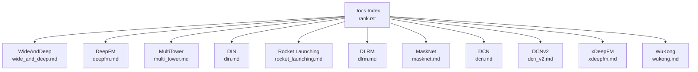

**Diagram sources**

- \[rank.rst\](file://docs/source/models/rank.rst#L1-L18)

**Section sources**

- \[rank.rst\](file://docs/source/models/rank.rst#L1-L18)

## Core Components

This section summarizes the core ranking models and their primary characteristics:

- WideAndDeep: Factorization-machine-style wide memory with deep neural network generalization. Supports explicit feature crosses via wide and implicit crosses via shared embeddings in deep.
- DeepFM: Extends WideAndDeep by adding a factorization machine (FM) module sharing embeddings with the deep MLP.
- MultiTower: Multi-input architecture with separate towers per feature group; no explicit FM; allows different embedding dimensions per tower.
- DIN: Attention-based sequential modeling for user behavior sequences; integrates a dedicated DIN tower with attention MLP over historical items.
- Rocket Launching: Dual-path training framework with a shared backbone, a booster network, and a lightweight network; trains the light net to mimic the booster via distillation; inference uses only the light net.
- DLRM: Product-based neural networks supporting dense and sparse features; models feature interactions via dot-product-like operations and bottom-top MLPs.
- MaskNet: Instance-guided masking with MaskBlocks to enhance feature interactions; supports serial and parallel block arrangements.
- DCN: Deep & Cross network with explicit cross layers to efficiently learn feature interactions without manual engineering.
- DCNv2: Improved cross network with matrix-based cross layers, optional backbone DNN, and two structural variants (parallel and serial Wide&Deep).
- xDeepFM: Compressed interaction network (CIN) to capture high-order explicit feature crosses, combined with deep MLP.
- WuKong: Dense-scaling architecture composed of stacked WuKong layers with linear compression, factorization-machine-like blocks, and feature-number MLPs.

**Section sources**

- \[wide_and_deep.md\](file://docs/source/models/wide_and_deep.md#L1-L59)
- \[deepfm.md\](file://docs/source/models/deepfm.md#L1-L79)
- \[multi_tower.md\](file://docs/source/models/multi_tower.md#L1-L72)
- \[din.md\](file://docs/source/models/din.md#L1-L89)
- \[rocket_launching.md\](file://docs/source/models/rocket_launching.md#L1-L76)
- \[dlrm.md\](file://docs/source/models/dlrm.md#L1-L101)
- \[masknet.md\](file://docs/source/models/masknet.md#L1-L40)
- \[dcn.md\](file://docs/source/models/dcn.md#L1-L69)
- \[dcn_v2.md\](file://docs/source/models/dcn_v2.md#L1-L84)
- \[xdeepfm.md\](file://docs/source/models/xdeepfm.md#L1-L89)
- \[wukong.md\](file://docs/source/models/wukong.md#L1-L112)

## Architecture Overview

The following diagram maps the high-level architecture of several representative models to their documentation pages:

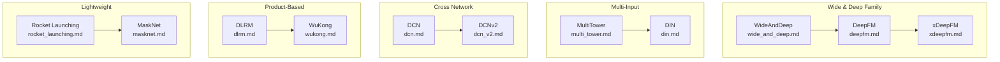

**Diagram sources**

- \[wide_and_deep.md\](file://docs/source/models/wide_and_deep.md#L1-L59)
- \[deepfm.md\](file://docs/source/models/deepfm.md#L1-L79)
- \[xdeepfm.md\](file://docs/source/models/xdeepfm.md#L1-L89)
- \[multi_tower.md\](file://docs/source/models/multi_tower.md#L1-L72)
- \[din.md\](file://docs/source/models/din.md#L1-L89)
- \[dcn.md\](file://docs/source/models/dcn.md#L1-L69)
- \[dcn_v2.md\](file://docs/source/models/dcn_v2.md#L1-L84)
- \[dlrm.md\](file://docs/source/models/dlrm.md#L1-L101)
- \[wukong.md\](file://docs/source/models/wukong.md#L1-L112)
- \[rocket_launching.md\](file://docs/source/models/rocket_launching.md#L1-L76)
- \[masknet.md\](file://docs/source/models/masknet.md#L1-L40)

## Detailed Component Analysis

### WideAndDeep

- Mathematical formulation: Linear combination of wide features plus a deep MLP pathway; embeddings are shared between wide and deep parts.
- Architecture: Two-branch structure with explicit crosses in wide and implicit crosses via shared embeddings in deep MLP.
- Training strategy: Separate optimizers for sparse and dense parameters; supports wide initialization customization.
- Practical configuration: Requires two feature groups (wide and deep) with specific group names; deep MLP hidden units configurable.
- Output: logits/probs/y depending on task type.

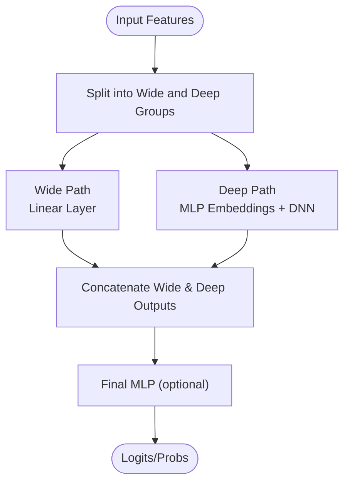

**Diagram sources**

- \[wide_and_deep.md\](file://docs/source/models/wide_and_deep.md#L9-L35)

**Section sources**

- \[wide_and_deep.md\](file://docs/source/models/wide_and_deep.md#L1-L59)

### DeepFM

- Mathematical formulation: FM module plus deep MLP with shared embeddings; combines explicit second-order feature interactions with deep representation learning.
- Architecture: Three-branch structure (wide, FM, deep) optionally merged via a final MLP.
- Training strategy: Shared embedding space across FM and deep; final MLP optional.
- Practical configuration: Requires at least wide and deep groups; FM group optional; deep MLP hidden units configurable.
- Output: logits/probs/y.

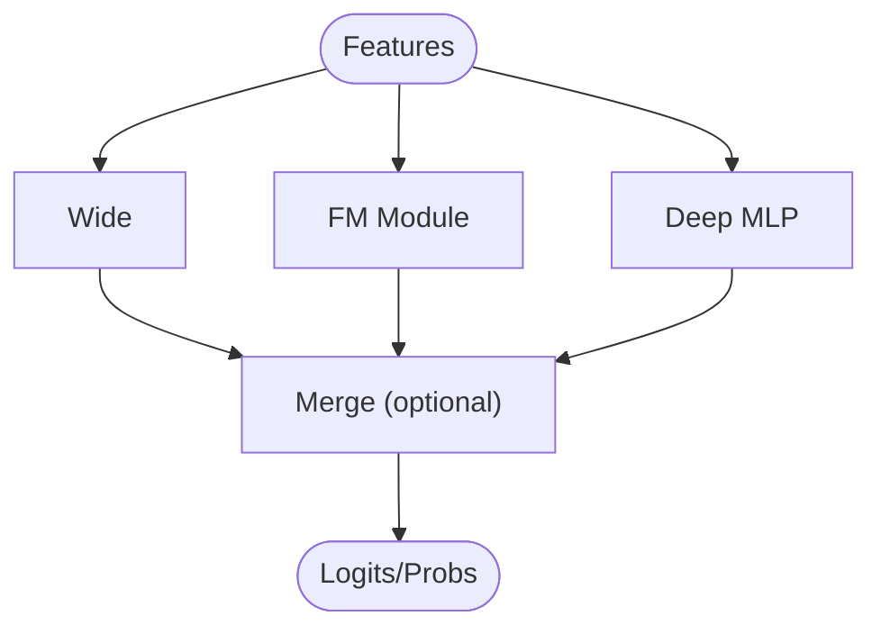

**Diagram sources**

- \[deepfm.md\](file://docs/source/models/deepfm.md#L9-L55)

**Section sources**

- \[deepfm.md\](file://docs/source/models/deepfm.md#L1-L79)

### MultiTower

- Mathematical formulation: Independent towers per feature group; no explicit FM; embeddings can have different dimensions per tower.
- Architecture: Multiple towers feeding into a final MLP; suitable for heterogeneous feature domains (user/item/context).
- Training strategy: Each tower has its own MLP; final fusion MLP configurable.
- Practical configuration: Multiple feature groups allowed; each group maps to a tower; MLP hidden units per tower configurable.
- Output: logits/probs/y.

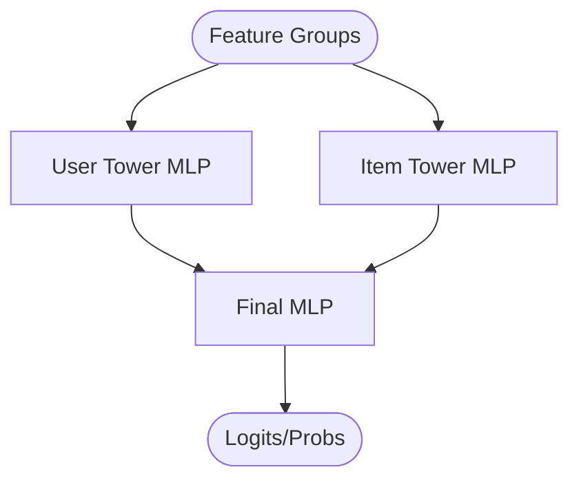

**Diagram sources**

- \[multi_tower.md\](file://docs/source/models/multi_tower.md#L10-L52)

**Section sources**

- \[multi_tower.md\](file://docs/source/models/multi_tower.md#L1-L72)

### DIN (Deep Interest Network)

- Mathematical formulation: Attention over historical user interactions; target-aware attention weights computed via an attention MLP over sequence features.
- Architecture: Multi-tower with a dedicated DIN tower for sequence features; attention mechanism computes importance scores for historical items.
- Training strategy: Sequence features require fixed-length sequences; DIN tower uses an attention MLP; final MLP fusion.
- Practical configuration: One or more deep feature groups and one sequence feature group; attention MLP hidden units configurable.
- Output: logits/probs/y.

```mermaid
sequenceDiagram
participant U as "User Features"
participant S as "Sequence Features"
participant ATTN as "Attention MLP"
participant FUS as "Final MLP"
U->>FUS : User Tower Output
S->>ATTN : Compute Attention Weights
ATTN-->>S : Weighted Sequence Representation
S-->>FUS : Sequence Tower Output
FUS-->>Out["Logits/Probs"]
```

**Diagram sources**

- \[din.md\](file://docs/source/models/din.md#L9-L56)

**Section sources**

- \[din.md\](file://docs/source/models/din.md#L1-L89)

### Rocket Launching

- Mathematical formulation: Shared backbone MLP, booster network, and lightweight network; lightweight network trained via feature-based distillation (e.g., cosine similarity) to imitate the booster.
- Architecture: Parallel shared MLP, booster MLP, and light MLP; optional feature-based distillation.
- Training strategy: Train both booster and light nets jointly; distill features or predictions; inference uses only the light net.
- Practical configuration: Share MLP, booster MLP, light MLP; optional feature-based distillation with configurable similarity function.
- Output: logits/probs/y.

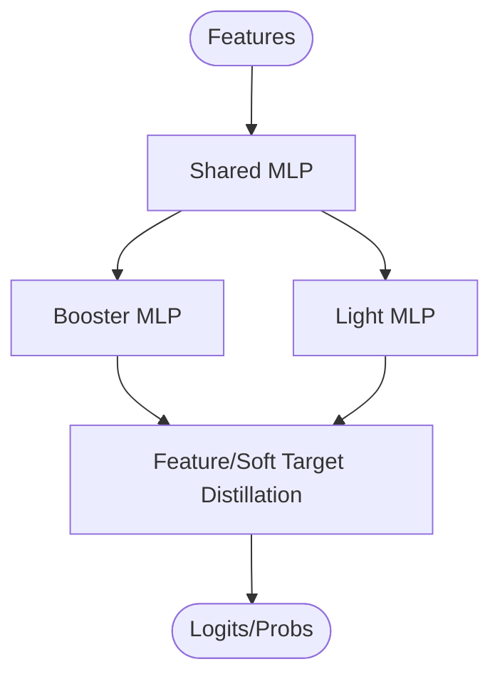

**Diagram sources**

- \[rocket_launching.md\](file://docs/source/models/rocket_launching.md#L10-L56)

**Section sources**

- \[rocket_launching.md\](file://docs/source/models/rocket_launching.md#L1-L76)

### DLRM (Deep Learning Recommender Model)

- Mathematical formulation: Bottom-top MLP with explicit feature interactions modeled via dot-product-like operations between embedded sparse features and dense features.
- Architecture: Dense MLP for dense features, sparse embedding lookup, interaction between dense/sparse/embedded features, and a final MLP.
- Training strategy: Optional dense MLP; optional concatenation of dense, sparse, and interaction features into final MLP.
- Practical configuration: Two feature groups (dense and sparse); dense MLP hidden units; final MLP hidden units; arch_with_sparse flag controls whether sparse features are concatenated into final MLP.
- Output: logits/probs/y.

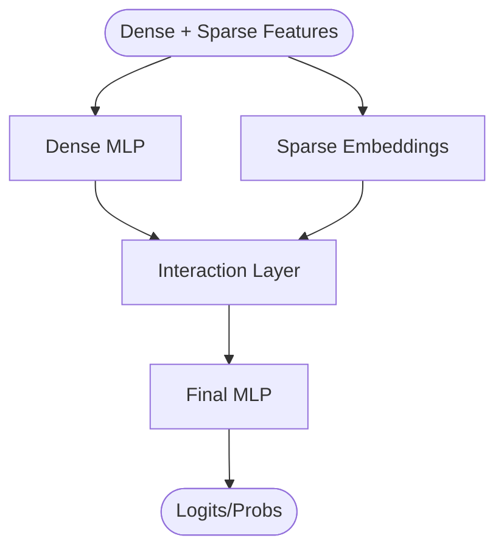

**Diagram sources**

- \[dlrm.md\](file://docs/source/models/dlrm.md#L23-L72)

**Section sources**

- \[dlrm.md\](file://docs/source/models/dlrm.md#L1-L101)

### MaskNet

- Mathematical formulation: Instance-guided masking introduces multiplicative interactions and highlights important feature positions; MaskBlocks combine normalization, masking, and feed-forward layers.
- Architecture: Serial or parallel MaskBlocks; top MLP for final prediction.
- Training strategy: Configurable number of MaskBlocks, parallel vs serial, and internal hidden dimensions.
- Practical configuration: n_mask_blocks, use_parallel, mask_block parameters (reduction_ratio or aggregation_dim, hidden_dim).
- Output: logits/probs/y.

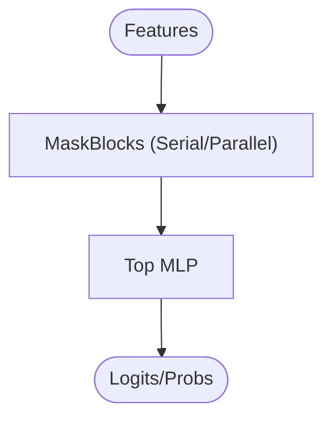

**Diagram sources**

- \[masknet.md\](file://docs/source/models/masknet.md#L8-L24)

**Section sources**

- \[masknet.md\](file://docs/source/models/masknet.md#L1-L40)

### DCN (Deep & Cross Network)

- Mathematical formulation: Cross network explicitly models feature interactions across layers; combined with a deep MLP for representation learning.
- Architecture: Cross layers with increasing degree of explicit feature interactions; deep MLP branch; final fusion.
- Training strategy: Cross layer count configurable; small computational overhead compared to explicit feature engineering.
- Practical configuration: Cross layer count; deep MLP hidden units; final MLP.
- Output: logits/probs/y.

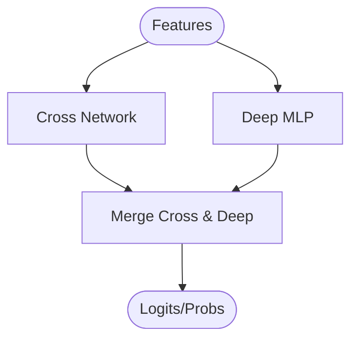

**Diagram sources**

- \[dcn.md\](file://docs/source/models/dcn.md#L11-L58)

**Section sources**

- \[dcn.md\](file://docs/source/models/dcn.md#L1-L69)

### DCNv2 (Deep & Cross Network v2)

- Mathematical formulation: Matrix-based cross layers replacing vector-based ones; optionally includes a backbone DNN before cross layers; offers parallel and serial Wide&Deep structures.
- Architecture: Backbone DNN (optional), cross layers with low-rank decomposition, deep MLP, and final fusion.
- Training strategy: Low-rank cross matrices reduce computation; two structural variants for flexibility.
- Practical configuration: Backbone MLP hidden units; cross_num and low_rank; deep MLP hidden units; final MLP.
- Output: logits/probs/y.

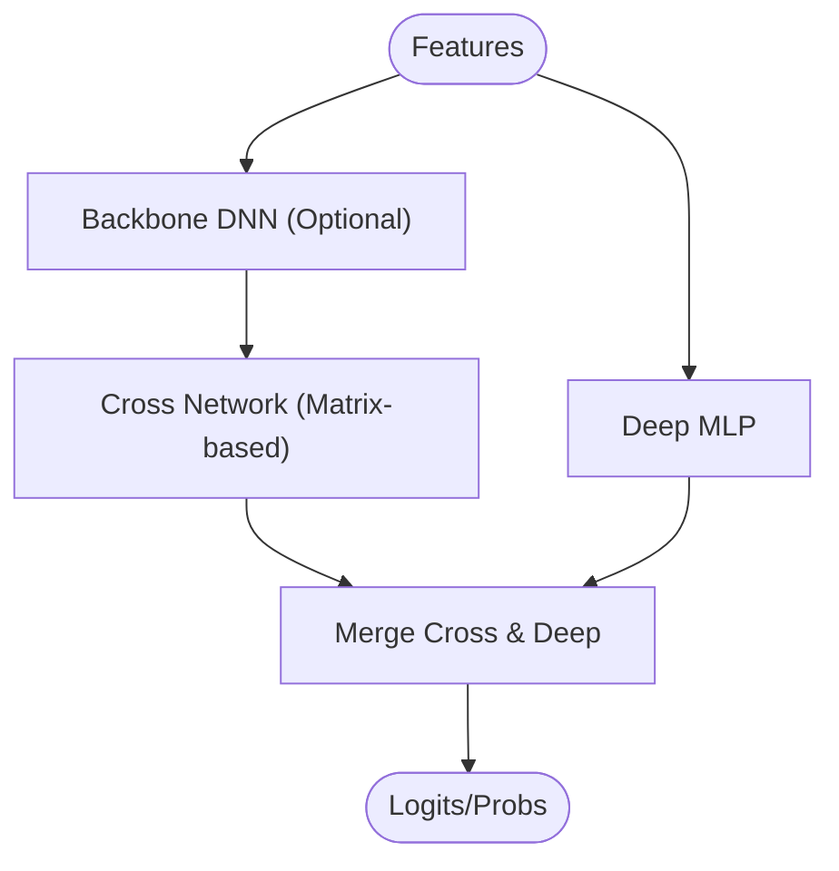

**Diagram sources**

- \[dcn_v2.md\](file://docs/source/models/dcn_v2.md#L14-L67)

**Section sources**

- \[dcn_v2.md\](file://docs/source/models/dcn_v2.md#L1-L84)

### xDeepFM (eXtended DeepFM)

- Mathematical formulation: Compressed Interaction Network (CIN) captures explicit high-order feature interactions; combined with deep MLP and optional wide branch.
- Architecture: CIN layers with specified layer sizes; deep MLP; optional final MLP.
- Training strategy: CIN replaces explicit cross layers with a compact interaction network; deep MLP learns higher-level representations.
- Practical configuration: CIN layer sizes; deep MLP hidden units; final MLP.
- Output: logits/probs/y.

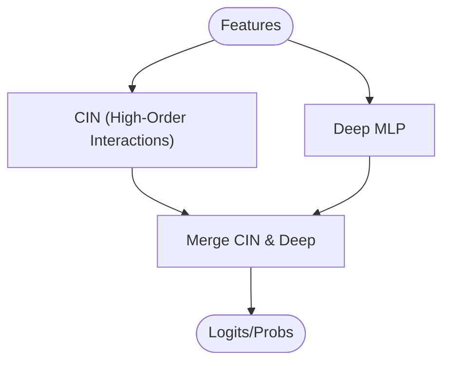

**Diagram sources**

- \[xdeepfm.md\](file://docs/source/models/xdeepfm.md#L9-L74)

**Section sources**

- \[xdeepfm.md\](file://docs/source/models/xdeepfm.md#L1-L89)

### WuKong

- Mathematical formulation: Dense-scaling architecture with stacked WuKong layers; each layer includes LinearCompressBlock, Factorization Machine-like block, and feature-number MLP to progressively compress and transform features.
- Architecture: Dense MLP for dense features; multiple WuKong layers with configurable feature numbers and MLPs; final MLP.
- Training strategy: Hierarchical compression and transformation improve scaling and expressiveness.
- Practical configuration: Dense MLP hidden units; multiple wukong_layers with lcb_feature_num, fmb_feature_num, compressed_feature_num, and feature_num_mlp; final MLP hidden units.
- Output: logits/probs/y.

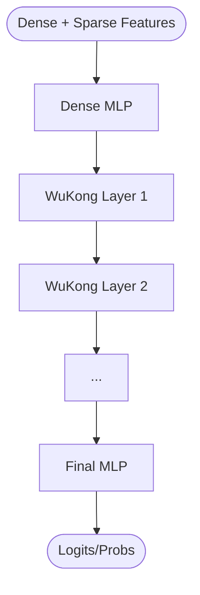

**Diagram sources**

- \[wukong.md\](file://docs/source/models/wukong.md#L13-L79)

**Section sources**

- \[wukong.md\](file://docs/source/models/wukong.md#L1-L112)

## Dependency Analysis

The ranking models are documented independently, with each page detailing configuration, parameters, and references. The documentation index aggregates all ranking models, enabling users to navigate between them.

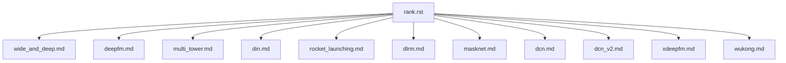

**Diagram sources**

- \[rank.rst\](file://docs/source/models/rank.rst#L4-L17)

**Section sources**

- \[rank.rst\](file://docs/source/models/rank.rst#L1-L18)

## Performance Considerations

- Model complexity vs latency: Lightweight models (e.g., Rocket Launching light net, MaskNet) are preferred for strict real-time constraints.
- Memory footprint: DLRM and WuKong scale with embedding and layer sizes; tune hidden units and feature counts accordingly.
- Feature interactions: DCN/DCNv2 and xDeepFM capture explicit interactions efficiently; DeepFM and WideAndDeep balance explicit and implicit interactions.
- Training stability: Separate optimizers for sparse and dense parameters improve convergence; ensure proper learning rates and batch sizes.
- Sequence modeling: DIN attention requires fixed-length sequences; ensure preprocessing aligns sequence lengths.

[No sources needed since this section provides general guidance]

## Troubleshooting Guide

- Sequence length mismatch in DIN: Ensure all sequence features within a SEQUENCE feature group have identical sequence lengths.
- Feature group naming: Some models enforce specific group names (e.g., wide/deep/fm in DeepFM; dense/sparse in DLRM/WuKong). Verify configuration matches model requirements.
- Embedding dimension mismatches: When combining dense and sparse features, ensure the last layer of dense MLP equals the embedding dimension of sparse features (DLRM/WuKong).
- Optimizer configuration: Use separate sparse and dense optimizers; adjust learning rates and schedulers per task.
- Distillation in Rocket Launching: Enable feature-based distillation only when appropriate; choose a suitable similarity function.

**Section sources**

- \[din.md\](file://docs/source/models/din.md#L74-L77)
- \[deepfm.md\](file://docs/source/models/deepfm.md#L57-L66)
- \[dlrm.md\](file://docs/source/models/dlrm.md#L74-L93)
- \[wukong.md\](file://docs/source/models/wukong.md#L82-L104)
- \[rocket_launching.md\](file://docs/source/models/rocket_launching.md#L66-L68)

## Conclusion

TorchEasyRec provides a broad set of ranking models tailored to different needs: explicit feature crosses (DeepFM, xDeepFM, DCN/DCNv2), multi-input scenarios (MultiTower, DIN), product-based interactions (DLRM, WuKong), attention-based modeling (DIN), lightweight inference (Rocket Launching), and flexible masking (MaskNet). By selecting models aligned with data characteristics, latency constraints, and scalability goals, and by carefully configuring feature groups, MLP layers, and optimizers, practitioners can achieve strong performance in production recommendation systems.

[No sources needed since this section summarizes without analyzing specific files]

## Appendices

### Practical Configuration Examples

- DeepFM example configuration demonstrates feature groups (wide, fm, deep), MLP hidden units, and loss/metric settings.

**Section sources**

- \[deepfm_criteo.config\](file://examples/deepfm_criteo.config#L278-L397)
