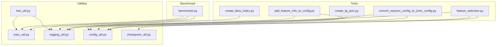
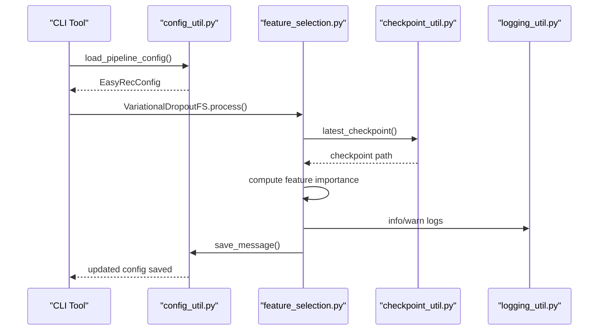
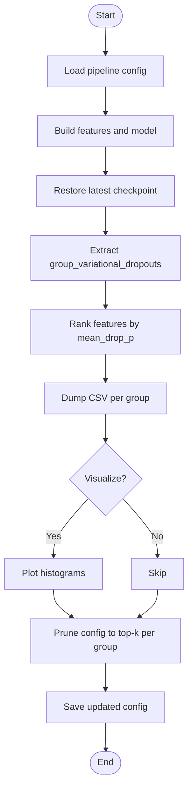
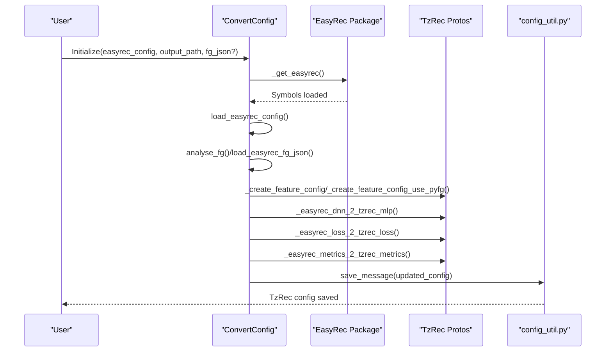
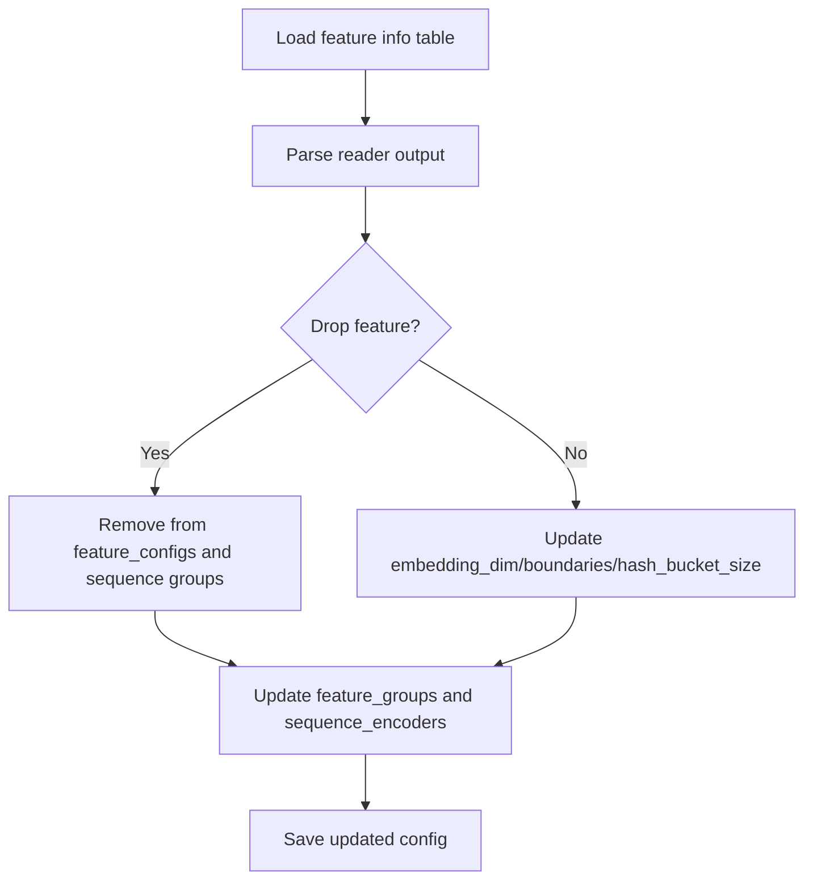
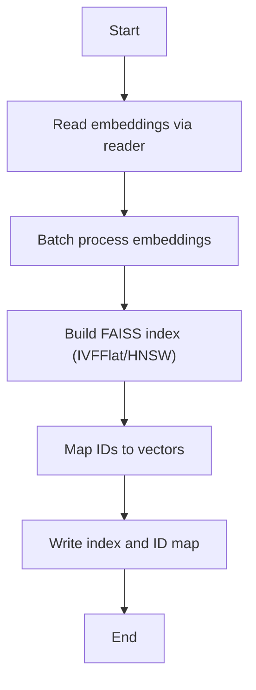
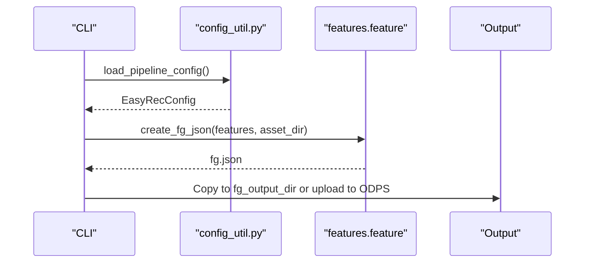
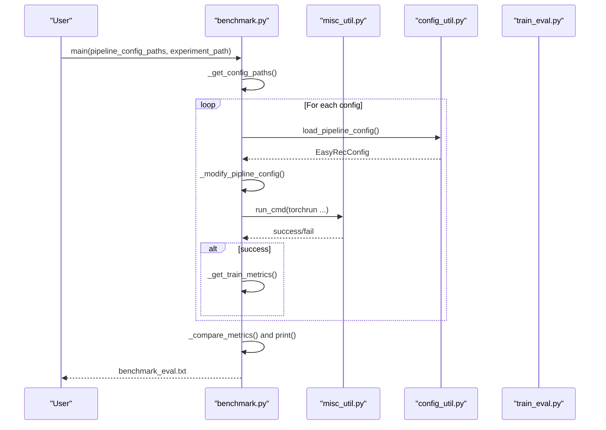
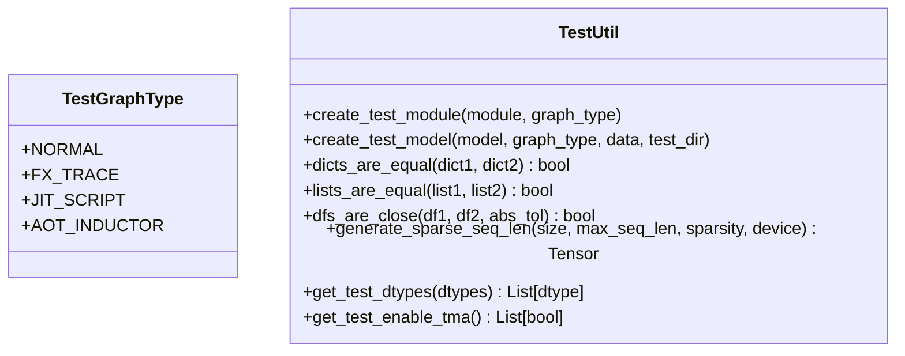
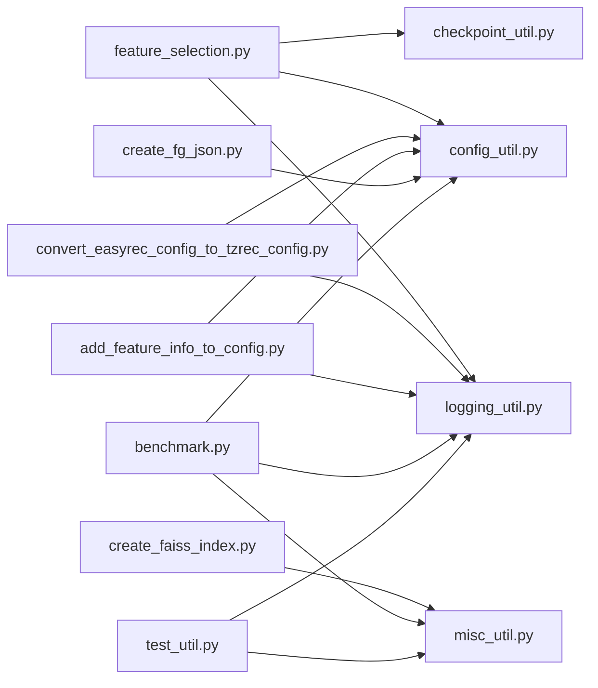

# Tools and Development Utilities

<cite>
**Referenced Files in This Document**
- [feature_selection.py](file://tzrec/tools/feature_selection.py)
- [convert_easyrec_config_to_tzrec_config.py](file://tzrec/tools/convert_easyrec_config_to_tzrec_config.py)
- [add_feature_info_to_config.py](file://tzrec/tools/add_feature_info_to_config.py)
- [create_faiss_index.py](file://tzrec/tools/create_faiss_index.py)
- [create_fg_json.py](file://tzrec/tools/create_fg_json.py)
- [benchmark.py](file://tzrec/benchmark/benchmark.py)
- [misc_util.py](file://tzrec/utils/misc_util.py)
- [test_util.py](file://tzrec/utils/test_util.py)
- [logging_util.py](file://tzrec/utils/logging_util.py)
- [config_util.py](file://tzrec/utils/config_util.py)
- [checkpoint_util.py](file://tzrec/utils/checkpoint_util.py)
- [feature_selection.md](file://docs/source/usage/feature_selection.md)
</cite>

## Table of Contents

1. [Introduction](#introduction)
1. [Project Structure](#project-structure)
1. [Core Components](#core-components)
1. [Architecture Overview](#architecture-overview)
1. [Detailed Component Analysis](#detailed-component-analysis)
1. [Dependency Analysis](#dependency-analysis)
1. [Performance Considerations](#performance-considerations)
1. [Troubleshooting Guide](#troubleshooting-guide)
1. [Conclusion](#conclusion)
1. [Appendices](#appendices)

## Introduction

This document describes TorchEasyRec’s tools and development utilities for:

- Automated feature engineering via feature selection
- Model configuration migration from other frameworks
- Testing and benchmarking workflows
- Utility functions for development tasks

It provides practical usage guidance, diagrams, and best practices for extending and integrating custom tools while maintaining development productivity.

## Project Structure

TorchEasyRec organizes tools and utilities primarily under:

- tzrec/tools: executable utilities for feature selection, configuration conversion, FAISS index creation, and feature group JSON generation
- tzrec/benchmark: benchmarking utilities for training/evaluation runs and metric comparison
- tzrec/utils: shared utilities for logging, configuration editing, checkpoint handling, and testing helpers

**Diagram sources**

- \[feature_selection.py\](file://tzrec/tools/feature_selection.py#L1-L291)
- \[convert_easyrec_config_to_tzrec_config.py\](file://tzrec/tools/convert_easyrec_config_to_tzrec_config.py#L1-L1011)
- \[add_feature_info_to_config.py\](file://tzrec/tools/add_feature_info_to_config.py#L1-L252)
- \[create_faiss_index.py\](file://tzrec/tools/create_faiss_index.py#L1-L86)
- \[create_fg_json.py\](file://tzrec/tools/create_fg_json.py#L1-L150)
- \[benchmark.py\](file://tzrec/benchmark/benchmark.py#L1-L338)
- \[misc_util.py\](file://tzrec/utils/misc_util.py#L1-L72)
- \[test_util.py\](file://tzrec/utils/test_util.py#L1-L216)
- \[logging_util.py\](file://tzrec/utils/logging_util.py#L1-L46)
- \[config_util.py\](file://tzrec/utils/config_util.py#L1-L299)
- \[checkpoint_util.py\](file://tzrec/utils/checkpoint_util.py#L1-L389)

**Section sources**

- \[feature_selection.py\](file://tzrec/tools/feature_selection.py#L1-L291)
- \[benchmark.py\](file://tzrec/benchmark/benchmark.py#L1-L338)
- \[misc_util.py\](file://tzrec/utils/misc_util.py#L1-L72)
- \[test_util.py\](file://tzrec/utils/test_util.py#L1-L216)
- \[logging_util.py\](file://tzrec/utils/logging_util.py#L1-L46)
- \[config_util.py\](file://tzrec/utils/config_util.py#L1-L299)
- \[checkpoint_util.py\](file://tzrec/utils/checkpoint_util.py#L1-L389)

## Core Components

- Feature Selection Tool: Computes feature importance using variational dropout and prunes configurations accordingly
- Configuration Converter: Converts EasyRec configs to TzRec configs, including features, towers, losses, and metrics
- Feature Info Updater: Adds feature metadata (embedding dimensions, boundaries, bucket sizes) to existing configs
- FAISS Index Builder: Builds approximate nearest neighbor indices from embeddings for retrieval
- Feature Group JSON Generator: Produces feature generator JSON for downstream processing and optional upload to MaxCompute resources
- Benchmark Runner: Executes repeated training/evaluation runs, aggregates metrics, and compares against baselines
- Testing Utilities: Helpers for graph tracing, scripting, AOT Inductor export/load, and numerical comparisons
- Logging Utilities: Structured logging with progress reporting
- Config Utilities: Loading, saving, editing, and path-based updates to pipeline configs
- Checkpoint Utilities: Distributed checkpoint loading/saving, best-checkpoint selection, and parameter remapping

**Section sources**

- \[feature_selection.py\](file://tzrec/tools/feature_selection.py#L34-L239)
- \[convert_easyrec_config_to_tzrec_config.py\](file://tzrec/tools/convert_easyrec_config_to_tzrec_config.py#L85-L1011)
- \[add_feature_info_to_config.py\](file://tzrec/tools/add_feature_info_to_config.py#L22-L214)
- \[create_faiss_index.py\](file://tzrec/tools/create_faiss_index.py#L12-L86)
- \[create_fg_json.py\](file://tzrec/tools/create_fg_json.py#L26-L150)
- \[benchmark.py\](file://tzrec/benchmark/benchmark.py#L126-L317)
- \[test_util.py\](file://tzrec/utils/test_util.py#L47-L216)
- \[logging_util.py\](file://tzrec/utils/logging_util.py#L20-L46)
- \[config_util.py\](file://tzrec/utils/config_util.py#L25-L299)
- \[checkpoint_util.py\](file://tzrec/utils/checkpoint_util.py#L38-L389)

## Architecture Overview

The tools integrate with TorchEasyRec’s configuration and model systems, leveraging protobuf-based pipeline configs and PyTorch utilities for distributed training and checkpointing.

**Diagram sources**

- \[feature_selection.py\](file://tzrec/tools/feature_selection.py#L216-L239)
- \[config_util.py\](file://tzrec/utils/config_util.py#L25-L64)
- \[checkpoint_util.py\](file://tzrec/utils/checkpoint_util.py#L147-L174)
- \[logging_util.py\](file://tzrec/utils/logging_util.py#L16-L46)

## Detailed Component Analysis

### Feature Selection Tool

Purpose: Automatically select features by ranking importance derived from variational dropout and updating the pipeline config accordingly.

Key capabilities:

- Loads a trained model’s variational dropout parameters
- Computes per-feature dropout probabilities per group
- Outputs CSV and optional visualizations
- Prunes unused features and optionally clears variational dropout config

Usage example (paths only):

- Train a model with variational dropout configured
- Run the feature selection script with pipeline config, checkpoint directory, and output directory
- Review CSVs and optional PNGs; updated config is saved to output directory

**Diagram sources**

- \[feature_selection.py\](file://tzrec/tools/feature_selection.py#L64-L239)
- \[config_util.py\](file://tzrec/utils/config_util.py#L25-L64)

Practical usage references:

- Training configuration and arguments: \[feature_selection.md\](file://docs/source/usage/feature_selection.md#L9-L46)
- CLI invocation example: \[feature_selection.md\](file://docs/source/usage/feature_selection.md#L29-L38)

**Section sources**

- \[feature_selection.py\](file://tzrec/tools/feature_selection.py#L34-L291)
- \[feature_selection.md\](file://docs/source/usage/feature_selection.md#L1-L46)

### Configuration Conversion (EasyRec → TzRec)

Purpose: Convert EasyRec pipeline configs to TzRec equivalents, including features, towers, losses, and metrics.

Highlights:

- Dynamically loads EasyRec package (wheel/tar) or fetches from URL
- Parses EasyRec textproto configs
- Maps feature types, sequences, and expressions
- Converts DNN stacks to MLP, losses, and metrics
- Supports optional fg.json-driven feature group mapping

**Diagram sources**

- \[convert_easyrec_config_to_tzrec_config.py\](file://tzrec/tools/convert_easyrec_config_to_tzrec_config.py#L41-L1011)
- \[config_util.py\](file://tzrec/utils/config_util.py#L51-L64)

**Section sources**

- \[convert_easyrec_config_to_tzrec_config.py\](file://tzrec/tools/convert_easyrec_config_to_tzrec_config.py#L85-L1011)

### Feature Info Updater

Purpose: Inject feature metadata (embedding dims, boundaries, hash buckets) into an existing config and drop features marked for removal.

Workflow:

- Reads feature info from a tabular source via a reader
- Drops features flagged for removal
- Updates feature configs with numeric parameters
- Cleans feature groups and sequence encoders accordingly

**Diagram sources**

- \[add_feature_info_to_config.py\](file://tzrec/tools/add_feature_info_to_config.py#L47-L214)
- \[config_util.py\](file://tzrec/utils/config_util.py#L51-L64)

**Section sources**

- \[add_feature_info_to_config.py\](file://tzrec/tools/add_feature_info_to_config.py#L22-L252)

### FAISS Index Builder

Purpose: Build approximate nearest neighbor indexes from embedding tables for retrieval.

Capabilities:

- Supports IVFFlat and HNSW variants
- Batched ingestion
- Reader abstraction for ODPS/Csv/Parquet
- Writes index and ID map to disk

**Diagram sources**

- \[create_faiss_index.py\](file://tzrec/tools/create_faiss_index.py#L12-L86)

**Section sources**

- \[create_faiss_index.py\](file://tzrec/tools/create_faiss_index.py#L12-L86)

### Feature Group JSON Generator

Purpose: Generate feature generator JSON from a pipeline config and optionally upload to MaxCompute resources.

Features:

- Traces feature computation to produce fg.json
- Optional debug mode to validate feature generation
- Uploads artifacts to ODPS with overwrite controls

**Diagram sources**

- \[create_fg_json.py\](file://tzrec/tools/create_fg_json.py#L84-L150)

**Section sources**

- \[create_fg_json.py\](file://tzrec/tools/create_fg_json.py#L26-L150)

### Benchmark Runner

Purpose: Execute repeated training/evaluation runs, compare metrics against baselines, and report outcomes.

Key steps:

- Discover config files (single file or directory)
- Modify paths for the current environment (project, quotas)
- Launch distributed training/eval runs
- Aggregate metrics and compare to baseline thresholds
- Produce summary reports and save benchmark results

**Diagram sources**

- \[benchmark.py\](file://tzrec/benchmark/benchmark.py#L126-L317)
- \[misc_util.py\](file://tzrec/utils/misc_util.py#L31-L62)
- \[config_util.py\](file://tzrec/utils/config_util.py#L25-L48)

**Section sources**

- \[benchmark.py\](file://tzrec/benchmark/benchmark.py#L126-L338)
- \[misc_util.py\](file://tzrec/utils/misc_util.py#L19-L72)

### Testing Infrastructure

Purpose: Provide helpers for testing model/graph variants, numerical equality checks, and AOT Inductor export/load.

Highlights:

- Graph types: normal, FX traced, JIT scripted, AOT Inductor
- Numerical comparisons for tensors and DataFrames
- Sparse sequence length generation
- GPU capability checks and Triton-enabled TMA toggles

**Diagram sources**

- \[test_util.py\](file://tzrec/utils/test_util.py#L47-L216)

**Section sources**

- \[test_util.py\](file://tzrec/utils/test_util.py#L1-L216)

### Logging Utilities

Purpose: Structured logging with progress reporting during long-running operations.

Features:

- ProgressLogger tracks iterations and throughput
- Central logger named “tzrec”

**Section sources**

- \[logging_util.py\](file://tzrec/utils/logging_util.py#L20-L46)

### Configuration Utilities

Purpose: Robust config loading/saving/editing with dot-bracket path support and type conversions.

Highlights:

- Load textproto or JSON configs
- Edit arbitrary fields via dot-path notation and bracket selectors
- Compatibility handling for deprecated fields

**Section sources**

- \[config_util.py\](file://tzrec/utils/config_util.py#L25-L299)

### Checkpoint Utilities

Purpose: Manage distributed checkpoints, best-checkpoint selection, and parameter remapping.

Highlights:

- Latest and best checkpoint discovery
- Partial load planner for compatibility and parameter remapping
- Save/load model and optimizer states, plus dynamic embedding dumps

**Section sources**

- \[checkpoint_util.py\](file://tzrec/utils/checkpoint_util.py#L38-L389)

## Dependency Analysis

The tools share common utilities and depend on PyTorch, protobuf, and optional libraries (e.g., matplotlib for visualization, FAISS for indexing).

**Diagram sources**

- \[feature_selection.py\](file://tzrec/tools/feature_selection.py#L12-L31)
- \[convert_easyrec_config_to_tzrec_config.py\](file://tzrec/tools/convert_easyrec_config_to_tzrec_config.py#L23-L38)
- \[add_feature_info_to_config.py\](file://tzrec/tools/add_feature_info_to_config.py#L16-L19)
- \[create_faiss_index.py\](file://tzrec/tools/create_faiss_index.py#L12-L14)
- \[create_fg_json.py\](file://tzrec/tools/create_fg_json.py#L20-L24)
- \[benchmark.py\](file://tzrec/benchmark/benchmark.py#L18-L21)
- \[test_util.py\](file://tzrec/utils/test_util.py#L24-L27)
- \[logging_util.py\](file://tzrec/utils/logging_util.py#L16-L17)
- \[config_util.py\](file://tzrec/utils/config_util.py#L20-L22)
- \[checkpoint_util.py\](file://tzrec/utils/checkpoint_util.py#L18-L35)
- \[misc_util.py\](file://tzrec/utils/misc_util.py#L12-L17)

**Section sources**

- \[feature_selection.py\](file://tzrec/tools/feature_selection.py#L12-L31)
- \[convert_easyrec_config_to_tzrec_config.py\](file://tzrec/tools/convert_easyrec_config_to_tzrec_config.py#L23-L38)
- \[add_feature_info_to_config.py\](file://tzrec/tools/add_feature_info_to_config.py#L16-L19)
- \[create_faiss_index.py\](file://tzrec/tools/create_faiss_index.py#L12-L14)
- \[create_fg_json.py\](file://tzrec/tools/create_fg_json.py#L20-L24)
- \[benchmark.py\](file://tzrec/benchmark/benchmark.py#L18-L21)
- \[test_util.py\](file://tzrec/utils/test_util.py#L24-L27)
- \[logging_util.py\](file://tzrec/utils/logging_util.py#L16-L17)
- \[config_util.py\](file://tzrec/utils/config_util.py#L20-L22)
- \[checkpoint_util.py\](file://tzrec/utils/checkpoint_util.py#L18-L35)
- \[misc_util.py\](file://tzrec/utils/misc_util.py#L12-L17)

## Performance Considerations

- Feature Selection: Visualization requires matplotlib; disable for CI environments to avoid overhead
- FAISS Indexing: Tune batch size and index parameters (nlist/M/efConstruction) for memory and latency trade-offs
- Benchmarking: Use appropriate run counts and thresholds; ensure sufficient GPU memory and stable ports
- Testing: Prefer FX tracing and JIT scripting for faster inference graphs; AOT Inductor requires CUDA and compatible drivers
- Logging: ProgressLogger reduces noisy logs during long iterations

[No sources needed since this section provides general guidance]

## Troubleshooting Guide

Common issues and resolutions:

- Missing matplotlib: Install to enable feature selection visualization; otherwise, run without visualization flag
- EasyRec package errors: Ensure wheel/tar path is valid or allow automatic download; verify network connectivity
- FAISS not installed: Install FAISS bindings before running index builder
- Benchmark failures: Check environment variables for project and quotas; review logs for port conflicts
- Checkpoint mismatches: Use parameter remapping and partial load planner; verify dynamic embedding availability
- GPU capability: Some tests require specific GPU architectures or Triton versions

**Section sources**

- \[feature_selection.py\](file://tzrec/tools/feature_selection.py#L19-L24)
- \[convert_easyrec_config_to_tzrec_config.py\](file://tzrec/tools/convert_easyrec_config_to_tzrec_config.py#L41-L70)
- \[create_faiss_index.py\](file://tzrec/tools/create_faiss_index.py#L12-L14)
- \[benchmark.py\](file://tzrec/benchmark/benchmark.py#L60-L124)
- \[checkpoint_util.py\](file://tzrec/utils/checkpoint_util.py#L38-L124)
- \[test_util.py\](file://tzrec/utils/test_util.py#L29-L40)

## Conclusion

TorchEasyRec’s tools and utilities streamline feature engineering, framework migration, testing, and benchmarking. By leveraging protobuf-based configs, PyTorch utilities, and modular helpers, teams can automate repetitive tasks, maintain reproducibility, and scale development workflows effectively.

[No sources needed since this section summarizes without analyzing specific files]

## Appendices

### Practical Examples

- Feature Selection

  - Train a model with variational dropout enabled
  - Run the feature selection tool with pipeline config, checkpoint directory, and output directory
  - Inspect CSVs and optional plots; updated config is saved for reuse

- Configuration Conversion

  - Prepare EasyRec config and optional fg.json
  - Run converter to produce TzRec config; validate mappings and adjust as needed

- FAISS Index Creation

  - Prepare embedding table via supported readers
  - Choose index type and parameters; write index and ID map for retrieval

- Benchmarking

  - Prepare base metrics and config set
  - Run benchmark with experiment path; review aggregated results and logs

- Testing and Debugging

  - Use graph types to validate model behavior across FX/JIT/AOT modes
  - Compare tensors and DataFrames with provided helpers
  - Monitor progress with structured logging

[No sources needed since this section provides general guidance]
