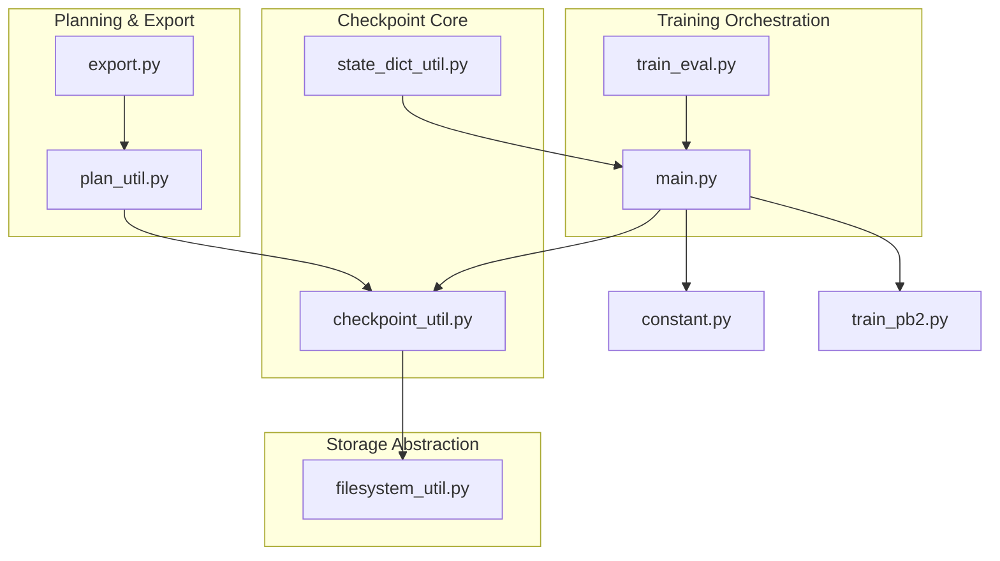
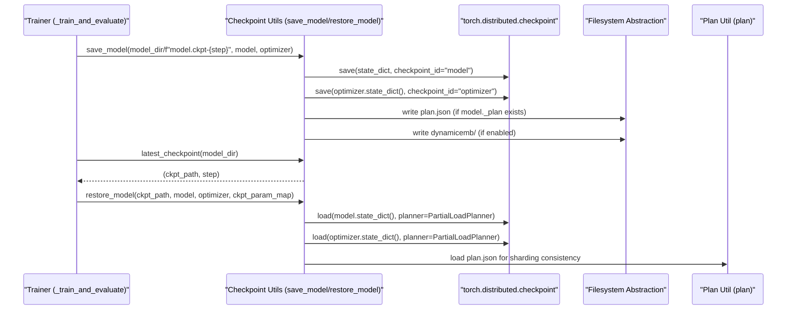
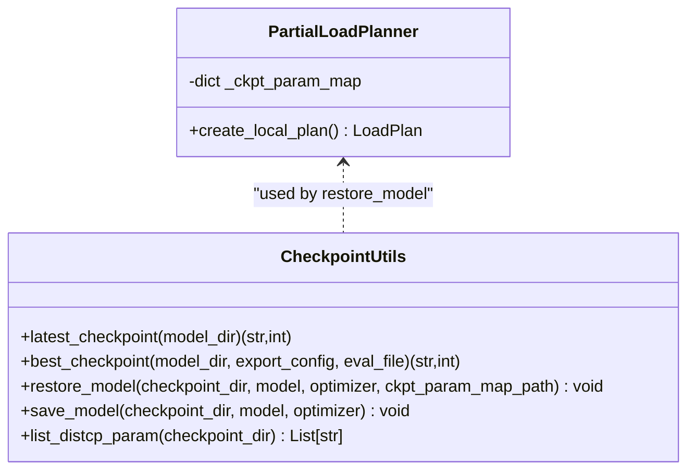
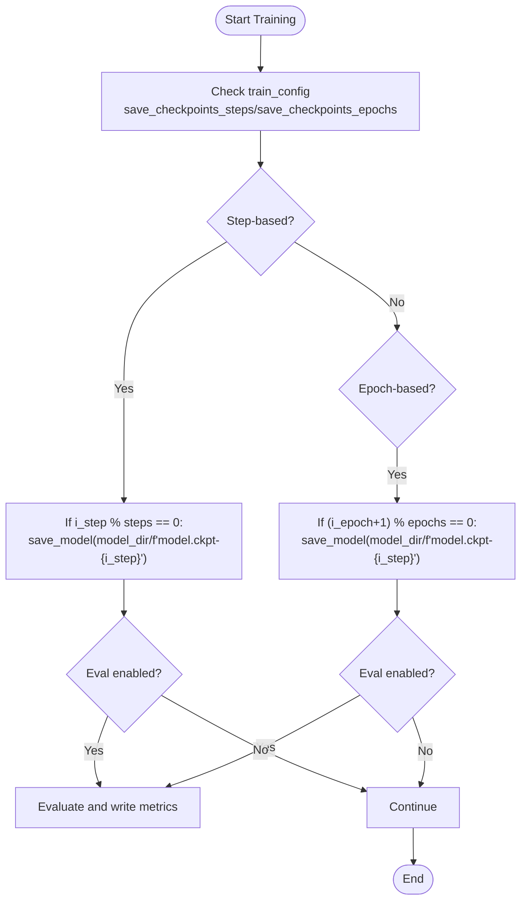
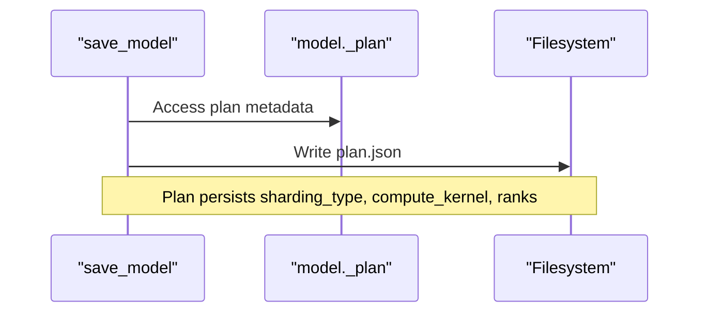
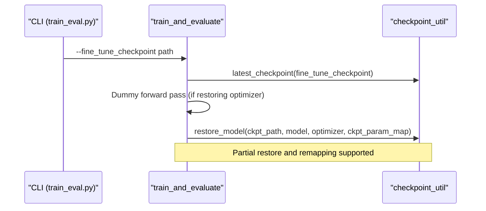
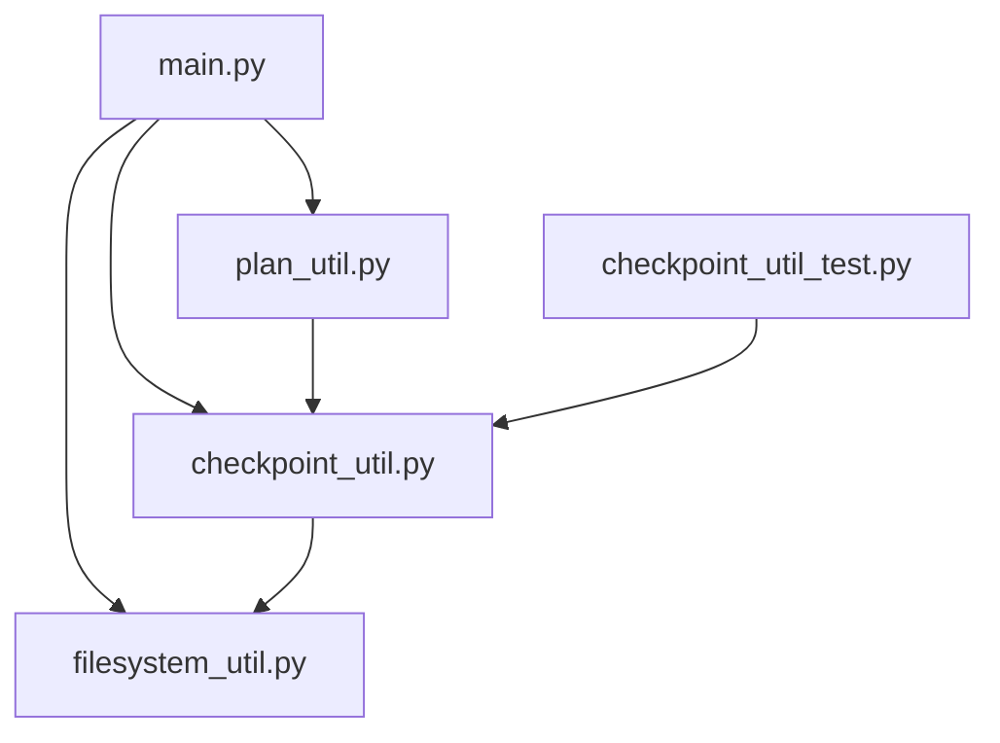

# Checkpoint Management and Model Persistence

<cite>
**Referenced Files in This Document**
- [checkpoint_util.py](file://tzrec/utils/checkpoint_util.py)
- [checkpoint_util_test.py](file://tzrec/utils/checkpoint_util_test.py)
- [state_dict_util.py](file://tzrec/utils/state_dict_util.py)
- [main.py](file://tzrec/main.py)
- [train_eval.py](file://tzrec/train_eval.py)
- [filesystem_util.py](file://tzrec/utils/filesystem_util.py)
- [plan_util.py](file://tzrec/utils/plan_util.py)
- [constant.py](file://tzrec/constant.py)
- [train_pb2.py](file://tzrec/protos/train_pb2.py)
- [export.py](file://tzrec/export.py)
</cite>

## Table of Contents

1. [Introduction](#introduction)
1. [Project Structure](#project-structure)
1. [Core Components](#core-components)
1. [Architecture Overview](#architecture-overview)
1. [Detailed Component Analysis](#detailed-component-analysis)
1. [Dependency Analysis](#dependency-analysis)
1. [Performance Considerations](#performance-considerations)
1. [Troubleshooting Guide](#troubleshooting-guide)
1. [Conclusion](#conclusion)
1. [Appendices](#appendices)

## Introduction

This document provides comprehensive guidance on checkpoint management and model persistence in TorchEasyRec. It covers checkpoint saving and loading mechanisms, state dictionary serialization/deserialization, versioning and best-checkpoint selection, incremental checkpointing strategies, and backup procedures. It also documents fine-tuning workflows, transfer learning configurations, model continuation scenarios, custom checkpoint strategies, handling model architecture changes, cross-filesystem storage, validation and recovery, optimization tips, and enterprise deployment with cloud storage and distributed file systems.

## Project Structure

The checkpoint system spans several modules:

- Utilities for checkpoint operations and distributed checkpointing
- Training orchestration that triggers periodic saves and restores
- Filesystem abstraction enabling cloud and distributed storage
- Planning utilities that persist sharding plans alongside checkpoints
- Tests validating distributed save/restore and partial remapping

**Diagram sources**

- \[checkpoint_util.py\](file://tzrec/utils/checkpoint_util.py#L1-L389)
- \[state_dict_util.py\](file://tzrec/utils/state_dict_util.py#L1-L60)
- \[main.py\](file://tzrec/main.py#L310-L525)
- \[train_eval.py\](file://tzrec/train_eval.py#L1-L73)
- \[filesystem_util.py\](file://tzrec/utils/filesystem_util.py#L1-L277)
- \[plan_util.py\](file://tzrec/utils/plan_util.py#L88-L190)
- \[constant.py\](file://tzrec/constant.py#L24-L26)
- \[train_pb2.py\](file://tzrec/protos/train_pb2.py#L19-L29)
- \[export.py\](file://tzrec/export.py#L1-L51)

**Section sources**

- \[checkpoint_util.py\](file://tzrec/utils/checkpoint_util.py#L1-L389)
- \[main.py\](file://tzrec/main.py#L310-L525)
- \[filesystem_util.py\](file://tzrec/utils/filesystem_util.py#L1-L277)
- \[plan_util.py\](file://tzrec/utils/plan_util.py#L88-L190)
- \[constant.py\](file://tzrec/constant.py#L24-L26)
- \[train_pb2.py\](file://tzrec/protos/train_pb2.py#L19-L29)
- \[export.py\](file://tzrec/export.py#L1-L51)

## Core Components

- Distributed checkpoint utilities: Save/load model and optimizer states, partial restoration, parameter remapping, and dynamic embedding persistence.
- Training orchestration: Periodic checkpoint creation based on steps or epochs, optional evaluation post-save, and automatic latest/best checkpoint discovery.
- Filesystem abstraction: Transparent support for local and remote/cloud filesystems via fsspec and TensorBoard gfile integration.
- Sharding plan persistence: Embedding sharding plan saved with checkpoints to ensure consistent model reconstruction.
- State initialization utilities: Fix meta tensors and initialize parameters for meta-device training scenarios.

Key responsibilities:

- Save model state dictionaries and optimizer states to separate subdirectories
- Load states with partial mapping and compatibility handling for embedding collections
- Discover latest or best checkpoints based on evaluation metrics
- Persist and reuse sharding plans for distributed training/inference
- Support cloud storage through filesystem abstraction

**Section sources**

- \[checkpoint_util.py\](file://tzrec/utils/checkpoint_util.py#L126-L389)
- \[main.py\](file://tzrec/main.py#L310-L525)
- \[filesystem_util.py\](file://tzrec/utils/filesystem_util.py#L36-L152)
- \[plan_util.py\](file://tzrec/utils/plan_util.py#L140-L164)
- \[state_dict_util.py\](file://tzrec/utils/state_dict_util.py#L17-L60)

## Architecture Overview

The checkpoint architecture integrates training orchestration, distributed checkpointing, filesystem abstraction, and planning utilities.

**Diagram sources**

- \[main.py\](file://tzrec/main.py#L310-L525)
- \[checkpoint_util.py\](file://tzrec/utils/checkpoint_util.py#L323-L364)
- \[plan_util.py\](file://tzrec/utils/plan_util.py#L140-L164)

## Detailed Component Analysis

### Distributed Checkpoint Utilities

The checkpoint utilities module provides:

- PartialLoadPlanner: Extends default load planner to handle partial state restoration, parameter remapping, and compatibility with older embedding collection naming.
- Latest and best checkpoint discovery: Parses checkpoint directories and selects the most recent or optimal based on evaluation metrics.
- Save and restore: Uses torch.distributed.checkpoint for model and optimizer state serialization/deserialization, with optional dynamic embedding persistence and plan metadata.

**Diagram sources**

- \[checkpoint_util.py\](file://tzrec/utils/checkpoint_util.py#L38-L124)
- \[checkpoint_util.py\](file://tzrec/utils/checkpoint_util.py#L147-L389)

Key capabilities:

- Parameter remapping via a mapping file for fine-tuning across architectures
- Compatibility mapping for embedding collections (e.g., ec_list to ec_dict)
- Dynamic embedding dump/load integration
- Distributed parameter listing for debugging and validation

**Section sources**

- \[checkpoint_util.py\](file://tzrec/utils/checkpoint_util.py#L38-L124)
- \[checkpoint_util.py\](file://tzrec/utils/checkpoint_util.py#L147-L389)

### Training Orchestration and Incremental Checkpointing

The training loop orchestrates periodic checkpointing:

- Configurable by steps or epochs
- Optional evaluation immediately after saving
- Automatic discovery of latest checkpoint for continuation
- Fine-tuning from an external checkpoint with optional optimizer state skipping

**Diagram sources**

- \[main.py\](file://tzrec/main.py#L310-L525)

Operational notes:

- Optimizer state is restored only after a dummy forward pass when resuming training
- Latest checkpoint discovery supports both standalone ckpt directories and legacy "model" and "optimizer" subdirectories
- Best checkpoint selection reads evaluation metrics and chooses the optimal step based on configured metric and direction

**Section sources**

- \[main.py\](file://tzrec/main.py#L310-L525)
- \[checkpoint_util.py\](file://tzrec/utils/checkpoint_util.py#L147-L240)

### Filesystem Abstraction and Cloud Storage

The filesystem utility enables transparent access to local and remote storage:

- URL-to-filesystem conversion supporting protocols via fsspec
- Monkey-patched built-in functions to route I/O through the selected filesystem
- Registration of external filesystems (e.g., Pangu DFS) and TensorBoard gfile integration
- Globbing and size queries adapted for remote filesystems

**Diagram sources**

- \[filesystem_util.py\](file://tzrec/utils/filesystem_util.py#L36-L152)

Practical implications:

- Checkpoints can be stored on S3, HDFS, or other fsspec-supported backends
- TensorBoard summaries and logs benefit from the same abstraction
- Use environment variables to enable fsspec and configure external filesystems

**Section sources**

- \[filesystem_util.py\](file://tzrec/utils/filesystem_util.py#L36-L152)

### Sharding Plan Persistence and Model Reconstruction

Sharding plans are persisted alongside checkpoints to ensure consistent model reconstruction:

- Plan JSON written during save_model when model.\_plan exists
- Plan loaded during evaluation/prediction/export to recreate the same sharding configuration
- Parameter constraints propagated from checkpoint plans to maintain optimizer state compatibility

**Diagram sources**

- \[checkpoint_util.py\](file://tzrec/utils/checkpoint_util.py#L350-L364)
- \[plan_util.py\](file://tzrec/utils/plan_util.py#L140-L164)

**Section sources**

- \[checkpoint_util.py\](file://tzrec/utils/checkpoint_util.py#L350-L364)
- \[plan_util.py\](file://tzrec/utils/plan_util.py#L140-L164)

### State Initialization for Meta Devices

Utilities to handle meta-device parameters and managed collision modules:

- Fix meta tensors for MCH modules
- Initialize parameters and buffers for meta-device training scenarios

**Section sources**

- \[state_dict_util.py\](file://tzrec/utils/state_dict_util.py#L17-L60)

### Practical Workflows and Examples

#### Fine-Tuning and Transfer Learning

- Use fine-tune checkpoint path to restore weights from a pre-trained model
- Optionally skip optimizer state restoration to avoid incompatible optimizer states
- Provide a parameter mapping file to align parameter names across models

**Diagram sources**

- \[train_eval.py\](file://tzrec/train_eval.py#L42-L72)
- \[main.py\](file://tzrec/main.py#L594-L617)
- \[checkpoint_util.py\](file://tzrec/utils/checkpoint_util.py#L242-L321)

**Section sources**

- \[train_eval.py\](file://tzrec/train_eval.py#L42-L72)
- \[main.py\](file://tzrec/main.py#L594-L617)
- \[checkpoint_util.py\](file://tzrec/utils/checkpoint_util.py#L242-L321)

#### Best Checkpoint Selection

- Read evaluation metrics from the training result file
- Choose the best step based on metric name and direction (larger/better or smaller/better)
- Validate existence of the selected checkpoint directory

**Section sources**

- \[checkpoint_util.py\](file://tzrec/utils/checkpoint_util.py#L176-L240)
- \[constant.py\](file://tzrec/constant.py#L26-L26)

#### Custom Checkpoint Strategies

- Implement parameter remapping for architecture changes using the mapping file
- Use PartialLoadPlanner to selectively restore compatible parameters
- Persist and reuse sharding plans to maintain numerical parity across runs

**Section sources**

- \[checkpoint_util.py\](file://tzrec/utils/checkpoint_util.py#L38-L124)
- \[checkpoint_util.py\](file://tzrec/utils/checkpoint_util.py#L350-L364)

#### Cross-Filesystem Storage

- Configure environment variables to enable fsspec and external filesystems
- Use URLs with appropriate protocols for checkpoint paths
- Leverage cached filesystem instances for performance

**Section sources**

- \[filesystem_util.py\](file://tzrec/utils/filesystem_util.py#L262-L277)
- \[filesystem_util.py\](file://tzrec/utils/filesystem_util.py#L36-L152)

## Dependency Analysis

The checkpoint system exhibits strong cohesion within utilities and clear separation of concerns:

- checkpoint_util depends on torch.distributed.checkpoint and dynamic embedding utilities
- main orchestrates checkpoint operations and integrates with filesystem and planning utilities
- plan_util reads plan metadata to ensure consistent model reconstruction
- filesystem_util centralizes I/O abstractions for local and remote storage

**Diagram sources**

- \[main.py\](file://tzrec/main.py#L310-L525)
- \[checkpoint_util.py\](file://tzrec/utils/checkpoint_util.py#L1-L389)
- \[filesystem_util.py\](file://tzrec/utils/filesystem_util.py#L1-L277)
- \[plan_util.py\](file://tzrec/utils/plan_util.py#L88-L190)
- \[checkpoint_util_test.py\](file://tzrec/utils/checkpoint_util_test.py#L1-L298)

**Section sources**

- \[main.py\](file://tzrec/main.py#L310-L525)
- \[checkpoint_util.py\](file://tzrec/utils/checkpoint_util.py#L1-L389)
- \[filesystem_util.py\](file://tzrec/utils/filesystem_util.py#L1-L277)
- \[plan_util.py\](file://tzrec/utils/plan_util.py#L88-L190)
- \[checkpoint_util_test.py\](file://tzrec/utils/checkpoint_util_test.py#L1-L298)

## Performance Considerations

- Checkpoint frequency: Balance save_checkpoints_steps vs save_checkpoints_epochs based on workload characteristics and I/O capacity.
- Mixed precision and gradient accumulation: Consider impact on optimizer state size and save frequency.
- Distributed checkpointing overhead: Use efficient filesystems and leverage fsspec caching for remote storage.
- Plan persistence: Writing plan.json adds minimal overhead but ensures reproducible sharding.
- Evaluation post-save: Enable only when necessary to reduce training time.

[No sources needed since this section provides general guidance]

## Troubleshooting Guide

Common issues and resolutions:

- Checkpoint not found: Verify model_dir layout and use latest_checkpoint to confirm path resolution.
- Partial restore warnings: Ensure parameter mapping file is correct and embedding collection compatibility is handled.
- Optimizer state mismatch: Skip optimizer restoration using ignore_restore_optimizer when switching optimizers or architectures.
- Remote filesystem connectivity: Confirm fsspec registration and environment variables for external filesystems.
- Dynamic embedding persistence: Ensure dynamic embedding dump/load is enabled and compatible with the model.

Validation and recovery procedures:

- Use list_distcp_param to inspect distributed checkpoint parameters and verify completeness.
- Validate plan.json presence and correctness for sharding consistency.
- Test distributed save/restore with unit tests to catch regressions early.

**Section sources**

- \[checkpoint_util.py\](file://tzrec/utils/checkpoint_util.py#L147-L389)
- \[checkpoint_util_test.py\](file://tzrec/utils/checkpoint_util_test.py#L219-L294)
- \[filesystem_util.py\](file://tzrec/utils/filesystem_util.py#L262-L277)

## Conclusion

TorchEasyRec’s checkpoint management provides robust, distributed, and portable model persistence with strong support for fine-tuning, transfer learning, and enterprise-scale deployments. By leveraging distributed checkpointing, filesystem abstraction, and plan persistence, users can reliably manage model states across diverse environments while maintaining performance and operational efficiency.

[No sources needed since this section summarizes without analyzing specific files]

## Appendices

### Configuration Reference

- save_checkpoints_steps: Frequency of step-based checkpoints
- save_checkpoints_epochs: Frequency of epoch-based checkpoints
- fine_tune_checkpoint: Path to pre-trained checkpoint for fine-tuning
- fine_tune_ckpt_param_map: Parameter mapping file for architecture changes

**Section sources**

- \[train_pb2.py\](file://tzrec/protos/train_pb2.py#L19-L29)
- \[main.py\](file://tzrec/main.py#L594-L617)
