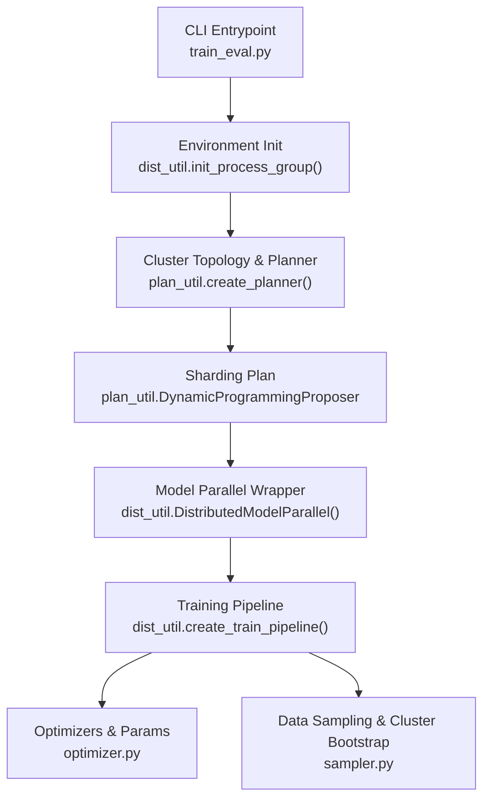
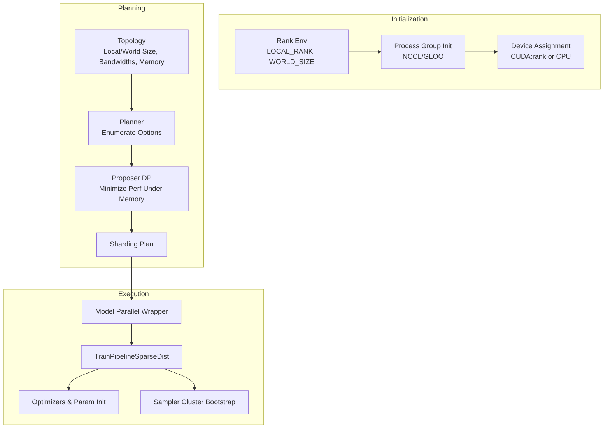
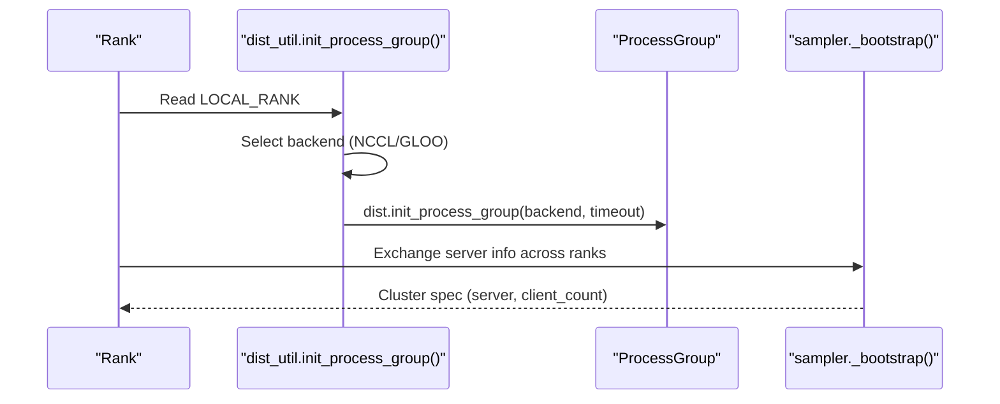
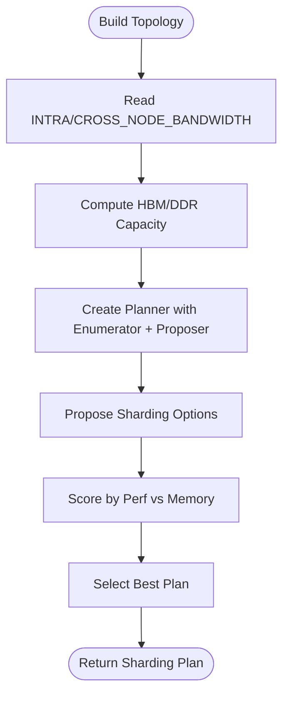
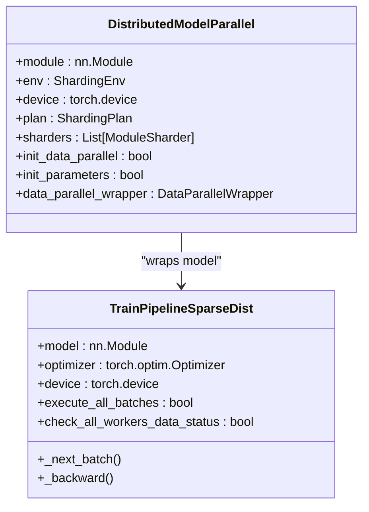
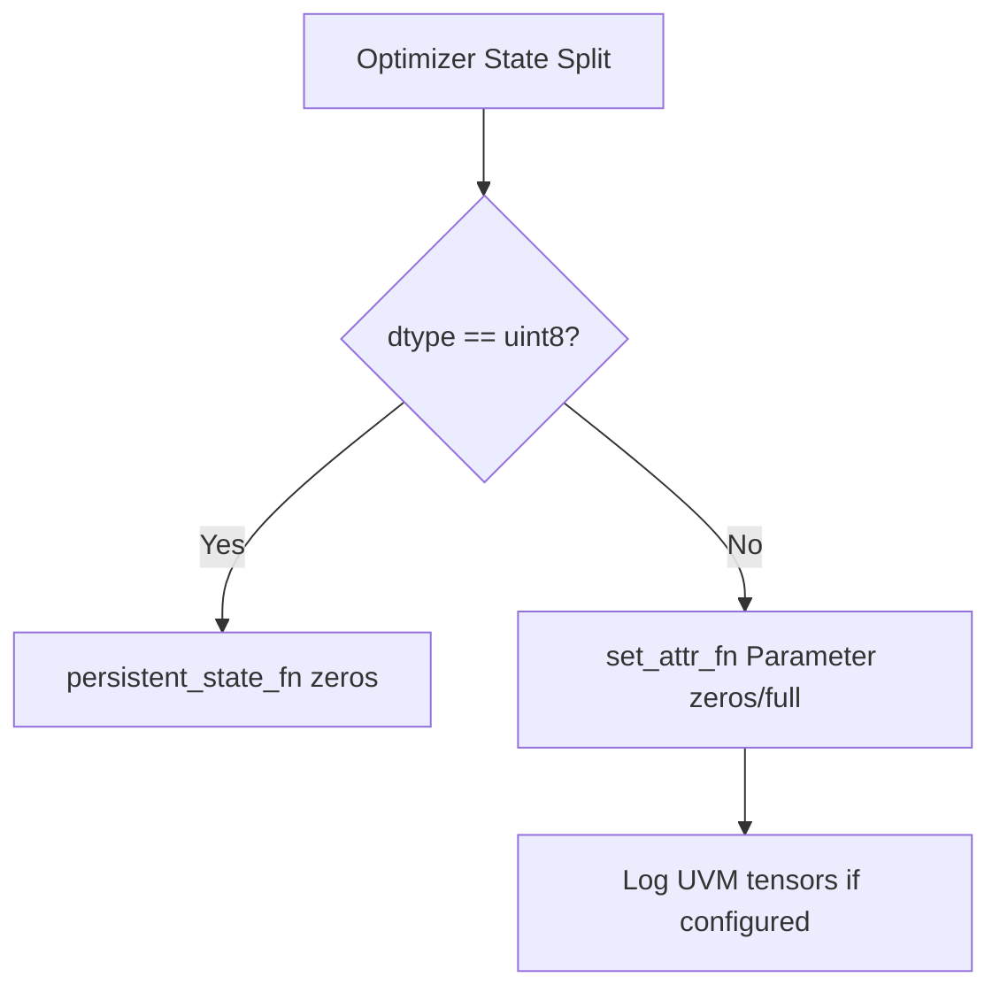
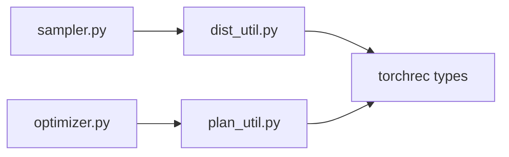

# Distributed Training Setup and Configuration

<cite>
**Referenced Files in This Document**
- [dist_util.py](file://tzrec/utils/dist_util.py)
- [plan_util.py](file://tzrec/utils/plan_util.py)
- [env_util.py](file://tzrec/utils/env_util.py)
- [train.md](file://docs/source/usage/train.md)
- [train_eval.py](file://tzrec/train_eval.py)
- [mmoe_taobao.config](file://examples/mmoe_taobao.config)
- [deepfm_criteo.config](file://examples/deepfm_criteo.config)
- [optimizer.py](file://tzrec/optim/optimizer.py)
- [model.py](file://tzrec/models/model.py)
- [sampler.py](file://tzrec/datasets/sampler.py)
</cite>

## Table of Contents

1. [Introduction](#introduction)
1. [Project Structure](#project-structure)
1. [Core Components](#core-components)
1. [Architecture Overview](#architecture-overview)
1. [Detailed Component Analysis](#detailed-component-analysis)
1. [Dependency Analysis](#dependency-analysis)
1. [Performance Considerations](#performance-considerations)
1. [Troubleshooting Guide](#troubleshooting-guide)
1. [Conclusion](#conclusion)
1. [Appendices](#appendices)

## Introduction

This document explains how TorchEasyRec performs distributed training, focusing on environment detection and initialization, GPU device management, NCCL/communication setup, model and data parallelism, training pipeline orchestration, and cluster topology-aware sharding. It also covers practical configuration examples for single-node multi-GPU and multi-node multi-GPU scenarios, fault tolerance and graceful degradation, and optimization tips for parameter initialization and gradient synchronization.

## Project Structure

The distributed training stack in TorchEasyRec centers around:

- Environment initialization and process group creation
- Cluster topology and sharding plan generation
- Model parallelism and pipeline orchestration
- Optimizer and parameter initialization
- Data sampling and cluster bootstrap

**Diagram sources**

- \[train_eval.py\](file://tzrec/train_eval.py#L16-L73)
- \[dist_util.py\](file://tzrec/utils/dist_util.py#L53-L71)
- \[plan_util.py\](file://tzrec/utils/plan_util.py#L88-L190)
- \[optimizer.py\](file://tzrec/optim/optimizer.py#L145-L180)
- \[sampler.py\](file://tzrec/datasets/sampler.py#L92-L116)

**Section sources**

- \[train_eval.py\](file://tzrec/train_eval.py#L16-L73)
- \[dist_util.py\](file://tzrec/utils/dist_util.py#L53-L71)
- \[plan_util.py\](file://tzrec/utils/plan_util.py#L88-L190)
- \[optimizer.py\](file://tzrec/optim/optimizer.py#L145-L180)
- \[sampler.py\](file://tzrec/datasets/sampler.py#L92-L116)

## Core Components

- Environment and process group initialization: selects backend (NCCL/GLOO), sets device, initializes process groups, and supports timeouts.
- Cluster topology and planner: builds Topology from environment, bandwidths, and memory capacities; uses a dynamic programming proposer to enumerate and score sharding options.
- Model parallel wrapper: custom DistributedModelParallel to defer input_dist initialization for specialized embedding modules.
- Training pipeline: TrainPipelineSparseDist orchestrates sparse embedding distribution and batch lifecycle; supports all-reduce checks and graceful degradation for uneven batches.
- Optimizer and parameter initialization: handles host-side parameter buffers and initialization for sparse optimizer states.
- Data sampling and cluster bootstrap: exchanges GL server info across ranks to form a cluster spec for graph loaders.

**Section sources**

- \[dist_util.py\](file://tzrec/utils/dist_util.py#L53-L71)
- \[plan_util.py\](file://tzrec/utils/plan_util.py#L88-L190)
- \[dist_util.py\](file://tzrec/utils/dist_util.py#L154-L183)
- \[dist_util.py\](file://tzrec/utils/dist_util.py#L304-L345)
- \[optimizer.py\](file://tzrec/optim/optimizer.py#L145-L180)
- \[sampler.py\](file://tzrec/datasets/sampler.py#L92-L116)

## Architecture Overview

TorchEasyRec’s distributed training architecture integrates:

- Backend selection and device assignment
- Topology-aware embedding sharding via a planner and proposer
- Model parallel wrapper and pipeline orchestration
- Optimizer state initialization aligned with sharding plans
- Cluster bootstrap for sampling servers

**Diagram sources**

- \[dist_util.py\](file://tzrec/utils/dist_util.py#L53-L71)
- \[plan_util.py\](file://tzrec/utils/plan_util.py#L88-L190)
- \[dist_util.py\](file://tzrec/utils/dist_util.py#L154-L183)
- \[dist_util.py\](file://tzrec/utils/dist_util.py#L304-L345)
- \[optimizer.py\](file://tzrec/optim/optimizer.py#L145-L180)
- \[sampler.py\](file://tzrec/datasets/sampler.py#L92-L116)

## Detailed Component Analysis

### Environment Detection and Initialization

- Device and backend selection:
  - Uses LOCAL_RANK to set CUDA device or falls back to CPU.
  - Initializes process groups with NCCL on CUDA-enabled hosts and GLOO otherwise.
  - Supports a configurable process group timeout via an environment variable.
- Cluster bootstrap for sampling:
  - Exchanges server address tensors across ranks to form a cluster spec for graph loaders.

**Diagram sources**

- \[dist_util.py\](file://tzrec/utils/dist_util.py#L53-L71)
- \[sampler.py\](file://tzrec/datasets/sampler.py#L92-L116)

**Section sources**

- \[dist_util.py\](file://tzrec/utils/dist_util.py#L53-L71)
- \[sampler.py\](file://tzrec/datasets/sampler.py#L92-L116)

### Cluster Topology Management and Sharding Plan

- Topology construction:
  - Builds Topology from local/world size, device memory, and system memory capacity.
  - Reads environment variables for intra-node and cross-node bandwidths.
- Planner and proposer:
  - Uses a dynamic programming proposer to enumerate sharding options and propose plans minimizing performance under memory constraints.
  - Supports storage reservation percentage adjustments to handle OOM scenarios.
- Constraint propagation:
  - Extracts parameter constraints from model modules and applies global constraints.

**Diagram sources**

- \[plan_util.py\](file://tzrec/utils/plan_util.py#L88-L190)
- \[plan_util.py\](file://tzrec/utils/plan_util.py#L221-L420)

**Section sources**

- \[plan_util.py\](file://tzrec/utils/plan_util.py#L88-L190)
- \[plan_util.py\](file://tzrec/utils/plan_util.py#L221-L420)

### Model Parallelism and Pipeline Orchestration

- Model parallel wrapper:
  - Custom DistributedModelParallel that defers input_dist initialization for specialized embedding modules to ensure correct initialization order.
- Training pipeline:
  - TrainPipelineSparseDist manages sparse embedding distribution and batch lifecycle.
  - Supports all-reduce checks to synchronize data availability across workers and gracefully handle remainder batches.
  - Backward pass supports gradient scaling and accumulation steps.

**Diagram sources**

- \[dist_util.py\](file://tzrec/utils/dist_util.py#L154-L183)
- \[dist_util.py\](file://tzrec/utils/dist_util.py#L209-L272)

**Section sources**

- \[dist_util.py\](file://tzrec/utils/dist_util.py#L154-L183)
- \[dist_util.py\](file://tzrec/utils/dist_util.py#L209-L272)

### Optimizer and Parameter Initialization

- Host-side parameter buffers:
  - Creates zero-initialized host-side parameters for optimizer states, with optional initialization values.
  - Logs UVM tensor names for debugging and monitoring.
- Mixed precision and gradient scaling:
  - Integrates with pipeline backward to support FP16/BF16 and GradScaler configurations.

**Diagram sources**

- \[optimizer.py\](file://tzrec/optim/optimizer.py#L145-L180)

**Section sources**

- \[optimizer.py\](file://tzrec/optim/optimizer.py#L145-L180)

### Practical Distributed Training Configurations

#### Single-node multi-GPU

- Use torchrun with nproc-per-node equal to the number of GPUs.
- Example command and environment variables are documented in the training guide.

**Section sources**

- \[train.md\](file://docs/source/usage/train.md#L5-L13)

#### Multi-node multi-GPU

- Configure torchrun with nnodes, nproc-per-node, node_rank, and master_addr/port.
- Ensure environment variables for inter/intra-node bandwidths reflect the cluster capabilities.

**Section sources**

- \[train.md\](file://docs/source/usage/train.md#L5-L13)
- \[train.md\](file://docs/source/usage/train.md#L113-L125)

#### Configuration Examples

- Example configs demonstrate sparse/dense optimizer settings, batch size, and feature groups.

**Section sources**

- \[mmoe_taobao.config\](file://examples/mmoe_taobao.config#L4-L20)
- \[deepfm_criteo.config\](file://examples/deepfm_criteo.config#L4-L20)

## Dependency Analysis

Key dependencies and interactions:

- dist_util depends on torch.distributed and torchrec types for process groups, model parallel wrappers, and pipelines.
- plan_util depends on torchrec planner enumerators/proposers and topology builders to generate sharding plans.
- optimizer.py interacts with shard splits to initialize optimizer states consistently with sharding plans.
- sampler.py depends on dist backend to ensure communication correctness when exchanging server info.

**Diagram sources**

- \[dist_util.py\](file://tzrec/utils/dist_util.py#L18-L49)
- \[plan_util.py\](file://tzrec/utils/plan_util.py#L23-L76)
- \[optimizer.py\](file://tzrec/optim/optimizer.py#L145-L180)
- \[sampler.py\](file://tzrec/datasets/sampler.py#L92-L116)

**Section sources**

- \[dist_util.py\](file://tzrec/utils/dist_util.py#L18-L49)
- \[plan_util.py\](file://tzrec/utils/plan_util.py#L23-L76)
- \[optimizer.py\](file://tzrec/optim/optimizer.py#L145-L180)
- \[sampler.py\](file://tzrec/datasets/sampler.py#L92-L116)

## Performance Considerations

- Communication bandwidth tuning:
  - Adjust INTRA_NODE_BANDWIDTH and CROSS_NODE_BANDWIDTH to match cluster capabilities; lower values reduce oversubscription risk.
- Storage reservation:
  - Increase STORAGE_RESERVE_PERCENT to mitigate OOM during sharding plan search.
- Mixed precision and TF32:
  - Enable mixed precision and TF32 selectively; TF32 toggles are controlled via environment-backed flags.
- Gradient accumulation:
  - Use gradient_accumulation_steps to scale effective batch size when memory is constrained.

**Section sources**

- \[train.md\](file://docs/source/usage/train.md#L113-L131)
- \[env_util.py\](file://tzrec/utils/env_util.py#L35-L52)
- \[train.md\](file://docs/source/usage/train.md#L95-L107)

## Troubleshooting Guide

Common issues and remedies:

- Communication timeouts:
  - Set PROCESS_GROUP_TIMEOUT_SECONDS to extend process group initialization timeouts.
- NCCL errors and device compatibility:
  - Ensure CUDA runtime compatibility; LD_LIBRARY_PATH adjustments may be needed on certain GPU families.
- DataLoader OOM:
  - Reduce batch_size or num_workers to prevent worker process termination.
- Session expiration for MC:
  - Upgrade to a newer version to address session expiration issues.

**Section sources**

- \[dist_util.py\](file://tzrec/utils/dist_util.py#L64-L68)
- \[train.md\](file://docs/source/usage/train.md#L188-L195)
- \[docs/source/faq.md\](file://docs/source/faq.md#L132-L142)
- \[docs/source/faq.md\](file://docs/source/faq.md#L104-L114)

## Conclusion

TorchEasyRec’s distributed training stack integrates environment initialization, topology-aware sharding, model parallelism, and robust pipeline orchestration. By tuning bandwidths, storage reservations, and mixed precision settings, users can achieve efficient scaling across single-node and multi-node environments. The provided components and examples offer a practical foundation for configuring and operating distributed training reliably.

## Appendices

### Environment Variables Reference

- PROCESS_GROUP_TIMEOUT_SECONDS: Sets process group initialization timeout.
- INTRA_NODE_BANDWIDTH: Intra-node bandwidth in bytes/sec for planning.
- CROSS_NODE_BANDWIDTH: Inter-node bandwidth in bytes/sec for planning.
- STORAGE_RESERVE_PERCENT: Percentage of device memory reserved for planning.
- FORCE_LOAD_SHARDING_PLAN: Forces loading sharding plan from checkpoints.
- ENABLE_TMA: Enables TMA for Triton ops when supported.
- USE_HASH_NODE_ID: Controls hashing node ID usage.
- USE_RTP: Enables RTP for online inference (requires additional flags).
- LD_LIBRARY_PATH: Adjust for CUDA runtime compatibility on specific GPU families.

**Section sources**

- \[dist_util.py\](file://tzrec/utils/dist_util.py#L64-L68)
- \[plan_util.py\](file://tzrec/utils/plan_util.py#L120-L125)
- \[env_util.py\](file://tzrec/utils/env_util.py#L19-L57)
- \[train.md\](file://docs/source/usage/train.md#L188-L195)
