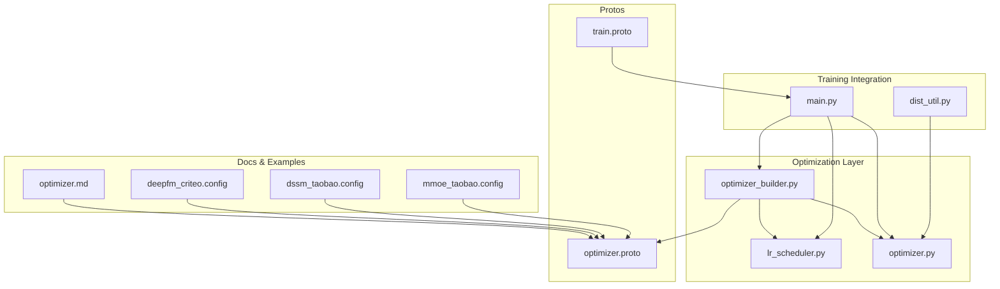
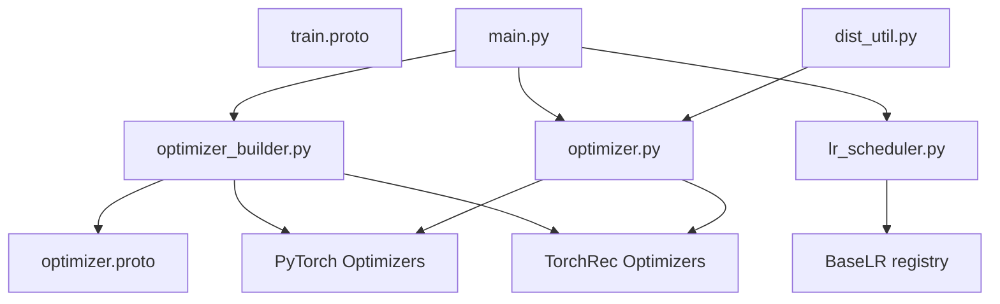

# Optimization Algorithms and Learning Rate Scheduling

<cite>
**Referenced Files in This Document**
- [optimizer.py](file://tzrec/optim/optimizer.py)
- [lr_scheduler.py](file://tzrec/optim/lr_scheduler.py)
- [optimizer_builder.py](file://tzrec/optim/optimizer_builder.py)
- [optimizer.proto](file://tzrec/protos/optimizer.proto)
- [train.proto](file://tzrec/protos/train.proto)
- [optimizer.md](file://docs/source/models/optimizer.md)
- [main.py](file://tzrec/main.py)
- [dist_util.py](file://tzrec/utils/dist_util.py)
- [deepfm_criteo.config](file://examples/deepfm_criteo.config)
- [dssm_taobao.config](file://examples/dssm_taobao.config)
- [mmoe_taobao.config](file://examples/mmoe_taobao.config)
</cite>

## Table of Contents

1. [Introduction](#introduction)
1. [Project Structure](#project-structure)
1. [Core Components](#core-components)
1. [Architecture Overview](#architecture-overview)
1. [Detailed Component Analysis](#detailed-component-analysis)
1. [Dependency Analysis](#dependency-analysis)
1. [Performance Considerations](#performance-considerations)
1. [Troubleshooting Guide](#troubleshooting-guide)
1. [Conclusion](#conclusion)
1. [Appendices](#appendices)

## Introduction

This document explains optimization algorithms and learning rate scheduling in TorchEasyRec. It covers supported optimizers (both dense and sparse/embedding), configuration parameters, learning rate scheduling strategies (warmup, decay, manual steps), optimizer state management, gradient clipping, momentum techniques, and advanced training features such as mixed precision, gradient accumulation, and memory-efficient training. Practical configuration examples are included for different model types and training scenarios, along with guidance for hyperparameter tuning, convergence monitoring, and building custom optimizers.

## Project Structure

The optimization stack is organized around three core modules:

- Optimizer builder: constructs dense and sparse optimizers and schedulers from configuration.
- Learning rate schedulers: base classes and concrete LR schedules (constant, exponential decay, manual step).
- Wrapper and integration: optimizer wrapper for gradient accumulation and mixed precision, plus training pipeline integration.



**Diagram sources**

- \[optimizer_builder.py\](file://tzrec/optim/optimizer_builder.py#L1-L234)
- \[lr_scheduler.py\](file://tzrec/optim/lr_scheduler.py#L1-L160)
- \[optimizer.py\](file://tzrec/optim/optimizer.py#L1-L238)
- \[optimizer.proto\](file://tzrec/protos/optimizer.proto#L1-L191)
- \[train.proto\](file://tzrec/protos/train.proto#L1-L62)
- \[optimizer.md\](file://docs/source/models/optimizer.md#L1-L60)
- \[main.py\](file://tzrec/main.py#L694-L705)
- \[dist_util.py\](file://tzrec/utils/dist_util.py#L186-L210)
- \[deepfm_criteo.config\](file://examples/deepfm_criteo.config#L1-L200)
- \[dssm_taobao.config\](file://examples/dssm_taobao.config#L1-L200)
- \[mmoe_taobao.config\](file://examples/mmoe_taobao.config#L1-L200)

**Section sources**

- \[optimizer_builder.py\](file://tzrec/optim/optimizer_builder.py#L1-L234)
- \[lr_scheduler.py\](file://tzrec/optim/lr_scheduler.py#L1-L160)
- \[optimizer.py\](file://tzrec/optim/optimizer.py#L1-L238)
- \[optimizer.proto\](file://tzrec/protos/optimizer.proto#L1-L191)
- \[train.proto\](file://tzrec/protos/train.proto#L1-L62)
- \[optimizer.md\](file://docs/source/models/optimizer.md#L1-L60)
- \[main.py\](file://tzrec/main.py#L694-L705)
- \[dist_util.py\](file://tzrec/utils/dist_util.py#L186-L210)
- \[deepfm_criteo.config\](file://examples/deepfm_criteo.config#L1-L200)
- \[dssm_taobao.config\](file://examples/dssm_taobao.config#L1-L200)
- \[mmoe_taobao.config\](file://examples/mmoe_taobao.config#L1-L200)

## Core Components

- Dense optimizers: SGD, Adagrad, Adam, AdamW.
- Sparse/embedding optimizers: fused SGD, Adagrad, Adam, LARS SGD, LAMB, Partial Row-wise LAMB/Adam, Row-wise Adagrad.
- Learning rate schedulers: Constant, ExponentialDecay (with warmup, staircase, min learning rate), ManualStep (with warmup).
- Optimizer wrapper: supports gradient accumulation and mixed precision via GradScaler.
- Training integration: creates schedulers per optimizer and integrates with the training loop and distributed pipeline.

**Section sources**

- \[optimizer_builder.py\](file://tzrec/optim/optimizer_builder.py#L30-L110)
- \[lr_scheduler.py\](file://tzrec/optim/lr_scheduler.py#L26-L160)
- \[optimizer.py\](file://tzrec/optim/optimizer.py#L26-L75)
- \[optimizer.proto\](file://tzrec/protos/optimizer.proto#L4-L121)
- \[optimizer.proto\](file://tzrec/protos/optimizer.proto#L123-L158)
- \[optimizer.proto\](file://tzrec/protos/optimizer.proto#L160-L190)

## Architecture Overview

The optimizer and scheduler architecture is driven by protocol buffers that define optimizer and learning rate configurations. The builder translates these configurations into PyTorch and TorchRec optimizer instances and scheduler classes. The training pipeline wires these components together and supports mixed precision and gradient accumulation.

```mermaid
sequenceDiagram
participant CFG as "Pipeline Config"
participant MAIN as "main.py"
participant OB as "optimizer_builder.py"
participant OPT as "TZRecOptimizer"
participant LR as "BaseLR subclasses"
participant PIPE as "Training Pipeline"
CFG->>MAIN : "Load train_config.sparse_optimizer/dense_optimizer"
MAIN->>OB : "create_sparse_optimizer / create_dense_optimizer"
OB-->>MAIN : "Optimizer class + kwargs"
MAIN->>OB : "create_scheduler(optimizer, config)"
OB-->>MAIN : "BaseLR subclass instance"
MAIN->>OPT : "Wrap optimizer with GradScaler and accumulation steps"
MAIN->>PIPE : "Attach schedulers and run training loop"
PIPE->>OPT : "zero_grad / step"
OPT->>LR : "get_lr() called by scheduler"
```

**Diagram sources**

- \[main.py\](file://tzrec/main.py#L694-L705)
- \[optimizer_builder.py\](file://tzrec/optim/optimizer_builder.py#L30-L149)
- \[optimizer.py\](file://tzrec/optim/optimizer.py#L26-L75)
- \[lr_scheduler.py\](file://tzrec/optim/lr_scheduler.py#L26-L160)

## Detailed Component Analysis

### Dense Optimizers

Supported dense optimizers and notable parameters:

- SGD: learning rate, momentum, dampening, Nesterov, fused.
- Adagrad: learning rate, weight decay, initial accumulator value, epsilon, fused.
- Adam: learning rate, betas (beta1, beta2), weight decay, epsilon, AMSGrad, fused.
- AdamW: same as Adam with decoupled weight decay.

Configuration mapping:

- Beta parameters are normalized to a betas tuple for Adam/AdamW.
- Fused variants toggle fused kernels when available.

Practical examples:

- Example configurations demonstrate dense optimizer usage in typical models.

**Section sources**

- \[optimizer_builder.py\](file://tzrec/optim/optimizer_builder.py#L77-L110)
- \[optimizer.proto\](file://tzrec/protos/optimizer.proto#L123-L158)
- \[optimizer.md\](file://docs/source/models/optimizer.md#L1-L60)
- \[deepfm_criteo.config\](file://examples/deepfm_criteo.config#L12-L18)
- \[dssm_taobao.config\](file://examples/dssm_taobao.config#L12-L18)
- \[mmoe_taobao.config\](file://examples/mmoe_taobao.config#L12-L18)

### Sparse/Embedding Optimizers

Supported sparse optimizers:

- Fused SGD, Adagrad, Adam, LARS SGD, LAMB, Partial Row-wise LAMB/Adam, Row Wise Adagrad.

Notable features:

- Weight decay modes: NONE, L2, DECOUPLE.
- Gradient clipping and max gradient thresholds.
- Special handling for Adagrad initial accumulator value via environment variable and a patched state initializer for FBGEMM embeddings.

Practical examples:

- Example configurations show sparse optimizer usage.

**Section sources**

- \[optimizer_builder.py\](file://tzrec/optim/optimizer_builder.py#L30-L75)
- \[optimizer.proto\](file://tzrec/protos/optimizer.proto#L4-L121)
- \[optimizer.py\](file://tzrec/optim/optimizer.py#L71-L238)
- \[optimizer.md\](file://docs/source/models/optimizer.md#L1-L60)
- \[deepfm_criteo.config\](file://examples/deepfm_criteo.config#L5-L11)
- \[dssm_taobao.config\](file://examples/dssm_taobao.config#L5-L11)
- \[mmoe_taobao.config\](file://examples/mmoe_taobao.config#L5-L11)

### Learning Rate Scheduling Strategies

BaseLR provides a registry-backed base class for schedulers. Available strategies:

- ConstantLR: flat schedule by epoch.
- ExponentialDecayLR: decay by steps or epochs with:
  - decay_size and decay_factor
  - staircase flag for discrete decay
  - warmup_learning_rate and warmup_size
  - min_learning_rate cap
  - by_epoch scheduling
- ManualStepLR: step schedule with:
  - schedule_sizes and learning_rates lists
  - optional warmup for the first interval
  - by_epoch scheduling

Freeze behavior:

- If base learning rate is zero, LR remains zero regardless of scheduler.

**Section sources**

- \[lr_scheduler.py\](file://tzrec/optim/lr_scheduler.py#L26-L160)
- \[optimizer.proto\](file://tzrec/protos/optimizer.proto#L160-L190)

### Optimizer State Management and Gradient Clipping

- State initialization for Adagrad momentum1 can be seeded via environment variable and patched FBGEMM split helper.
- Gradient clipping is supported in both dense and sparse optimizer configurations via max_gradient and gradient_clipping flags.
- Momentum and related parameters are exposed per optimizer type (e.g., SGD momentum, Adam betas).

**Section sources**

- \[optimizer.py\](file://tzrec/optim/optimizer.py#L71-L238)
- \[optimizer.proto\](file://tzrec/protos/optimizer.proto#L58-L121)
- \[optimizer.proto\](file://tzrec/protos/optimizer.proto#L123-L158)

### Mixed Precision Training and Gradient Accumulation

Mixed precision:

- TrainConfig supports mixed_precision with FP16/BF16 selection.
- Model wrapper sets mixed-precision dtype accordingly.

Gradient scaling and accumulation:

- GradScaler configuration supports initial scale, growth/backoff factors, and growth interval.
- Gradient accumulation steps are supported; the optimizer wrapper steps only at multiples of accumulation steps.
- The training pipeline divides loss by accumulation steps when accumulating gradients.

**Section sources**

- \[train.proto\](file://tzrec/protos/train.proto#L7-L19)
- \[train.proto\](file://tzrec/protos/train.proto#L54-L59)
- \[optimizer.py\](file://tzrec/optim/optimizer.py#L26-L75)
- \[dist_util.py\](file://tzrec/utils/dist_util.py#L186-L210)
- \[main.py\](file://tzrec/main.py#L694-L705)

### Memory-Efficient Training Techniques

- Weight decay mode selection for sparse optimizers (NONE/L2/DECOUPLE).
- Row-wise and partial-row-wise optimizers reduce memory pressure for large embeddings.
- Optional fused kernels for dense optimizers improve throughput.

**Section sources**

- \[optimizer.proto\](file://tzrec/protos/optimizer.proto#L52-L56)
- \[optimizer.proto\](file://tzrec/protos/optimizer.proto#L6-L14)
- \[optimizer.proto\](file://tzrec/protos/optimizer.proto#L123-L158)

### Practical Configuration Examples

Common scenarios:

- Dense-only training with constant learning rate.
- Mixed sparse/dense training with separate optimizers and schedulers.
- Multi-task models with per-part optimizers and schedulers.

Examples:

- DeepFM Criteo: sparse Adagrad + dense Adam with constant LR.
- DSSM Taobao: sparse Adagrad + dense Adam with constant LR.
- MMOE Taobao: sparse Adagrad + dense Adam with constant LR.

Part optimizers:

- Regex-based parameter partitioning allows distinct optimizers and schedulers per module subset.

**Section sources**

- \[deepfm_criteo.config\](file://examples/deepfm_criteo.config#L1-L200)
- \[dssm_taobao.config\](file://examples/dssm_taobao.config#L1-L200)
- \[mmoe_taobao.config\](file://examples/mmoe_taobao.config#L1-L200)
- \[optimizer.md\](file://docs/source/models/optimizer.md#L24-L42)

### Hyperparameter Tuning, Convergence Monitoring, and Stability

Guidance:

- Start with recommended defaults from example configs; adjust learning rates and schedulers based on convergence curves.
- Use warmup to stabilize early training; staircase decay reduces oscillation.
- Monitor learning rate logs and loss via TensorBoard summaries configured in TrainConfig.
- Enable gradient clipping to mitigate exploding gradients.
- For mixed precision, tune GradScaler parameters to maintain numerical stability.

**Section sources**

- \[train.proto\](file://tzrec/protos/train.proto#L44-L47)
- \[optimizer.proto\](file://tzrec/protos/optimizer.proto#L160-L190)
- \[optimizer.proto\](file://tzrec/protos/optimizer.proto#L58-L121)
- \[optimizer.proto\](file://tzrec/protos/optimizer.proto#L123-L158)

### Custom Optimizer Development and Integration

Steps:

- Define optimizer parameters in the optimizer protobuf messages.
- Extend the builder to map new optimizer types to PyTorch/TorchRec classes and normalize parameters (e.g., betas).
- If needed, add a new scheduler class inheriting from BaseLR and register it via the registry mechanism.
- Integrate with training by wiring the new optimizer and scheduler in the main training entry point.

**Section sources**

- \[optimizer_builder.py\](file://tzrec/optim/optimizer_builder.py#L30-L149)
- \[lr_scheduler.py\](file://tzrec/optim/lr_scheduler.py#L26-L51)
- \[optimizer.proto\](file://tzrec/protos/optimizer.proto#L1-L191)

## Dependency Analysis

The optimizer subsystem depends on:

- Protocol buffer definitions for optimizer and training configuration.
- PyTorch and TorchRec optimizers and schedulers.
- Registry-based class creation for schedulers.
- Distributed training utilities for gradient scaling and accumulation.



**Diagram sources**

- \[optimizer_builder.py\](file://tzrec/optim/optimizer_builder.py#L1-L234)
- \[lr_scheduler.py\](file://tzrec/optim/lr_scheduler.py#L1-L160)
- \[optimizer.py\](file://tzrec/optim/optimizer.py#L1-L238)
- \[optimizer.proto\](file://tzrec/protos/optimizer.proto#L1-L191)
- \[train.proto\](file://tzrec/protos/train.proto#L1-L62)
- \[main.py\](file://tzrec/main.py#L694-L705)
- \[dist_util.py\](file://tzrec/utils/dist_util.py#L186-L210)

**Section sources**

- \[optimizer_builder.py\](file://tzrec/optim/optimizer_builder.py#L1-L234)
- \[lr_scheduler.py\](file://tzrec/optim/lr_scheduler.py#L1-L160)
- \[optimizer.py\](file://tzrec/optim/optimizer.py#L1-L238)
- \[optimizer.proto\](file://tzrec/protos/optimizer.proto#L1-L191)
- \[train.proto\](file://tzrec/protos/train.proto#L1-L62)
- \[main.py\](file://tzrec/main.py#L694-L705)
- \[dist_util.py\](file://tzrec/utils/dist_util.py#L186-L210)

## Performance Considerations

- Prefer fused optimizers when available for dense parameters to improve throughput.
- Use partial-row-wise or row-wise optimizers for large embedding tables to reduce memory footprint.
- Enable mixed precision (FP16/BF16) to reduce memory usage and increase throughput; tune GradScaler parameters carefully.
- Use gradient accumulation to simulate larger effective batch sizes without increasing memory.
- Choose appropriate schedulers (warmup + staircase decay) to balance convergence speed and stability.

[No sources needed since this section provides general guidance]

## Troubleshooting Guide

Common issues and resolutions:

- Unexpected learning rate: verify by_epoch setting and warmup parameters; check base learning rate freezing behavior.
- NaN or overflow in mixed precision: reduce growth_factor or increase init_scale in GradScaler; enable gradient clipping.
- Slow convergence: adjust learning rate schedules (warmup duration, decay factor, staircase), or try different optimizers.
- Memory pressure with embeddings: switch to row-wise or partial-row-wise optimizers; reduce embedding dimensionality or batch size.

**Section sources**

- \[lr_scheduler.py\](file://tzrec/optim/lr_scheduler.py#L34-L45)
- \[train.proto\](file://tzrec/protos/train.proto#L7-L19)
- \[optimizer.proto\](file://tzrec/protos/optimizer.proto#L160-L190)
- \[optimizer.proto\](file://tzrec/protos/optimizer.proto#L6-L14)

## Conclusion

TorchEasyRec provides a flexible and extensible optimization framework supporting both dense and sparse optimizers, rich learning rate scheduling strategies, and advanced training features like mixed precision and gradient accumulation. By leveraging configuration-driven construction and scheduler registries, users can tailor optimization to diverse model architectures and datasets while maintaining strong performance and stability.

[No sources needed since this section summarizes without analyzing specific files]

## Appendices

### Appendix A: Supported Optimizer Parameters Summary

- Dense optimizers:
  - SGD: lr, momentum, dampening, nesterov, fused
  - Adagrad: lr, weight_decay, initial_accumulator_value, eps, fused
  - Adam/AdamW: lr, beta1, beta2, weight_decay, eps, amsgrad, fused
- Sparse optimizers:
  - Fused SGD/Adagrad/Adam: lr, gradient_clipping, max_gradient
  - LARS SGD: lr, momentum, weight_decay, gradient_clipping, max_gradient
  - LAMB/Partial Row-wise LAMB/Adam: lr, beta1, beta2, weight_decay, gradient_clipping, max_gradient
  - Row-wise Adagrad: lr, weight_decay, weight_decay_mode, gradient_clipping, max_gradient

**Section sources**

- \[optimizer.proto\](file://tzrec/protos/optimizer.proto#L58-L158)

### Appendix B: Learning Rate Schedule Parameters Summary

- ConstantLR: none
- ExponentialDecayLR: decay_size, decay_factor, staircase, warmup_learning_rate, warmup_size, min_learning_rate, by_epoch
- ManualStepLR: schedule_sizes, learning_rates, warmup, by_epoch

**Section sources**

- \[optimizer.proto\](file://tzrec/protos/optimizer.proto#L160-L190)
- \[lr_scheduler.py\](file://tzrec/optim/lr_scheduler.py#L64-L160)
