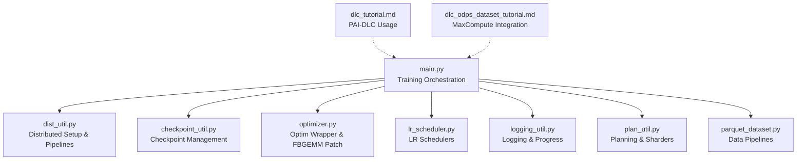
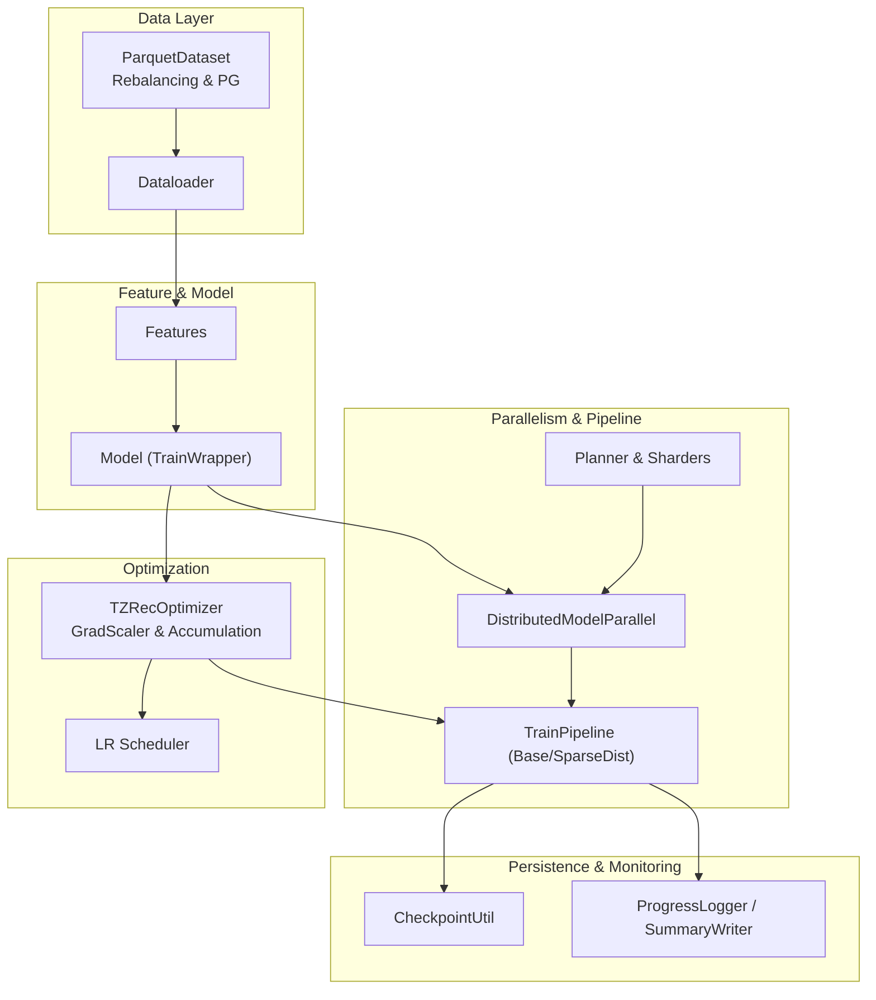
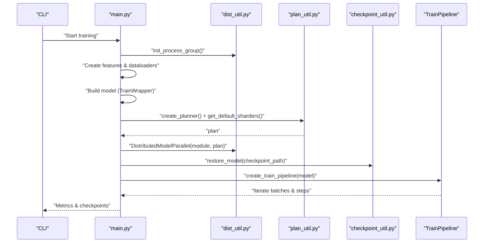
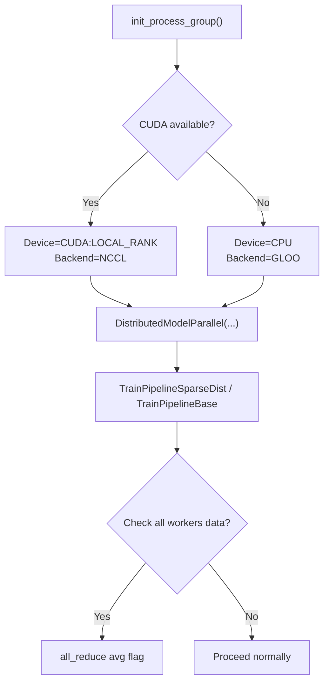
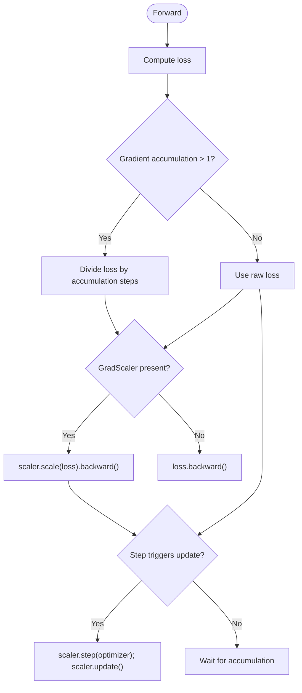
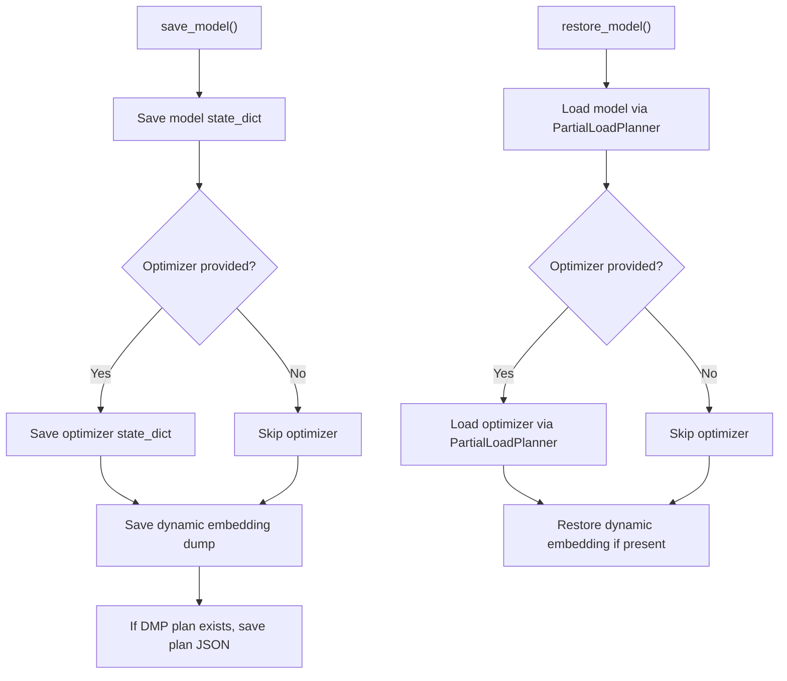
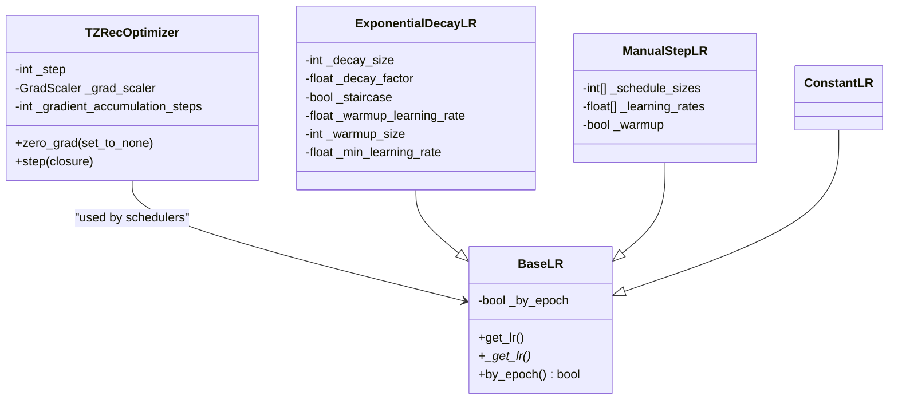
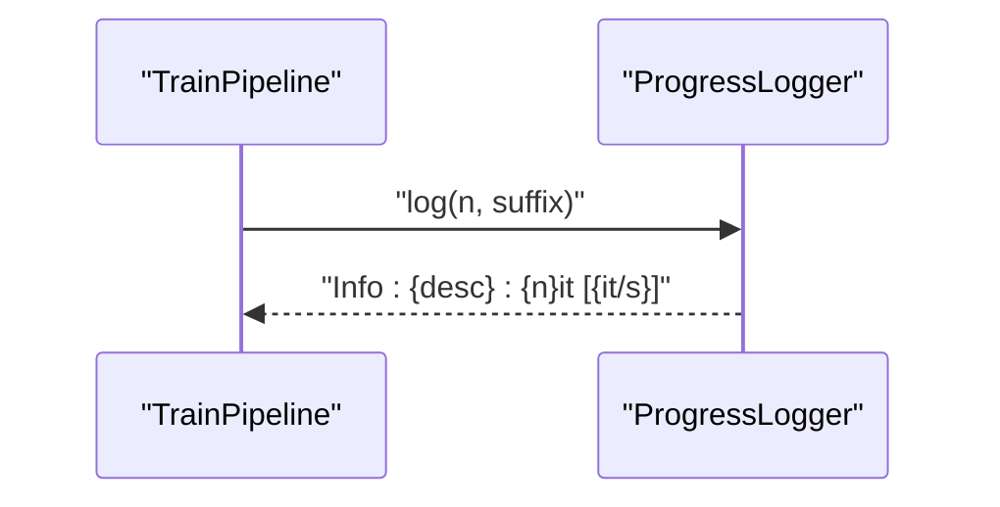
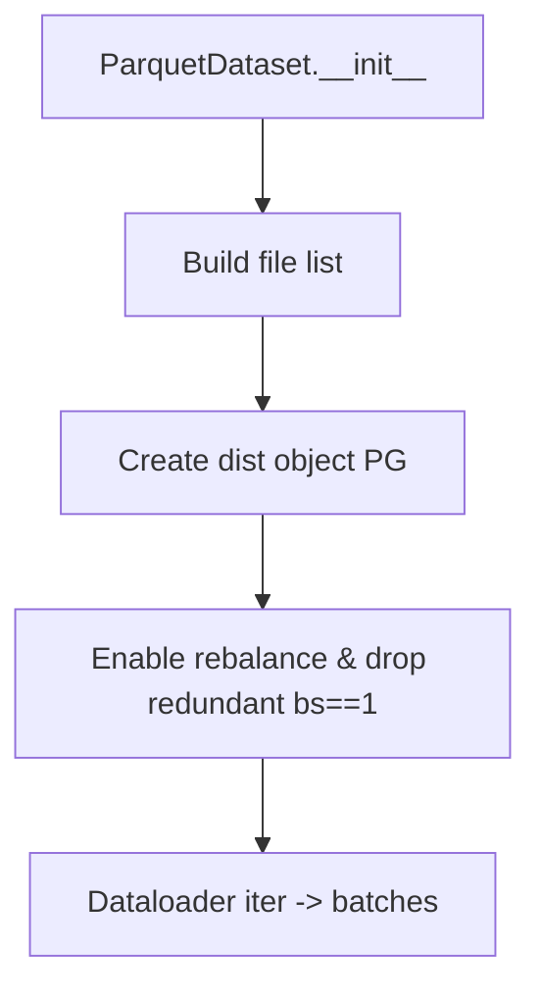
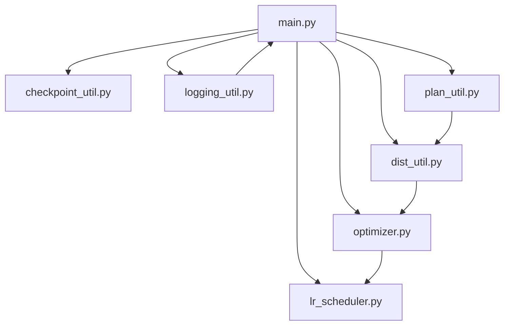

# Training Infrastructure and Distributed Computing

<cite>
**Referenced Files in This Document**
- [README.md](file://README.md)
- [main.py](file://tzrec/main.py)
- [dist_util.py](file://tzrec/utils/dist_util.py)
- [checkpoint_util.py](file://tzrec/utils/checkpoint_util.py)
- [optimizer.py](file://tzrec/optim/optimizer.py)
- [lr_scheduler.py](file://tzrec/optim/lr_scheduler.py)
- [logging_util.py](file://tzrec/utils/logging_util.py)
- [plan_util.py](file://tzrec/utils/plan_util.py)
- [dlc_tutorial.md](file://docs/source/quick_start/dlc_tutorial.md)
- [dlc_odps_dataset_tutorial.md](file://docs/source/quick_start/dlc_odps_dataset_tutorial.md)
- [parquet_dataset.py](file://tzrec/datasets/parquet_dataset.py)
- [utils.py](file://tzrec/tests/utils.py)
</cite>

## Table of Contents

1. [Introduction](#introduction)
1. [Project Structure](#project-structure)
1. [Core Components](#core-components)
1. [Architecture Overview](#architecture-overview)
1. [Detailed Component Analysis](#detailed-component-analysis)
1. [Dependency Analysis](#dependency-analysis)
1. [Performance Considerations](#performance-considerations)
1. [Troubleshooting Guide](#troubleshooting-guide)
1. [Conclusion](#conclusion)
1. [Appendices](#appendices)

## Introduction

This document explains TorchEasyRec’s training infrastructure and distributed computing capabilities. It covers the training pipeline orchestration, hybrid parallelism (data and model), mixed precision training, gradient accumulation, checkpoint management, logging and monitoring, optimizer and learning rate scheduling, and practical guidance for configuring distributed training, managing checkpoints, and monitoring progress. It also provides guidance on scaling across GPUs/nodes, optimizing data pipelines, and troubleshooting distributed training issues, along with integration notes for cloud platforms (PAI-DLC, PAI-DSW) and on-premises environments.

## Project Structure

TorchEasyRec organizes training-related logic across several modules:

- Entry point and orchestration: main training loop, model creation, optimizer setup, and distributed pipeline creation
- Distributed utilities: process group initialization, model parallel wrapper, and training pipelines
- Checkpoint utilities: saving/loading model and optimizer states, partial restoration, and plan metadata
- Optimizer and LR scheduling: optimizer wrapper for gradient accumulation and mixed precision, and LR schedulers
- Logging and monitoring: progress logging and summary writers
- Planning and sharding: embedding sharding planner and sharders for hybrid parallelism
- Data pipelines: dataset abstractions and distributed rebalancing
- Cloud integration: tutorials for PAI-DLC and MaxCompute integration

**Diagram sources**

- \[main.py\](file://tzrec/main.py#L571-L817)
- \[dist_util.py\](file://tzrec/utils/dist_util.py#L53-L71)
- \[checkpoint_util.py\](file://tzrec/utils/checkpoint_util.py#L323-L364)
- \[optimizer.py\](file://tzrec/optim/optimizer.py#L26-L69)
- \[lr_scheduler.py\](file://tzrec/optim/lr_scheduler.py#L26-L160)
- \[logging_util.py\](file://tzrec/utils/logging_util.py#L20-L46)
- \[plan_util.py\](file://tzrec/utils/plan_util.py#L88-L190)
- \[parquet_dataset.py\](file://tzrec/datasets/parquet_dataset.py#L147-L180)
- \[dlc_tutorial.md\](file://docs/source/quick_start/dlc_tutorial.md#L1-L133)
- \[dlc_odps_dataset_tutorial.md\](file://docs/source/quick_start/dlc_odps_dataset_tutorial.md#L1-L72)

**Section sources**

- \[README.md\](file://README.md#L1-L83)
- \[main.py\](file://tzrec/main.py#L571-L817)
- \[dist_util.py\](file://tzrec/utils/dist_util.py#L53-L71)
- \[checkpoint_util.py\](file://tzrec/utils/checkpoint_util.py#L323-L364)
- \[optimizer.py\](file://tzrec/optim/optimizer.py#L26-L69)
- \[lr_scheduler.py\](file://tzrec/optim/lr_scheduler.py#L26-L160)
- \[logging_util.py\](file://tzrec/utils/logging_util.py#L20-L46)
- \[plan_util.py\](file://tzrec/utils/plan_util.py#L88-L190)
- \[parquet_dataset.py\](file://tzrec/datasets/parquet_dataset.py#L147-L180)
- \[dlc_tutorial.md\](file://docs/source/quick_start/dlc_tutorial.md#L1-L133)
- \[dlc_odps_dataset_tutorial.md\](file://docs/source/quick_start/dlc_odps_dataset_tutorial.md#L1-L72)

## Core Components

- Training orchestration and pipeline
  - Initializes distributed process groups, builds features and dataloaders, wraps model for mixed precision, creates distributed model parallel, sets up optimizer and schedulers, and runs training loops with pipelines.
- Distributed utilities
  - Provides process group initialization, a custom DistributedModelParallel wrapper, and TrainPipeline variants supporting gradient scaler and all-workers data status checks.
- Checkpoint management
  - Supports saving/loading model and optimizer states, partial restoration via a custom planner, best/latest checkpoint selection, and dynamic embedding restoration.
- Optimizer and LR scheduling
  - A TZRecOptimizer wrapper integrates gradient accumulation and mixed precision scaling; LR schedulers include constant, exponential decay, and manual step schedules.
- Logging and monitoring
  - ProgressLogger reports iteration throughput; TensorBoard summaries are supported via SummaryWriter.
- Planning and hybrid parallelism
  - EmbeddingShardingPlanner and sharders enable data and model parallel strategies; supports constraints and checkpoint-driven plan loading.
- Data pipelines
  - ParquetDataset supports distributed rebalancing and ordered column handling; integrates with distributed process groups.

**Section sources**

- \[main.py\](file://tzrec/main.py#L571-L817)
- \[dist_util.py\](file://tzrec/utils/dist_util.py#L53-L71)
- \[checkpoint_util.py\](file://tzrec/utils/checkpoint_util.py#L323-L364)
- \[optimizer.py\](file://tzrec/optim/optimizer.py#L26-L69)
- \[lr_scheduler.py\](file://tzrec/optim/lr_scheduler.py#L26-L160)
- \[logging_util.py\](file://tzrec/utils/logging_util.py#L20-L46)
- \[plan_util.py\](file://tzrec/utils/plan_util.py#L88-L190)
- \[parquet_dataset.py\](file://tzrec/datasets/parquet_dataset.py#L147-L180)

## Architecture Overview

The training architecture combines:

- Data ingestion via PyArrow-backed datasets and distributed rebalancing
- Feature engineering and model construction
- Mixed precision and gradient accumulation via a wrapped optimizer
- Hybrid parallelism (data and model) via DistributedModelParallel and planning
- Pipeline-based training loop with optional all-workers data synchronization
- Checkpointing and exporting for model persistence and serving

**Diagram sources**

- \[parquet_dataset.py\](file://tzrec/datasets/parquet_dataset.py#L147-L180)
- \[main.py\](file://tzrec/main.py#L571-L817)
- \[dist_util.py\](file://tzrec/utils/dist_util.py#L154-L183)
- \[plan_util.py\](file://tzrec/utils/plan_util.py#L88-L190)
- \[optimizer.py\](file://tzrec/optim/optimizer.py#L26-L69)
- \[lr_scheduler.py\](file://tzrec/optim/lr_scheduler.py#L26-L160)
- \[checkpoint_util.py\](file://tzrec/utils/checkpoint_util.py#L323-L364)
- \[logging_util.py\](file://tzrec/utils/logging_util.py#L20-L46)

## Detailed Component Analysis

### Training Orchestration and Pipeline

- Initializes process group and device, constructs features and dataloaders, builds model wrapped for mixed precision, applies sparse/frozen parameter optimizers, plans and shards model, wraps with DistributedModelParallel, restores from checkpoint if provided, and runs training with a pipeline-aware loop.
- Uses a pipeline abstraction that supports gradient scaling and optional synchronization across workers to handle uneven batches.

**Diagram sources**

- \[main.py\](file://tzrec/main.py#L571-L817)
- \[dist_util.py\](file://tzrec/utils/dist_util.py#L53-L71)
- \[dist_util.py\](file://tzrec/utils/dist_util.py#L154-L183)
- \[plan_util.py\](file://tzrec/utils/plan_util.py#L88-L190)
- \[checkpoint_util.py\](file://tzrec/utils/checkpoint_util.py#L242-L321)
- \[dist_util.py\](file://tzrec/utils/dist_util.py#L304-L345)

**Section sources**

- \[main.py\](file://tzrec/main.py#L571-L817)
- \[dist_util.py\](file://tzrec/utils/dist_util.py#L304-L345)

### Distributed Training Setup and Hybrid Parallelism

- Process group initialization selects CUDA with NCCL or CPU with Gloo, with configurable timeouts.
- DistributedModelParallel resets input_dist flags to defer initialization, enabling custom MC-EBD input_dist handling.
- TrainPipeline variants support gradient scaling and optional all-workers data availability checks to prevent hangs and ensure balanced training.

**Diagram sources**

- \[dist_util.py\](file://tzrec/utils/dist_util.py#L53-L71)
- \[dist_util.py\](file://tzrec/utils/dist_util.py#L154-L183)
- \[dist_util.py\](file://tzrec/utils/dist_util.py#L243-L268)
- \[dist_util.py\](file://tzrec/utils/dist_util.py#L304-L345)

**Section sources**

- \[dist_util.py\](file://tzrec/utils/dist_util.py#L53-L71)
- \[dist_util.py\](file://tzrec/utils/dist_util.py#L154-L183)
- \[dist_util.py\](file://tzrec/utils/dist_util.py#L243-L268)
- \[dist_util.py\](file://tzrec/utils/dist_util.py#L304-L345)

### Mixed Precision Training and Gradient Accumulation

- Mixed precision is enabled via TrainWrapper around the model.
- TZRecOptimizer integrates GradScaler and gradient accumulation steps, ensuring scaled backward passes and controlled optimizer steps.
- Pipeline backward logic divides loss by accumulation steps and scales gradients when a scaler is present.

**Diagram sources**

- \[main.py\](file://tzrec/main.py#L629-L641)
- \[optimizer.py\](file://tzrec/optim/optimizer.py#L26-L69)
- \[dist_util.py\](file://tzrec/utils/dist_util.py#L186-L200)

**Section sources**

- \[main.py\](file://tzrec/main.py#L629-L641)
- \[optimizer.py\](file://tzrec/optim/optimizer.py#L26-L69)
- \[dist_util.py\](file://tzrec/utils/dist_util.py#L186-L200)

### Checkpoint Management System

- Save/load model and optimizer states; supports partial restoration via a custom planner that remaps parameter names and handles embedding collection compatibility.
- Best checkpoint selection based on evaluation metrics; latest checkpoint discovery; dynamic embedding restoration if present.
- Plan metadata saved alongside checkpoints for reproducible sharding.

**Diagram sources**

- \[checkpoint_util.py\](file://tzrec/utils/checkpoint_util.py#L323-L364)
- \[checkpoint_util.py\](file://tzrec/utils/checkpoint_util.py#L242-L321)
- \[checkpoint_util.py\](file://tzrec/utils/checkpoint_util.py#L38-L124)

**Section sources**

- \[checkpoint_util.py\](file://tzrec/utils/checkpoint_util.py#L323-L364)
- \[checkpoint_util.py\](file://tzrec/utils/checkpoint_util.py#L242-L321)
- \[checkpoint_util.py\](file://tzrec/utils/checkpoint_util.py#L38-L124)

### Optimizer Implementations and Learning Rate Scheduling

- TZRecOptimizer wraps a keyed optimizer, tracks internal step counts, and conditionally zeros grads and steps based on accumulation frequency.
- LR schedulers include constant, exponential decay (with warmup and staircasing), and manual step schedules (with optional warmup).
- Part-based schedulers can be created per parameter groups when using partial optimizers.

**Diagram sources**

- \[optimizer.py\](file://tzrec/optim/optimizer.py#L26-L69)
- \[lr_scheduler.py\](file://tzrec/optim/lr_scheduler.py#L26-L160)

**Section sources**

- \[optimizer.py\](file://tzrec/optim/optimizer.py#L26-L69)
- \[lr_scheduler.py\](file://tzrec/optim/lr_scheduler.py#L26-L160)

### Logging Infrastructure and Monitoring

- ProgressLogger reports iteration counts and throughput at configurable intervals.
- TensorBoard summaries are integrated via SummaryWriter for metrics and scalars during training.

**Diagram sources**

- \[logging_util.py\](file://tzrec/utils/logging_util.py#L20-L46)
- \[main.py\](file://tzrec/main.py#L161-L200)

**Section sources**

- \[logging_util.py\](file://tzrec/utils/logging_util.py#L20-L46)
- \[main.py\](file://tzrec/main.py#L161-L200)

### Data Loading Pipelines and Distributed Rebalancing

- ParquetDataset supports distributed rebalancing and ordered column handling; integrates a dedicated process group for cross-rank coordination.
- Sampling clusters are propagated from training to evaluation dataloaders to maintain consistency.

**Diagram sources**

- \[parquet_dataset.py\](file://tzrec/datasets/parquet_dataset.py#L147-L180)
- \[main.py\](file://tzrec/main.py#L571-L589)

**Section sources**

- \[parquet_dataset.py\](file://tzrec/datasets/parquet_dataset.py#L147-L180)
- \[main.py\](file://tzrec/main.py#L571-L589)

### Practical Examples

- Distributed training with torchrun on PAI-DLC:
  - Use torchrun with WORLD_SIZE, NPROC_PER_NODE, MASTER_ADDR, MASTER_PORT, and pass pipeline config and input paths.
  - For MaxCompute integration, set ODPS_ENDPOINT and use odps:// URIs for inputs.
- Managing checkpoints:
  - Use latest_checkpoint to resume training; best_checkpoint to select by metric; save_model to persist states.
- Monitoring:
  - Observe logs and TensorBoard summaries; use ProgressLogger for iteration throughput.

**Section sources**

- \[dlc_tutorial.md\](file://docs/source/quick_start/dlc_tutorial.md#L1-L133)
- \[dlc_odps_dataset_tutorial.md\](file://docs/source/quick_start/dlc_odps_dataset_tutorial.md#L1-L72)
- \[checkpoint_util.py\](file://tzrec/utils/checkpoint_util.py#L147-L174)
- \[checkpoint_util.py\](file://tzrec/utils/checkpoint_util.py#L176-L240)
- \[checkpoint_util.py\](file://tzrec/utils/checkpoint_util.py#L323-L364)
- \[logging_util.py\](file://tzrec/utils/logging_util.py#L20-L46)

## Dependency Analysis

- Coupling and cohesion
  - main.py orchestrates multiple modules with clear boundaries: dist_util for distributed primitives, plan_util for hybrid parallelism, checkpoint_util for persistence, optimizer/lr_scheduler for training dynamics, and logging_util for observability.
- External dependencies
  - PyTorch, TorchRec, PyArrow, and optional dynamic embedding libraries; environment variables drive planner and runtime behavior.
- Potential circular dependencies
  - None observed among the analyzed modules; each dependency flows from main orchestration into specialized utilities.

**Diagram sources**

- \[main.py\](file://tzrec/main.py#L571-L817)
- \[dist_util.py\](file://tzrec/utils/dist_util.py#L53-L71)
- \[checkpoint_util.py\](file://tzrec/utils/checkpoint_util.py#L323-L364)
- \[optimizer.py\](file://tzrec/optim/optimizer.py#L26-L69)
- \[lr_scheduler.py\](file://tzrec/optim/lr_scheduler.py#L26-L160)
- \[logging_util.py\](file://tzrec/utils/logging_util.py#L20-L46)
- \[plan_util.py\](file://tzrec/utils/plan_util.py#L88-L190)

**Section sources**

- \[main.py\](file://tzrec/main.py#L571-L817)
- \[dist_util.py\](file://tzrec/utils/dist_util.py#L53-L71)
- \[checkpoint_util.py\](file://tzrec/utils/checkpoint_util.py#L323-L364)
- \[optimizer.py\](file://tzrec/optim/optimizer.py#L26-L69)
- \[lr_scheduler.py\](file://tzrec/optim/lr_scheduler.py#L26-L160)
- \[logging_util.py\](file://tzrec/utils/logging_util.py#L20-L46)
- \[plan_util.py\](file://tzrec/utils/plan_util.py#L88-L190)

## Performance Considerations

- Mixed precision and gradient accumulation reduce memory footprint and improve throughput; tune accumulation steps to balance memory vs. effective batch size.
- Hybrid parallelism (data and model) reduces per-device memory and accelerates training; adjust planner constraints and sharders according to hardware topology.
- Data pipeline efficiency: enable rebalancing and ordered columns; minimize preprocessing overhead; leverage PyArrow IPC for inter-process transfers.
- Process group tuning: set bandwidth and reserve percentages via environment variables to optimize sharding plans and reduce OOM risks.
- Logging overhead: throttle progress logs to avoid I/O bottlenecks; rely on TensorBoard for lightweight metrics.

[No sources needed since this section provides general guidance]

## Troubleshooting Guide

- Distributed hangs or imbalanced batches
  - Enable all-workers data status checks in the pipeline to synchronize batch availability and drop remainder batches when necessary.
- OOM during sharding
  - Increase storage reserve percentage via environment variables; review planner-proposed plans and constraints.
- Checkpoint restoration failures
  - Use PartialLoadPlanner to remap parameter names and handle embedding collection compatibility; verify meta flags for loading model/optimizer.
- Training on CPU/Gloo
  - Ensure Gloo backend is used on CPU; verify process group initialization and ranks.
- PAI-DLC/MaxCompute connectivity
  - Set ODPS_ENDPOINT and use odps:// URIs; ensure role permissions and quotas are configured.

**Section sources**

- \[dist_util.py\](file://tzrec/utils/dist_util.py#L243-L268)
- \[plan_util.py\](file://tzrec/utils/plan_util.py#L117-L125)
- \[checkpoint_util.py\](file://tzrec/utils/checkpoint_util.py#L38-L124)
- \[dist_util.py\](file://tzrec/utils/dist_util.py#L53-L71)
- \[dlc_odps_dataset_tutorial.md\](file://docs/source/quick_start/dlc_odps_dataset_tutorial.md#L1-L72)

## Conclusion

TorchEasyRec’s training infrastructure integrates mixed precision, gradient accumulation, hybrid parallelism, robust checkpointing, and practical cloud deployment workflows. The orchestration in main.py coordinates data, model, and distributed components through specialized utilities, enabling scalable and observable training across GPUs and nodes. By leveraging the provided tools and following the troubleshooting guidance, users can efficiently configure distributed training, manage checkpoints, and monitor progress in both cloud and on-premises environments.

[No sources needed since this section summarizes without analyzing specific files]

## Appendices

### Scaling Across GPUs and Nodes

- Use torchrun with WORLD_SIZE and NPROC_PER_NODE matching cluster resources.
- Ensure MASTER_ADDR and MASTER_PORT are discoverable; initialize process groups with appropriate backends.
- For multi-node, verify RDMA-capable instances and network settings.

**Section sources**

- \[dlc_tutorial.md\](file://docs/source/quick_start/dlc_tutorial.md#L1-L133)
- \[dist_util.py\](file://tzrec/utils/dist_util.py#L53-L71)

### Optimizing Data Loading Pipelines

- Enable rebalancing and ordered columns in ParquetDataset.
- Use PyArrow IPC buffers for efficient inter-process transfers.
- Align batch sizes with accumulation steps to maximize GPU utilization.

**Section sources**

- \[parquet_dataset.py\](file://tzrec/datasets/parquet_dataset.py#L147-L180)
- \[utils.py\](file://tzrec/tests/utils.py#L1222-L1267)

### Cloud Platform Integration Notes

- PAI-DLC: Use official images and torchrun commands; mount NAS/OSS datasets; pass pipeline config and input paths.
- MaxCompute: Set ODPS_ENDPOINT and use odps:// URIs; ensure role permissions and quotas.

**Section sources**

- \[dlc_tutorial.md\](file://docs/source/quick_start/dlc_tutorial.md#L1-L133)
- \[dlc_odps_dataset_tutorial.md\](file://docs/source/quick_start/dlc_odps_dataset_tutorial.md#L1-L72)
