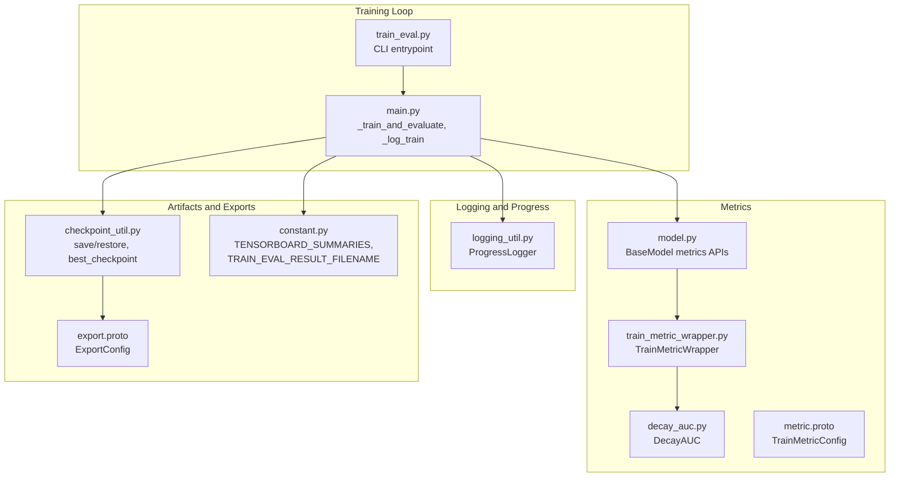
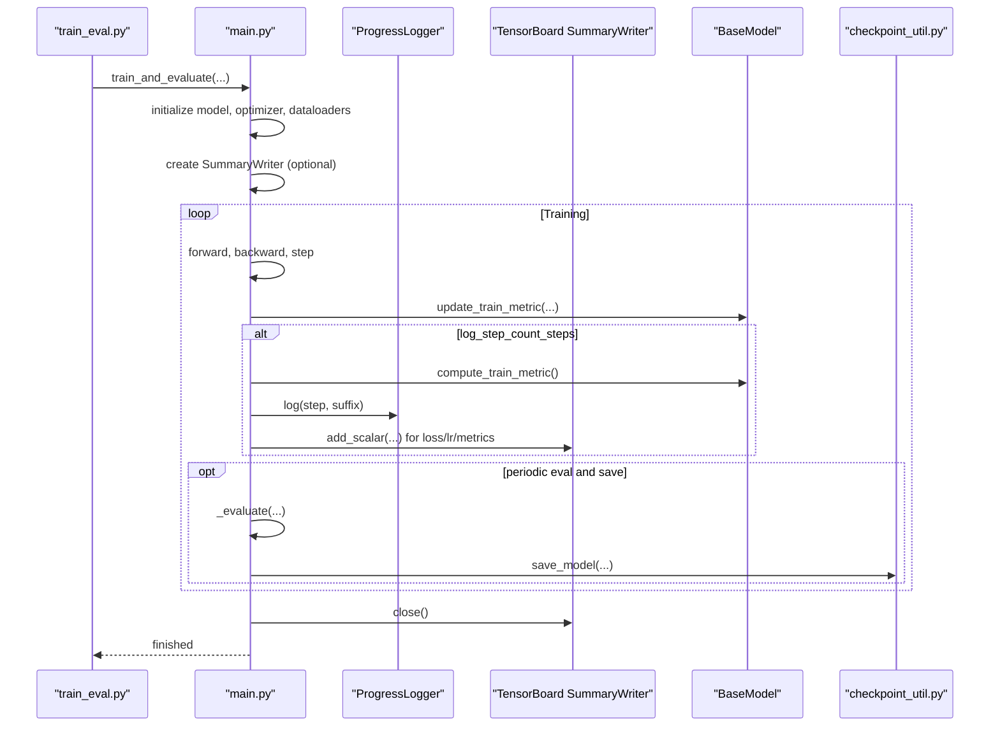
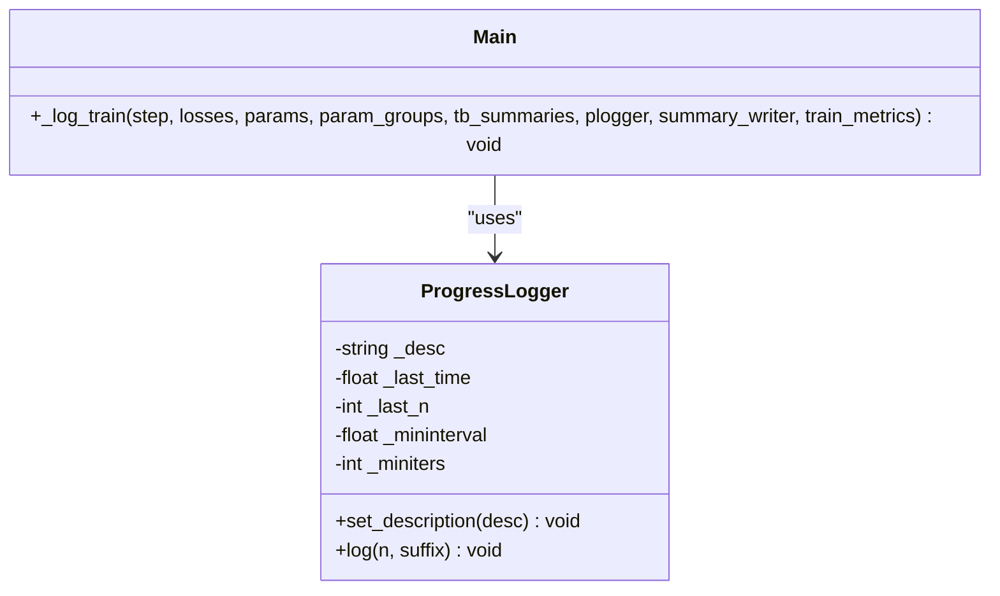
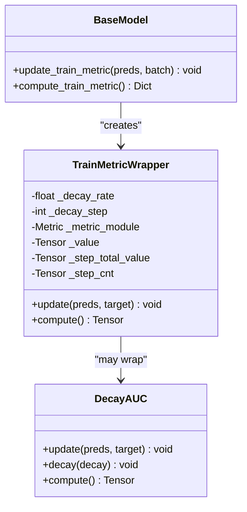
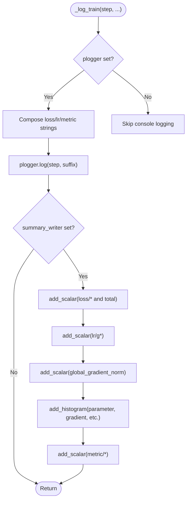
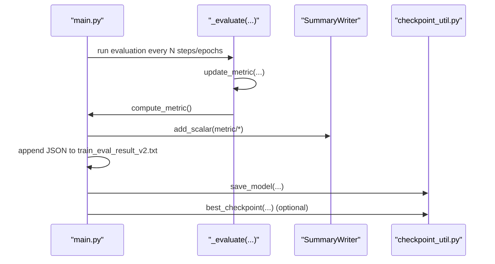
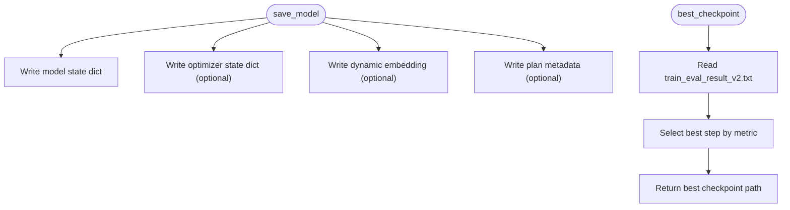
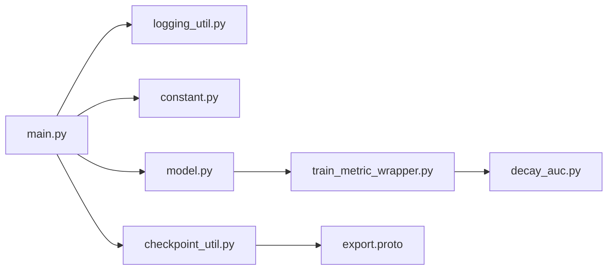

# Training Monitoring and Logging Infrastructure

<cite>
**Referenced Files in This Document**
- [logging_util.py](file://tzrec/utils/logging_util.py)
- [main.py](file://tzrec/main.py)
- [train_eval.py](file://tzrec/train_eval.py)
- [constant.py](file://tzrec/constant.py)
- [checkpoint_util.py](file://tzrec/utils/checkpoint_util.py)
- [model.py](file://tzrec/models/model.py)
- [train_metric_wrapper.py](file://tzrec/metrics/train_metric_wrapper.py)
- [decay_auc.py](file://tzrec/metrics/decay_auc.py)
- [metric.proto](file://tzrec/protos/metric.proto)
- [export.proto](file://tzrec/protos/export.proto)
</cite>

## Table of Contents

1. [Introduction](#introduction)
1. [Project Structure](#project-structure)
1. [Core Components](#core-components)
1. [Architecture Overview](#architecture-overview)
1. [Detailed Component Analysis](#detailed-component-analysis)
1. [Dependency Analysis](#dependency-analysis)
1. [Performance Considerations](#performance-considerations)
1. [Troubleshooting Guide](#troubleshooting-guide)
1. [Conclusion](#conclusion)
1. [Appendices](#appendices)

## Introduction

This document describes the training monitoring and logging infrastructure in TorchEasyRec. It covers logging architecture, log levels, structured logging formats, metrics collection and decay, performance monitoring, training progress tracking, integration with TensorBoard and external observability systems, artifact logging, and best practices for debugging and reproducibility.

## Project Structure

The monitoring and logging system spans several modules:

- Logging utilities and progress reporting
- Training loop and evaluation integration
- Metrics computation and decay
- TensorBoard summaries and export artifacts
- Checkpointing and best-model selection

**Diagram sources**

- \[logging_util.py\](file://tzrec/utils/logging_util.py#L20-L46)
- \[main.py\](file://tzrec/main.py#L228-L369)
- \[train_eval.py\](file://tzrec/train_eval.py#L16-L73)
- \[model.py\](file://tzrec/models/model.py#L106-L138)
- \[train_metric_wrapper.py\](file://tzrec/metrics/train_metric_wrapper.py#L20-L63)
- \[decay_auc.py\](file://tzrec/metrics/decay_auc.py#L24-L61)
- \[metric.proto\](file://tzrec/protos/metric.proto#L63-L76)
- \[checkpoint_util.py\](file://tzrec/utils/checkpoint_util.py#L176-L240)
- \[export.proto\](file://tzrec/protos/export.proto#L4-L13)
- \[constant.py\](file://tzrec/constant.py#L30-L37)

**Section sources**

- \[logging_util.py\](file://tzrec/utils/logging_util.py#L1-L46)
- \[main.py\](file://tzrec/main.py#L228-L369)
- \[train_eval.py\](file://tzrec/train_eval.py#L16-L73)
- \[model.py\](file://tzrec/models/model.py#L106-L138)
- \[train_metric_wrapper.py\](file://tzrec/metrics/train_metric_wrapper.py#L20-L63)
- \[decay_auc.py\](file://tzrec/metrics/decay_auc.py#L24-L61)
- \[metric.proto\](file://tzrec/protos/metric.proto#L63-L76)
- \[checkpoint_util.py\](file://tzrec/utils/checkpoint_util.py#L176-L240)
- \[export.proto\](file://tzrec/protos/export.proto#L4-L13)
- \[constant.py\](file://tzrec/constant.py#L30-L37)

## Core Components

- ProgressLogger: lightweight iteration progress logger with periodic throttling and throughput calculation.
- \_log_train: central logging function emitting console progress and TensorBoard summaries.
- BaseModel metrics: standardized APIs for updating and computing metrics during training and evaluation.
- TrainMetricWrapper: decaying moving average for training metrics with configurable decay rate and step interval.
- DecayAUC: AUC metric with decaying confidence matrices for stable training-time AUROC estimates.
- TensorBoard summaries: configurable logging of loss, learning rate, gradients, parameters, and per-metric scalars.
- Checkpointing and best model export: saving checkpoints and selecting best checkpoint based on metrics.

**Section sources**

- \[logging_util.py\](file://tzrec/utils/logging_util.py#L20-L46)
- \[main.py\](file://tzrec/main.py#L228-L369)
- \[model.py\](file://tzrec/models/model.py#L106-L138)
- \[train_metric_wrapper.py\](file://tzrec/metrics/train_metric_wrapper.py#L20-L63)
- \[decay_auc.py\](file://tzrec/metrics/decay_auc.py#L24-L61)
- \[constant.py\](file://tzrec/constant.py#L30-L37)
- \[checkpoint_util.py\](file://tzrec/utils/checkpoint_util.py#L323-L350)

## Architecture Overview

The training loop integrates logging, metrics, and TensorBoard summarization. It periodically logs training steps, computes and logs metrics, and optionally evaluates and saves checkpoints.

**Diagram sources**

- \[train_eval.py\](file://tzrec/train_eval.py#L16-L73)
- \[main.py\](file://tzrec/main.py#L310-L525)
- \[logging_util.py\](file://tzrec/utils/logging_util.py#L20-L46)
- \[checkpoint_util.py\](file://tzrec/utils/checkpoint_util.py#L323-L350)

## Detailed Component Analysis

### Logging System and Progress Tracking

- Logger name and level: a named logger "tzrec" is configured at INFO level.
- ProgressLogger: tracks iterations, enforces minimum interval and minimum iterations between logs, and prints iteration count and throughput.
- Console logging: \_log_train composes loss, learning rates, and metrics into a single progress message; evaluation results are logged similarly.
- Throttling: logs are emitted only when sufficient iterations/time elapsed to avoid overhead.

**Diagram sources**

- \[logging_util.py\](file://tzrec/utils/logging_util.py#L20-L46)
- \[main.py\](file://tzrec/main.py#L228-L256)

**Section sources**

- \[logging_util.py\](file://tzrec/utils/logging_util.py#L16-L46)
- \[main.py\](file://tzrec/main.py#L228-L256)

### Metrics Collection and Decay

- BaseModel exposes update_train_metric and compute_train_metric for training-time metrics.
- TrainMetricWrapper wraps a torchmetrics Metric and maintains a decaying value computed every N steps. Special-case DecayAUC applies exponential decay to confusion matrix buffers.
- TrainMetricConfig (metric.proto) defines supported metrics and decay parameters.

**Diagram sources**

- \[model.py\](file://tzrec/models/model.py#L133-L138)
- \[train_metric_wrapper.py\](file://tzrec/metrics/train_metric_wrapper.py#L20-L63)
- \[decay_auc.py\](file://tzrec/metrics/decay_auc.py#L24-L61)
- \[metric.proto\](file://tzrec/protos/metric.proto#L63-L76)

**Section sources**

- \[model.py\](file://tzrec/models/model.py#L106-L138)
- \[train_metric_wrapper.py\](file://tzrec/metrics/train_metric_wrapper.py#L20-L63)
- \[decay_auc.py\](file://tzrec/metrics/decay_auc.py#L24-L61)
- \[metric.proto\](file://tzrec/protos/metric.proto#L63-L76)

### TensorBoard Summaries and Structured Logging

- \_log_train writes to TensorBoard based on a whitelist controlled by TENSORBOARD_SUMMARIES and train_config.tensorboard_summaries.
- Logged items include per-loss scalars, total loss, learning rates, global gradient norm, histograms for parameters/gradients, and per-metric scalars.
- Evaluation metrics are written to a separate SummaryWriter for validation.

**Diagram sources**

- \[main.py\](file://tzrec/main.py#L228-L308)
- \[constant.py\](file://tzrec/constant.py#L30-L37)

**Section sources**

- \[main.py\](file://tzrec/main.py#L228-L308)
- \[constant.py\](file://tzrec/constant.py#L30-L37)

### Training Progress Tracking and Evaluation

- Training progress: ProgressLogger updates description per epoch; \_log_train emits per-log-step progress with losses, learning rates, and metrics.
- Evaluation: \_evaluate runs evaluation, updates metrics, logs results, appends JSON lines to train_eval_result_v2.txt, and writes to eval SummaryWriter.
- Best checkpoint selection: best_checkpoint reads eval_result_v2.txt and selects the checkpoint with the best metric value.

**Diagram sources**

- \[main.py\](file://tzrec/main.py#L161-L226)
- \[checkpoint_util.py\](file://tzrec/utils/checkpoint_util.py#L176-L240)
- \[constant.py\](file://tzrec/constant.py#L26)

**Section sources**

- \[main.py\](file://tzrec/main.py#L161-L226)
- \[checkpoint_util.py\](file://tzrec/utils/checkpoint_util.py#L176-L240)
- \[constant.py\](file://tzrec/constant.py#L26)

### Artifact Logging and Export

- Checkpointing: save_model persists model and optimizer states, plus dynamic embedding and plan metadata.
- Best model export: best_checkpoint locates the best checkpoint based on a selected metric and directionality.
- Export configuration: ExportConfig controls exporter type and metric selection criteria.

**Diagram sources**

- \[checkpoint_util.py\](file://tzrec/utils/checkpoint_util.py#L323-L364)
- \[checkpoint_util.py\](file://tzrec/utils/checkpoint_util.py#L176-L240)
- \[export.proto\](file://tzrec/protos/export.proto#L4-L13)

**Section sources**

- \[checkpoint_util.py\](file://tzrec/utils/checkpoint_util.py#L323-L364)
- \[checkpoint_util.py\](file://tzrec/utils/checkpoint_util.py#L176-L240)
- \[export.proto\](file://tzrec/protos/export.proto#L4-L13)

## Dependency Analysis

- main.py depends on logging_util for ProgressLogger and uses BaseModel metrics APIs.
- TensorBoard summaries depend on constant.TENSORBOARD_SUMMARIES and train_config.tensorboard_summaries.
- Metrics decay depends on metric.proto TrainMetricConfig and DecayAUC.
- Export and best checkpoint selection depend on train_eval_result_v2.txt and ExportConfig.

**Diagram sources**

- \[main.py\](file://tzrec/main.py#L228-L369)
- \[logging_util.py\](file://tzrec/utils/logging_util.py#L20-L46)
- \[constant.py\](file://tzrec/constant.py#L30-L37)
- \[checkpoint_util.py\](file://tzrec/utils/checkpoint_util.py#L176-L240)
- \[model.py\](file://tzrec/models/model.py#L106-L138)
- \[train_metric_wrapper.py\](file://tzrec/metrics/train_metric_wrapper.py#L20-L63)
- \[decay_auc.py\](file://tzrec/metrics/decay_auc.py#L24-L61)
- \[export.proto\](file://tzrec/protos/export.proto#L4-L13)

**Section sources**

- \[main.py\](file://tzrec/main.py#L228-L369)
- \[logging_util.py\](file://tzrec/utils/logging_util.py#L20-L46)
- \[constant.py\](file://tzrec/constant.py#L30-L37)
- \[checkpoint_util.py\](file://tzrec/utils/checkpoint_util.py#L176-L240)
- \[model.py\](file://tzrec/models/model.py#L106-L138)
- \[train_metric_wrapper.py\](file://tzrec/metrics/train_metric_wrapper.py#L20-L63)
- \[decay_auc.py\](file://tzrec/metrics/decay_auc.py#L24-L61)
- \[export.proto\](file://tzrec/protos/export.proto#L4-L13)

## Performance Considerations

- Logging throttling: ProgressLogger avoids frequent console writes by enforcing minimum intervals and minimum iterations.
- TensorBoard histogram costs: Parameter and gradient histograms can be expensive; enable only when needed via tensorboard_summaries.
- Gradient norm computation: Global gradient norm is computed per step; consider disabling for very large models to reduce overhead.
- Mixed precision: Autocast reduces memory bandwidth and improves throughput; ensure compatible devices and dtypes.

[No sources needed since this section provides general guidance]

## Troubleshooting Guide

- Debugging training issues:
  - Inspect console logs emitted by ProgressLogger for loss spikes, divergent learning rates, or stalled throughput.
  - Enable TensorBoard and monitor loss curves, learning rates, and metrics to detect anomalies.
  - Review train_eval_result_v2.txt for evaluation metric trends and early stopping decisions.
- Performance bottlenecks:
  - Use torch profiler integration to capture traces; traces are written to a dedicated directory for analysis.
  - Reduce TensorBoard histogram logging frequency or disable histograms to lower overhead.
- Experiment reproducibility:
  - Save pipeline.config and version file during training for exact reproducibility.
  - Use checkpoints to resume training; ensure consistent data sharding and optimizer states.

**Section sources**

- \[main.py\](file://tzrec/main.py#L371-L383)
- \[main.py\](file://tzrec/main.py#L712-L718)
- \[checkpoint_util.py\](file://tzrec/utils/checkpoint_util.py#L323-L350)

## Conclusion

TorchEasyRec’s monitoring stack combines a concise ProgressLogger, robust metrics with decay, and configurable TensorBoard summaries. Together with checkpointing and best-model selection, it enables effective training oversight, artifact management, and reproducible experimentation. For production deployments, pair console/TensorBoard logging with external observability platforms and remote logging sinks as needed.

[No sources needed since this section summarizes without analyzing specific files]

## Appendices

### Practical Examples and Recipes

- Implementing custom metrics:
  - Define a torchmetrics Metric and register it via TrainMetricConfig; TrainMetricWrapper will manage decay and compute cadence.
  - Reference: \[metric.proto\](file://tzrec/protos/metric.proto#L63-L76), \[train_metric_wrapper.py\](file://tzrec/metrics/train_metric_wrapper.py#L20-L63), \[model.py\](file://tzrec/models/model.py#L133-L138)
- Logging training artifacts:
  - Save checkpoints regularly; export best checkpoint based on a chosen metric.
  - Reference: \[checkpoint_util.py\](file://tzrec/utils/checkpoint_util.py#L323-L350), \[export.proto\](file://tzrec/protos/export.proto#L4-L13)
- Exporting training statistics:
  - Append evaluation metrics to train_eval_result_v2.txt; visualize and alert on trends externally.
  - Reference: \[main.py\](file://tzrec/main.py#L216-L225), \[constant.py\](file://tzrec/constant.py#L26)
- Log rotation and storage:
  - Configure filesystem retention policies for model_dir and TensorBoard logs; keep stdout/stderr logs for recent runs.
  - Reference: \[main.py\](file://tzrec/main.py#L354-L355)
- Remote logging:
  - Stream logs to centralized logging systems (e.g., syslog, cloud log agents) outside the scope of this codebase.
  - Reference: \[logging_util.py\](file://tzrec/utils/logging_util.py#L16-L17)

[No sources needed since this section provides general guidance]
