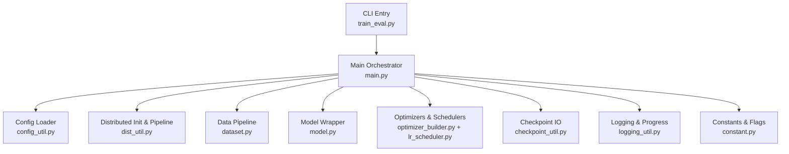
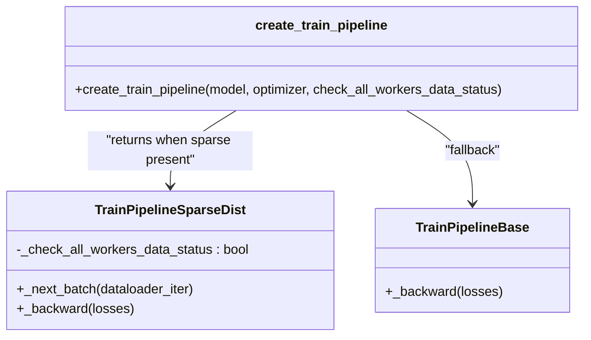
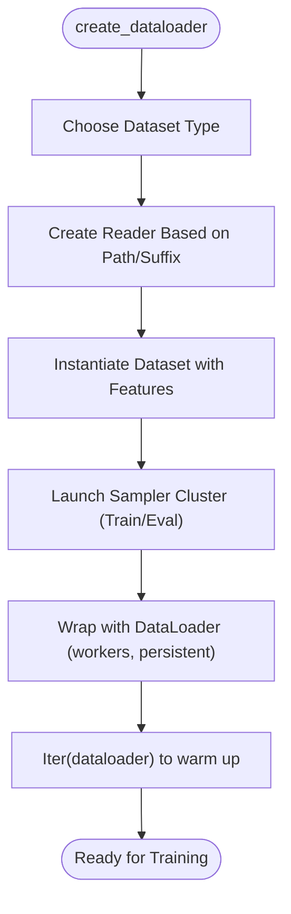
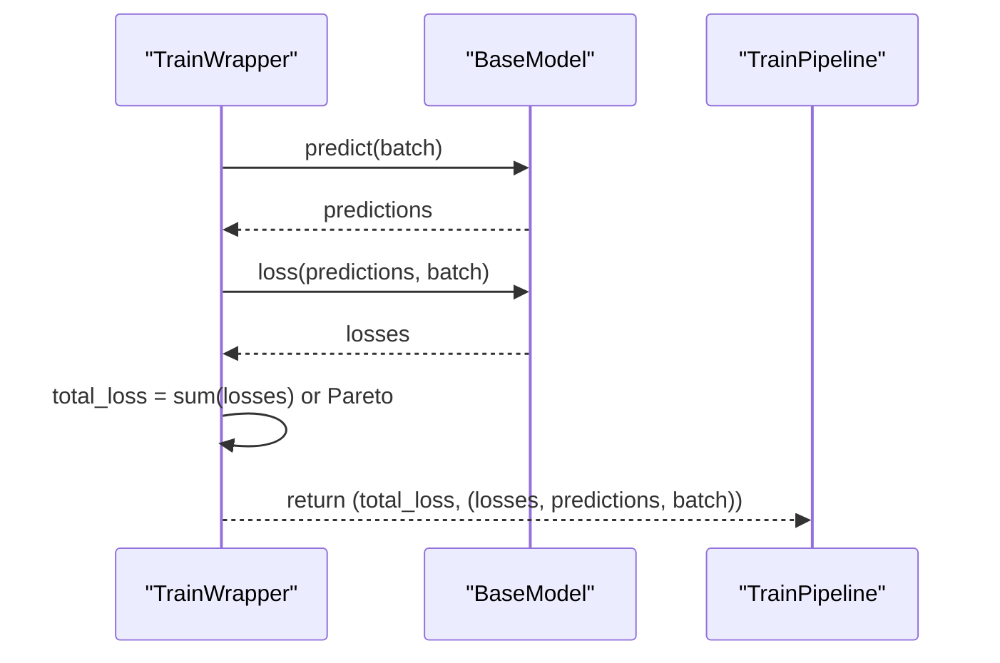
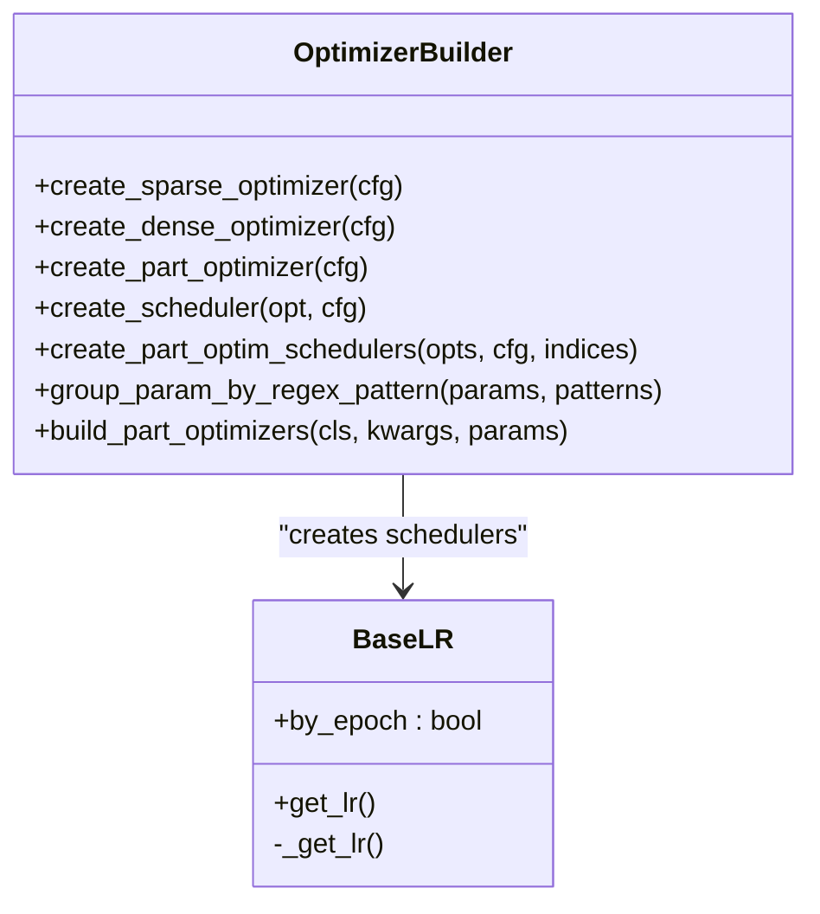
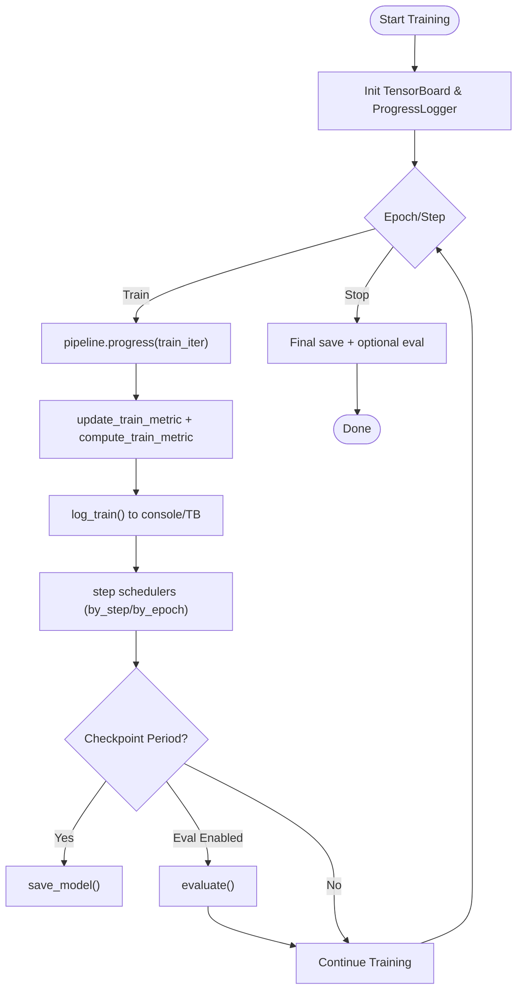
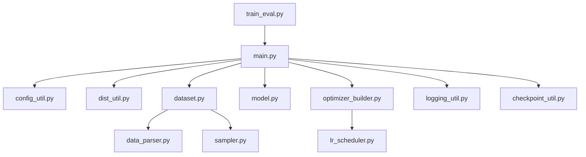

# Training Pipeline Orchestration and Execution

<cite>
**Referenced Files in This Document**
- [main.py](file://tzrec/main.py)
- [train_eval.py](file://tzrec/train_eval.py)
- [config_util.py](file://tzrec/utils/config_util.py)
- [logging_util.py](file://tzrec/utils/logging_util.py)
- [constant.py](file://tzrec/constant.py)
- [dataset.py](file://tzrec/datasets/dataset.py)
- [model.py](file://tzrec/models/model.py)
- [dist_util.py](file://tzrec/utils/dist_util.py)
- [optimizer_builder.py](file://tzrec/optim/optimizer_builder.py)
- [lr_scheduler.py](file://tzrec/optim/lr_scheduler.py)
- [checkpoint_util.py](file://tzrec/utils/checkpoint_util.py)
- [deepfm_criteo.config](file://examples/deepfm_criteo.config)
</cite>

## Table of Contents

1. [Introduction](#introduction)
1. [Project Structure](#project-structure)
1. [Core Components](#core-components)
1. [Architecture Overview](#architecture-overview)
1. [Detailed Component Analysis](#detailed-component-analysis)
1. [Dependency Analysis](#dependency-analysis)
1. [Performance Considerations](#performance-considerations)
1. [Troubleshooting Guide](#troubleshooting-guide)
1. [Conclusion](#conclusion)
1. [Appendices](#appendices)

## Introduction

This document explains the training pipeline orchestration and execution in TorchEasyRec. It covers the main training loop, execution flow, and coordination among training components. It documents argument parsing, configuration validation, pipeline initialization, and the training and evaluation phases including data loading, model forward/backward passes, and metric computation. It also describes integration with logging systems, progress tracking, and experiment management, along with practical examples for customization, early stopping, interruption handling, monitoring, resource tracking, and performance profiling.

## Project Structure

The training pipeline is orchestrated by a central entry point that parses arguments, loads and validates configuration, initializes distributed training, builds datasets and models, and runs the training loop with periodic evaluations and checkpoints.



**Diagram sources**

- \[train_eval.py\](file://tzrec/train_eval.py#L16-L72)
- \[main.py\](file://tzrec/main.py#L527-L736)
- \[config_util.py\](file://tzrec/utils/config_util.py#L25-L48)
- \[dist_util.py\](file://tzrec/utils/dist_util.py#L53-L71)
- \[dataset.py\](file://tzrec/datasets/dataset.py#L645-L732)
- \[model.py\](file://tzrec/models/model.py#L222-L284)
- \[optimizer_builder.py\](file://tzrec/optim/optimizer_builder.py#L30-L150)
- \[lr_scheduler.py\](file://tzrec/optim/lr_scheduler.py#L26-L51)
- \[checkpoint_util.py\](file://tzrec/utils/checkpoint_util.py#L147-L174)
- \[logging_util.py\](file://tzrec/utils/logging_util.py#L20-L46)
- \[constant.py\](file://tzrec/constant.py#L16-L41)

**Section sources**

- \[train_eval.py\](file://tzrec/train_eval.py#L16-L72)
- \[main.py\](file://tzrec/main.py#L527-L736)

## Core Components

- Argument parsing and CLI entry point: Parses training arguments and invokes the main training routine.
- Configuration loader: Loads and edits pipeline configurations from JSON or text proto formats, with compatibility handling.
- Distributed initialization and pipeline: Initializes process groups, sets device/backend, and creates the training pipeline abstraction.
- Data pipeline: Builds datasets and dataloaders with configurable readers, samplers, and batching strategies.
- Model wrapper: Provides training and prediction wrappers with mixed precision and optional Pareto-efficient multi-task loss.
- Optimizer and scheduler builder: Creates sparse/dense/part-wise optimizers and schedulers from configuration.
- Logging and progress tracking: ProgressLogger for iteration throughput and TensorBoard summaries for metrics and gradients.
- Checkpoint utilities: Save/load model and optimizer states, including partial restoration and dynamic embedding support.

**Section sources**

- \[train_eval.py\](file://tzrec/train_eval.py#L16-L72)
- \[config_util.py\](file://tzrec/utils/config_util.py#L25-L48)
- \[dist_util.py\](file://tzrec/utils/dist_util.py#L53-L71)
- \[dataset.py\](file://tzrec/datasets/dataset.py#L645-L732)
- \[model.py\](file://tzrec/models/model.py#L222-L284)
- \[optimizer_builder.py\](file://tzrec/optim/optimizer_builder.py#L30-L150)
- \[lr_scheduler.py\](file://tzrec/optim/lr_scheduler.py#L26-L51)
- \[logging_util.py\](file://tzrec/utils/logging_util.py#L20-L46)
- \[checkpoint_util.py\](file://tzrec/utils/checkpoint_util.py#L323-L350)

## Architecture Overview

The training orchestrator coordinates the following stages:

- Initialization: Parse CLI, load and edit config, initialize distributed environment, create features, dataloaders, model, optimizer, and schedulers.
- Training loop: Iterate over steps or epochs, run forward/backward through the pipeline, log metrics, update schedulers, periodically save checkpoints, and optionally evaluate.
- Evaluation: Periodic evaluation with a separate dataloader and metric aggregation.
- Logging and profiling: TensorBoard summaries and optional PyTorch profiler traces.

```mermaid
sequenceDiagram
participant CLI as "CLI"
participant Main as "train_and_evaluate"
participant Dist as "init_process_group"
participant Data as "create_dataloader"
participant Model as "TrainWrapper"
participant Opt as "TZRecOptimizer"
participant Pipe as "create_train_pipeline"
participant Loop as "_train_and_evaluate"
participant Eval as "_evaluate"
participant CKPT as "checkpoint_util"
CLI->>Main : parse args and call train_and_evaluate
Main->>Dist : init_process_group()
Main->>Data : create_dataloader(train)
Main->>Data : create_dataloader(eval)
Main->>Model : TrainWrapper(model)
Main->>Opt : build combined optimizer
Main->>Pipe : create_train_pipeline(model, optimizer)
Main->>Loop : start training loop
Loop->>Pipe : pipeline.progress(train_iterator)
Loop->>Opt : step schedulers (by_step)
Loop->>CKPT : save checkpoint (periodic)
alt eval enabled
Loop->>Eval : evaluate(model, eval_loader)
Eval->>Model : compute_metric()
end
```

**Diagram sources**

- \[train_eval.py\](file://tzrec/train_eval.py#L63-L72)
- \[main.py\](file://tzrec/main.py#L527-L736)
- \[dist_util.py\](file://tzrec/utils/dist_util.py#L304-L345)
- \[dataset.py\](file://tzrec/datasets/dataset.py#L645-L732)
- \[model.py\](file://tzrec/models/model.py#L222-L284)
- \[optimizer_builder.py\](file://tzrec/optim/optimizer_builder.py#L671-L734)
- \[checkpoint_util.py\](file://tzrec/utils/checkpoint_util.py#L323-L350)

## Detailed Component Analysis

### Argument Parsing and CLI Entry

- The CLI script defines arguments for pipeline config path, model directory, train/eval input paths, continuation flag, fine-tuning checkpoint, JSON edits, and optimizer restoration behavior.
- It delegates to the main training function with parsed arguments.

Practical usage:

- Override model directory, train/eval paths, and enable continue training from an existing directory.
- Edit configuration fields via JSON string for quick hyperparameter tuning.

**Section sources**

- \[train_eval.py\](file://tzrec/train_eval.py#L16-L72)

### Configuration Loading and Validation

- Loads pipeline config from JSON or text proto, with compatibility for legacy fields.
- Supports editing configuration via dot-bracket notation and type conversion.
- Validates mutually exclusive training modes (steps vs epochs) and tensorboard summary options.

Key behaviors:

- Compatibility handling for feature group encoding modes.
- Editable arrays and nested fields using bracket notation and conditionals.

**Section sources**

- \[config_util.py\](file://tzrec/utils/config_util.py#L25-L48)
- \[config_util.py\](file://tzrec/utils/config_util.py#L144-L299)
- \[main.py\](file://tzrec/main.py#L331-L334)
- \[main.py\](file://tzrec/main.py#L356-L367)

### Distributed Initialization and Pipeline Creation

- Initializes process group, selects device and backend, and ensures TF32 allowance based on training config.
- Creates the training pipeline tailored to presence of sparse modules (embedding shards) and supports checking all workers’ data availability.



**Diagram sources**

- \[dist_util.py\](file://tzrec/utils/dist_util.py#L202-L272)
- \[dist_util.py\](file://tzrec/utils/dist_util.py#L304-L345)

**Section sources**

- \[main.py\](file://tzrec/main.py#L566-L570)
- \[dist_util.py\](file://tzrec/utils/dist_util.py#L53-L71)
- \[dist_util.py\](file://tzrec/utils/dist_util.py#L304-L345)

### Data Loading and Sampling

- Dataset factory constructs datasets with configurable readers (CSV, Parquet, ODPS) and batching strategies.
- Supports negative sampling, TDM expansion, HSTU sequence handling, and sample-cost-aware slicing.
- Launches sampler clusters for graphlearn-based sampling and reuses clusters between train and eval.



**Diagram sources**

- \[dataset.py\](file://tzrec/datasets/dataset.py#L645-L732)
- \[dataset.py\](file://tzrec/datasets/dataset.py#L149-L420)

**Section sources**

- \[dataset.py\](file://tzrec/datasets/dataset.py#L645-L732)
- \[dataset.py\](file://tzrec/datasets/dataset.py#L149-L420)

### Model Construction and Forward/Backward

- Model creation resolves the configured model type and attaches kernel selection.
- TrainWrapper performs forward in autocast, computes total loss, detaches tensors for logging, and supports Pareto-efficient multi-task loss weighting.



**Diagram sources**

- \[model.py\](file://tzrec/models/model.py#L258-L284)
- \[model.py\](file://tzrec/models/model.py#L181-L216)

**Section sources**

- \[main.py\](file://tzrec/main.py#L126-L158)
- \[model.py\](file://tzrec/models/model.py#L222-L284)

### Optimizers, Schedulers, and Mixed Precision

- Sparse optimizer: embedding-specific optimizers (e.g., Adagrad, Adam, LARS/LAMB).
- Dense optimizer: standard torch optimizers with beta handling.
- Part-wise optimizer: regex-based parameter partitioning with separate optimizers/schedulers.
- Mixed precision: FP16/BF16 autocast controlled by training config.
- Gradient scaler: optional GradScaler for numerical stability.



**Diagram sources**

- \[optimizer_builder.py\](file://tzrec/optim/optimizer_builder.py#L30-L234)
- \[lr_scheduler.py\](file://tzrec/optim/lr_scheduler.py#L26-L160)

**Section sources**

- \[main.py\](file://tzrec/main.py#L633-L706)
- \[optimizer_builder.py\](file://tzrec/optim/optimizer_builder.py#L30-L234)
- \[lr_scheduler.py\](file://tzrec/optim/lr_scheduler.py#L26-L160)

### Training Loop and Evaluation

- Training loop supports epoch or step-based termination, gradient accumulation, and periodic checkpointing.
- Uses the training pipeline to drive forward/backward, updates schedulers, logs metrics and gradients, and optionally evaluates.
- Evaluation computes metrics across the eval set and writes results to disk and TensorBoard.



**Diagram sources**

- \[main.py\](file://tzrec/main.py#L310-L525)
- \[main.py\](file://tzrec/main.py#L161-L226)
- \[main.py\](file://tzrec/main.py#L228-L308)

**Section sources**

- \[main.py\](file://tzrec/main.py#L310-L525)
- \[main.py\](file://tzrec/main.py#L161-L226)
- \[main.py\](file://tzrec/main.py#L228-L308)

### Logging, Progress Tracking, and Experiment Management

- ProgressLogger reports iteration count and throughput at configurable intervals.
- TensorBoard summaries include loss, learning rate, global gradient norm, histograms for parameters/gradients, and training metrics.
- Experiment artifacts saved include pipeline config, version, and evaluation results.

**Section sources**

- \[logging_util.py\](file://tzrec/utils/logging_util.py#L20-L46)
- \[main.py\](file://tzrec/main.py#L353-L367)
- \[main.py\](file://tzrec/main.py#L228-L308)
- \[constant.py\](file://tzrec/constant.py#L26-L41)

### Checkpointing and Experiment Continuation

- Save/load model and optimizer states with distributed checkpoint support.
- Partial restoration via parameter remapping and compatibility mapping for embedding collections.
- Best checkpoint selection based on evaluation metrics.

**Section sources**

- \[checkpoint_util.py\](file://tzrec/utils/checkpoint_util.py#L147-L174)
- \[checkpoint_util.py\](file://tzrec/utils/checkpoint_util.py#L242-L321)
- \[checkpoint_util.py\](file://tzrec/utils/checkpoint_util.py#L323-L350)
- \[main.py\](file://tzrec/main.py#L592-L618)

## Dependency Analysis

The training pipeline exhibits strong modularity with clear separation of concerns:

- CLI depends on main orchestrator.
- Main orchestrator depends on config loader, distributed utilities, dataset factory, model wrapper, optimizer builder, schedulers, logging, and checkpoint utilities.
- Data pipeline depends on readers, samplers, and parsers.
- Model wrapper depends on BaseModel and torchmetrics.



**Diagram sources**

- \[train_eval.py\](file://tzrec/train_eval.py#L16-L72)
- \[main.py\](file://tzrec/main.py#L527-L736)
- \[dataset.py\](file://tzrec/datasets/dataset.py#L149-L420)

**Section sources**

- \[main.py\](file://tzrec/main.py#L527-L736)
- \[dataset.py\](file://tzrec/datasets/dataset.py#L149-L420)

## Performance Considerations

- Mixed precision: Enable FP16/BF16 via training config to reduce memory bandwidth and improve throughput.
- Gradient accumulation: Configure to simulate larger batch sizes without increasing memory footprint.
- Data pipeline: Tune num_workers, persistent_workers, and reader shuffle buffer size; ensure sufficient files for sharding.
- Sampler clustering: Reuse graphlearn clusters between train and eval to reduce overhead.
- TensorBoard summaries: Limit expensive histograms to reduce I/O overhead during training.
- Profiling: Use PyTorch profiler with TensorBoard handler for kernel-level insights.

[No sources needed since this section provides general guidance]

## Troubleshooting Guide

Common issues and resolutions:

- Configuration conflicts: Ensure either num_epochs or num_steps is set, not both.
- Checkpoint restoration: If optimizer state fails to restore, use the ignore flag to restore only model weights.
- Data imbalance across workers: Enable all-workers data status checks to drop remainder batches and avoid hangs.
- Missing evaluation metrics: Verify eval result file exists and metric name matches exporter configuration.
- Device/backend mismatch: NCCL on GPU, Gloo on CPU; ensure environment variables and ranks are set correctly.

**Section sources**

- \[main.py\](file://tzrec/main.py#L331-L334)
- \[main.py\](file://tzrec/main.py#L720-L734)
- \[checkpoint_util.py\](file://tzrec/utils/checkpoint_util.py#L242-L321)
- \[dist_util.py\](file://tzrec/utils/dist_util.py#L254-L268)

## Conclusion

TorchEasyRec’s training pipeline integrates configuration-driven orchestration, robust distributed training, efficient data pipelines, modular model wrappers, and comprehensive logging and checkpointing. The design supports flexible customization, scalable evaluation, and observability through TensorBoard and profiling. By leveraging the provided components and patterns, users can implement advanced training workflows, integrate early stopping, manage interruptions, and optimize performance across diverse environments.

## Appendices

### Practical Customization Examples

- Custom training workflow:
  - Add a custom scheduler by extending the scheduler registry and referencing it in configuration.
  - Integrate a custom optimizer by adding a new optimizer type in the builder and referencing it in the config.
- Early stopping:
  - Use evaluation metrics to track best checkpoint and stop training when no improvement occurs over a window.
  - Reference best checkpoint selection logic for guidance.
- Managing interruptions:
  - Continue training from the latest checkpoint by enabling the continue flag and ensuring model directory semantics.
  - Use ignore_restore_optimizer to recover from incompatible optimizer states.
- Monitoring and profiling:
  - Enable TensorBoard summaries selectively to balance observability and overhead.
  - Use PyTorch profiler with a dedicated trace directory for kernel-level analysis.

**Section sources**

- \[lr_scheduler.py\](file://tzrec/optim/lr_scheduler.py#L26-L160)
- \[optimizer_builder.py\](file://tzrec/optim/optimizer_builder.py#L30-L234)
- \[checkpoint_util.py\](file://tzrec/utils/checkpoint_util.py#L176-L240)
- \[main.py\](file://tzrec/main.py#L720-L734)

### Example Configuration

- Example configuration demonstrates typical training and evaluation settings, optimizer choices, and feature definitions.

**Section sources**

- \[deepfm_criteo.config\](file://examples/deepfm_criteo.config#L1-L397)
