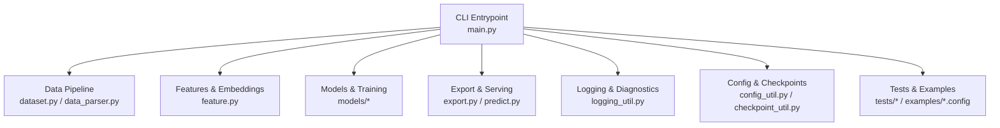
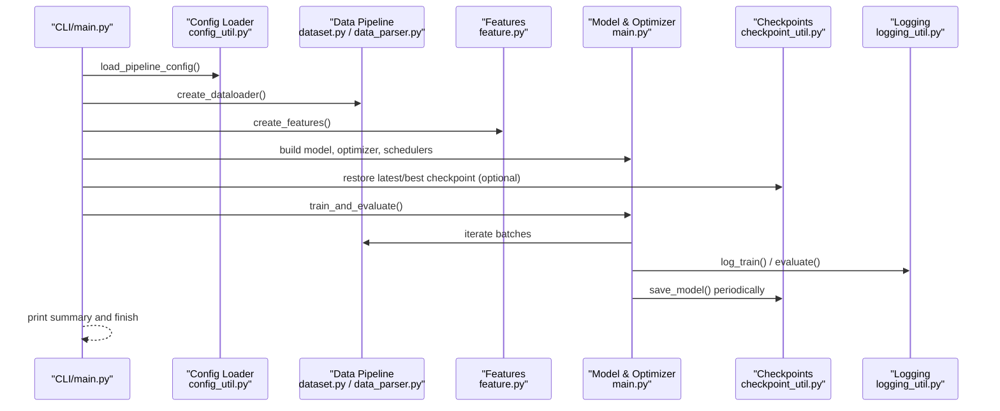
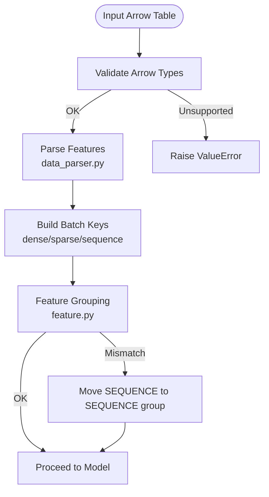
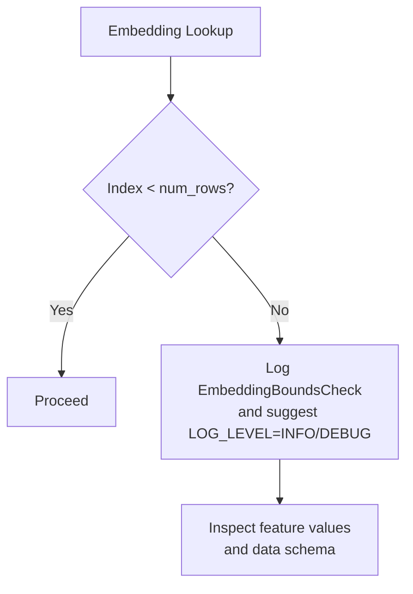
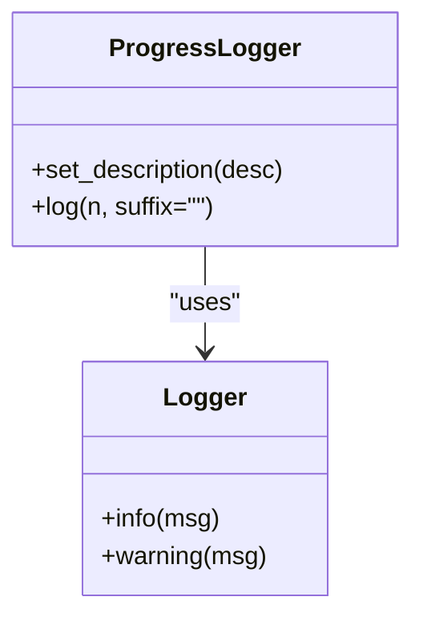
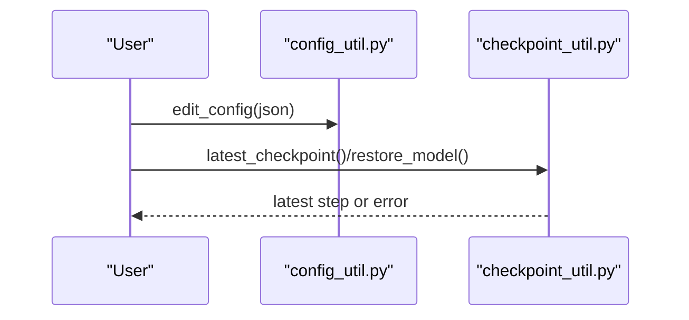
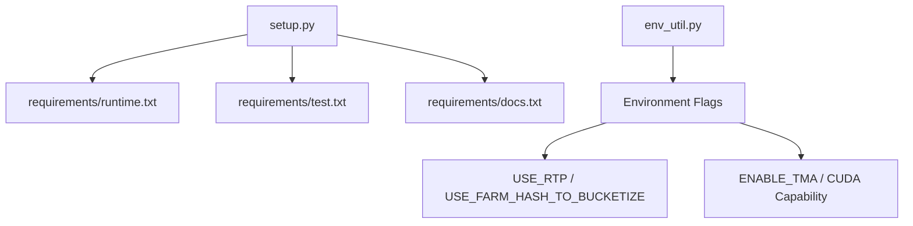

# Troubleshooting Guide and FAQ

<cite>
**Referenced Files in This Document**
- [README.md](file://README.md)
- [faq.md](file://docs/source/faq.md)
- [logging_util.py](file://tzrec/utils/logging_util.py)
- [main.py](file://tzrec/main.py)
- [config_util.py](file://tzrec/utils/config_util.py)
- [checkpoint_util.py](file://tzrec/utils/checkpoint_util.py)
- [dataset.py](file://tzrec/datasets/dataset.py)
- [data_parser.py](file://tzrec/datasets/data_parser.py)
- [feature.py](file://tzrec/features/feature.py)
- [env_util.py](file://tzrec/utils/env_util.py)
- [rank_integration_test.py](file://tzrec/tests/rank_integration_test.py)
- [examples/deepfm_criteo.config](file://examples/deepfm_criteo.config)
- [setup.py](file://setup.py)
</cite>

## Table of Contents

1. [Introduction](#introduction)
1. [Project Structure](#project-structure)
1. [Core Components](#core-components)
1. [Architecture Overview](#architecture-overview)
1. [Detailed Component Analysis](#detailed-component-analysis)
1. [Dependency Analysis](#dependency-analysis)
1. [Performance Considerations](#performance-considerations)
1. [Troubleshooting Guide](#troubleshooting-guide)
1. [FAQ](#faq)
1. [Conclusion](#conclusion)

## Introduction

This document provides a comprehensive troubleshooting guide and FAQ for TorchEasyRec. It covers installation issues, configuration errors, training failures, and deployment problems across all framework components. It explains diagnostic approaches, logging strategies, debugging techniques, and platform-specific pitfalls. Step-by-step procedures are included for typical scenarios such as data loading issues, model training problems, and serving deployment failures. Guidance is also provided for performance troubleshooting, memory optimization, scaling, and collecting diagnostic information.

## Project Structure

TorchEasyRec is organized around modular components:

- CLI entrypoint and training loop orchestration
- Data ingestion, parsing, and batching
- Feature engineering and embedding handling
- Model definition and training/evaluation loops
- Export and prediction utilities
- Logging and progress reporting
- Tests and example configurations

**Diagram sources**

- \[main.py\](file://tzrec/main.py#L527-L737)
- \[dataset.py\](file://tzrec/datasets/dataset.py#L149-L200)
- \[data_parser.py\](file://tzrec/datasets/data_parser.py#L56-L200)
- \[feature.py\](file://tzrec/features/feature.py#L375-L500)
- \[logging_util.py\](file://tzrec/utils/logging_util.py#L20-L46)
- \[config_util.py\](file://tzrec/utils/config_util.py#L25-L98)
- \[checkpoint_util.py\](file://tzrec/utils/checkpoint_util.py#L147-L240)
- \[rank_integration_test.py\](file://tzrec/tests/rank_integration_test.py#L30-L120)

**Section sources**

- \[README.md\](file://README.md#L1-L83)
- \[main.py\](file://tzrec/main.py#L527-L737)

## Core Components

- CLI and training loop: orchestrates data loading, model creation, optimizer setup, distributed training, evaluation, and checkpointing.
- Data pipeline: creates PyArrow-backed datasets, parses features, applies samplers, and batches data for training/evaluation.
- Feature engine: handles feature groups, sparse/dense/sequence features, and embedding configurations.
- Logging and diagnostics: progress logging, info/warning logs, and structured summaries for metrics and gradients.
- Config and checkpoints: loads pipeline configs, edits parameters dynamically, and manages model/optimizer/dynamic embedding checkpoints.

**Section sources**

- \[main.py\](file://tzrec/main.py#L527-L737)
- \[dataset.py\](file://tzrec/datasets/dataset.py#L149-L200)
- \[data_parser.py\](file://tzrec/datasets/data_parser.py#L56-L200)
- \[feature.py\](file://tzrec/features/feature.py#L375-L500)
- \[logging_util.py\](file://tzrec/utils/logging_util.py#L20-L46)
- \[config_util.py\](file://tzrec/utils/config_util.py#L25-L98)
- \[checkpoint_util.py\](file://tzrec/utils/checkpoint_util.py#L147-L240)

## Architecture Overview

End-to-end training and evaluation flow with diagnostics and logging.

**Diagram sources**

- \[main.py\](file://tzrec/main.py#L527-L737)
- \[config_util.py\](file://tzrec/utils/config_util.py#L25-L98)
- \[dataset.py\](file://tzrec/datasets/dataset.py#L149-L200)
- \[data_parser.py\](file://tzrec/datasets/data_parser.py#L56-L200)
- \[feature.py\](file://tzrec/features/feature.py#L375-L500)
- \[checkpoint_util.py\](file://tzrec/utils/checkpoint_util.py#L323-L364)
- \[logging_util.py\](file://tzrec/utils/logging_util.py#L20-L46)

## Detailed Component Analysis

### Data Pipeline and Parsing

Common issues include unsupported data types, missing columns, mismatched feature groups, and out-of-bounds embedding indices. The parser validates feature inputs and raises explicit errors for invalid configurations.

**Diagram sources**

- \[data_parser.py\](file://tzrec/datasets/data_parser.py#L178-L200)
- \[feature.py\](file://tzrec/features/feature.py#L157-L161)

**Section sources**

- \[data_parser.py\](file://tzrec/datasets/data_parser.py#L56-L200)
- \[feature.py\](file://tzrec/features/feature.py#L157-L161)

### Feature Engineering and Embeddings

Embedding-related errors often stem from out-of-range indices or unsupported data types. The system logs detailed information to help identify offending features.

**Diagram sources**

- \[faq.md\](file://docs/source/faq.md#L161-L172)

**Section sources**

- \[faq.md\](file://docs/source/faq.md#L161-L172)

### Logging and Progress Reporting

ProgressLogger reports iteration throughput and metrics, while INFO/WARNING logs surface configuration and runtime anomalies.

**Diagram sources**

- \[logging_util.py\](file://tzrec/utils/logging_util.py#L20-L46)

**Section sources**

- \[logging_util.py\](file://tzrec/utils/logging_util.py#L20-L46)

### Configuration and Checkpoints

Dynamic config editing and checkpoint restoration are supported. Misconfiguration can lead to missing files or incompatible state.

**Diagram sources**

- \[config_util.py\](file://tzrec/utils/config_util.py#L144-L299)
- \[checkpoint_util.py\](file://tzrec/utils/checkpoint_util.py#L147-L240)

**Section sources**

- \[config_util.py\](file://tzrec/utils/config_util.py#L144-L299)
- \[checkpoint_util.py\](file://tzrec/utils/checkpoint_util.py#L147-L240)

## Dependency Analysis

- Python version and package dependencies are declared via setup.py and requirements files.
- Runtime dependencies include PyTorch, TorchRec, PyArrow, and optional acceleration/backends.
- Environment flags influence feature graph behavior, RTP usage, and Triton/TMA features.

**Diagram sources**

- \[setup.py\](file://setup.py#L64-L84)
- \[env_util.py\](file://tzrec/utils/env_util.py#L24-L57)

**Section sources**

- \[setup.py\](file://setup.py#L64-L84)
- \[env_util.py\](file://tzrec/utils/env_util.py#L24-L57)

## Performance Considerations

- Mixed precision and TF32 toggles can improve throughput depending on backend.
- Gradient accumulation reduces memory pressure at the cost of effective batch steps.
- TensorBoard summaries can be tuned to reduce overhead.
- Sequence feature grouping and feature graph modes impact memory and latency.

[No sources needed since this section provides general guidance]

## Troubleshooting Guide

### Installation and Environment

- Verify Python version and installed packages meet requirements.
- Resolve CUDA/cuDNN version conflicts by ensuring a single CUDA runtime is loaded.
- On Linux systems, install missing system libraries (e.g., libidn) if linking fails.

Diagnostic steps:

- Confirm Python version and installed packages.
- Check CUDA availability and driver compatibility.
- Validate system libraries and container GPU flags.

**Section sources**

- \[faq.md\](file://docs/source/faq.md#L3-L14)
- \[faq.md\](file://docs/source/faq.md#L17-L28)
- \[faq.md\](file://docs/source/faq.md#L31-L42)

### Configuration Errors

- Ensure pipeline.config exists and is readable.
- Validate feature groups: SEQUENCE features must be placed in SEQUENCE groups.
- Use config editing safely; invalid paths or types will raise errors.

Diagnostic steps:

- Confirm file paths and permissions.
- Review feature group assignments.
- Use config edit helpers to validate changes.

**Section sources**

- \[faq.md\](file://docs/source/faq.md#L62-L73)
- \[faq.md\](file://docs/source/faq.md#L118-L129)
- \[config_util.py\](file://tzrec/utils/config_util.py#L144-L299)

### Training Failures

- Multi-GPU misconfiguration leads to invalid device ordinals; align nproc-per-node with available GPUs.
- DataLoader OOM kills worker processes; reduce batch_size or num_workers.
- EmbeddingBoundsCheck indicates out-of-range indices; increase embedding table size or sanitize inputs.
- CUDA initialization errors on certain GPUs require clearing LD_LIBRARY_PATH to use conda CUDA.

Diagnostic steps:

- Check device count and ranks.
- Reduce batch size and workers.
- Enable INFO/DEBUG logs to identify offending features.
- Clear LD_LIBRARY_PATH for CUDA compatibility.

**Section sources**

- \[faq.md\](file://docs/source/faq.md#L45-L59)
- \[faq.md\](file://docs/source/faq.md#L132-L143)
- \[faq.md\](file://docs/source/faq.md#L161-L172)
- \[faq.md\](file://docs/source/faq.md#L175-L196)

### Data Loading Issues

- Missing or malformed schema in offline prediction outputs causes tunnel write failures; drop or rename conflicting tables.
- KV feature keys containing ":" cause parsing errors; clean data to avoid colons in keys.

Diagnostic steps:

- Validate output table schema before writing.
- Sanitize KV feature keys and inspect raw data.

**Section sources**

- \[faq.md\](file://docs/source/faq.md#L146-L158)
- \[faq.md\](file://docs/source/faq.md#L199-L235)

### Offline Prediction Problems

- INPUT_TILE mode does not support offline prediction with batch_size key; unset INPUT_TILE and re-export.

Diagnostic steps:

- Remove INPUT_TILE environment variable during export.
- Re-run prediction with non-tiled model.

**Section sources**

- \[faq.md\](file://docs/source/faq.md#L76-L93)

### MC Session Expiration

- mc session expiration (1 day) can cause ArrowInvalid; upgrade to a newer version to mitigate.

Diagnostic steps:

- Upgrade framework version.
- Monitor session lifetimes and refresh as needed.

**Section sources**

- \[faq.md\](file://docs/source/faq.md#L104-L115)

### Logging and Debugging Strategies

- Use INFO/DEBUG logs to capture embedding table mappings and feature values.
- Enable GLOG_logtostderr for FG task logs visibility in cloud environments.
- Leverage ProgressLogger output for throughput and loss curves.

Diagnostic steps:

- Set LOG_LEVEL to INFO/DEBUG.
- Configure GLOG_logtostderr during training.
- Inspect TensorBoard summaries for gradient norms and histograms.

**Section sources**

- \[faq.md\](file://docs/source/faq.md#L96-L101)
- \[logging_util.py\](file://tzrec/utils/logging_util.py#L20-L46)

### Deployment and Serving

- Ensure exported scripted models are generated without INPUT_TILE for offline prediction.
- Validate environment flags for RTP and TMA compatibility.

Diagnostic steps:

- Re-export without INPUT_TILE for offline prediction.
- Verify USE_RTP and related flags.
- Confirm Triton version and GPU capability for TMA.

**Section sources**

- \[faq.md\](file://docs/source/faq.md#L76-L93)
- \[env_util.py\](file://tzrec/utils/env_util.py#L24-L57)

### Example Configuration Validation

- Use example configs to validate feature groups and data_config settings.
- Compare your config against working examples to catch subtle mismatches.

**Section sources**

- \[examples/deepfm_criteo.config\](file://examples/deepfm_criteo.config#L1-L397)

## FAQ

### CUDA Version Conflicts

Symptoms: ImportError due to undefined symbol in libcusparse.
Resolution: Clear LD_LIBRARY_PATH to use the conda CUDA runtime.

**Section sources**

- \[faq.md\](file://docs/source/faq.md#L3-L14)

### Missing libidn

Symptoms: libidn.so.11 cannot open shared object file.
Resolution: Install libidn via yum (CentOS) or deb package (Ubuntu).

**Section sources**

- \[faq.md\](file://docs/source/faq.md#L17-L28)

### GPU Not Detected

Symptoms: libnvidia-ml.so.1 cannot open shared object file.
Resolution: Ensure GPU-enabled environment; verify nvidia-smi; include --gpus all in container startup.

**Section sources**

- \[faq.md\](file://docs/source/faq.md#L31-L42)

### Multi-GPU Device Ordinal Error

Symptoms: invalid device ordinal; async CUDA errors.
Resolution: Align --nproc-per-node with available GPUs.

**Section sources**

- \[faq.md\](file://docs/source/faq.md#L45-L59)

### pipeline.config Not Found

Symptoms: FileNotFoundError for pipeline.config.
Resolution: Verify path existence and task completion.

**Section sources**

- \[faq.md\](file://docs/source/faq.md#L62-L73)

### Offline Prediction KeyError: batch_size

Symptoms: TorchScript KeyError for batch_size.
Resolution: Remove INPUT_TILE environment variable and re-export.

**Section sources**

- \[faq.md\](file://docs/source/faq.md#L76-L93)

### FG Task Logs Not Visible

Symptoms: GLOG logs stored in /tmp.
Resolution: Set GLOG_logtostderr=1 during training.

**Section sources**

- \[faq.md\](file://docs/source/faq.md#L96-L101)

### MC Session Expiration

Symptoms: ArrowInvalid due to session expiry.
Resolution: Upgrade to version >= 0.7.5.

**Section sources**

- \[faq.md\](file://docs/source/faq.md#L104-L115)

### SEQUENCE Feature Group Configuration

Symptoms: KeyError in \_regroup_keyed_tensors.
Resolution: Place SEQUENCE features in SEQUENCE group.

**Section sources**

- \[faq.md\](file://docs/source/faq.md#L118-L129)

### DataLoader OOM

Symptoms: Worker killed by signal KILL.
Resolution: Decrease batch_size or num_workers.

**Section sources**

- \[faq.md\](file://docs/source/faq.md#L132-L143)

### Offline Prediction Schema Mismatch

Symptoms: Tunnel write schema validation failure.
Resolution: Drop existing table or change output table name.

**Section sources**

- \[faq.md\](file://docs/source/faq.md#L146-L158)

### fbgemm EmbeddingBoundsCheck

Symptoms: Out-of-bounds access for embedding indices.
Resolution: Increase embedding table size or sanitize inputs; set LOG_LEVEL=INFO/DEBUG to identify offending feature.

**Section sources**

- \[faq.md\](file://docs/source/faq.md#L161-L172)

### CUDA Initialization Error

Symptoms: CUDA initialization warning about unsupported HW.
Resolution: Clear LD_LIBRARY_PATH to use conda CUDA runtime.

**Section sources**

- \[faq.md\](file://docs/source/faq.md#L175-L196)

### KV Feature Key Contains ":"

Symptoms: ArrowInvalid parsing error for KV feature values.
Resolution: Clean data to remove ":" in keys.

**Section sources**

- \[faq.md\](file://docs/source/faq.md#L199-L235)

## Conclusion

This guide consolidates common TorchEasyRec issues and their resolutions across installation, configuration, training, and deployment. By leveraging structured logging, environment flags, and example configurations, most problems can be diagnosed and resolved quickly. For persistent issues, collect diagnostic logs, reproduce with minimal configs, and escalate with precise error messages and environment details.
