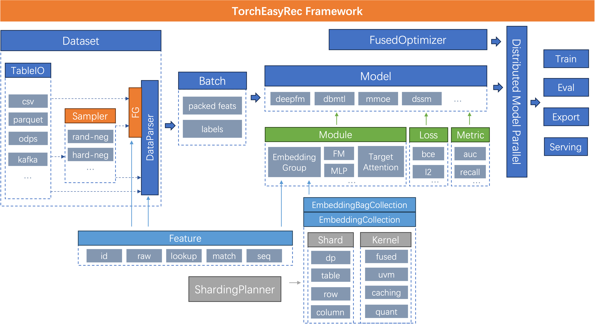

# TorchEasyRec Introduction

## What is TorchEasyRec?

### TorchEasyRec is an easy-to-use framework for Recommendation

TorchEasyRec implements state of the art deep learning models used in common recommendation tasks: candidate generation(matching), scoring(ranking), and multi-task learning. It improves the efficiency of generating high performance models by simple configuration and easy customization.

### Get Started

- [Local](docs/source/quick_start/local_tutorial.md)
- [PAI-DLC](docs/source/quick_start/dlc_tutorial.md)

## Why TorchEasyRec?

### Run everywhere

- Local / [PAI-DLC](https://help.aliyun.com/zh/pai/user-guide/container-training) / [PAI-DSW](https://help.aliyun.com/zh/pai/user-guide/dsw-notebook-service) / [EMR-DataScience](https://help.aliyun.com/document_detail/170836.html)

### Diversified input data

- [MaxCompute Table](https://help.aliyun.com/document_detail/27819.html)
- [OSS files](https://help.aliyun.com/product/31815.html)
- CSV files
- Parquet files

### Easy-to-use

- Flexible feature config and model config
- Easy to implement [customized models](docs/source/models/user_define.md)
- Easy deployment to [EAS](https://help.aliyun.com/zh/pai/user-guide/eas-model-serving): automatic scaling, easy monitoring

### Fast and robust

- Efficient and robust feature generation
- Large scale embedding with different sharding strategies
- Hybrid data-parallelism/model-parallelism
- Optimized kernels for RecSys powered by TorchRec
- Consistency guarantee: train and serving

### A variety of features & models

- IdFeature / RawFeature / ComboFeature / LookupFeature / MatchFeature / ExprFeature / OverlapFeature / TokenizeFeature / SequenceIdFeature / SequenceRawFeature / SequenceFeature
- [DSSM](docs/source/models/dssm.md) / [TDM](docs/source/models/tdm.md)
- [DeepFM](docs/source/models/deepfm.md) / [MultiTower](docs/source/models/multi_tower.md) / [DIN](docs/source/models/din.md)
- [MMoE](docs/source/models/mmoe.md) / [DBMTL](docs/source/models/dbmtl.md) / [PLE](docs/source/models/ple.md)
- More models in development

## Contribute

Any contributions you make are greatly appreciated!

- Please report bugs by submitting a issue.
- Please submit contributions using pull requests.
- Please refer to the [Development](docs/source/develop.md) document for more details.

## Contact

### Join Us

- DingDing Group: 32260796, click [this url](https://page.dingtalk.com/wow/z/dingtalk/simple/ddhomedownload?action=joingroup&code=v1,k1,MwaiOIY1Tb2W+onmBBumO7sQsdDOYjBmv6FXC6wTGns=&_dt_no_comment=1&origin=11#/) or scan QrCode to join!

- DingDing Group2: 37930014162, click [this url](https://page.dingtalk.com/wow/z/dingtalk/simple/ddhomedownload?action=joingroup&code=v1,k1,1ppFWEXXNPyxUClHh77gCmpfB+JcPhbFv6FXC6wTGns=&_dt_no_comment=1&origin=11#/) or scan QrCode to join!

  
    

- Email Group: easy_rec@service.aliyun.com.

### Enterprise Service

- If you have any questions about how to use TorchEasyRec, please join the DingTalk group and contact us.
- If you have enterprise service needs or need to purchase Alibaba Cloud services to build a recommendation system, please join the DingTalk group to contact us.

## License

TorchEasyRec is released under Apache License 2.0. Please note that third-party libraries may not have the same license as TorchEasyRec.
