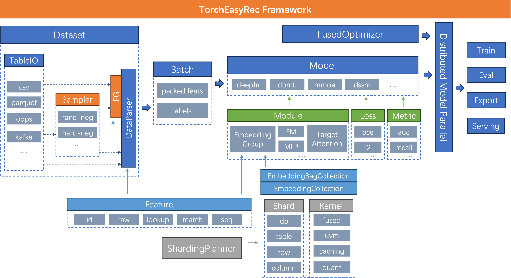

<div align="center">
  <h1>TorchEasyRec</h1>
  <p><strong>A PyTorch-based recommendation system framework for production-ready deep learning models</strong></p>

<p>
    <a href="https://github.com/alibaba/TorchEasyRec/blob/master/LICENSE">
      
    </a>
    <a href="https://github.com/alibaba/TorchEasyRec/actions/workflows/unittest_ci.yml">
      
    </a>
    <a href="https://github.com/alibaba/TorchEasyRec/actions/workflows/unittest_nightly.yml">
      
    </a>
    
  </p>
</div>

## What is TorchEasyRec?

TorchEasyRec implements state-of-the-art deep learning models for recommendation tasks: **candidate generation (matching)**, **scoring (ranking)**, **multi-task learning**, and **generative recommendation**. It enables efficient development of high-performance models through simple configuration and easy customization.



## Key Features

### Data Sources

- **MaxCompute/ODPS** - Native Alibaba Cloud data warehouse integration
- **Parquet** - High-performance columnar file format when use [OSS](https://help.aliyun.com/zh/oss/) or NAS storage, with built-in auto-rebalancing capabilities
- **CSV** - Standard tabular file format
- **Streaming** - Kafka message queue integration, also compatible with [Alibaba Datahub](https://help.aliyun.com/zh/datahub/product-overview/what-is-datahub)
- **Checkpointable** - Resume training from exact data position

### Scalability

- **Distributed Training** - Hybrid data/model parallelism via TorchRec
- **Large Embeddings** - Row-wise, column-wise, table-wise sharding
- **Zero-Collision Hash** - Large scale Dynamic embedding with eviction policies (LFU/LRU)
- **Mixed Precision** - FP16/BF16 training support

### Production

- **Feature Generation** - Consistent FG between training and serving
- **[EAS](https://help.aliyun.com/zh/pai/user-guide/eas-model-serving) Deployment** - Auto-scaling model serving on Alibaba Cloud
- **TensorRT/AOTInductor** - Model acceleration for inference

### Features & Models

- **20+ Models** - Battle-tested algorithms powering real-world recommendation: DSSM, TDM, DeepFM, DIN, MMoE, PLE, PEPNet, DLRM-HSTU and more
- **Custom Model** - Easy to implement [customized models](docs/source/models/user_define.md)
- **10+ Feature Types** - IdFeature, RawFeature, ComboFeature, LookupFeature, ExprFeature, SequenceFeature, CustomFeature, and more
- **Custom Feature** - Easy to implement [customized features](https://help.aliyun.com/zh/airec/what-is-pai-rec/user-guide/custom-feature-operator)

## Supported Models

### Matching (Candidate Generation)

| Model                                    | Description                                      |
| ---------------------------------------- | ------------------------------------------------ |
| [DSSM](docs/source/models/dssm.md)       | Two-tower deep semantic matching model           |
| [DSSM-V2](docs/source/models/dssm_v2.md) | Enhanced DSSM with cross-tower embedding sharing |
| [MIND](docs/source/models/mind.md)       | Multi-interest network with dynamic routing      |
| [TDM](docs/source/models/tdm.md)         | Tree-based deep model for large-scale retrieval  |
| [DAT](docs/source/models/dat.md)         | Dual augmented two-tower model                   |

### Ranking (Scoring)

| Model                                                     | Description                                    |
| --------------------------------------------------------- | ---------------------------------------------- |
| [DeepFM](docs/source/models/deepfm.md)                    | Factorization-machine based neural network     |
| [WideAndDeep](docs/source/models/wide_and_deep.md)        | Wide & Deep learning for recommendations       |
| [MultiTower](docs/source/models/multi_tower.md)           | Flexible multi-tower architecture              |
| [DIN](docs/source/models/din.md)                          | Deep Interest Network with attention mechanism |
| [DLRM](docs/source/models/dlrm.md)                        | Deep Learning Recommendation Model             |
| [DCN](docs/source/models/dcn.md)                          | Deep & Cross Network                           |
| [DCN-V2](docs/source/models/dcn_v2.md)                    | Improved Deep & Cross Network                  |
| [MaskNet](docs/source/models/masknet.md)                  | Instance-guided mask for feature interaction   |
| [xDeepFM](docs/source/models/xdeepfm.md)                  | Compressed interaction network                 |
| [WuKong](docs/source/models/wukong.md)                    | Dense scaling with high-order interactions     |
| [RocketLaunching](docs/source/models/rocket_launching.md) | Knowledge distillation framework               |

### Multi-Task Learning

| Model                                  | Description                                  |
| -------------------------------------- | -------------------------------------------- |
| [MMoE](docs/source/models/mmoe.md)     | Multi-gate Mixture-of-Experts                |
| [PLE](docs/source/models/ple.md)       | Progressive Layered Extraction               |
| [DBMTL](docs/source/models/dbmtl.md)   | Deep Bayesian Multi-task Learning            |
| [PEPNet](docs/source/models/pepnet.md) | Personalized Embedding and Parameter Network |

### Generative Recommendation

| Model                                        | Description                                |
| -------------------------------------------- | ------------------------------------------ |
| [DLRM-HSTU](docs/source/models/dlrm_hstu.md) | Hierarchical Sequential Transduction Units |

## Documentation

Get started with TorchEasyRec in minutes:

| Tutorial                                                                 | Description                                         |
| ------------------------------------------------------------------------ | --------------------------------------------------- |
| [Local Training](docs/source/quick_start/local_tutorial.md)              | Train models on your local machine or single server |
| [PAI-DLC Training](docs/source/quick_start/dlc_tutorial.md)              | Distributed training on Alibaba Cloud PAI-DLC       |
| [DLC + MaxCompute](docs/source/quick_start/dlc_odps_dataset_tutorial.md) | Train with MaxCompute (ODPS) datasets on PAI-DLC    |

For the completed documentation, please refer to https://torcheasyrec.readthedocs.io/

## Community & Support

- **GitHub Issues** - [Report bugs or Request features](https://github.com/alibaba/TorchEasyRec/issues)

- **DingTalk Groups**

  - DingDing Group: 32260796 - [Join](https://h5.dingtalk.com/circle/joinCircle.html?corpId=ding1fe214a7fea14f55a39a90f97fcb1e09&token=a970cf981a8cd15424aeb839c0fdc2a4&groupCode=v1,k1,QH4dGSsGXXWW+onmBBumO1U9mQElyRKWi2x16a6oTVY=&from=group&ext=%7B%22channel%22%3A%22QR_GROUP_NORMAL%22%2C%22extension%22%3A%7B%22groupCode%22%3A%22v1%2Ck1%2CQH4dGSsGXXWW%2BonmBBumO1U9mQElyRKWi2x16a6oTVY%3D%22%2C%22groupFrom%22%3A%22group%22%7D%2C%22inviteId%22%3A75657307%2C%22orgId%22%3A644683226%2C%22shareType%22%3A%22GROUP%22%7D&origin=11)
  - DingDing Group2: 37930014162 - [Join](https://h5.dingtalk.com/circle/joinCircle.html?corpId=ding1fe214a7fea14f55a39a90f97fcb1e09&token=a970cf981a8cd15424aeb839c0fdc2a4&groupCode=v1,k1,qTwau91MJZmxUClHh77gCsgcLASX0/eyhysrOf+8emQ=&from=group&ext=%7B%22channel%22%3A%22QR_GROUP_NORMAL%22%2C%22extension%22%3A%7B%22groupCode%22%3A%22v1%2Ck1%2CqTwau91MJZmxUClHh77gCsgcLASX0%2FeyhysrOf%2B8emQ%3D%22%2C%22groupFrom%22%3A%22group%22%7D%2C%22inviteId%22%3A75657307%2C%22orgId%22%3A644683226%2C%22shareType%22%3A%22GROUP%22%7D&origin=11)
    
    

- If you have any questions about how to use TorchEasyRec, please join the DingTalk group and contact us.

- If you have enterprise service needs or need to purchase Alibaba Cloud services to build a recommendation system, please join the DingTalk group to contact us.

## Contributing

Any contributions you make are greatly appreciated!

- Please report bugs by submitting an issue
- Please submit contributions using pull requests
- Please refer to the [Development Guide](docs/source/develop.md) for more details

## Citation

If you use TorchEasyRec in your research, please cite:

```bibtex
@software{torchasyrec2024,
  title = {TorchEasyRec: An Easy-to-Use Framework for Recommendation},
  author = {Alibaba PAI Team},
  year = {2024},
  url = {https://github.com/alibaba/TorchEasyRec}
}
```

## License

TorchEasyRec is released under [Apache License 2.0](LICENSE). Please note that third-party libraries may not have the same license as TorchEasyRec.
