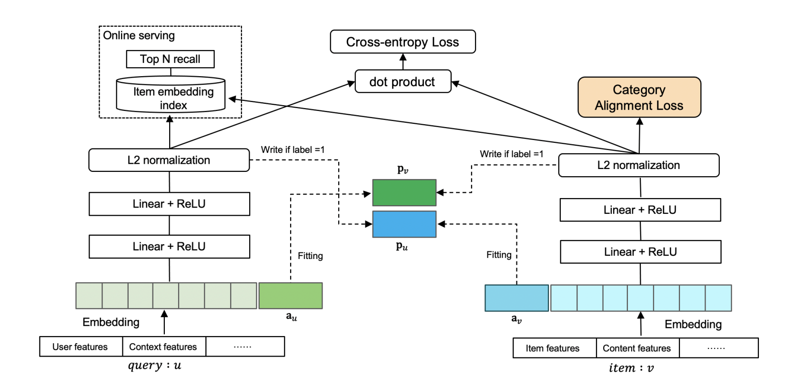

# DAT

## 简介

对偶增强双塔(Dual Augmented Two-Tower, DAT)是对传统DSSM双塔模型的改进。双塔模型对用户和物品的特征分开进行建模，在对特征进行了多层神经网络的整合后进行交互。由于网络的整合可能会损失一部分信息，因此过晚的user/item交互不利于模型的学习，这也是DSSM的一个主要的弊端。在对偶增强双塔算法中，作者设计了一个辅助向量，通过对user和item进行增强，使得user和item的交互更加有效。DAT模型的结构如下图所示。



## 配置说明

作为DSSM的衍生模型，DAT的配置与DSSM类似，在model_config中除了user和item的feature_group外，还需要增加user_augment的feature_group和item_augment的feature_group, 作为模型输入的增强向量。 **两塔各自的DNN最后一层输出维度需要和user_augment/item_augment的embedding维度保持一致**，以便构造AMM损失（Adaptive-Mimic Mechanism）。

amm_u_weight/amm_i_weight: 分别表示user和item的辅助向量AMM损失权重， 默认为0.5。

```
model_config {
    feature_groups {
        group_name: "user"
        feature_names: "user_id"
        feature_names: "cms_segid"
        feature_names: "cms_group_id"
        feature_names: "final_gender_code"
        feature_names: "age_level"
        feature_names: "pvalue_level"
        feature_names: "shopping_level"
        feature_names: "occupation"
        feature_names: "new_user_class_level"
        feature_names: "pid"
        group_type: DEEP
    }
    feature_groups {
        group_name: "item"
        feature_names: "adgroup_id"
        feature_names: "cate_id"
        feature_names: "campaign_id"
        feature_names: "customer"
        feature_names: "brand"
        feature_names: "price"
        group_type: DEEP
    }
    feature_groups {
        group_name: "user_augment"  # 增加user_augment特征组，对user_id特征进行embedding作为辅助向量
        feature_names: "user_id"
        group_type: DEEP
    }
    feature_groups {
        group_name: "item_augment" # 增加item_augment特征组，对item_id特征进行embedding作为辅助向量
        feature_names: "adgroup_id"
        group_type: DEEP
    }
    dat {
        user_tower {
            input: 'user'
            augment_input: 'user_augment'
            mlp {
                hidden_units: [512, 256, 128]
            }
        }
        item_tower {
            input: 'item'
            augment_input: 'item_augment'
            mlp {
                hidden_units: [512, 256, 128]
            }
        }
        output_dim: 64       # 输出维度需要保证和user_augment/item_augment特征组的embedding维度一致
        amm_i_weight: 0.5
        amm_u_weight: 0.5
        temperature: 0.1
        similarity: COSINE
    }
}
```

### 负采样配置

负采样的配置与DSSM一致。

## 示例Config

[dat_taobao.config](https://tzrec.oss-cn-beijing.aliyuncs.com/config/models/dat_taobao.config)

## 参考论文

[DAT.pdf](https://dlp-kdd.github.io/assets/pdf/DLP-KDD_2021_paper_4.pdf)
