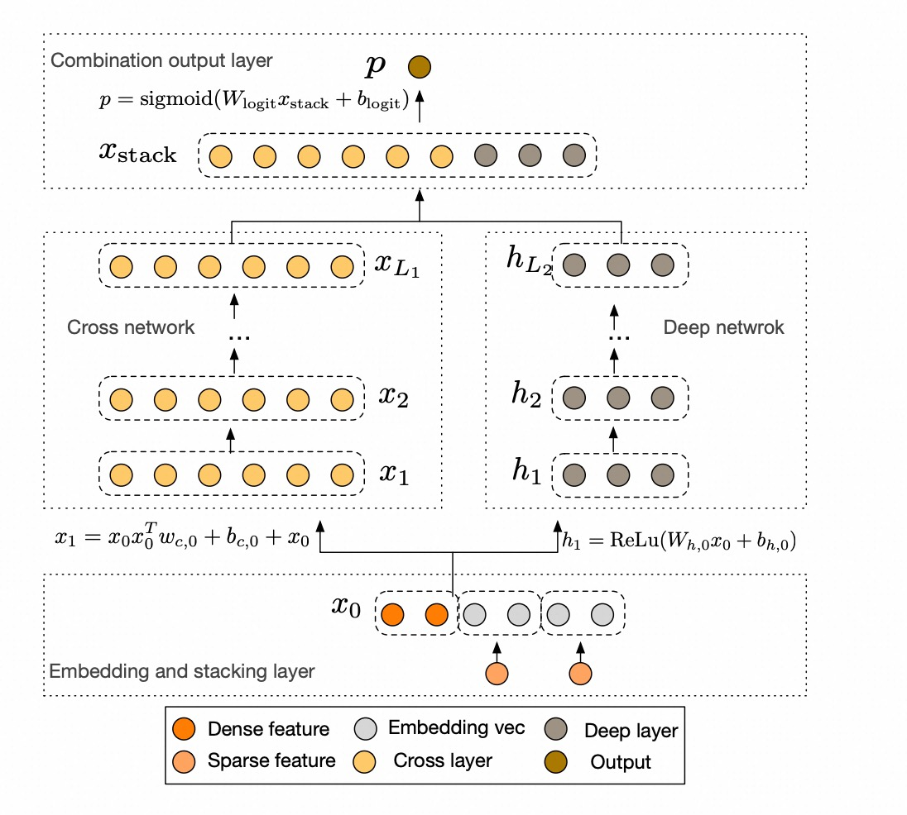

# DCN

## 简介

### DCN v1

Deep＆Cross Network（DCN）是在DNN模型的基础上，引入了交叉网络，该网络在学习某些特征交叉时效率更高。特别是，DCN显式地在每一层应用特征交叉，不需要人工特征工程，并且只增加了很小的额外复杂性。



## 配置说明

### DCNV1

```
model_config {
    feature_groups {
        group_name: "features"
        feature_names: "user_id"
        feature_names: "cms_segid"
        feature_names: "cms_group_id"
        feature_names: "final_gender_code"
        feature_names: "age_level"
        feature_names: "pvalue_level"
        feature_names: "shopping_level"
        feature_names: "occupation"
        feature_names: "new_user_class_level"
        feature_names: "pid"
        feature_names: "adgroup_id"
        feature_names: "cate_id"
        feature_names: "campaign_id"
        feature_names: "customer"
        feature_names: "brand"
        feature_names: "price"
        group_type: DEEP
    }
    dcn_v1 {
        cross {
            cross_num: 3
        }
        deep {
            hidden_units: [256, 128]
        }
        final {
            hidden_units: [64, 32]
        }
    }
    metrics {
        auc {}
        grouped_auc {
            grouping_key: "user_id"
        }
    }
    losses {
        binary_cross_entropy {}
    }
}
```

- cross
  - cross_num: 交叉层层数，默认为3
- deep
  - hidden_units: dnn每一层的channel数目，即神经元的数目
- final: 整合cross层, deep层的全连接层

## 参考论文

[dcn.pdf](https://arxiv.org/abs/1708.05123)
