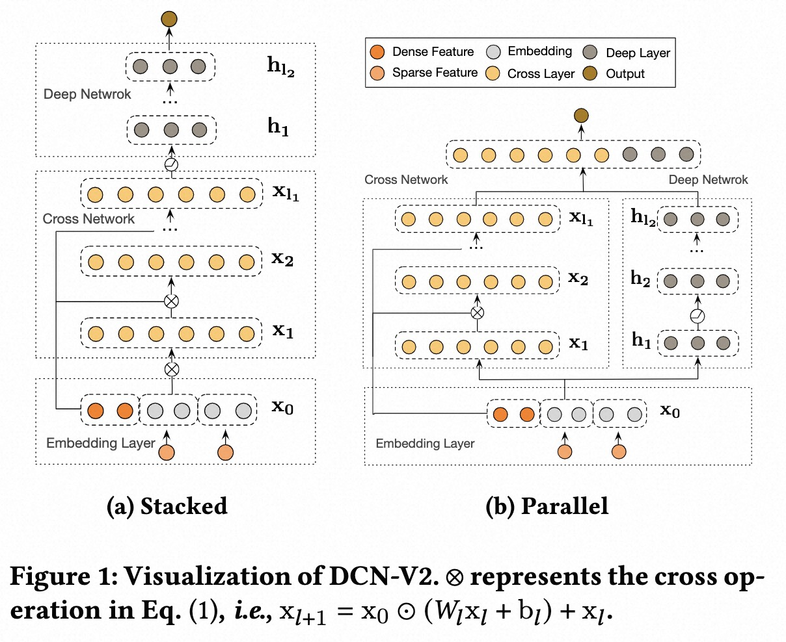
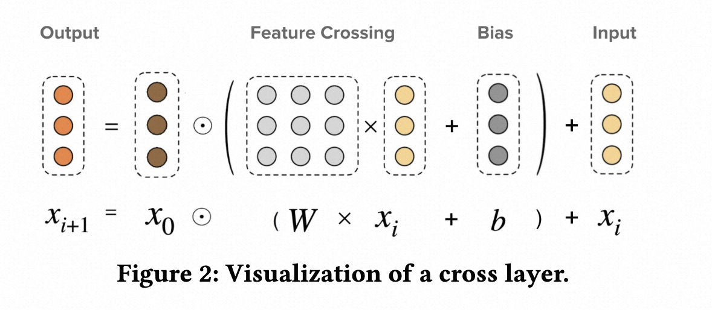

# DCN V2

## 简介

### DCN v2

相对于DCN v1模型，主要的改进点在于：

1. Wide侧-Cross Network中用矩阵替代向量,方阵可以分解成2个低维矩阵;
1. 提出2种模型结构，传统的Wide&Deep并行 + Wide&Deep串行。
   
   

## 配置说明

### DCNV2

```
model_config {
    feature_groups {
        group_name: "features"
        feature_names: "user_id"
        feature_names: "cms_segid"
        feature_names: "cms_group_id"
        feature_names: "final_gender_code"
        feature_names: "age_level"
        feature_names: "pvalue_level"
        feature_names: "shopping_level"
        feature_names: "occupation"
        feature_names: "new_user_class_level"
        feature_names: "pid"
        feature_names: "adgroup_id"
        feature_names: "cate_id"
        feature_names: "campaign_id"
        feature_names: "customer"
        feature_names: "brand"
        feature_names: "price"
        group_type: DEEP
    }
    dcn_v2 {
        backbone {
            hidden_units: 512
            hidden_units: 256
            hidden_units: 128
        }
        cross {
            cross_num: 2
            low_rank: 32
        }
        deep {
            hidden_units: 512
            hidden_units: 256
        }
        final {
            hidden_units: 128
            hidden_units: 32
        }
    }
    num_class: 1
    metrics {
        auc {}
    }
    losses {
        binary_cross_entropy {}
    }
}
```

- backbone: dnn层,可选配置,特征在进入cross层的时候是否要经过dnn层的处理
- cross
  - cross_num: 交叉层层数，默认为3
  - low_rank: cross层中大矩阵分解成2个低维矩阵的维度
- deep
  - hidden_units: dnn每一层的channel数目，即神经元的数目
- final: 整合cross层, deep层的全连接层

### 示例Config

[dcn_v2_demo.config](https://tzrec.oss-cn-beijing.aliyuncs.com/config/models/dcn_v2_criteo.config)

### 参考论文

[DCN v2](https://arxiv.org/abs/2008.13535)
