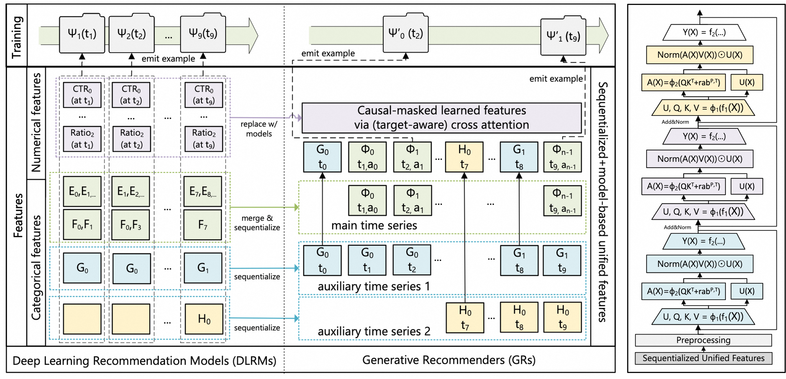

# DLRM HSTU

### 简介

HSTU (Hierarchical Sequential Trans-duction Units) 是Meta提出的一种生成式推荐模型, DlrmHSTU是其中的排序部分。该模型直接针对用户原始的超长的曝光/点击/行为序列基于类Transformer的架构进行建模，尝试在推荐场景实现Scaling Law。



注意：该模型的样本格式与传统推荐模型不同，一个用户一个时间窗内的行为会聚合成单条样本

### 配置说明

```protobuf
model_config {
    feature_groups {
        group_name: "contextual"
        feature_names: "user_id"
        feature_names: "user_active_degree"
        feature_names: "follow_user_num_range"
        feature_names: "fans_user_num_range"
        feature_names: "friend_user_num_range"
        feature_names: "register_days_range"
        group_type: DEEP
    }
    feature_groups {
        group_name: "uih"
        feature_names: "video_id"
        group_type: JAGGED_SEQUENCE
    }
    feature_groups {
        group_name: "candidate"
        feature_names: "item_video_id"
        group_type: JAGGED_SEQUENCE
    }
    feature_groups {
        group_name: "uih_action"
        feature_names: "action_weight"
        group_type: JAGGED_SEQUENCE
    }
    feature_groups {
        group_name: "uih_watchtime"
        feature_names: "watch_time"
        group_type: JAGGED_SEQUENCE
    }
    feature_groups {
        group_name: "uih_timestamp"
        feature_names: "action_timestamp"
        group_type: JAGGED_SEQUENCE
    }
    feature_groups {
        group_name: "candidate_timestamp"
        feature_names: "item_query_time"
        group_type: JAGGED_SEQUENCE
    }
    dlrm_hstu {
        hstu {
            stu {
                embedding_dim: 512
                num_heads: 4
                hidden_dim: 128
                attention_dim: 128
                output_dropout_ratio: 0.1
                use_group_norm: true
            }
            input_dropout_ratio: 0.2
            attn_num_layers: 3
            positional_encoder {
                num_position_buckets: 8192
                num_time_buckets: 2048
                use_time_encoding: true
            }
            input_preprocessor {
                contextual_preprocessor {
                    action_encoder {
                        simple_action_encoder {
                            action_embedding_dim: 8
                            action_weights: [1, 2, 4, 8, 16, 32, 64, 128]
                        }
                    }
                    action_mlp {
                        simple_mlp {
                            hidden_dim: 256
                        }
                    }
                    content_encoder {
                        slice_content_encoder {}
                    }
                    content_mlp {
                        simple_mlp {
                            hidden_dim: 256
                        }
                    }
                }
            }
            output_postprocessor {
                timestamp_layernorm_postprocessor {
                    time_duration_period_units: [3600, 86400]
                    time_duration_units_per_period: [24, 7]
                }
            }
        }
        fusion_mtl_tower {
            mlp {
                hidden_units: 512
                activation: "nn.SiLU"
                use_ln: true
            }
            task_configs {
                task_name: "is_click"
                label_name: "item_action_weight"
                task_bitmask: 1
                losses {
                    binary_cross_entropy {}
                }
                metrics {
                    auc {}
                }
            }
            task_configs {
                task_name: "is_like"
                label_name: "item_action_weight"
                task_bitmask: 2
                losses {
                    binary_cross_entropy {}
                }
                metrics {
                    auc {}
                }
            }
        }
        max_seq_len: 8000
    }
    kernel: TRITON
}
```

- feature_groups: 特征组

  - 包含feature_group: contextual, uih, candidate, uih_action, uih_watchtime, uih_timestamp, candidate_timestamp **group name不能变**, 三个group的
    - contextual: 用户侧的ID特征；类型为DEEP
    - uih: 用户历史行为序列，可增加side info；类型为JAGGED_SEQUENCE
    - candidate: 用户当前样本时间窗交互的物品的行为序列，可增加side info；类型为JAGGED_SEQUENCE
    - uih_action: 用户历史交互的行为事件序列，注: 该行为事件按位存储，如expr, click, add, buy三个行为，则一般expr=0, click=1, add=2, buy=4；类型为JAGGED_SEQUENCE
    - uih_watchtime: 用户历史交互的行为时长序列；类型为JAGGED_SEQUENCE
    - uih_timestamp: 用户历史交互的行为时间戳序列；类型为JAGGED_SEQUENCE
    - candidate_timestamp: 用户当前样本时间窗交互的物品请求时间序列；类型为JAGGED_SEQUENCE

- dlrm_hstu: dlrm_hstu 模型相关的参数

  - hstu: HSTU模型参数配置
    - stu: STU模块配置
    - input_dropout_ratio: 输入是否使用dropout
    - attn_num_layers: STU层数
    - positional_encoder: 位置时间编码配置
    - input_preprocessor: 输入特征预处理配置，主要用于contextual和action特征处理
    - output_postprocessor: 输出后处理配置，主要用于normalization
  - fusion_mtl_tower: 多目标目标塔配置
    - task_configs:
      - task_name: 任务名
      - label_name: Label序列名(用户当前样本时间窗交互的行为事件序列名)
      - task_bitmask: label位mask，如果是分类目标的话需要设置
      - losses: 损失函数
      - metrics: 任务指标
  - max_seq_len: 最大序列长度

- kernel: 算子实现，可选TRITON/PYTORCH，TRITON通常比PYTORCH快2-3x，节省2-3x显存

### 示例Config

[dlrm_hstu_kuairand.config](https://tzrec.oss-cn-beijing.aliyuncs.com/config/models/dlrm_hstu_kuairand.config)

### 参考论文

[HSTU](https://arxiv.org/abs/2402.17152)
