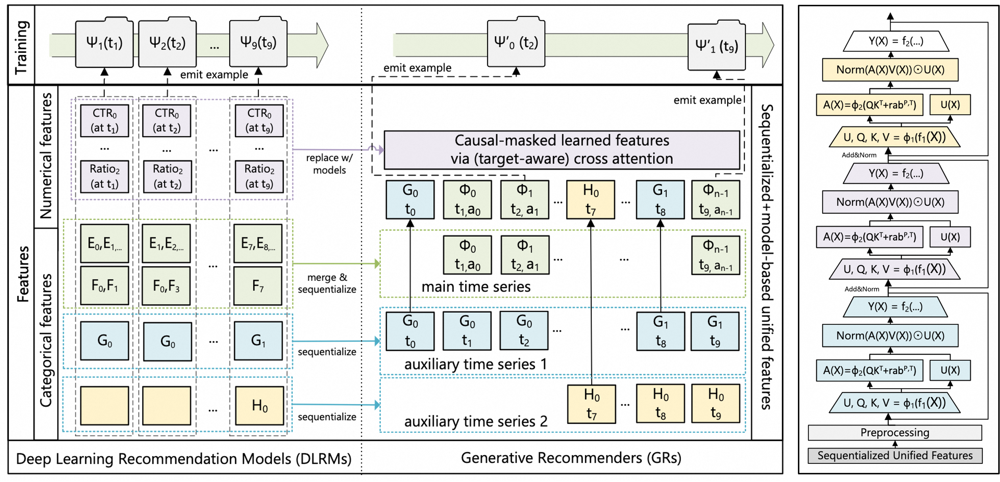

# DLRM HSTU

## 简介

HSTU (Hierarchical Sequential Trans-duction Units) 是Meta提出的一种生成式推荐模型, DlrmHSTU是其中的排序部分。该模型直接针对用户原始的超长的曝光/点击/行为序列基于类Transformer的架构进行建模，尝试在推荐场景实现Scaling Law。



注意：该模型的样本格式与传统推荐模型不同，一个用户一个时间窗内的行为会聚合成单条样本

## 配置说明

### MetaGR Style 配置方式

```
model_config {
    feature_groups {
        group_name: "contextual"
        feature_names: "user_id"
        feature_names: "user_active_degree"
        feature_names: "follow_user_num_range"
        feature_names: "fans_user_num_range"
        feature_names: "friend_user_num_range"
        feature_names: "register_days_range"
        group_type: DEEP
    }
    feature_groups {
        group_name: "uih"
        feature_names: "uih_seq__video_id"
        group_type: JAGGED_SEQUENCE
    }
    feature_groups {
        group_name: "candidate"
        feature_names: "cand_seq___video_id"
        group_type: JAGGED_SEQUENCE
    }
    feature_groups {
        group_name: "uih_action"
        feature_names: "uih_seq__action_weight"
        group_type: JAGGED_SEQUENCE
    }
    feature_groups {
        group_name: "uih_watchtime"
        feature_names: "uih_seq__watch_time"
        group_type: JAGGED_SEQUENCE
    }
    feature_groups {
        group_name: "uih_timestamp"
        feature_names: "uih_seq__action_timestamp"
        group_type: JAGGED_SEQUENCE
    }
    feature_groups {
        group_name: "candidate_timestamp"
        feature_names: "cand_seq___query_time"
        group_type: JAGGED_SEQUENCE
    }
    dlrm_hstu {
        hstu {
            stu {
                embedding_dim: 512
                num_heads: 4
                hidden_dim: 128
                attention_dim: 128
                output_dropout_ratio: 0.1
                use_group_norm: true
            }
            input_dropout_ratio: 0.2
            attn_num_layers: 3
            positional_encoder {
                num_position_buckets: 8192
                num_time_buckets: 2048
                use_time_encoding: true
            }
            input_preprocessor {
                contextual_preprocessor {
                    action_encoder {
                        simple_action_encoder {
                            action_embedding_dim: 8
                            action_weights: [1, 2]
                        }
                    }
                    action_mlp {
                        simple_mlp {
                            hidden_dim: 256
                        }
                    }
                    content_encoder {
                        slice_content_encoder {}
                    }
                    content_mlp {
                        simple_mlp {
                            hidden_dim: 256
                        }
                    }
                }
            }
            output_postprocessor {
                timestamp_layernorm_postprocessor {
                    time_duration_period_units: [3600, 86400]
                    time_duration_units_per_period: [24, 7]
                }
            }
        }
        fusion_mtl_tower {
            mlp {
                hidden_units: 512
                activation: "nn.SiLU"
                use_ln: true
            }
            task_configs {
                task_name: "is_click"
                label_name: "cand_seq___action_weight"
                task_bitmask: 1
                losses {
                    binary_cross_entropy {}
                }
                metrics {
                    auc {}
                }
            }
            task_configs {
                task_name: "is_like"
                label_name: "cand_seq___action_weight"
                task_bitmask: 2
                losses {
                    binary_cross_entropy {}
                }
                metrics {
                    auc {}
                }
            }
        }
        max_seq_len: 8000
    }
    kernel: TRITON
}
```

- feature_groups: 特征组

  - 包含feature_group: contextual, uih, candidate, uih_action, uih_watchtime, uih_timestamp, candidate_timestamp **group name不能变**, 三个group的
    - contextual: 用户侧的ID特征；类型为DEEP
    - uih: 用户历史行为序列，可增加side info；类型为JAGGED_SEQUENCE
    - candidate: 用户当前样本时间窗交互的物品的行为序列，可增加side info；类型为JAGGED_SEQUENCE
    - uih_action: 用户历史交互的行为事件序列，注: 该行为事件按位存储，如expr, click, add, buy三个行为，则一般expr=0, click=1, add=2, buy=4；类型为JAGGED_SEQUENCE
    - uih_watchtime: 用户历史交互的行为时长序列；类型为JAGGED_SEQUENCE
    - uih_timestamp: 用户历史交互的行为时间戳序列；类型为JAGGED_SEQUENCE
    - candidate_timestamp: 用户当前样本时间窗交互的物品请求时间序列；类型为JAGGED_SEQUENCE

- dlrm_hstu: dlrm_hstu 模型相关的参数

  - hstu: HSTU模型参数配置
    - stu: STU模块配置（参见下文 ULTRA-HSTU 节介绍 `sla_k1` / `sla_k2`）
    - input_dropout_ratio: 输入是否使用dropout
    - attn_num_layers: STU层数
    - positional_encoder: 位置时间编码配置
    - input_preprocessor: 输入特征预处理配置，主要用于contextual和action特征处理
    - output_postprocessor: 输出后处理配置，主要用于normalization
    - attn_truncation_split_layer: 注意力截断的分层位置 N1（参见下文 ULTRA-HSTU 节）
    - attn_truncation_tail_len: 注意力截断时每个样本保留的UIH尾部token数
  - fusion_mtl_tower: 多目标目标塔配置
    - task_configs:
      - task_name: 任务名
      - label_name: Label序列名(用户当前样本时间窗交互的行为事件序列名)
      - task_bitmask: label位mask，如果是分类目标的话需要设置
      - losses: 损失函数
      - metrics: 任务指标
  - max_seq_len: 最大序列长度

- kernel: 算子实现，可选TRITON/PYTORCH/CUTLASS

  - TRITON: 基于Triton的实现，通常比PYTORCH快2-3x，节省2-3x显存
  - CUTLASS: 基于CUTLASS的CUDA融合算子实现，需安装hstu_attn包（DEVICE可选cu126/cu129：`pip install hstu_attn-0.1.0+bea6b4b.${DEVICE} -f https://tzrec.oss-accelerate.aliyuncs.com/third_party/hstu/${DEVICE}/repo.html`），要求`attention_dim`等于`hidden_dim`，支持Ampere/Ada/Hopper GPU
  - PYTORCH: 纯PyTorch实现，兼容性最好

### MTGR Style 配置方式

MTGR在candidate特征组中增加u-i交叉特征的序列，可使用mlp_content_encoder将uih和candidate的序列token拉齐到统一的特征空间，示例如下：

```
model_config {
    feature_groups {
        group_name: "contextual"
        feature_names: "user_id"
        feature_names: "user_active_degree"
        feature_names: "follow_user_num_range"
        feature_names: "fans_user_num_range"
        feature_names: "friend_user_num_range"
        feature_names: "register_days_range"
        group_type: DEEP
    }
    feature_groups {
        group_name: "uih"
        feature_names: "uih_seq__video_id"
        feature_names: "uih_seq__video_cate1"   # 物品属性
        feature_names: "uih_seq__video_cate2"
        group_type: JAGGED_SEQUENCE
    }
    feature_groups {
        group_name: "candidate"
        feature_names: "cand_seq___video_id"
        feature_names: "cand_seq___video_cate1" # 物品属性
        feature_names: "cand_seq___video_cate2"
        feature_names: "cand_seq___user_video_cross1"  # 交叉特征
        feature_names: "cand_seq___user_video_cross2"
        group_type: JAGGED_SEQUENCE
    }
    feature_groups {
        group_name: "uih_action"
        feature_names: "uih_seq__action_weight"
        group_type: JAGGED_SEQUENCE
    }
    feature_groups {
        group_name: "uih_watchtime"
        feature_names: "uih_seq__watch_time"
        group_type: JAGGED_SEQUENCE
    }
    feature_groups {
        group_name: "uih_timestamp"
        feature_names: "uih_seq__action_timestamp"
        group_type: JAGGED_SEQUENCE
    }
    feature_groups {
        group_name: "candidate_timestamp"
        feature_names: "cand_seq___query_time"
        group_type: JAGGED_SEQUENCE
    }
    dlrm_hstu {
        hstu {
            stu {
                embedding_dim: 512
                num_heads: 4
                hidden_dim: 128
                attention_dim: 128
                output_dropout_ratio: 0.1
                use_group_norm: true
            }
            input_dropout_ratio: 0.2
            attn_num_layers: 3
            positional_encoder {
                num_position_buckets: 8192
                num_time_buckets: 2048
                use_time_encoding: true
            }
            input_preprocessor {
                contextual_preprocessor {
                    action_encoder {
                        simple_action_encoder {
                            action_embedding_dim: 8
                            action_weights: [1, 2]
                        }
                    }
                    action_mlp {
                        simple_mlp {
                            hidden_dim: 256
                        }
                    }
                    content_encoder {
                        mlp_content_encoder {
                            uih_mlp {
                                hidden_dim: 256
                            }
                            target_mlp {
                                hidden_dim: 256
                            }
                        }
                    }
                    content_mlp {
                        simple_mlp {
                            hidden_dim: 256
                        }
                    }
                }
            }
            output_postprocessor {
                layernorm_postprocessor {}
            }
        }
        fusion_mtl_tower {
            mlp {
                hidden_units: 512
                activation: "nn.SiLU"
                use_ln: true
            }
            task_configs {
                task_name: "is_click"
                label_name: "cand_seq___action_weight"
                task_bitmask: 1
                losses {
                    binary_cross_entropy {}
                }
                metrics {
                    auc {}
                }
            }
        }
        max_seq_len: 8000
    }
    kernel: TRITON
}
```

## 示例

模型的训练和评估方式同[local_tutorial](../quick_start/local_tutorial.md)，以 kuairand-27k 为例的数据和配置如下：

### 数据

[kuairand-27k.tar.gz](https://tzrec.oss-cn-beijing.aliyuncs.com/data/models/kuairand-27k.tar.gz)

### 配置文件

[dlrm_hstu_kuairand.config](https://tzrec.oss-cn-beijing.aliyuncs.com/config/models/dlrm_hstu_kuairand.config)
注: 如遇到训练不稳定问题，可优先考虑调整混合精度相关的配置: 去除train_config中的mixed_precision，去除feature_configs中的data_type，设置train_config.cuda_matmul_allow_tf32=true

### 模型导出

hstu模型导出时， 需要通过命令行参数 `--additional_export_config` 传入一个 JSON， 其中 `cand_seq_pk` 指定 candidate 序列特征的名称（即 `sequence_feature.sequence_name`， 例如 `cand_seq`）。该 JSON 的内容会被合并写入 `model_acc.json` 供在线推理使用。

例如:

```
torchrun --master_addr=localhost --master_port=32555 \
    --nnodes=1 --nproc-per-node=1 --node_rank=0 \
    -m tzrec.export \
    --pipeline_config_path experiments/dlrm_hstu/pipeline.config \
    --additional_export_config '{"cand_seq_pk": "cand_seq"}' \
    --export_dir experiments/dlrm_hstu/export
```

## ULTRA-HSTU

ULTRA-HSTU 在 HSTU 之上引入了三个可独立开启的优化（参见 [ULTRA-HSTU](https://arxiv.org/abs/2602.16986)）：Semi-Local Attention、注意力截断、以及精细化的重计算控制。

### Semi-Local Attention（SLA）

SLA 通过 `sla_k1` / `sla_k2` 把全局 attention 拆成「局部因果窗口 + 全局前缀」：history 行只 attend 到 `[max(0, pos - sla_k1 + 1), pos]` 这个局部窗口加上前 `max(sla_k2, contextual_seq_len)` 个全局 token。两个参数都为 0 时表示禁用 SLA。

- `sla_k1`：局部因果窗口大小（`0` 表示禁用）。
- `sla_k2`：全局前缀长度（`0` 表示禁用；`contextual_seq_len > 0` 时会自动取 `max(sla_k2, contextual_seq_len)`）。
- SLA 仅支持 `Kernel.CUTLASS`（生产）和 `Kernel.PYTORCH`（参考实现）。`Kernel.TRITON` 没有 NFUNC 路径，会在构造期或前向直接报错。

```
stu {
    embedding_dim: 512
    num_heads: 4
    sla_k1: 256
    sla_k2: 32
    ...
}
```

### 注意力截断（Attention Truncation）

`attn_truncation_split_layer`（N1）和 `attn_truncation_tail_len`（L'）共同启用层间截断：前 N1 层在完整序列上跑，从第 N1 层开始仅保留每个样本最后 L' 个 UIH token，contextual 前缀和 targets 永远保留。两个字段必须同时 `> 0` 才会生效，单独设置其一会在构造期被拒。

```
hstu {
    attn_num_layers: 8
    attn_truncation_split_layer: 2
    attn_truncation_tail_len: 512
    ...
}
```

注意：`STUStack.cached_forward`（serving 路径）暂不支持截断，配置开启时会抛 `NotImplementedError`，避免 train/serve 不一致。

### 选择性重计算

`stu` 下的 `recompute_normed_x` / `recompute_uvqk` / `recompute_y` 控制反向传播时的重计算颗粒度：

- `recompute_normed_x`：`True` 时反向时重算 LayerNorm 后的 `normed_x`。
- `recompute_uvqk`：`True` 时反向时重算 `addmm + split + silu` 得到的 UVQK。
- `recompute_y`：`True` 时反向时重算输出投影。

四种 `(recompute_normed_x, recompute_uvqk)` 组合的前向输出和梯度对位结果均与无重计算的参考实现 bitwise 相同（参见 `tzrec/ops/hstu_compute_test.py::Hstu4WayRematParityTest`）。

## 参考论文

[HSTU](https://arxiv.org/abs/2402.17152)
[ULTRA-HSTU](https://arxiv.org/abs/2602.16986)
