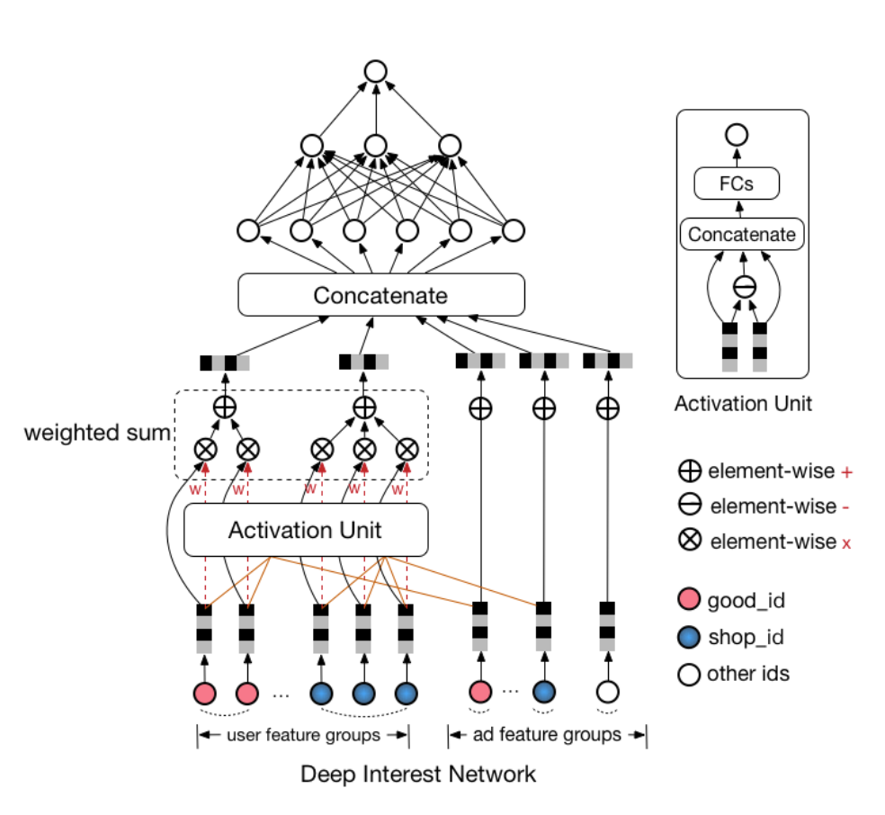

# 特征组

## 简介

feature_group用于将一组特征在Embedding Lookup后聚合成一组，方便在模型中直接根据group_name获取获取一组特征的Embedding值。feature_group支持多组，也支持通过group_type配置多种类型的feature_group，包括WIDE，DEEP，SEQUENCE。

#### SEQUENCE

SEQUENCE: 序列特征组。其中feature_names实际分为`query`和`sequence`部分，`query`对应feature_names中的非序列特征（IdFeature/RawFeature/ComboFeature等），`sequence`对应feature_names中的序列特征（SequenceIdFeature/SequenceRawFeature/SequenceFeature等）。序列特征组的特征经过Embedding后不做任何处理，开发者可以根据`{{group_name}}.query`，`{{group_name}}.sequence`，`{{group_name}}.sequence_length`从`EmbeddingGroup`的输出字典中获取到相应的序列特征信息，从而进一步构建对序列特征的处理。

#### DEEP

DEEP: 深度特征组。其中feature_names只能包含非序列特征（IdFeature/RawFeature/ComboFeature等），但可以嵌套包含多个sequence_groups来配置序列特征，此处序列特征会走对应配置的sequence_encoders进行序列维度的池化，并和非序列特征Embedding拼接在一起，开发者可以根据group_name从EmbeddingGroup的输出字典中获取到相应的特征组Embedding。其中sequence_groups的配置方式同序列特征组，sequence_encoders目前包含DINEncoder和SimpleAttention两种：

- DINEncoder: 该Encoder为DIN模型中使用的序列池化。
  
  假设用户历史序列id为**id**=\[id<sub>1</sub>, id<sub>2</sub>, ..., id<sub>n</sub>\],经过embedding后向量是**ide**=\[ide<sub>1</sub>, ide<sub>2</sub>, ..., ide<sub>n</sub>\]。其中序列池化是把用户历史行为的商品向量与候选广告商品向量做相减，相乘。后经过全连接层后得到每个商品的概率值**score**=\[s<sub>1</sub>,s<sub>2</sub>,...s<sub>n</sub>\] ，在对权重和向量乘积求和，得到池化向量。 如果此时的序列id包含，商品id，商品类目，等多种特征，此时`sequence_groups`中的`query`即当前广告的id，类目等特征向量，`sequence`即历史行为的广告id，类目等特征向量，所以`query`和`sequence`的特征顺序应该对应起来。将多余的特征放在`sequence_groups`配置的最后。

- SimpleAttention: 类似于DINEncoder,其中的**score**是`query`和`sequence`矩阵相乘，得到序列特征中对用的权重，然后对权重和向量乘积求和得到池化向量。由于要做矩阵相乘，要求`query`和`sequence`的特征输数量和顺序一定相同。

- PoolingEncoder: 对变长的`sequence`的Emebdding做池化，`pooling_type`支持mean和sum两种，常用于向量召回模型的user侧特征组

#### WIDE

WIDE: 广度特征组，主要用于WideAndDeep/DeepFM模型。其中feature_names只能包含非序列特征IdFeature/RawFeature/ComboFeature等，embedding_dim固定为4，不根据feature_group中的embedding_dim的配置变化而变化，开发者可以根据group_name从EmbeddingGroup的输出字典中获取到相应的特征组Embedding。不可以包含sequence_groups。

## 配置样例

```
model_config {
    feature_groups {
        group_name: "only_sequence"
        feature_names: "int_0"
        feature_names: "cat_1"
        ...
        feature_names: "click_50__int_0"
        feature_names: "click_50__cat_1"
        group_type: SEQUENCE
    }
    feature_groups {
        group_name: "common_deep"
        feature_names: "int_0"
        feature_names: "int_1"
        ...
        feature_names: "cat_24"
        feature_names: "cat_25"
        group_type: DEEP
    }
    feature_groups {
        group_name: "deep"
        feature_names: "int_0"
        feature_names: "int_1"
        ...
        feature_names: "cat_24"
        feature_names: "cat_25"
        sequence_groups {
            group_name: "click_50"
            feature_names: "int_0"
            feature_names: "cat_1"
            ...
            feature_names: "click_50__int_0"
            feature_names: "click_50__cat_1"
            feature_names: "click_50__ts"
        }
        sequence_groups {
            group_name: "buy_50"
            feature_names: "int_0"
            feature_names: "cat_1"
            ...
            feature_names: "buy_50__int_0"
            feature_names: "buy_50__cat_1"
            feature_names: "buy_50__ts"
        }
        sequence_encoders {
            din_encoder: {
                input: "click_50"
                attn_mlp: {
                    hidden_units: [128, 64]
                }
            }
        }
        sequence_encoders {
            simple_attention: {
                input: "buy_50"
            }
        }
        group_type: DEEP
    }
    feature_groups {
        group_name: "wide"
        feature_names: "int_0"
        feature_names: "int_1"
        ...
        feature_names: "cat_24"
        feature_names: "cat_25"
        group_type: WIDE
    }
}

```
