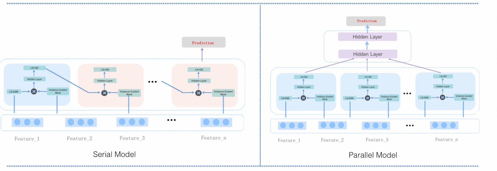

# MaskNet

## 简介

本模型提出实例引导的掩码，将乘法操作引入CTR模型，增强特征交互能力, 突出重要的特征位。设计MaskBlock模块，整合层归一化、掩码和前馈层，作为灵活构建块。MaskNet包含架构： 串行和并行， 如下所示


## 配置说明

```
    mask_net {
        n_mask_blocks: 3
        mask_block {
            reduction_ratio: 3
            hidden_dim: 512
        }
        use_parallel: true
        top_mlp {
            hidden_units: [256, 128, 64]

        }
    }
```

- n_mask_blocks: mask block 的个数
- use_parallel: 为true时使用并行mask blocks, 否则串行
- mask_block: mask block的配置
  - reduction_ratio: 可选，是aggregation_dim与input_feature_dim的比值, 当指定时， aggregation_dim由此参数计算得到， 不看aggregation_dim参数。
  - aggregation_dim: 可选，aggregation layer的维度， 当指定reduction_ratio时可不指定本参数
  - hidden_dim: 全连接隐含层的维度

## 示例config

[masknet_criteo.config](../../../examples/masknet_criteo.config)

## 参考论文

[masknet.pdf](https://arxiv.org/pdf/2102.07619)
