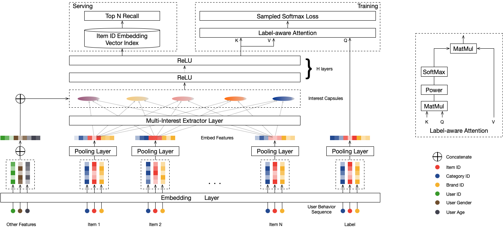

# MIND

mind召回模型, 在dssm的基础上加入了兴趣聚类功能，支持多兴趣召回，能够显著的提升召回层的效果.


## 配置说明

```
feature_configs {
    sequence_feature {
        sequence_name: "click_50_seq"
        sequence_length: 100
        sequence_delim: "|"
        features {
            id_feature {
                feature_name: "adgroup_id"
                num_buckets: 846812
                embedding_dim: 16
                expression: "item:adgroup_id"
            }
        }
        features {
            id_feature {
                feature_name: "cate_id"
                num_buckets: 12961
                embedding_dim: 16
                expression: "item:cate_id"
            }
        }
        features {
            id_feature {
                feature_name: "brand"
                num_buckets: 461498
                embedding_dim: 16
                expression: "item:brand"
            }
        }
    }

}


model_config {
    feature_groups {
        group_name: "user"
        feature_names: "user_id"
        # feature_names: "cms_segid"
        feature_names: "cms_group_id"
        feature_names: "final_gender_code"
        feature_names: "age_level"
        feature_names: "pvalue_level"
        feature_names: "shopping_level"
        feature_names: "occupation"
        feature_names: "new_user_class_level"
        feature_names: "pid"
        group_type: DEEP
    }
    feature_groups {
        group_name: "item"
        feature_names: "adgroup_id"
        feature_names: "cate_id"
        feature_names: "campaign_id"
        feature_names: "customer"
        feature_names: "brand"
        feature_names: "price"
        group_type: DEEP
    }
    feature_groups {
        group_name: "hist"
        feature_names: "click_50_seq__adgroup_id"
        feature_names: "click_50_seq__cate_id"
        feature_names: "click_50_seq__brand"
        group_type: SEQUENCE
    }
    mind{
        user_tower{
            input: 'user'
            history_input: 'hist'
            user_mlp {
                hidden_units: [256, 128]
                use_bn: true
            }
            hist_seq_mlp {
                hidden_units: [256, 128]
                use_bn: true
            }
            capsule_config {
                max_k: 5
                max_seq_len: 64
                high_dim: 64
                squash_pow: 0.2
            }
            concat_mlp {
                hidden_units: [256, 128]
                use_bn: true
            }
        }
        item_tower{
            input: 'item'
            mlp {
                hidden_units: [256, 128]
                use_bn: true
            }
        }

        simi_pow: 20
        in_batch_negative: false

    }

    losses {
        softmax_cross_entropy {}
    }
}

```

## 示例Config

[mind_taobao.config](<>)

## 参考论文

[MIND.pdf](https://arxiv.org/pdf/1904.08030)
