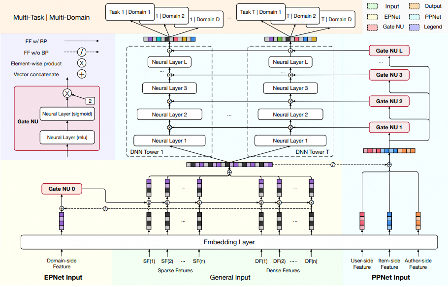

# PEPNet

## 简介

PEPNet将带有个性化先验信息的特征作为输入，通过门控机制，来动态地缩放底层网络-embedding layer和顶层网络-DNN隐藏层单元，分别称之为场景特定的EPNet和任务特定的PPNet：

- Embedding Personalized Network (EPNet) 为底层网络添加场景特定的个性化信息来生成个性化embedding门控，用于执行来自多个场景的原始embedding选择，以生成个性化的embedding
- Parameter Personalized Network (PPNet) 将用户和items的个性化信息与每一个task tower的DNN的输入进行拼接来获得个性化的门控分数，然后采用element-wise product应用到DNN的隐藏层单元上，来个性化优化DNN的参数。

PEPNet的整体结构如下图所示，可以看到，核心的组件便是这三个：Gate NU（门控网络单元）、Embedding Personalized Network (EPNet)、Parameter Personalized Network (PPNet)


## 模型配置

```protobuf
model_config: {
  feature_groups: {
    group_name: 'all'
    feature_names: 'user_id'
    feature_names: 'cms_segid'
    feature_names: 'cms_group_id'
    feature_names: 'age_level'
    feature_names: 'pvalue_level'
    feature_names: 'shopping_level'
    feature_names: 'occupation'
    feature_names: 'new_user_class_level'
    feature_names: 'adgroup_id'
    feature_names: 'cate_id'
    feature_names: 'campaign_id'
    feature_names: 'customer'
    feature_names: 'brand'
    feature_names: 'pid'
    feature_names: 'tag_category_list'
    feature_names: 'tag_brand_list'
    feature_names: 'price'
    wide_deep: DEEP
  }
  feature_groups: {
    group_name: 'domain'
    feature_names: 'occupation'
    wide_deep: DEEP
  }
  feature_groups: {
    group_name: 'uia'
    feature_names: 'user_id'
    feature_names: 'adgroup_id'
    wide_deep: DEEP
  }
  pepnet {
    domain_input_name: 'occupation'
    task_domain_num: 3
    ppnet_hidden_units: [512, 256]
    ppnet_dropout_ratio: [0.1, 0.1]
    task_towers {
      tower_name: "ctr"
      label_name: "clk"
      mlp {
        hidden_units: [256, 128, 64]
      }
      metrics {
        auc {}
      }
      losses {
        binary_cross_entropy {}
      }
    }
    task_towers {
      tower_name: "cvr"
      label_name: "buy"
      mlp {
        hidden_units: [256, 128, 64]
      }
      metrics {
        auc {
          thresholds: 1000
        }
      }
      losses {
        binary_cross_entropy {}
      }
    }
  }
}
```

- feature_groups: 特征组

  - 通常情况下有3个feature_group，分别为3类：all, domain, uia，其中domain和uia是可选配置，根据自身需求进行配置，如果没有对应配置，则也没有对应网络。
  - wide_deep: pepnet模型使用的都是Deep features, 所以都设置成DEEP

- pepnet: pepnet模型相关的参数

  - epnet_hidden_unit: epnet的gateGu的隐层设置，一般介于domain的dim和主特征组dim之间，如果不设置，则默认为主特征组的dim
  - epnet_gamma: epnet的门控参数，默认是2
  - ppnet_hidden_units: 个性化tower的隐藏层设置
  - ppnet_activation: 个性化tower的激活函数,默认是relu
  - ppnet_dropout_ratio: 个性化tower的dropout设置
  - ppnet_gamma: 个性化tower的门控参数，默认是2
  - domain_input_name: 域特征的名称
    - 如果配置该参数，则要求该特征是num_bucket, 且**需要在data_config的label中配置该特征**，会产生和域数量一样多的任务tower。
    - 如果不配置，每个任务塔只会有1个任务塔
  - task_domain_num: 域的数量，会在每个task上产生和域的数量一样多的任务塔。要求域特征值需要小于该值但大于等于0
  - task_towers: 根据任务数配置task_towers
    - tower_name：TaskTower名
    - label_name: tower对应的label名
    - mlp: TaskTower的MLP参数配置
    - weight: 任务权重名
    - sample_weight_name: 样本权重列名
    - losses: 任务损失函数配置
    - metrics: 任务评估指标配置
    - task_space_indicator_label: 标识当前任务空间的目标名称，配合in_task_space_weight、out_task_space_weight使用。例如，对于cvr任务，可以设置task_space_indicator_label=clk，in_task_space_weight=1，out_task_space_weight=0，来使得cvr任务塔只在点击空间计算loss。
      - 注: in_task_space_weight和out_task_space_weight不影响loss权重的绝对值，权重会在batch维度被归一化。例如：in_task_space_weight=10,out_task_space_weight=1跟in_task_space_weight=1,out_task_space_weight=0.1是等价的。如需要提升这个task的loss权重的绝对值，需设置weight参数
    - in_task_space_weight: 对于task_space_indicator_label>0的样本会乘以该权重
    - out_task_space_weight: 对于task_space_indicator_label\<=0的样本会乘以该权重

## 模型输出

- 在不配置domain_input_name和task_domain_num时， 和其余多任务模型一样，每个塔的输出名为："logits\_" / "probs\_" / "y\_" + tower_name
  其中，logits/probs/y对应: sigmoid之前的值/概率/回归模型的预测值
- 当配置domain_input_name和task_domain_num，则模型输出结果为："logits\_" / "probs\_" / "y\_" + tower_name + "\_domain_index",domain_index从0开始,到task_domain_num-1

## 示例Config

[pepnet_taobao.config](https://tzrec.oss-cn-beijing.aliyuncs.com/config/models/pepnet_taobao.config)

## 参考论文

[PEPNet.pdf](https://arxiv.org/pdf/2302.01115)
