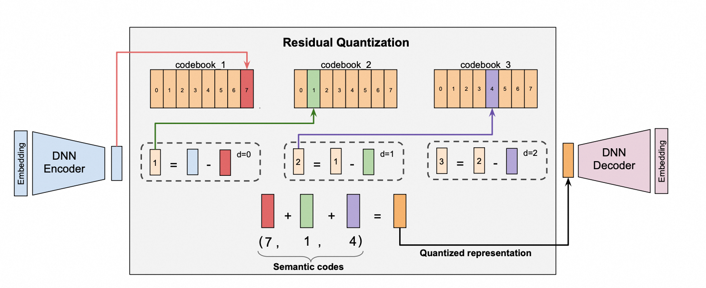

# SID RQVAE

## 简介

RQ-VAE (Residual-Quantized Variational Auto-Encoder) 是一种语义ID (Semantic ID, 简称 SID) 生成模型, 用于把物品的内容/多模态 embedding 量化成一串离散的整数编码 `(code_0, code_1, ..., code_{n-1})`, 每个残差码本层产生一个 code。它是生成式推荐的上游 tokenizer: 先用 RQVAE 把物品 embedding 转成 SID, 下游再用 SID 作为物品 token 进行生成式建模。

模型结构为 `编码器 MLP -> 多层残差向量量化 (Residual Vector Quantizer) -> 解码器 MLP`: 编码器把输入 embedding 压缩到 `embed_dim` 维的潜在向量, 残差量化器逐层把当前残差就近映射到该层码本 (一个可学习的 `nn.Embedding`) 的最近条目, 解码器再用各层量化向量之和重建原始 embedding。码本、编码器、解码器通过梯度联合训练, 量化的不可导通过直通估计 (Straight-Through Estimator, STE) 传递梯度。物品的 SID 即为各残差层最近邻码本下标组成的元组。



注意: RQVAE 通过梯度训练码本, 可多卡训练; 若希望用 FAISS 直接对残差做 K-Means 聚类得到码本 (无编码器/解码器, 单机 CPU), 请参考 [SID RQKMeans](sid_rqkmeans.md)。

RQVAE 还支持 CLIP 风格的双视图对比学习: 除主物品 embedding 外, 再输入一个配对 (paired/clip) embedding 以及一个 0/1 的配对标记, 在对比对样本上额外施加 InfoNCE 对比损失, 使语义相近的两个视图被编码到相近的 SID 空间。本文示例即为带 CLIP 的配置; 关闭 CLIP 的用法见文末。

## 数据格式

RQVAE 的输入是离线预先算好的物品 embedding (例如多模态/文本/图像 embedding), 以 `fg_mode: FG_DAG` 直接读取数组列。带 CLIP 的样本单文件包含如下列:

| 列名 | 类型 | 说明 |
| --- | --- | --- |
| `item_id` | string | 物品 ID (透传列, 模型不消费, 预测时可用 `--reserved_columns` 带出) |
| `embedding` | array\<double\> | 主物品 embedding, 维度需与 `value_dim` 一致 (示例为 512) |
| `clip_item_id` | string | 配对物品 ID (透传列) |
| `clip_embedding` | array\<double\> | 配对 (CLIP) embedding, 维度同 `embedding` |
| `is_contrastive` | int32 (0/1) | 配对标记: `1`=对比对样本, `0`=纯重建样本 (此时 `clip_*` 与主列相同) |

非 CLIP 场景只需 `item_id` + `embedding` 两列。

`is_contrastive` 在语义上是布尔标记, 但**以 0/1 整数存储而非 `bool`**，以 `> 0.5` 判定是否为对比对。embedding 列为原生数组列, 无需 `separator`。

## 配置说明

```
feature_configs {
    raw_feature { feature_name: "emb" expression: "item:embedding" value_dim: 512 }
}
feature_configs {
    raw_feature { feature_name: "clip_emb" expression: "item:clip_embedding" value_dim: 512 }
}
feature_configs {
    raw_feature { feature_name: "is_clip_pair" expression: "item:is_contrastive" value_dim: 1 }
}

model_config {
    feature_groups {
        group_name: "deep"
        feature_names: "emb"
        group_type: DEEP
    }
    feature_groups {
        group_name: "clip_image"
        feature_names: "clip_emb"
        group_type: DEEP
    }
    feature_groups {
        group_name: "clip_pair"
        feature_names: "is_clip_pair"
        group_type: DEEP
    }
    sid_rqvae {
        embed_dim: 64
        hidden_dims: 256
        hidden_dims: 256
        codebook: 256
        codebook: 256
        codebook: 256
        forward_mode: "ste"
        kmeans_init: false
        clip_config {
            clip_feature_group: "clip_image"
            clip_pair_feature_group: "clip_pair"
        }
    }
    losses {
        recon_loss {
            recon_type: "l2"
        }
    }
    losses {
        commitment_loss {
            latent_weight: 0.5
            latent_weight: 0.5
        }
    }
    losses {
        sid_clip_loss {}
    }
}
```

- feature_configs: 特征配置, 每个 embedding/标记列对应一个 `raw_feature`
  - emb: 主物品 embedding, `expression` 指向 Parquet 列名 (`item:` 前缀仅为 FG 命名空间), `value_dim` 须等于 embedding 维度 (示例 512)
  - clip_emb: 配对 (CLIP) embedding, `value_dim` 须与主 embedding 相同
  - is_clip_pair: 0/1 配对标记, `value_dim: 1`
- feature_groups: 特征组, 每组喂给模型的 `EmbeddingGroup`; **group_name 需与下方 sid_rqvae 的引用对应**
  - deep: 主输入组 (默认组名 `deep`), 其拼接后的总维度即编码器输入维度 `input_dim`; 类型 DEEP
  - clip_image: CLIP 配对 embedding 组 (仅 CLIP 时需要); 类型 DEEP
  - clip_pair: CLIP 配对标记组 (仅 CLIP 时需要); 类型 DEEP
- sid_rqvae: RQVAE 模型参数
  - embed_dim: 量化潜在维度, 即编码器输出维度与码本向量维度, 默认 64
  - hidden_dims: 编码器各隐层大小 (解码器按反序镜像), 如 `[256, 256]`; 不配置时默认为 `[input_dim // 2]`
  - codebook: 每层码本大小; **列表长度即残差量化层数 (= SID 的位数)**; 示例为 `[256, 256, 256]` (生产规模常用 `[8192, 8192, 8192]`); 支持非均匀如 `[512, 256, 128]`
  - forward_mode: VQ 前向模式, `"ste"` (默认) 或 `"gumbel_softmax"`
  - normalize_residuals: 每层量化前是否对残差做 L2 归一化, 默认 `false` (开启后重建度量 `mse`/`rel_loss` 不再可比)
  - distance_type: 最近邻度量, `"l2"` (默认) 或 `"cosine"`
  - rotation_trick: 是否使用 rotation-trick 形式的 STE 梯度, 默认 `false`
  - kmeans_init: 是否在首个训练 batch 上用 FAISS 残差 K-Means 初始化码本, 默认 `false`; 需 `batch_size >= max(codebook)`
  - sinkhorn_config: Sinkhorn 均匀分配子配置 (省略时默认启用, `iters=5`, `epsilon=10.0`; 设 `enabled: false` 可关闭)
  - clip_config: CLIP 双编码器结构 (不配置则关闭 CLIP)
    - clip_feature_group: 配对 embedding 特征组名, 须与主组同维 (示例 `clip_image`)
    - clip_pair_feature_group: 配对标记特征组名 (维度 1, `>0.5` 视为对比对; 示例 `clip_pair`)
  - feature_group: 主输入特征组名, 默认 `"deep"`
- losses: 损失配置, 每个 `losses {}` 配一个 SID 损失项, 总损失为各项之和
  - recon_loss: 重建损失 (解码输出 vs 输入 embedding), `recon_type` 可选 `"l2"`/`"l1"`/`"cos"`; CLIP 模式下仅在非配对行 (重建样本) 上计算
  - commitment_loss: VQ commitment 损失; `latent_weight` 为 `[w1, w2]` 两个权重 (默认 `[1.0, 0.5]`, **必须长度为 2**), `commitment_type` 可选 `"l2"`/`"l1"`/`"cos"`
  - sid_clip_loss: 开启 CLIP 对比 (masked InfoNCE) 损失; **须与 `clip_config` 同时设置**; 仅在配对行上生效

> 评估指标自动输出 `mse` (重建均方误差)、`rel_loss` (相对 L1)、`unique_sid_ratio` (每个 batch 内不重复 SID 占比, 反映码本利用/多样性)。

## 示例

### 配置文件

[sid_rqvae.config](https://tzrec.oss-accelerate.aliyuncs.com/config/models/sid_rqvae.config)

### 数据

CLIP 混合数据：
[sid_generation_clip_merged_sample_4w.parquet](https://tzrec.oss-accelerate.aliyuncs.com/data/models/sid_generation_clip_merged_sample_4w.parquet)

非CLIP Item数据：
[sid_generation_item_only_sample_4w.parquet](https://tzrec.oss-accelerate.aliyuncs.com/data/models/sid_generation_item_only_sample_4w.parquet)

### 模型输出

预测输出与输入 `dataset_type` 一致, 每行包含:

- codes: `array<int64>`, 即该物品的 SID, 长度等于 `codebook` 层数, 每个元素为对应残差层的码本下标 (取值范围 `[0, codebook_i)`)。例如 `[241, 134, 78]`。
- item_id: 由 `--reserved_columns` 透传的原始物品 ID。

### 非 CLIP 用法

如果不需要对比学习, 去掉 `clip_image` / `clip_pair` 两个特征组、对应的 `clip_emb` / `is_clip_pair` 特征、`sid_rqvae.clip_config` 以及 `sid_clip_loss`, 输入改用仅含 `item_id` + `embedding` 的 `data/sid_example/item_only/*.parquet` 即可。

## 参考论文

[Recommender Systems with Generative Retrieval (TIGER)](https://arxiv.org/abs/2305.05065)

[Autoregressive Image Generation using Residual Quantization (RQ-VAE)](https://arxiv.org/abs/2203.01941)
