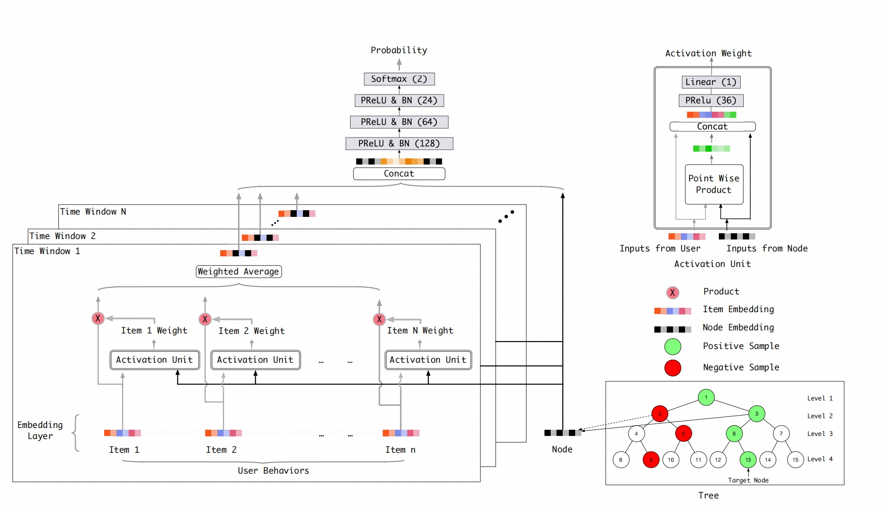

# TDM

### 简介

树召回模型, 支持更早使用交叉特征。



根据item的相似性建立一个完全n叉树, 给每个item构建树索引, 从而增加检索效率, 保证可以使用复杂模型, 更早进行特征交叉。要训练一个树每层节点的分类器, 因此根据样本中每个正样本对应的叶节点, 要逐层进行正负采样, 将其所有祖先节点作为正样本, 再逐层随机选择其他样本作为负样本。 由于每层节点数不同, 因此每层的负采样数也不同。

TorchEasyRec的TDM支持运行时进行负采样，会以图存储的方式将物品的特征分布式地存储在节点上。

注：训练样本一般只需准备点击（正样本）的样本即可

### 配置说明

```
data_config {
    ...
    tdm_sampler {
        item_input_path: 'data/init_tree/node_table.txt'
        edge_input_path: 'data/init_tree/edge_table.txt'
        predict_edge_input_path: 'data/init_tree/predict_edge_table.txt'
        attr_fields: 'tree_level'
        attr_fields: "adgroup_id"
        attr_fields: "cate_id"
        attr_fields: "campaign_id"
        attr_fields: "customer"
        attr_fields: "brand"
        attr_fields: "price"
        item_id_field: "adgroup_id"
        layer_num_sample: [0, 1, 2, 3, 4, 5, 6, 7, 8, 9, 10, 11, 12, 13, 14, 17, 23, 30, 34, 82, 200]
        attr_delimiter : ','
    }
}
model_config {
    feature_groups {
        group_name: 'seq'
        feature_names: 'click_50_seq__adgroup_id'
        feature_names: 'click_50_seq__cate_id'
        feature_names: 'click_50_seq__brand'
        feature_names: 'adgroup_id'
        feature_names: 'cate_id'
        feature_names: 'brand'
        group_type : SEQUENCE
    }
    feature_groups {
        group_name: 'user'
        feature_names: 'user_id'
        feature_names: "cms_segid"
        feature_names: "cms_group_id"
        feature_names: "final_gender_code"
        feature_names: "age_level"
        feature_names: "pvalue_level"
        feature_names: "shopping_level"
        feature_names: "occupation"
        feature_names: "new_user_class_level"
        feature_names: "pid"
        group_type: DEEP
    }
    feature_groups {
        group_name: "item"
        feature_names: "campaign_id"
        feature_names: "customer"
        feature_names: "price"
        group_type: DEEP
    }
    tdm {
        multiwindow_din {
            windows_len: [1,1,1,2,2,2,5,6,10,20]
            attn_mlp {
                hidden_units: [36]
                activation: 'nn.PReLU'
            }
        }
        final {
            hidden_units: [256, 128, 64, 32]
            use_bn: True
        }
    }

    num_class: 2
    metrics{
        auc {}
    }
    losses{
        softmax_cross_entropy{}
    }
}
```

- data_config: 数据配置，其中需要配置负采样Sampler，负采样Sampler的配置详见**负采样配置**
- feature_groups: 必须有group_type为SEQUENCE的feature_group, 为DEEP的可以选择设置
- tdm: tdm相关的参数
  - multiwindow_din: 多个时间窗口的DIN
    - windows_len: 从左到右是时间由近到远的每个窗口长度
    - attn_mlp: attention MLP的参数配置
      - hidden_units: mlp每一层的channel数目，即神经元的数目
      - activation: mlp的激活函数
  - final:final MLP的参数配置
- losses: 损失函数配置
- metrics: 评估指标配置

#### 负采样配置

目前只支持tdm_sampler：

- tdm_sampler：逐层正负采样
  - item_input_path: 负采样Item表, Schema为: id:int64 | weight:float | attrs:string，其中attr默认为","分隔符拼接的Item特征
  - edge_input_path: 训练时用于采样的GraphLearn格式的边表, Schema为: src_id:int64 | dst_id:int64 | weight:float
  - predict_edge_input_path: 召回时用于采样的GraphLearn格式的边表, Schema为: src_id:int64 | dst_id:int64 | weight:float
  - attr_fields: item特征名，第一个attr_fields必须人为多添加一个"tree_level", 并且要和建树时候输入的attr_fields和raw_attr_fields顺序一致, 即顺序为("tree_level", attr_fields, raw_attr_fields)
  - layer_num_sample: 每个样本在树每层的负采样个数
  - item_id_field: item_id列名
  - attr_delimiter: 目前是以","写表的, 因此需设置为","
  - remain_ratio: (可选, 默认为1.0)训练时每个batch内在树中随机选取一定比例的非叶节点层的节点训练, 可以一定程度防止过拟合
  - probability_type: (可选, 默认为"UNIFORM")随机选取树中非叶节点层时, 每层被选中的概率, 目前可选择"UNIFORM", "ARITHMETIC", "RECIPROCAL"
   - "UNIFORM": 每层被选中的概率相同
   - "ARTITHMETIC": 每层被选中概率等差递增
   - "RECIPROCAL": 每层被选中的概率呈反比例函数递增, 即p正比于1/(TREE_LEVEL - CUR_LEVEL)

### 示例Config

[tdm_taobao.config](https://tzrec.oss-cn-beijing.aliyuncs.com/config/quick_start/tdm_taobao_local.config)

### 参考论文

[TDM.pdf](https://arxiv.org/pdf/1801.02294)
