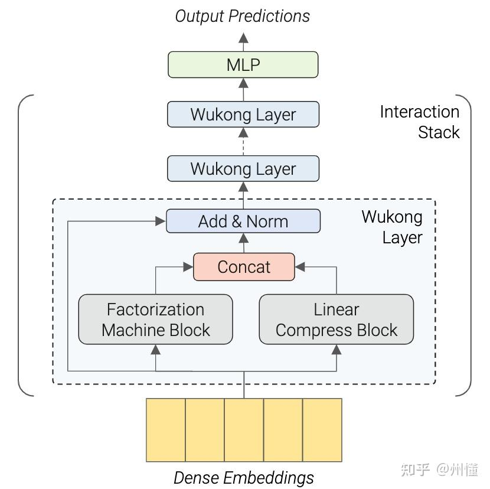

# WuKong

## 简介

meta提出wukong架构，是一个简单的交互架构，旨在为推荐系统建立一种有效的dense scaling机制。wukong架构的设计主要遵循以下两个目标：

- 1.可以有效地捕获复杂的高阶特征交互能力

- 2.确保模型性能的scaling law



## 模型配置

```protobuf
model_config: {
  feature_groups: {
    group_name: 'deep'
    feature_names: 'user_id'
    feature_names: 'cms_segid'
    feature_names: 'cms_group_id'
    feature_names: 'age_level'
    feature_names: 'pvalue_level'
    feature_names: 'shopping_level'
    feature_names: 'occupation'
    feature_names: 'new_user_class_level'
    feature_names: 'adgroup_id'
    feature_names: 'cate_id'
    feature_names: 'campaign_id'
    feature_names: 'customer'
    feature_names: 'brand'
    feature_names: 'pid'
    feature_names: 'tag_category_list'
    feature_names: 'tag_brand_list'
    feature_names: 'price'
    wide_deep: DEEP
  }
  wukong {
    wukong_layers {
      lcb_feature_num: 16,
      fmb_feature_num: 16,
      compressed_feature_num: 8,
      feature_num_mlp {
        hidden_units: 1024
        hidden_units: 512
      }
    }
    wukong_layers {
      lcb_feature_num: 8,
      fmb_feature_num: 8,
      compressed_feature_num: 4,
      feature_num_mlp {
        hidden_units: 512
        hidden_units: 256
      }
    }
    ....
    final {
        hidden_units: 512
        hidden_units: 256
    }
  }
  num_class: 1
  metrics {
      auc {}
  }
  losses {
      binary_cross_entropy {}
  }
}

```

feature_groups: 特征组

- feature_groups: 配置一个feature_group, 不能包含序列特征，所有特征都需要配置一样的embedding_dim。

- wukong: wukong模型相关的参数

  - wukong_layers: 特征交叉层参数，可以配置多层堆叠

    - lcb_feature_num: LinearCompressBlock输出特征数量
    - fmb_feature_num: FM输出特征数量
    - compressed_feature_num: FM特征压缩数量
    - feature_num_mlp: FM后特征变化mlp配置
      - hidden_units: dnn每一层的channel数目，即神经元的数目

  - final: 输出(logits)之前的mlp, 输入未最后一层wukong_layer的输出展平.

    - hidden_units: dnn每一层的channel数目，即神经元的数目

### 示例Config

[wukong_demo.config](https://tzrec.oss-cn-beijing.aliyuncs.com/config/models/dlrm_criteo.config)

### 参考论文

[WuKong](https://arxiv.org/pdf/2403.02545)
