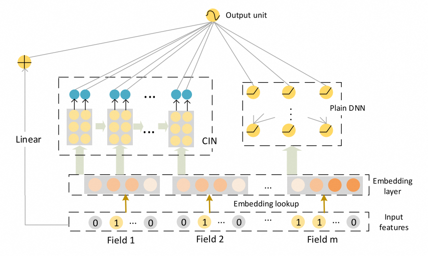

# xDeepFM

### 简介

xDeepFM模型延续了deep&cross network(参考[DCN](https://easyrec.readthedocs.io/en/latest/models/dcn.html))模型的建模思想。不过，在建模显式高阶交叉特征时，采用了不同于deep&cross network的方式，文章称为compressed interaction network(CIN)，并将CIN网络与深度神经网络结合，最后输入到输出层。



### 配置说明

```protobuf

model_config {
    feature_groups {
        group_name: "wide"
        feature_names: 'user_id'
        feature_names: 'cms_segid'
        feature_names: 'cms_group_id'
        feature_names: 'age_level'
        feature_names: 'pvalue_level'
        feature_names: 'shopping_level'
        feature_names: 'occupation'
        feature_names: 'new_user_class_level'
        feature_names: 'tag_category_list'
        feature_names: 'tag_brand_list'
        feature_names: 'adgroup_id'
        feature_names: 'cate_id'
        feature_names: 'campaign_id'
        feature_names: 'customer'
        feature_names: 'brand'
        feature_names: 'price'
        feature_names: 'pid'
        group_type: WIDE
    }
    feature_groups {
        group_name: "deep"
        feature_names: 'user_id'
        feature_names: 'cms_segid'
        feature_names: 'cms_group_id'
        feature_names: 'age_level'
        feature_names: 'pvalue_level'
        feature_names: 'shopping_level'
        feature_names: 'occupation'
        feature_names: 'new_user_class_level'
        feature_names: 'tag_category_list'
        feature_names: 'tag_brand_list'
        feature_names: 'adgroup_id'
        feature_names: 'cate_id'
        feature_names: 'campaign_id'
        feature_names: 'customer'
        feature_names: 'brand'
        feature_names: 'price'
        feature_names: 'pid'
        group_type: DEEP
    }
    xdeepfm {
        cin {
            cin_layer_size: [64, 64]
        }
        deep {
            hidden_units: [128, 64]
        }
        final {
            hidden_units: [64, 32]
        }
    }
    metrics {
        auc {}
    }
    losses {
        binary_cross_entropy {}
    }
}
```

- cin: 特征交叉层
  - cin_layer_size: cin每层要输出的维度
- deep
  - hidden_units: dnn每一层的channel数目，即神经元的数目
- final: 整合cross层, deep层的全连接层

### 示例Config

[xdeepfm_criteo.config](https://tzrec.oss-cn-beijing.aliyuncs.com/config/models/xdeepfm_criteo.config)

### 参考论文

[xDeepFM](https://arxiv.org/pdf/1803.05170)
